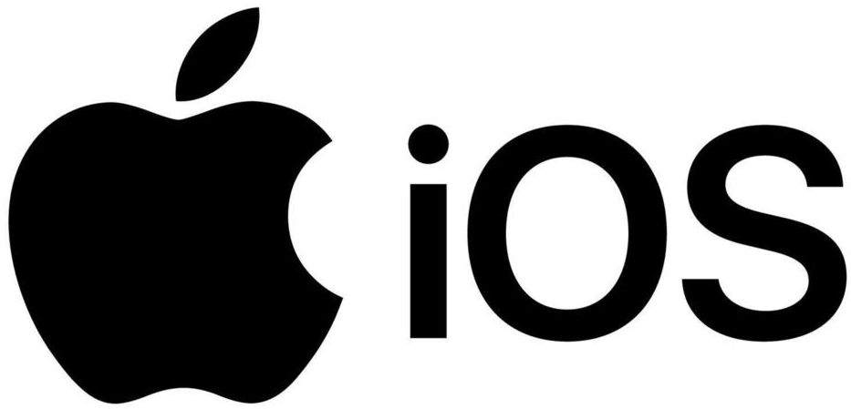
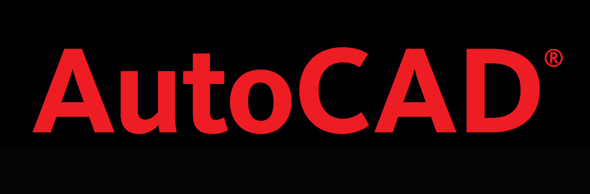
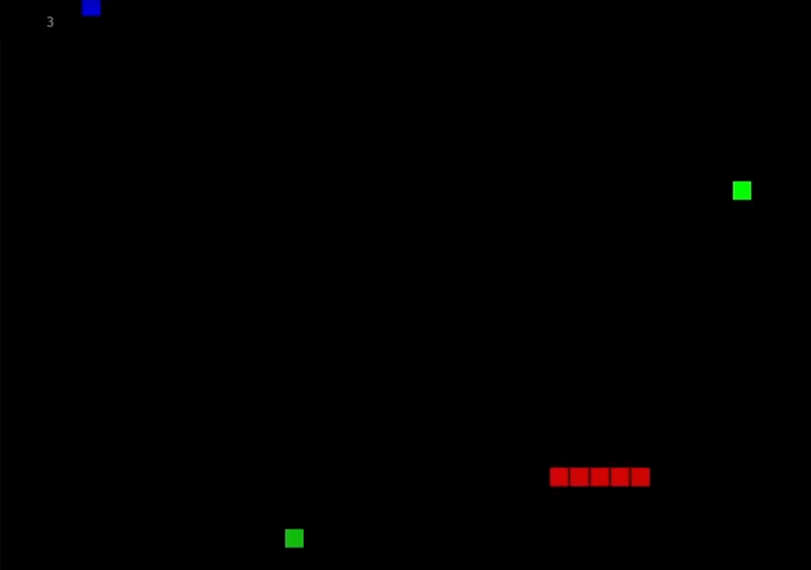
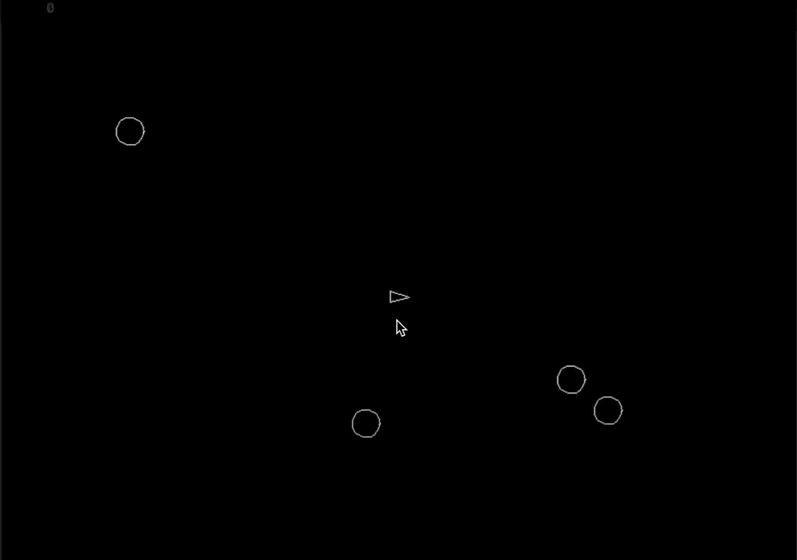
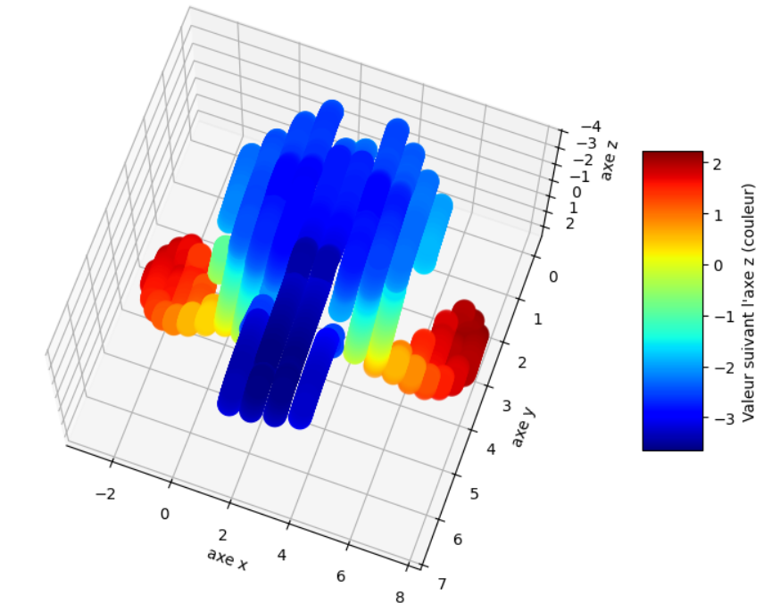
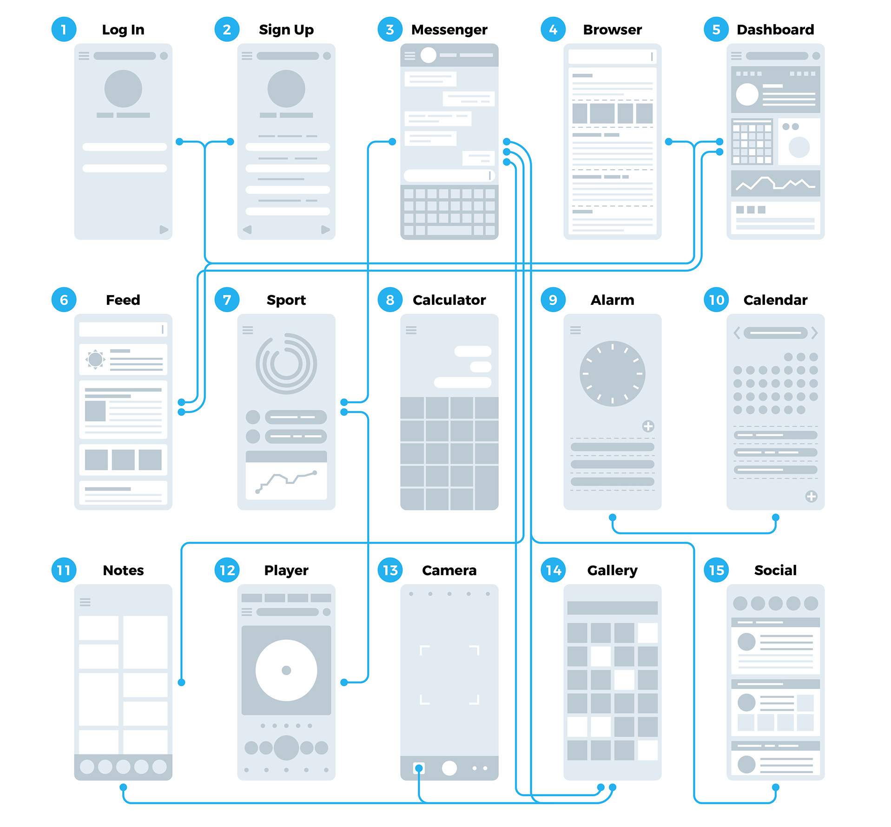
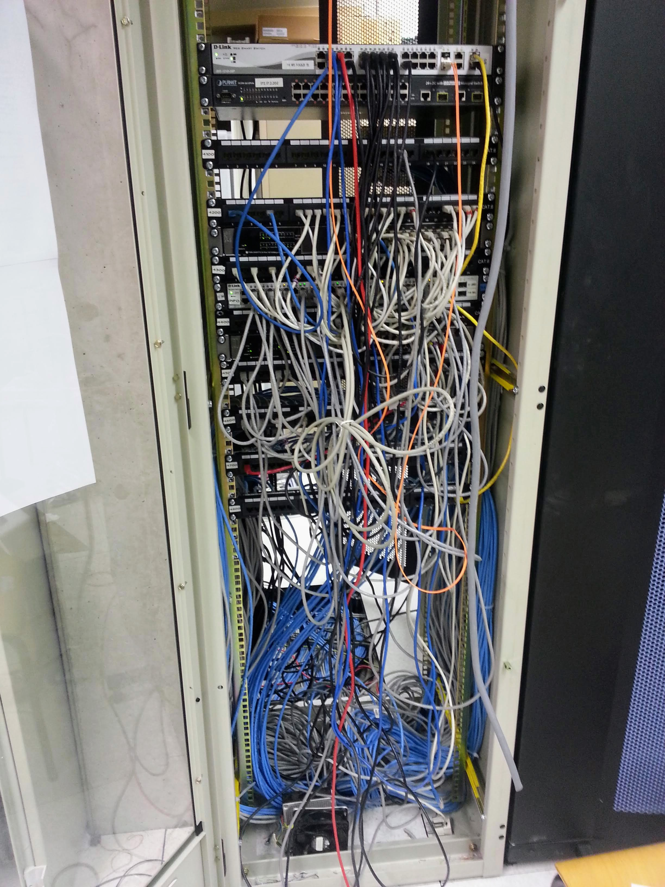

## Un·e ingénieur·e informaticien·ne ?

- Ce n'est pas...

:::row

::::span6

::::

::::span6

{.third2}

::::

:::

## Un·e ingénieur·e informaticien·ne ?

- Organise les projets avec rigueur, agilité et pragmatisme
- Communique, collabore et convainc
- Apprendre en autonomie, former et vulgariser

Comme tous les ingénieur·e·s !

## Un domaine particulier

- Rythme votre vie quotidienne

- l'impact potentiel est extrêmement large [Qu'il soit positif ou
  négatif]{.small}

## Une discipline jeune

- Beaucoup de liberté pour l'**innovation**.
- Encore plein de choses à découvrir.
- Besoin d'esprits jeunes et pleins d'**idées nouvelles**.
- Tout évolue très vite, **pas le temps de s'ennuyer**.

## Soft skills

- **Gérer des projets**
  - Agile, créatif mais pragmatique
  - Elucider, valider, gouverner, anticiper, planifier, accompagner
  - Dans un cadre normatif et juridique
- **Communiquer et collaborer**
  - Ecouter des parties prenantes
  - Convaincre, faciliter, conseiller
  - Rédiger
  - Multilingue
- **Apprendre par lui-même et partager**
  - Veille technologique
  - Former, vulgariser

## Axes techniques: Software engineering

- Programmation
- Architecture
- Web and mobile applications
- Internet of Things
- Hardware
- Embeded system

## Software engineering: UE

<section>

2BE (2025 - 2026)

Q1

Q2

Chimie du vivant et environnement

6 crédits

Dessin technique

2 crédits

Électricité

5 crédits

Électronique

4 crédits

Informatique

4 crédits

Thermodynamique

5 crédits

Langues

3 crédits

Mécanique des fluides et transfert de chaleur

4 crédits

Outils mathématiques

5 crédits

Ondes, optique et physique moderne

5 crédits

Stabilité, déformation et résistance des structures

6 crédits

Mesures

3 crédits

Électronique appliquée

4 crédits

Projet informatique

4 crédits

</section>
<section>

3BE (2025 - 2026)

Q1

Q2

Comptabilité et entrepreneuriat

5 crédits

Stage

10 crédits

Electronic design

5 crédits

Control Theory and applications

3 crédits

Embedded systems

4 crédits

Microcontroller and logic design

6 crédits

Fundamentals of electrical engineering

3 crédits

PCB design

5 crédits

Software engineering 1

7 crédits

Software engineering 2

3 crédits

Signals, systems and telecommunications

5 crédits

Network and web technologies

4 crédits

</section>
<section>

4MIN (2025 - 2026)

Q1

Q2

Architecture and software quality

4 crédits

Artificial Intelligence

6 crédits

Mobile development

3 crédits

Web Architecture

4 crédits

Database management system

4 crédits

Network management

5 crédits

Operating Systems

3 crédits

GPU computing

6 crédits

System on chip

3 crédits

Embedded Project

9 crédits

Computer Networks

5 crédits

Hardware Testing Processes

2 crédits

Gestion

6 crédits

</section>
<section>

5MIN (2025 - 2026)

Q1

Q2

Distributed Systems Project

4 crédits

Artificial Intelligence project

4 crédits

Data center

3 crédits

Software licences and GDPR

2 crédits

Computer security

4 crédits

Ethical Electronics & Informatics

3 crédits

Gestion et stratégie financière

4 crédits

Economie

4 crédits

Langues

2 crédits

Insertion professionnelle

10 crédits

Travail de Fin d’études

20 crédits

</section>

## Software engineering: Projet 2BA

## Software engineering: Compétition d'IA

## Software engineering: Simulation sur GPU

## Software engineering: Stéréovision

 

## Axes techniques: Network and Security

- Telecommunications
- Network infrastructure and administration
- Operating System
- Software and Hardware Security

## Network and Security: UE

<section>

2BE (2025 - 2026)

Q1

Q2

Chimie du vivant et environnement

6 crédits

Dessin technique

2 crédits

Électricité

5 crédits

Électronique

4 crédits

Informatique

4 crédits

Thermodynamique

5 crédits

Langues

3 crédits

Mécanique des fluides et transfert de chaleur

4 crédits

Outils mathématiques

5 crédits

Ondes, optique et physique moderne

5 crédits

Stabilité, déformation et résistance des structures

6 crédits

Mesures

3 crédits

Électronique appliquée

4 crédits

Projet informatique

4 crédits

</section>
<section>

3BE (2025 - 2026)

Q1

Q2

Comptabilité et entrepreneuriat

5 crédits

Stage

10 crédits

Electronic design

5 crédits

Control Theory and applications

3 crédits

Embedded systems

4 crédits

Microcontroller and logic design

6 crédits

Fundamentals of electrical engineering

3 crédits

PCB design

5 crédits

Software engineering 1

7 crédits

Software engineering 2

3 crédits

Signals, systems and telecommunications

5 crédits

Network and web technologies

4 crédits

</section>
<section>

4MIN (2025 - 2026)

Q1

Q2

Architecture and software quality

4 crédits

Artificial Intelligence

6 crédits

Mobile development

3 crédits

Web Architecture

4 crédits

Database management system

4 crédits

Network management

5 crédits

Operating Systems

3 crédits

GPU computing

6 crédits

System on chip

3 crédits

Embedded Project

9 crédits

Computer Networks

5 crédits

Hardware Testing Processes

2 crédits

Gestion

6 crédits

</section>
<section>

5MIN (2025 - 2026)

Q1

Q2

Distributed Systems Project

4 crédits

Artificial Intelligence project

4 crédits

Data center

3 crédits

Software licences and GDPR

2 crédits

Computer security

4 crédits

Ethical Electronics & Informatics

3 crédits

Gestion et stratégie financière

4 crédits

Economie

4 crédits

Langues

2 crédits

Insertion professionnelle

10 crédits

Travail de Fin d’études

20 crédits

</section>

## Axes techniques: Artificial Intelligence

- Database
- Big Data
- Machine Learning

## Artificial Intelligence: UE

<section>

2BE (2025 - 2026)

Q1

Q2

Chimie du vivant et environnement

6 crédits

Dessin technique

2 crédits

Électricité

5 crédits

Électronique

4 crédits

Informatique

4 crédits

Thermodynamique

5 crédits

Langues

3 crédits

Mécanique des fluides et transfert de chaleur

4 crédits

Outils mathématiques

5 crédits

Ondes, optique et physique moderne

5 crédits

Stabilité, déformation et résistance des structures

6 crédits

Mesures

3 crédits

Électronique appliquée

4 crédits

Projet informatique

4 crédits

</section>
<section>

3BE (2025 - 2026)

Q1

Q2

Comptabilité et entrepreneuriat

5 crédits

Stage

10 crédits

Electronic design

5 crédits

Control Theory and applications

3 crédits

Embedded systems

4 crédits

Microcontroller and logic design

6 crédits

Fundamentals of electrical engineering

3 crédits

PCB design

5 crédits

Software engineering 1

7 crédits

Software engineering 2

3 crédits

Signals, systems and telecommunications

5 crédits

Network and web technologies

4 crédits

</section>
<section>

4MIN (2025 - 2026)

Q1

Q2

Architecture and software quality

4 crédits

Artificial Intelligence

6 crédits

Mobile development

3 crédits

Web Architecture

4 crédits

Database management system

4 crédits

Network management

5 crédits

Operating Systems

3 crédits

GPU computing

6 crédits

System on chip

3 crédits

Embedded Project

9 crédits

Computer Networks

5 crédits

Hardware Testing Processes

2 crédits

Gestion

6 crédits

</section>
<section>

5MIN (2025 - 2026)

Q1

Q2

Distributed Systems Project

4 crédits

Artificial Intelligence project

4 crédits

Data center

3 crédits

Software licences and GDPR

2 crédits

Computer security

4 crédits

Ethical Electronics & Informatics

3 crédits

Gestion et stratégie financière

4 crédits

Economie

4 crédits

Langues

2 crédits

Insertion professionnelle

10 crédits

Travail de Fin d’études

20 crédits

</section>

## Axes techniques: Sustainable Developpment

- Life cycle assessment (LCA)
- Optimization
- Social impacts

## Sustainable Developpment: UE

<section>

2BE (2025 - 2026)

Q1

Q2

Chimie du vivant et environnement

6 crédits

Dessin technique

2 crédits

Électricité

5 crédits

Électronique

4 crédits

Informatique

4 crédits

Thermodynamique

5 crédits

Langues

3 crédits

Mécanique des fluides et transfert de chaleur

4 crédits

Outils mathématiques

5 crédits

Ondes, optique et physique moderne

5 crédits

Stabilité, déformation et résistance des structures

6 crédits

Mesures

3 crédits

Électronique appliquée

4 crédits

Projet informatique

4 crédits

</section>
<section>

3BE (2025 - 2026)

Q1

Q2

Comptabilité et entrepreneuriat

5 crédits

Stage

10 crédits

Electronic design

5 crédits

Control Theory and applications

3 crédits

Embedded systems

4 crédits

Microcontroller and logic design

6 crédits

Fundamentals of electrical engineering

3 crédits

PCB design

5 crédits

Software engineering 1

7 crédits

Software engineering 2

3 crédits

Signals, systems and telecommunications

5 crédits

Network and web technologies

4 crédits

</section>
<section>

4MIN (2025 - 2026)

Q1

Q2

Architecture and software quality

4 crédits

Artificial Intelligence

6 crédits

Mobile development

3 crédits

Web Architecture

4 crédits

Database management system

4 crédits

Network management

5 crédits

Operating Systems

3 crédits

GPU computing

6 crédits

System on chip

3 crédits

Embedded Project

9 crédits

Computer Networks

5 crédits

Hardware Testing Processes

2 crédits

Gestion

6 crédits

</section>
<section>

5MIN (2025 - 2026)

Q1

Q2

Distributed Systems Project

4 crédits

Artificial Intelligence project

4 crédits

Data center

3 crédits

Software licences and GDPR

2 crédits

Computer security

4 crédits

Ethical Electronics & Informatics

3 crédits

Gestion et stratégie financière

4 crédits

Economie

4 crédits

Langues

2 crédits

Insertion professionnelle

10 crédits

Travail de Fin d’études

20 crédits

</section>

## Métier: Business Analyst

:::row

:::span6

:::

:::{.span6 .middle}

- Récolte des **exigences** du client
- Traduction en objectifs **techniques**
- Compréhension de l'entreprise et de son **business** dans son ensemble
- **Communication** entre équipes de développement et client
- Suivi de **projets**

:::

:::

## Métier: Application Architect

:::row

:::span6

:::

:::{.span6 .middle}

- **Conception** haut niveau d'une application
- **Organisation** des équipes de développement
- Gestion du **planing** et des _deadlines_
- Gestion de la **qualité**

:::

:::

## Métier: IA Dev / Data Analyst

:::row

:::span6

:::

:::{.span6 .middle}

- Analyse et **compréhension** des données.
- Impact sur la **gouvernance** de l'entreprise.
- Création de **modèles**

:::

:::

## Métier: System Engineer

:::row

:::span6

:::

:::{.span6 .middle}

- **Conception** et maintenance d'une infrastructure
- Garantir la **continuité** de service
- **Datacenter**
- **Sécurité** des données

:::

:::

## Métier: Network Engineer

:::row

:::span6

:::

:::{.span6 .middle}

- **Conception** et maintenance d'une architecture réseau
- Garantir la **continuité** de service
- **Confidentialité** des communications

:::

:::
