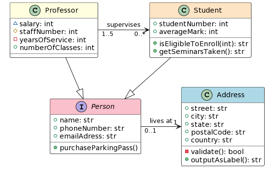
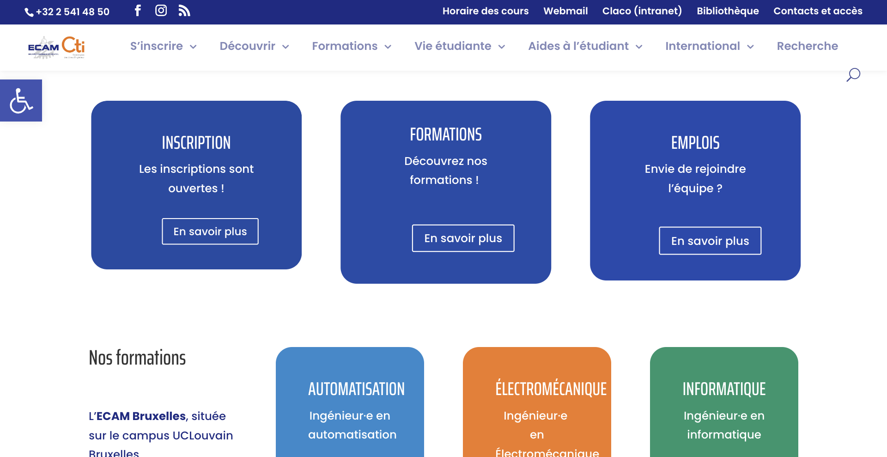
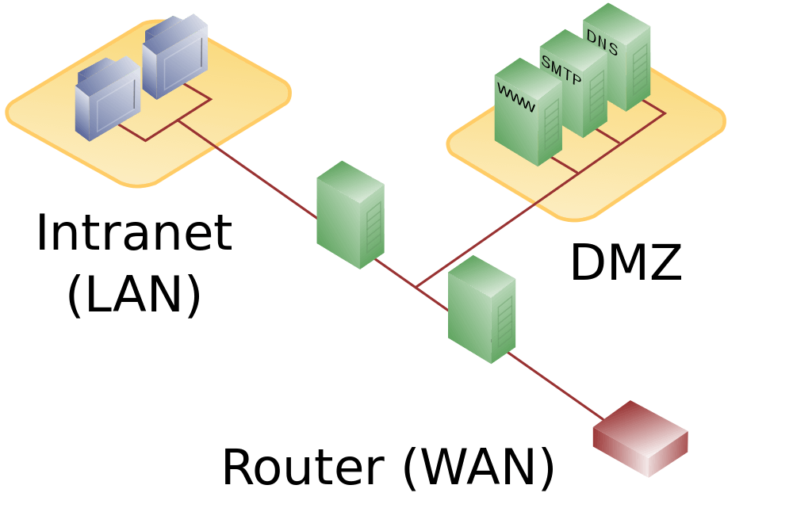

## Programme des cours Bachelier

<section>

2BE (2024 - 2025)

Q1

Q2

Chimie du vivant et environnement

6 crédits

Dessin technique

2 crédits

Électricité

5 crédits

Électronique

4 crédits

Informatique

4 crédits

Thermodynamique

5 crédits

Langues

3 crédits

Mécanique des fluides et transfert de chaleur

4 crédits

Outils mathématiques

5 crédits

Ondes, optique et physique moderne

5 crédits

Stabilité, déformation et résistance des structures

6 crédits

Mesures

3 crédits

Électronique appliquée

4 crédits

Projet informatique

4 crédits

</section>
<section>

3BE (2024 - 2025)

Q1

Q2

Comptabilité et entrepreneuriat

5 crédits

Stage

10 crédits

Electronic design

5 crédits

Control Theory and applications

3 crédits

Embedded systems

4 crédits

Microcontroller and logic design

6 crédits

Fundamentals of electrical engineering

3 crédits

PCB design

5 crédits

Software engineering 1

7 crédits

Software engineering 2

3 crédits

Signals, systems and telecommunications

5 crédits

Network and web technologies

4 crédits

</section> 

## 2BE - Projet Informatique

- Python: programmation fonctionnelle, réseau et concurrente
- Projet:
  - IA pour un jeu
  - Compétition réseau

<iframe class="center" src="https://ecambxl.sharepoint.com/sites/PI2C-ProjetInformatique2021-2022/_layouts/15/embed.aspx?UniqueId=4164be2a-7165-4715-bf25-e12d99ac79b0&embed=%7B%22af%22%3Atrue%2C%22hvm%22%3Atrue%2C%22ust%22%3Atrue%7D&referrer=StreamWebApp&referrerScenario=EmbedDialog.Create" width="1000" height="565" frameborder="0" scrolling="no" allowfullscreen title="Othello 2022.mp4"></iframe>

## 3BE - Software engineering 1 & 2

:::row
:::span6

- Ingénierie des exigences
- Bases de données
- Structures de données
- Programmation orientée objets
- Projets: Réalisation de "vrais" applications

:::
:::span6

:::
:::

## 3BE - Network and web technologies

- Technologies web: HTML, Javascript, CSS, ...
- Administration Linux
- Introduction aux réseaux

## Programme des cours Master

<section>

4MIN (2024 - 2025)

Q1

Q2

Architecture and software quality

4 crédits

Artificial Intelligence

6 crédits

 

Mobile development

3 crédits

Web Architecture

4 crédits

Database management system

4 crédits

Network management

5 crédits

Operating Systems

3 crédits

GPU computing

6 crédits

System on chip

3 crédits

Embedded Project

7 crédits

Computer Networks

5 crédits

IOT and Data acquisition

4 crédits

Gestion

6 crédits

</section>
<section>

5MIN (2024 - 2025)

Q1

Q2

Distributed Systems Project

5 crédits

Artificial Intelligence project

3 crédits

Data center

3 crédits

Software licences and GDPR

2 crédits

Computer security

4 crédits

Seminars

3 crédits

Gestion et stratégie financière

4 crédits

Economie

4 crédits

Langues

2 crédits

Insertion professionnelle

10 crédits

Travail de Fin d’études

20 crédits

</section>

## 4MIN - Database management system

- Bases de données relationnelles
- Realtime DB
- NoSQL

## 4MIN - Web Architecture

- Répartition des opérations entre les clients et le serveur

  - Single Page App
  - Server-Side Rendering

- Projet

## 4MIN - Computer Network

- Utilisation et configuration de matériels réseaux

  - Switch
  - Routeur

- Labos de mise en pratique

## 4MIN - Network management

:::row
:::span8

- Sécurité des réseaux

  - Firewall
  - DMZ
  - ...

- Administration des systèmes et utilisateurs

  - Permissions
  - ..

- Labos de mise en pratique

:::
:::span4

:::
:::

## 4MIN - Artificial Intelligence

- 1 activité supplémentaire: **Advanced AI Lab**
- Machine Learning
- Deep Learning

{.half}

## 4MIN - Mobile development

- Particularités du développement sur appareils mobiles
- Projet

## 4MIN - GPU computing

- Utilisation du GPU
  - Graphismes 3D
  - Calculs

<iframe class="center" src="https://ecambxl-my.sharepoint.com/personal/lur_ecam_be/_layouts/15/embed.aspx?UniqueId=a4a3d208-f9e4-43c4-92b8-4a1658f64d90&embed=%7B%22af%22%3Atrue%2C%22hvm%22%3Atrue%2C%22ust%22%3Atrue%7D&referrer=StreamWebApp&referrerScenario=EmbedDialog.Create" width="745" height="600" frameborder="0" scrolling="no" allowfullscreen title="cloth Simulation in Rust.mp4"></iframe>

## 4MIN - Operating Systems

- Structure d'OS
- Ordonnancement de processus
- Gestion de la mémoire
- OS temps réel

- Labos:
  - Modification d'un Kernel Linux
  - Attaque d'un OS

## 5MIN - Distributed Systems Project

- Réalisation d'un service haute disponibilité
- Docker, Kubernetes
- Application des méthodes de développement professionnelles

## 5MIN - Datacenter

- Réalisation, utilisation et maintenance
- Étude de cas pratiques
- Cloud
- Politique de sécurité en entreprise

## 5MIN - Artificial Intelligence project

- Projet de Machine/Deep Learning plus ambitieux
- Utilisation de méthodes de pointe

## 5MIN - Software licences and GDPR

- Principes fondamentaux du droit de la propriété intellectuelle et législation de base
- GDPR
- Licences Logicielle

## 5MIN - Computer security

- Les attaques
- Stratégie de défense
- Gestion des risques
- Projets
