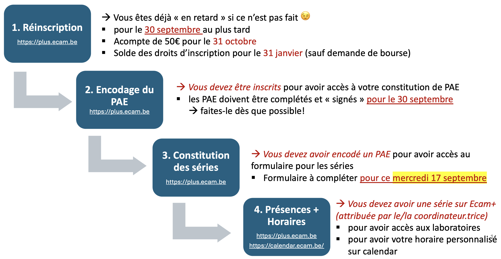

## Coordination

- **Informatique**:
  - Coordinateur du diplôme IN: **LUR**
  - Coordinateur d'années 4MIN, 5MIN et 5MIC: **LUR**
- **Électronique**:
  - Coordinateur du diplôme EO: **DLH**
  - Coordinateur d'années 4MEO et 5MEO: **DLH**

Rejoignez l'équipe Teams
[**Finalités Informatique / Electronique**](https://teams.microsoft.com/l/team/19%3A51ae90943dd14492a33fd1f4a4e770f5%40thread.tacv2/conversations?groupId=004b483e-157a-4bc0-811b-d588a0821632&tenantId=e3d6f09e-9ba9-4a36-ad75-d9039be4fe29)

## Vision Mission de l'ECAM

- Notre mission est de former des ingénieur·es aux compétences **techniques** et
  **scientifiques** approfondies, qui se distinguent par leur approche
  **pragmatique** et **orientée solution**.
- Grace à leur esprit **critique**, leurs aptitudes à s'adapter et à apprendre
  de manière **autonome**, nos ingénieur·es sont des acteurs et actrices faisant
  preuve **d’innovation** et **d’engagement** dans les défis du **futur**.
- Capables de travailler efficacement en **équipe** pluridisciplinaire et de
  mener à bien des **projets** complexes, nos diplômé·es collaborent et
  communiquent étroitement avec tous les milieux **socio-professionnels**.
- Nous nous engageons, à travers nos activités de formation, de recherche et de
  services, en faveur de la **durabilité** et de **l'innovation** pour un impact
  positif sur la société et l’environnement.​​​​

## Valeurs de la communauté ECAM

- **Bienveillance​ :** La bienveillance signifie écouter, comprendre et soutenir
  autrui avec tolérance, en créant un environnement respectueux, dans la limite
  de mes possibilités.​

- **Collaboration​ :** La collaboration implique de travailler activement avec
  les autres, d’écouter leurs avis, de réévaluer nos points de vue, et de
  favoriser l'échange d'idées et d’expertise dans un climat de confiance
  réciproque.​

- **Engagement​ :** L'engagement consiste à assumer ses responsabilités de
  manière proactive, à s'investir dans son travail et dans la vie de
  l’institution en prenant en compte les enjeux sociétaux et environnementaux.​

- **Excellence​ :** L'excellence est caractérisée par la quête continue de
  qualité et d'amélioration dans tout ce que nous entreprenons.​

- **Intégrité​ :** L'intégrité se traduit par des comportements exemplaires qui
  reflètent les valeurs de l'ECAM, ainsi que par la communication honnête et
  transparente des actions et décisions prises dans le respect des règles. ​

_​Liste de comportements associés à chaque valeur disponible sur Claco​_

## Consignes de sécurité

- Les **consignes de sécurité** sont décrites dans le document que l'on peut
  trouver sur **Claco**
  ([ECAM Informations étudiant·es > Consignes de sécurité](https://claco.ecam.be/#/workspace/3c0ca032-b721-11e8-b44d-0cc47a960f96/resources/Consignes%20de%20s%C3%A9curit%C3%A9-58541))
- **Vous êtes censés les connaître !**

## Calendar

- Les **horaires** sont disponibles sur <http://calendar.ecam.be>.
- La **calendrier CAL** contient les événements du calendrier académique
  [vacances, journées pédagogiques, délibérations, ...]{.small}
- Il est possible d'obtenir le calendrier d'une **série**, d'une **activité** ou
  d'un **auditoire**.
- Les calendriers sont **synchronisables** sur les services de calendrier
  courants [Google Calendar, Apple Calendrier, ...]{.small}

## PAE

<!-- - Vous devez remplir votre **PAE** le plus tôt possible [Idéalement
  **Aujourd'hui**]{.small}
- C'est important pour l'organisation des séries et des labos
- Cela se fait sur **ECAM plus** <https://plus.ecam.be/pae> -->

## Programme des cours

<section>

4MIN (2025 - 2026)

Q1

Q2

Architecture and software quality

4 crédits

Artificial Intelligence

6 crédits

Mobile development

3 crédits

Web Architecture

4 crédits

Database management system

4 crédits

Network management

5 crédits

Operating Systems

3 crédits

GPU computing

6 crédits

System on chip

3 crédits

Embedded Project

9 crédits

Computer Networks

5 crédits

Hardware Testing Processes

2 crédits

Gestion

6 crédits

</section>
<section>

5MIN (2025 - 2026)

Q1

Q2

Distributed Systems Project

4 crédits

Artificial Intelligence project

4 crédits

Data center

3 crédits

Software licences and GDPR

2 crédits

Computer security

4 crédits

Ethical Electronics & Informatics

3 crédits

Gestion et stratégie financière

4 crédits

Economie

4 crédits

Langues

2 crédits

Insertion professionnelle

10 crédits

Travail de Fin d’études

20 crédits

</section>

## Programme des cours EO

<section>

4MEO (2025 - 2026)

Q1

Q2

  

  Architecture and software quality
  

  

  2 crédits
  

  

  Artificial Intelligence
  

  

  5 crédits
  

  

  Advanced PCB Design
  

  

  4 crédits
  

  

  Computer Vision
  

  

  3 crédits
  

  

  Microelectronics
  

  

  4 crédits
  

  

  Telecommunications
  

  

  5 crédits
  

  

  Operating Systems
  

  

  3 crédits
  

  

  Power Electronics
  

  

  7 crédits
  

  

  System on chip
  

  

  5 crédits
  

  

  Embedded Project
  

  

  9 crédits
  

  

  Computer Networks
  

  

  5 crédits
  

  

  Hardware Testing Processes
  

  

  2 crédits
  

  

  Gestion
  

  

  6 crédits
  

</section>
<section>
  

  5MEO (2025 - 2026)
  

  

  Q1
  

  

  Q2
  

  

  

  

    

    Biodiversity Monitoring Project
    

    

    4 crédits
    

  

  

    

    Embedded Security Project
    

    

    4 crédits
    

  

  

    

    High Frequency Circuit Design
    

    

    9 crédits
    

  

  

    

    Ethical Electronics & Informatics
    

    

    3 crédits
    

  

  

    

    Gestion et stratégie financière
    

    

    4 crédits
    

  

  

    

    Economie
    

    

    4 crédits
    

  

  

    

    Langues
    

    

    2 crédits
    

  

  

    

    Insertion professionnelle
    

    

    10 crédits
    

  

  

    

    Travail de Fin d’études
    

    

    20 crédits
    

  

</section>

## Stages et TFEs

- Informations stages 5MIN/5MEO sur **Claco**
  _([ECAM Informations étudiant·es > Stages et TFE > Stages 5MA](https://claco.ecam.be/#/workspace/3c0ca032-b721-11e8-b44d-0cc47a960f96/resources/Stages%205MA-11582))_
  Prochaine échéance : **24  octobre** Vous prenez contact avec votre coordinateur pour faire le point // **17 novembre** Vous avez encodé votre proposition de stage.
- Informations TFEs sur **Claco**
  _([ECAM Informations étudiant·es > Stages et TFE > TFE](https://claco.ecam.be/#/workspace/3c0ca032-b721-11e8-b44d-0cc47a960f96/resources/TFE-11615))_
- Des propositions de stages/TFEs sont publiées sur l'équipe Teams
  [**Finalités Informatique / Electronique**](https://teams.microsoft.com/l/team/19%3A51ae90943dd14492a33fd1f4a4e770f5%40thread.tacv2/conversations?groupId=004b483e-157a-4bc0-811b-d588a0821632&tenantId=e3d6f09e-9ba9-4a36-ad75-d9039be4fe29)
- ⚠️ Attention à ne pas créer une entreprise existante ! Si soucis de coordonnées ou autre → stages@ecam.be

## GenAI et travaux

[Article 95 du règlement des études](https://claco.ecam.be/#/workspace/3c0ca032-b721-11e8-b44d-0cc47a960f96/resources/haute-ecole-ichec-ecam-isfsc-reglement-des-etudes-2025-2026-vf) :
> Dans tous les cas, l’usage d’un logiciel tel que ChatGPT ou de tout autre logiciel d’intelligence artificielle ne peut aboutir à une substitution complète ou partielle de la production personnelle de l’étudiante ou de l’étudiant, sous peine d’une sanction académique.
> Dans tous les cas, l’étudiante ou l’étudiant devra obligatoirement mentionner le recours à toute forme d’intelligence artificielle dans le cadre d’un travail et préciser l’usage qu’elle ou il en a fait, sous peine de s’exposer aux sanctions prévues à l’article suivant.

Un guide de rédaction avec les règles de référencement suggérées se trouve [sur Claco](https://claco.ecam.be/#/workspace/3c0ca032-b721-11e8-b44d-0cc47a960f96/resources/tfe-guideredactiontfe-versionmars-2025-3).

## Outils "Présences" et "Séries"

- Nouveaux outils sur [ECAM plus](https://plus.ecam.be)
- [Mode d'emploi (ECAM Informations étudiant·es > Coordination > Séries - Etudiants - Mode d'emploi ECAM+.pdf)](https://claco.ecam.be/#/workspace/3c0ca032-b721-11e8-b44d-0cc47a960f96/resources/series-etudiants-mode-demploi-ecam-1)

## Élections des représentant·es des étudiant·es

- Rôles:
  - **Transférer** les informations entre les enseignant·es et les étudiant·es
  - **Motiver** à participer aux activités proposées
  - Expliquer l’utilité des **É**valuations des **E**nseignements par les
    **É**tudiant·es
  - **"prendre la température"** dans le groupe
  - Réaliser des **sondages**, d’initiative personnelle ou pour répondre à une
    question de l’école.
  - Porter attention et transmettre proactivement les remarques et **idées**
    étudiantes.
  - Veiller à la **cohésion** du groupe et favoriser une ambiance constructive
    et une dynamique positive
  - Organiser idéalement des **activités** intra-groupe ou à plusieurs groupes

## Élections des représentant·e·s des étudiant·e·s

- Implications:
  - 2X/an min: **réunions** avec le bloc qu’il ou elle représente
  - 3X/an : confection des **horaires d’examen**
  - 1X/an : **conseil de diplôme** de leur formation respective
  - 2X/an : **conseil de département ECAM** pour les points liés au programme de
    cours
  - Fonction des demandes, réaliser quelques sondages chaque année
  - Fonction des souhaits/besoins du groupe : quelques activités pour
    créer/soutenir la cohésion et l’ambiance constructive du groupe

## Élections des représentant·e·s des étudiant·e·s

- Qualités:
  - Faire preuve de **proactivité**
  - Aimer **communiquer​**
  - Garder la **confidentialité** (personnes/informations)​
  - Savoir **représenter** un groupe​
  - Chercher à **fédérer** le groupe​
  - Favoriser la **cohésion** et une ambiance constructive du groupe​

## Élections des représentant·e·s des étudiant·e·s

- Désignation:
  - Envoyer **candidature** à LUR et DLH avant le **30 septembre**
  - Si suffisamment de candidatures > élections parmi les candidat·es
  - Sinon > élections sur base de la **liste étudiante**

## Distribution cartes étudiant·e·s

Distribution cartes étudiant·e·s

