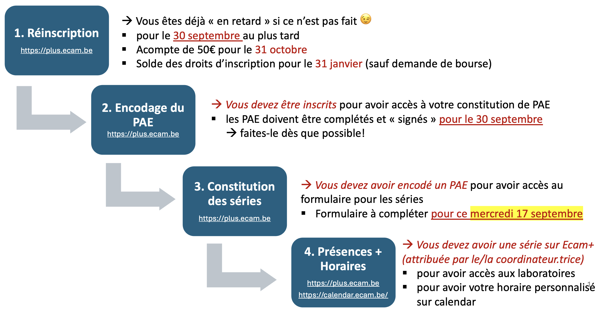

## Coordination

- **Computer Science**:
  - IN Degree Coordinator: **LUR**
  - Year Coordinator for 4MIN, 5MIN and 5MIC: **LUR**
- **Electronics**:
  - EO Degree Coordinator: **DLH**
  - Year Coordinator for 4MEO and 5MEO: **DLH**

Join the Teams group
[**Finalités Informatique / Electronique**, code `nalmf23`](https://teams.microsoft.com/l/team/19%3A51ae90943dd14492a33fd1f4a4e770f5%40thread.tacv2/conversations?groupId=004b483e-157a-4bc0-811b-d588a0821632&tenantId=e3d6f09e-9ba9-4a36-ad75-d9039be4fe29)

## In memoriam

RIP Claco (1847 - †2026).

## Welcome Moodle!

New learning platform on [https://moodle.ecam.be](https://moodle.ecam.be).

It will need some time to be properly propulated. We're still getting our hands on it.

## Vision Mission de l'ECAM

- Our mission is to educate engineers with strong **technical** and
  **scientific** competencies, distinguished by their **pragmatic** and
  **solution-oriented** approach.
- Thanks to their **critical thinking**, their ability to adapt and learn
  **independently**, our engineers are key contributors demonstrating
  **innovation** and **commitment** in addressing the challenges of the
  **future**.
- Able to work effectively in multidisciplinary **teams** and successfully
  manage complex **projects**, our graduates collaborate and communicate
  closely with all **professional and societal sectors**.
- Through our educational, research, and service activities, we are committed
  to **sustainability** and **innovation** for a positive impact on society
  and the environment.

## Values of the ECAM Community

- **Kindness (Bienveillance):** Kindness means listening to, understanding, and supporting
  others with tolerance, while creating a respectful environment within the
  limits of one's possibilities.

- **Collaboration:** Collaboration means actively working with others,
  listening to their opinions, reassessing our viewpoints, and encouraging the
  exchange of ideas and expertise in a climate of mutual trust.

- **Commitment (Engagement):** Commitment consists of proactively taking responsibility,
  investing oneself in one's work and in the life of the institution while
  considering societal and environmental challenges.

- **Excellence:** Excellence is characterized by the continuous pursuit of
  quality and improvement in everything we undertake.

- **Integrity:** Integrity is reflected in exemplary behavior that embodies
  ECAM's values, as well as honest and transparent communication regarding
  actions and decisions made in compliance with established rules.

_The list of behaviors associated with each value is available on Moodle._

## Safety Instructions

- The **safety instructions** are described in the document available on
  **Moodle**
  ([ECAM Informations étudiant·es > Consignes de sécurité](https://moodle.ecam.be/course/section.php?id=1278))
- **You are expected to know them!**

## Calendar

- The **timetables** are available at <http://calendar.ecam.be>.
- The **CAL calendar** contains academic calendar events
  [holidays, pedagogical days, examination boards, ...]{.small}
- It is possible to obtain the calendar of a **group**, an **activity**, or a
  **lecture hall**.
- Calendars can be **synchronized** with common calendar services
  [Google Calendar, Apple Calendar, ...]{.small}

## Individual Study Plan (PAE)

<!-- - Vous devez remplir votre **PAE** le plus tôt possible [Idéalement
  **Aujourd'hui**]{.small}
- C'est important pour l'organisation des séries et des labos
- Cela se fait sur **ECAM plus** <https://plus.ecam.be/pae> -->

## IN Curriculum

<section>

4MIN (2026 - 2027)

Q1

Q2

Architecture and software quality

4 ECTS

Artificial Intelligence

6 ECTS

Mobile development

3 ECTS

Web Architecture

4 ECTS

Database management system

4 ECTS

Network management

5 ECTS

Operating Systems

3 ECTS

GPU computing

6 ECTS

System on chip

3 ECTS

Robotics Project

9 ECTS

Computer Networks

5 ECTS

Hardware Testing Processes

2 ECTS

Gestion

6 ECTS

</section>
<section>

5MIN (2026 - 2027)

Q1

Q2

Distributed Systems Project

4 ECTS

Artificial Intelligence project

4 ECTS

Data center

3 ECTS

Software licences and GDPR

2 ECTS

Computer security

4 ECTS

Ethical Electronics & Informatics

3 ECTS

Gestion et stratégie financière

4 ECTS

Economie

4 ECTS

Langues

2 ECTS

Insertion professionnelle

10 ECTS

Travail de Fin d’études

20 ECTS

</section>

## EO Curriculum

<section>

4MEO (2025 - 2026)

Q1

Q2

Architecture and software quality

2 ECTS

Artificial Intelligence

5 ECTS

Advanced PCB Design

4 ECTS

Computer Vision

3 ECTS

Microelectronics

4 ECTS

Telecommunications

5 ECTS

Operating Systems

3 ECTS

Power Electronics

7 ECTS

System on chip

5 ECTS

Robotics Project

9 ECTS

Computer Networks

5 ECTS

Hardware Testing Processes

2 ECTS

Gestion

6 ECTS

</section>
<section>

5MEO (2026 - 2027)

Q1

Q2

Biodiversity Monitoring Project

4 ECTS

Embedded Security Project

4 ECTS

High Frequency Circuit Design

9 ECTS

Ethical Electronics & Informatics

3 ECTS

Gestion et stratégie financière

4 ECTS

Economie

4 ECTS

Langues

2 ECTS

Insertion professionnelle

10 ECTS

Travail de Fin d’études

20 ECTS

</section>

## Internships and Master's Theses

- Information about 5MIN/5MEO internships on **Moodle**
  _([ECAM - Informations pour les étudiant·es > Stages et TFE](https://moodle.ecam.be/course/section.php?id=1284))_

  Upcoming deadlines:
  - **Around 23 octobre** Contact your coordinator to review your progress.
  - **Around 16 novembre** You must have submitted your internship proposal.

- Information about Master's Theses on **Moodle**
  _([ECAM - Informations pour les étudiant·es > Stages et TFE](https://moodle.ecam.be/course/section.php?id=1284))_
- Internship and thesis opportunities are posted in the Teams group
  [**Finalités Informatique / Electronique**](https://teams.microsoft.com/l/team/19%3A51ae90943dd14492a33fd1f4a4e770f5%40thread.tacv2/conversations?groupId=004b483e-157a-4bc0-811b-d588a0821632&tenantId=e3d6f09e-9ba9-4a36-ad75-d9039be4fe29)
- ⚠️ Be careful not to create a company that already exists! If you encounter
  contact information issues or similar problems → <stages@ecam.be>

## Master's Theses Grading Scheme

- Master's thesis (85%)
  - Continuous assessment (20%): At least two mandatory meetings (end of March and end of April), evaluates how you organise your work, present your results, manage the meeting and your day-to-day work, how proactive you are, etc.
  - Deliverables (10%): They must be clearly planned in the thesis specifications (cahier des charges), evaluated by the promoter (industry).
  - Written manuscript (10%): Around 30 pages.
  - Presentation (10%): 15 minutes in front of a jury composed of promoter (industry), tutor (ECAM), two external reviewers, and one moderator (ECAM). All but the moderator will have read your work and prepared questions.
  - Defence (35%): 45 minutes.
- Technical Maturity (15%): You get asked a broad problem to solve, then develop your solution for 25 minutes in front of a jury. We will train for it in June.

## Generative AI and Coursework

[Article 95 du règlement des études](https://claco.ecam.be/#/workspace/3c0ca032-b721-11e8-b44d-0cc47a960f96/resources/haute-ecole-ichec-ecam-isfsc-reglement-des-etudes-2025-2026-vf):

> Dans tous les cas, l'usage d'un logiciel tel que ChatGPT ou de tout autre
> logiciel d’**intelligence artificielle** ne peut aboutir à une
> **substitution** complète ou partielle de la **production personnelle** de
> l'étudiante ou de l'étudiant, sous peine d'une **sanction** académique. Dans
> tous les cas, l'étudiante ou l'étudiant devra obligatoirement **mentionner**
> le recours à toute forme d'intelligence artificielle dans le cadre d’un
> travail et préciser l'**usage** qu'elle ou il en a fait, sous peine de
> s’exposer aux sanctions prévues à l'article suivant.

> In all cases, the use of software such as ChatGPT or any other
> **artificial intelligence** software may not result in a complete or partial
> **substitution** of the student's **personal work**, under penalty of
> academic **sanctions**. In all cases, students must explicitly **declare**
> the use of any form of artificial intelligence within an assignment and
> specify the **purpose** for which it was used, failing which they may be
> subject to the sanctions provided for in the following article.

A **writing guide** containing the recommended citation rules will be available
[on Moodle](https://moodle.ecam.be/course/section.php?id=1284).

## "Attendance" and "Groups" Tools

- New tools available on [ECAM Plus](https://plus.ecam.be)
- [Mode d'emploi (ECAM - Informations pour les étudiant·es > Coordinations > Mode d'emploi outil "Séries" sur ecam+)](https://moodle.ecam.be/pluginfile.php/3963/mod_resource/content/1/series_-_etudiants_-_mode_demploi_ecam.pdf)

## Courses Assessment -- EEE

Here is how the process goes:
1. You get a form during the last session of the evaluated activity.
2. You get a reminder a few weeks later.
3. You get a second form after the evaluation.
4. Someone in admin crafts an anonymised report.
5. Mrs Lefèbvre summons the teaching team to analyse the report.
6. We do something about it.

It's important we get **everybody's** opinion. Each course is only evaluated every three years.

## Election of Student Representatives

- Responsibilities:
  - **Relay** information between teachers and students.
  - **Encourage** participation in proposed activities.
  - Explain the importance of **Student Evaluations of Teaching**.
  - **Take the pulse** of the student group.
  - Conduct **surveys**, either on personal initiative or in response to a
    request from the school.
  - Pay attention to and proactively communicate student comments and
    **ideas**.
  - Promote group **cohesion** and foster a constructive atmosphere and
    positive group dynamics.
  - Ideally organize **activities** within the group or across multiple groups.

## Election of Student Representatives

- Commitments:
  - At least **2 meetings per year** with the cohort they represent.
  - **3 times per year:** preparation of **exam schedules**.
  - **Once per year:** participation in the **degree council** of their
    program.
  - **Twice per year:** participation in the **ECAM department council** for
    matters related to the curriculum.
  - Depending on requests, conduct several surveys each year.
  - Depending on the group's wishes and needs, organize a few activities to
    support cohesion and a constructive atmosphere.

## Election of Student Representatives

- Qualities:
  - Demonstrate **proactivity**.
  - Enjoy **communication**.
  - Maintain **confidentiality** regarding people and information.
  - Be able to **represent** a group.
  - Seek to **unite** the group.
  - Promote **cohesion** and a constructive atmosphere.

## Election of Student Representatives

- Selection process:
  - Send your **application** to LUR and DLH before **September 30**.
  - If there are enough candidates, an election will be held among them.
  - Otherwise, representatives will be selected from the **student list**.

## Distribution of Student Cards

Distribution of student cards.
