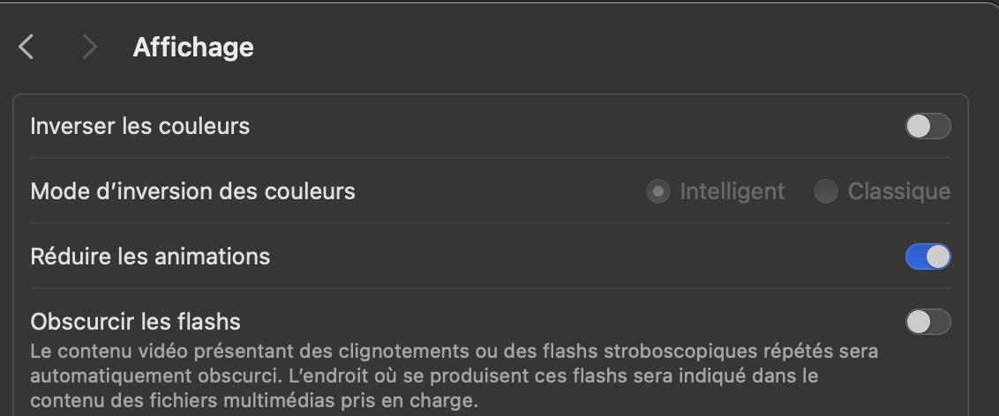

<script src="https://cdn.jsdelivr.net/gh/ireade/caniuse-embed/public/caniuse-embed.min.js"></script>

## Objectifs du cours

Tour d'horizon du design d'interface web.

## _Mobile First_

Un site est de plus en plus souvent consulté sur mobile.

- importance de soigner l'expérience utilisateur sur les écrans de petites
  tailles.
- Nécessaire de supporter les utilisateurs sur ordinateurs de bureau.

## Le _Responsive Web Design_

Lorsqu'on souhaite supporter une large gamme d'écrans, plusieurs approches sont
possibles :

- créer des versions complètement différentes du site pour chaque type
  d'appareil,
- créer une seule interface capable de s'adapter à toutes les tailles d'écrans.

## Le _Responsive Web Design_

En pratique, on a un seul site (un _markup_ HTML) et on utilise le CSS pour
rendre le site _Responsive_.

## Viewport

la définition du _viewport_ se fait comme ceci :

```html
<meta name="viewport" content="width=device-width, initial-scale=1.0" />
```

Empêche le "dézoom" des navigateurs mobiles

## Le CSS

Une règles CSS prend la forme suivante :

```css
selector {
 property: value;
 ...
}
```

## Les sélecteurs

```html
<element id="identifiant" class="classe1 classe2"></element>
```

Voici quelques exemples de sélecteurs :

- `element`: sélectionne les balises `element`
- `.classe`: sélectionne les balises ayant la classe `classe`
- `#identifiant`: sélectionne les balises ayant l'identificateur `identifiant`
- `selecteur1, selecteur2`: les `selecteur1` et les `selecteur2`
- `selecteur1 selecteur2`: les `selecteur2` descendant d'un `selecteur1`
- `selecteur1 > selecteur2`: les `selecteur2` descendant direct d'un
  `selecteur1`

## La propriété `display`

Cette propriété CSS contrôle la position d'un élément par rapport aux autres.

## `display: inline`

Les éléments `inline` s'affichent comme des caractères dans une phrase.

Les balises `<strong>`, `<em>` et `<span>` sont `inline` par défaut.

L'HTML :

```html
<strong>hello</strong> <em>ça va</em> <span class="punctuation">?</span>
```

s'affiche :

<div style="padding: 0.5rem; border: 1px solid #ccc; border-radius: 4px;">
<strong>hello</strong> <em>ça va</em>
<span class="punctuation">?</span>
</div>

## `display: block`

Les éléments `block` s'affichent les uns en dessous des autres comme des
paragraphes dans un texte.

Les balises `<p>` et `<div>` sont des `block` par défaut.

L'HTML :

```html
<p>hello world !!</p>
<div class="salutation">Hi !</div>
```

s'affiche :

<div style="padding: 0.5rem; border: 1px solid #ccc; border-radius: 4px;">
<p>hello world !!</p><div class="salutation">Hi !</div>
</div>

## `display: flex`

Les éléments `flex` organisent leur contenu horizontalement ou verticalement. Il
y a
[beaucoup de propriétés](https://css-tricks.com/snippets/css/a-guide-to-flexbox/)
associées au mode d'affichage `flex`.

## `flex` 3 colonnes

```html
<div class="row">
  <nav class="left"></nav>
  <main></main>
  <nav class="right"></nav>
</div>
```

```css
.row {
  display: flex;
  justify-content: space-between;
}

.left,
.right {
  flex-grow: 0;
  flex-shrink: 0;
  width: 100px;
  background-color: green;
}

main {
  flex-grow: 1;
  flex-shrink: 0;
  background-color: red;
}
```

résultat :

<div style="padding: 0.5rem; border: 1px solid #ccc; border-radius: 4px; margin-bottom: 1rem;">
<div class="row" style="display: flex; justify-content: space-between; column-gap: 0">
 <nav class="left" style="flex-grow: 0; flex-shrink: 0; width: 100px; background-color: green; height: 100px; "></nav>
 <div style="flex-grow: 1; flex-shrink: 0; background-color: red;"></div>
 <nav class="right" style="flex-grow: 0; flex-shrink: 0; width: 100px; background-color: green;"></nav>
</div>
</div>

## `flex` bloc centré

```html
<html>
  <body>
    <main></main>
  </body>
</html>
```

```css
html,
body {
  height: 100%;
}

body {
  background-color: green;
  display: flex;
  justify-content: center;
  align-items: center;
}

main {
  background-color: red;
}
```

<div style="padding: 0.5rem; border: 1px solid #ccc; border-radius: 4px; margin-bottom: 1rem;">
<div style="height: 200px; background-color: green; display: flex; justify-content: center; align-items: center;">
  <div style="background-color: red; width: 100px; height: 50px;"></div>
</div>
</div>

## `flex` support

<p class="ciu_embed" data-feature="flexbox" data-periods="future_1,current,past_1,past_2" data-accessible-colours="false">
  <a href="http://caniuse.com/#feat=flexbox">
  <picture>
    <source type="image/webp" srcset="https://caniuse.bitsofco.de/image/flexbox.webp">
    
  </picture>
  </a>
</p>

## `display: grid`

Le mode d'affichage `grid` permet d'organiser le contenu d'un élément selon une
grille à deux dimensions. C'est l'outil ultime de l'organisation des éléments
d'une page web. Vous trouverez les détails sur les propriétés associées sur
[cette page](https://css-tricks.com/snippets/css/complete-guide-grid/).

## `grid` page layout

```html
<body>
  <header></header>
  <main></main>
  <nav></nav>
  <footer></footer>
</body>
```

```css
header {
  grid-area: header;
  background-color: red;
}
main {
  grid-area: main;
  background-color: green;
}
nav {
  grid-area: sidebar;
  background-color: blue;
}
footer {
  grid-area: footer;
  background-color: yellow;
}

body {
  display: grid;
  grid-template-columns: 1fr 1fr 1fr 100px;
  grid-template-rows: auto;
  grid-template-areas:
    'header header header header'
    'main main main sidebar'
    'footer footer footer footer';
}
```

Résultat :

<div style="padding: 0.5rem; border: 1px solid #ccc; border-radius: 4px; margin-bottom: 1rem;">
<div style='display: grid; grid-template-columns: 1fr 1fr 1fr 100px; grid-template-rows: auto; grid-template-areas: "header header header header" "main main main sidebar" "footer footer footer footer";'>
  <div style="grid-area: header; background-color: red; height: 50px;"></div>
  <div style="grid-area: main; background-color: green; height: 50px;"></div>
  <div style="grid-area: sidebar; background-color: blue; height: 50px;"></div>
  <div style="grid-area: footer; background-color: yellow; height: 50px;"></div>
</div>
</div>

## `grid` support

<p class="ciu_embed" data-feature="css-grid" data-periods="future_1,current,past_1,past_2" data-accessible-colours="false">
  <a href="http://caniuse.com/#feat=css-grid">
    <picture>
      <source type="image/webp" srcset="https://caniuse.bitsofco.de/image/css-grid.webp">
      
    </picture>
  </a>
</p>

## Les règles _Media_

Les règles média permettent de spécifier des règles CSS qui ne doivent
s'appliquer que pour certaines tailles d'écran. C'est l'outil indispensable du
_Responsive Design_ !

## taille d'écran

Les règles CSS contenue dans la règle média suivante ne s'appliqueront que si la
largeur de la page est inférieure à 800 pixels :

```css
@media (max-width: 800px) {
}
```

## La préférence pour un affichage sombre

La plupart des systèmes d'exploitation permettent de choisir entre un thème
clair ou sombre. Il est possible d'adapter la page à cette préférence. Exemple :
le site de [GitHub](https://github.com)

```css
@media (prefers-color-scheme: dark) {
}

@media (prefers-color-scheme: light) {
}
```

## Le préférences pour une réduction des animations

Certains utilisateurs sont dérangés par le présence d'un trop grand nombre
d'animations. Il est possible dans le plupart des systèmes d'exploitation de
demander de diminuer les animations.

<figure>
  
    <figcaption>Paramètre dans MacOS</figcaption>
</figure>

```css
@media (prefers-reduced-motion: reduce) {
}
```

Si vous avez cette préférence activée sur votre OS, la boîte ci-dessous ne
bougera pas :

<div style="margin-bottom: 1rem;"><div class="animation">boîte animée</div></div>
