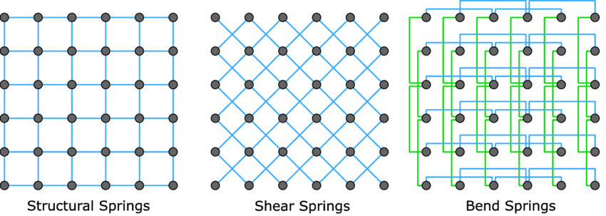

## Introduction

In this projet you will create a simulation of cloth. The cloth will be just a
subdivided plane.

You will use a Compute Shader to update the positions and velocities of the
vertices of the cloth. Your simulation will have to detect collisions between
the cloth and a sphere and make the cloth react in a realistic way.

The cloth geometry and the springs connectivity will be generated on the CPU.
The simulation must run on the GPU with a Compute Shader. Simulations parameters
must come from the CPU code via Bind Groups.

The project will have to be defended during the oral exam in January.

## Cloth Simulation

In a cloth simulation, only the motion of individual vertices is calculated.
Each vertex is considered as a point body with a mass, a position and a
velocity. At each time step, we calculate the forces that apply on the vertex.
The resultant of the forces allows us to calculate the acceleration. The
acceleration allows us to update the velocity. The velocity allows us to update
the position.
$$arrow(v_c) &= arrow(v_p) + Delta t thick arrow(R)/m \ arrow(x_c) &= arrow(x_p) + Delta t thick arrow(v_c)$$

Where $arrow(x_c)$ and $arrow(x_p)$ are respectively the positions in the
current frame and in the previous frame. Idem for $arrow(v_c)$ and $arrow(v_p)$
that are velocities. $arrow(R)$ is the resultant of the forces and $m$ the mass.
$Delta t$ is the time step. If we want a stable simulation we will need to
compute **multiple time steps between each frame**. What are the forces that
apply in a simulation of a cloth? To make a simple simulation, we consider that
the different vertices of the cloth are connected by springs. The forces are
easily calculated using Hooke's law. $$arrow(F_s) = - k thick Delta l$$

Where $k$ is the spring stiffness constant and $Delta l$ the difference in
length compared to the length of the spring at rest. the $-$ sign is there to
remind us that the force opposes the length variation and therefore acts to
bring the spring back to its rest length.

To obtain a realistic behavior it is necessary to have three types of springs in
a cloth.

The stiffness constants of these three types of springs are generally different.

The problem with springs is that they have an annoying tendency to oscillate. To
reduce this problem, a damping force is added. This force resists the movement
of the spring and is proportional to the extension rate.
$$arrow(F_d) = - c_d thick arrow(v_s)$$

Where $c_d$ is the damping coefficient.

For the cloth to fall, gravity must obviously be taken into account.
$$arrow(F_g) = m thick arrow(g)$$

The contact with the sphere will also be modelised by an elastic force:
$$arrow(F_c) = k_c thick arrow(d) thick$$

Where $arrow(d)$ is the penetration depth and $k_c$ the stiffness of collisions.

During the contact between the cloth and the sphere, it is possible to take into
account frictional forces. The friction is tangent to the friction surface and
is calculated on the basis of the resultant of the other forces.

$$arrow(R_(o_n)) &= (arrow(R_o) dot.op arrow(1_n)) thick arrow(1_n) \ arrow(R_(o_t)) &= arrow(R_o) - arrow(R_(o_n)) \ arrow(1_t) &= arrow(R_(o_t))/(|arrow(R_(o_t))|) \ arrow(F_f) &= - min(|arrow(R_(o_t))|, c_f |arrow(R_(o_n))|) thick arrow(1_t)$$

Where $arrow(R_o)$ is the resultant of the other forces. $arrow(R_(o_t))$ et
$arrow(R_(o_n))$ are its tangential and normal components. $arrow(1_n)$ is the
unit vector normal to the surface. $arrow(1_t)$ is the unit vector tangent to
the surface in the same direction as $arrow(R_(o_t))$. $c_f$ is the coefficient
of friction. In short, the frictional force cancels out the tangential component
of the other forces up to a certain point which depends on the normal component.

## Grading Grid

- The number of vertices of the fabric is easily editable in the CPU code. (4
  points)
- The compute shader receives the position and radius of the sphere from the CPU
  code. (2 points).
- The parameters of the simulation (stiffness constants, vertex masses, ...) are
  easily editable in the CPU code. (2 points)
- The effect of gravity is simulated by the Compute Shader. (2 points)
- The fabric does not pass through the sphere. (2 points)
- The effect of the springs (Hooke's law) is simulated by the Compute Shader. (4
  points)
- All three types of springs are present in the simulation. (2 points)
- The friction forces between the sphere and the fabric are simulated by the
  Compute Shader. (2 points)
