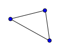

## The Render Pipeline


## Vertex Buffers

- Data attached to **each Vertex**
- Vertex Shader Thread can only acces **one** Vertex's Data
- Examples:
  - position
  - normal
  - color
  - texture coordinates
  - ...
- Can be indexed by an Index Buffer

```python
vertex_data = np.array(
    [
        #   x,    y,    z,   xn,   yn,   zn,    u,    v
        [ 0.5,  0.5,  0.5,  0.0,  0.0,  1.0,  0.0,  0.0],
        [-0.5,  0.5,  0.5,  0.0,  0.0,  1.0,  0.0,  1.0],
        [-0.5, -0.5,  0.5,  0.0,  0.0,  1.0,  1.0,  1.0],
        [ 0.5, -0.5,  0.5,  0.0,  0.0,  1.0,  1.0,  0.0],

        [ 0.5,  0.5,  0.5,  1.0,  0.0,  0.0,  0.0,  0.0],
        [ 0.5, -0.5,  0.5,  1.0,  0.0,  0.0,  0.0,  1.0],
        [ 0.5, -0.5, -0.5,  1.0,  0.0,  0.0,  1.0,  1.0],
        [ 0.5,  0.5, -0.5,  1.0,  0.0,  0.0,  1.0,  0.0],

        [ 0.5,  0.5, -0.5,  0.0,  0.0, -1.0,  0.0,  0.0],
        [ 0.5, -0.5, -0.5,  0.0,  0.0, -1.0,  0.0,  1.0],
        [-0.5, -0.5, -0.5,  0.0,  0.0, -1.0,  1.0,  1.0],
        [-0.5,  0.5, -0.5,  0.0,  0.0, -1.0,  1.0,  0.0],

        [-0.5,  0.5,  0.5, -1.0,  0.0,  0.0,  0.0,  0.0],
        [-0.5,  0.5, -0.5, -1.0,  0.0,  0.0,  0.0,  1.0],
        [-0.5, -0.5, -0.5, -1.0,  0.0,  0.0,  1.0,  1.0],
        [-0.5, -0.5,  0.5, -1.0,  0.0,  0.0,  1.0,  0.0],

        [ 0.5,  0.5,  0.5,  0.0,  1.0,  0.0,  0.0,  0.0],
        [ 0.5,  0.5, -0.5,  0.0,  1.0,  0.0,  0.0,  1.0],
        [-0.5,  0.5, -0.5,  0.0,  1.0,  0.0,  1.0,  1.0],
        [-0.5,  0.5,  0.5,  0.0,  1.0,  0.0,  1.0,  0.0],

        [ 0.5, -0.5,  0.5,  0.0, -1.0,  0.0,  0.0,  0.0],
        [-0.5, -0.5,  0.5,  0.0, -1.0,  0.0,  0.0,  1.0],
        [-0.5, -0.5, -0.5,  0.0, -1.0,  0.0,  1.0,  1.0],
        [ 0.5, -0.5, -0.5,  0.0, -1.0,  0.0,  1.0,  0.0],
    ],
    dtype=np.float32,
)

index_data = np.array(
    [
        0,  1,  2,  0,  2,  3,
        4,  5,  6,  4,  6,  7,
        8,  9, 10,  8, 10, 11,
        12, 13, 14, 12, 14, 15,
        16, 17, 18, 16, 18, 19,
        20, 21, 22, 20, 22, 23,
    ],
    dtype=np.uint32,
)
```

## Vertex Shader

- One thread per Vertex

  {.third}

- Must produce:
  - Vertex position in **Clip Space**
  - Any data needed for the Fragment Shader

## Espaces

- Vertex positions go through multiple **transformations**:
  - Object Space
  - World Space
  - Camera Space
  - Clipping Space

## Espace Object

- Axes attached to the object

```js{.script}
import * as THREE from './three.module.js'
import { OrbitControls } from './OrbitControls.js'
import { createLabel } from './label.js'

console.log(id)
const figure = document.createElement("figure")
document.getElementById(id).appendChild(figure)

const width = 1280
const height = 600

const scene = new THREE.Scene()
const camera = new THREE.PerspectiveCamera(30, width / height, 0.1, 1000)
camera.position.set(6.25, 2.75, 1.22)
camera.up.set(0, 0, 1)

const renderer = new THREE.WebGLRenderer({antialias: true})
renderer.setClearColor( 0xffffff, 1)
renderer.setSize(width, height)
figure.appendChild(renderer.domElement)

const controls = new OrbitControls( camera, renderer.domElement )

const geometry = new THREE.BoxGeometry()
const wireframe = new THREE.EdgesGeometry( geometry );
const line = new THREE.LineSegments(
  wireframe, new THREE.LineBasicMaterial( { color: 0x0000ff, linewidth: 2 } )
);
const redMaterial = new THREE.MeshBasicMaterial( { color: 0xff0000 } )
const cube = new THREE.Mesh(
  wireframe, new THREE.LineBasicMaterial( { color: 0x0000ff, linewidth: 2 } )
)

const axeZ = new THREE.ArrowHelper(
  new THREE.Vector3( 0, 0, 1 ), new THREE.Vector3( 0, 0, 0 ), 1, 0x000000
)
const axeX = new THREE.ArrowHelper(
  new THREE.Vector3( 1, 0, 0 ), new THREE.Vector3( 0, 0, 0 ), 1, 0x000000
)
const axeY = new THREE.ArrowHelper(
  new THREE.Vector3( 0, 1, 0 ), new THREE.Vector3( 0, 0, 0 ), 1, 0x000000
)

const labelX = createLabel('x')
labelX.position.set(1.2, 0, 0)

const labelY = createLabel('y')
labelY.position.set(0, 1.2, 0)

const labelZ = createLabel('z')
labelZ.position.set(0, 0, 1.2)

scene.add(line)
scene.add(axeX)
scene.add(axeY)
scene.add(axeZ)
scene.add(labelX)
scene.add(labelY)
scene.add(labelZ)

renderer.domElement.style=''

const animate = function () {
    requestAnimationFrame( animate )
    controls.update();
    renderer.render( scene, camera )
}

animate()
```

## Projective Geometry

- Transition to projective geometry
  $$mat(x; y; z) arrow.r mat(k dot.c x; k dot.c y; k dot.c z; k)$$

  For all $k$. We often choose $k=1$

## World Space

- Transition from object space to world space

$$mat(x_w; y_w; z_w; t_w) = "ModelMatrix" dot.c mat(x_o; y_o; z_o; t_o)$$

- This matrix is a combination of translation, rotation ans scaling.

## Camera Space

- Transition from world space to camera space

$$mat(x_"cam"; y_"cam"; z_"cam"; t_"cam") = "ViewMatrix" dot.c mat(x_w; y_w; z_w; t_w)$$

- This matrix is a combination of translation and rotation. We sometimes combine
  the ModelMatrix and the ViewMatrix matrices.

$$"ModelViewMatrix" = "ViewMatrix" dot.c "ModelMatrix"$$

## View Matrix

```python
def look_at(
    eye: ArrayLike, target: ArrayLike, up: ArrayLike
) -> NDArray:
    """
    Convert world coordinates to camera coordinates where the camera
    point in the direction of -z axis.
    """
    eye = np.array(eye, dtype=np.float32)
    target = np.array(target, dtype=np.float32)
    up = np.array(up, dtype=np.float32)
    f = target - eye
    f = f / np.linalg.norm(f)
    s = np.cross(f, up)
    s = s / np.linalg.norm(s)
    u = np.cross(s, f)

    return np.array([[ s[0],  s[1],  s[2], -eye @ s],
                     [ u[0],  u[1],  u[2], -eye @ u],
                     [-f[0], -f[1], -f[2],  eye @ f],
                     [    0,     0,     0,        1]], dtype=np.float32)
```

## Clip Space

- Projection of the vertices by the camera.

$$mat(x_"clip"; y_"clip"; z_"clip"; t_"clip") = "ProjectionMatrix" dot.c mat(x_"cam"; y_"cam"; z_"cam"; t_"cam")$$

- Vertices outside the interval $([-t, t], [-t, t], [0, t], t)$ are **clipped**.

## Projection Matrix

```python
def perspective(
    fovy_deg: float, aspect: float, near: float, far: float)
) -> NDArray:
    """
    Convert camera coordinates to wgpu clip coordinates where x and y goes
    from -1.0 to 1.0 and z goes from 0.0 to 1.0.
    """

    angle = fovy_deg * np.pi / 180

    yspan = near * np.tan(angle)
    xspan = yspan * aspect

    c0r0 = 2 * near / xspan
    c1r1 = 2 * near / yspan
    c2r2 = -(far + near) / (far - near) / 2 - 0.5
    c3r2 = -far * near / (far - near)

    return np.array([[c0r0,    0,    0,    0],
                     [   0, c1r1,    0,    0],
                     [   0,    0, c2r2, c3r2],
                     [   0,    0,   -1,    0]], dtype=np.float32)
```

## Normalized Device Coordinates (NDC)

- We leave the projective geometry
- Not in Vertex Shader
- Called **perspective division**

$$mat(x_"ndc"; y_"ndc"; z_"ndc") = mat(x_"clip"/t_"clip"; y_"clip"/t_"clip"; z_"clip"/t_"clip")$$

## Rasterizer

- Get data from the Vertex Stage
- Compose Primitives [Triangles, Lines, Points, ...]{.small}
- Divide primitives into Fragments _(pixels)_

  {.third}

- Interpolate data from the Vertex Stage across primitives

## Fragment Shader

- One thread per Fragment
- Compute the color of the fragment [The Shading]{.small}

## Depth Texture / z-buffer

- Store $z_"clip"$ for each pixel
- Enables **hidden surface removal** [avoid rendering a fragment that is behind
  the current rendered fragment at that pixel]{.small}
- Required for **3D rendering pipelines** [We cannot always render from back to
  front]{.small}

- Can be sampled in shaders for post-processing effects

## The Window

```terminal
> pip install rendercanvas glfw
```

```python
from rendercanvas.auto import RenderCanvas, loop
import wgpu

adapter = wgpu.gpu.request_adapter_sync(power_preference="high-performance")
device = adapter.request_device_sync()

canvas = RenderCanvas(
    size=(640, 480), title="WebGPU Example",
    update_mode="continuous", max_fps=60,
)
context = canvas.get_wgpu_context()
render_texture_format = context.get_preferred_format(device.adapter)
context.configure(device=device, format=render_texture_format)

@canvas.request_draw
def draw_frame():
    screen_texture = context.get_current_texture()
    # render in the screen_texture

loop.run()
```

## Shading

- Diffuse lighting
  - The most basic lighting model [The diffuse lighting corresponds to the light
    reflected in all directions by the illuminated surface. It does not depend
    on the point of view.]{.small}

:::row

::::span4

{.third2}

::::

::::span8

- $N$ is the normal vector to the surface.
- $L$ is the vector directed towards the light.

These two vectors are normalized.

The diffuse intensity reflected $I_d$ is calculated by

$$I_d = (L dot.c N)C_d$$

where is the diffuse color (i.e. the color of the object).

Colors are $(r, g, b)$ vectors.

::::

:::

## Texture Coordinates


## Cube{.code}

```python
from rendercanvas.auto import RenderCanvas, loop
import wgpu
import numpy as np
import PIL.Image as Image
from primitives import cube
from camera import Camera


class App:
    def __init__(self):
        adapter = wgpu.gpu.request_adapter_sync(power_preference="high-performance")
        self.device = adapter.request_device_sync()

        self.size = (0, 0)

        self.canvas = RenderCanvas(
            size=(640, 480),
            title="WebGPU Example",
            update_mode="continuous",
            max_fps=60,
        )
        self.context = self.canvas.get_wgpu_context()

        render_texture_format = self.context.get_preferred_format(self.device.adapter)
        self.context.configure(device=self.device, format=render_texture_format)

        vertex_data, index_data = cube()

        self.vertex_buffer = self.device.create_buffer_with_data(
            data=vertex_data, usage=wgpu.BufferUsage.VERTEX
        )

        self.index_buffer = self.device.create_buffer_with_data(
            data=index_data, usage=wgpu.BufferUsage.INDEX
        )

        bg_layout = self.device.create_bind_group_layout(
            entries=[
                {
                    "binding": 0,
                    "visibility": wgpu.ShaderStage.VERTEX | wgpu.ShaderStage.FRAGMENT,
                    "buffer": {"type": wgpu.BufferBindingType.uniform},
                },
                {
                    "binding": 1,
                    "visibility": wgpu.ShaderStage.FRAGMENT,
                    "texture": {},
                },
                {
                    "binding": 2,
                    "visibility": wgpu.ShaderStage.FRAGMENT,
                    "sampler": {},
                },
            ]
        )

        p_layout = self.device.create_pipeline_layout(bind_group_layouts=[bg_layout])

        self.render_params_buffer = self.device.create_buffer(
            size=4 * 4 + 2 * 4 * 4 * 4,
            usage=wgpu.BufferUsage.UNIFORM | wgpu.BufferUsage.COPY_DST,
        )

        img = Image.open("./texel_checker.png")
        texture_size = img.size + (1,)
        texture = self.device.create_texture(
            size=texture_size,
            format=wgpu.TextureFormat.rgba8unorm_srgb,
            usage=wgpu.TextureUsage.TEXTURE_BINDING | wgpu.TextureUsage.COPY_DST,
        )
        self.device.queue.write_texture(
            destination={
                "texture": texture,
            },
            data=np.asarray(img),
            data_layout={
                "bytes_per_row": img.size[0] * 4,
            },
            size=texture_size,
        )
        sampler = self.device.create_sampler()

        self.render_params_bind_group = self.device.create_bind_group(
            layout=bg_layout,
            entries=[
                {
                    "binding": 0,
                    "resource": {
                        "buffer": self.render_params_buffer,
                        "offset": 0,
                        "size": self.render_params_buffer.size,
                    },
                },
                {
                    "binding": 1,
                    "resource": texture.create_view(),
                },
                {
                    "binding": 2,
                    "resource": sampler,
                },
            ],
        )

        self.canvas.add_event_handler(
            self.process_event, "pointer_up", "pointer_down", "pointer_move", "wheel"
        )  # type: ignore

        self.camera = Camera(45, 640 / 480, 0.1, 100, 3, np.pi / 4, np.pi / 4)

        vertex_buffer_descriptor = {
            "array_stride": 8 * 4,
            "step_mode": wgpu.VertexStepMode.vertex,
            "attributes": [
                {
                    "format": wgpu.VertexFormat.float32x3,
                    "offset": 0,
                    "shader_location": 0,
                },
                {
                    "format": wgpu.VertexFormat.float32x3,
                    "offset": 3 * 4,
                    "shader_location": 1,
                },
                {
                    "format": wgpu.VertexFormat.float32x2,
                    "offset": 6 * 4,
                    "shader_location": 2,
                },
            ],
        }

        with open("./render.wgsl") as file:
            shader_module = self.device.create_shader_module(code=file.read())

        self.pipeline = self.device.create_render_pipeline(
            layout=p_layout,
            vertex={
                "module": shader_module,
                "entry_point": "vs_main",
                "buffers": [vertex_buffer_descriptor],
            },
            primitive={
                "topology": wgpu.PrimitiveTopology.triangle_list,
                "front_face": wgpu.FrontFace.ccw,
                "cull_mode": wgpu.CullMode.back,
            },
            depth_stencil={
                "format": wgpu.TextureFormat.depth32float,
                "depth_write_enabled": True,
                "depth_compare": wgpu.CompareFunction.less,
            },
            multisample=None,
            fragment={
                "module": shader_module,
                "entry_point": "fs_main",
                "targets": [
                    {
                        "format": render_texture_format,
                        "blend": {
                            "color": {},
                            "alpha": {},
                        },
                    },
                ],
            },
        )

    def process_event(self, event):
        self.camera.process_event(event)

    def loop(self):
        screen_texture: wgpu.GPUTexture = self.context.get_current_texture()  # type: ignore
        size = screen_texture.size
        if size[:2] != self.size:
            self.depth_texture = self.device.create_texture(
                size=size,
                format=wgpu.TextureFormat.depth32float,
                usage=wgpu.TextureUsage.RENDER_ATTACHMENT
                | wgpu.TextureUsage.TEXTURE_BINDING,
            )
            self.size = size[:2]
            self.camera.aspect = size[0] / size[1]

        # light_position must be vec4 for memory alignement
        light_position = np.array([-10, 10, 10, 0], dtype=np.float32)

        proj_matrix, view_matrix = self.camera.get_matrices()

        render_params_data = light_position.tobytes()
        # Must send transpose version of matrices, because GPU expect matrices
        # in column major order
        render_params_data += view_matrix.T.tobytes()
        render_params_data += proj_matrix.T.tobytes()

        self.device.queue.write_buffer(
            buffer=self.render_params_buffer, data=render_params_data, buffer_offset=0
        )

        command_encoder = self.device.create_command_encoder()

        render_pass = command_encoder.begin_render_pass(
            color_attachments=[
                {
                    "view": screen_texture.create_view(),
                    "resolve_target": None,
                    "clear_value": (0.9, 0.9, 0.9, 1.0),
                    "load_op": wgpu.LoadOp.clear,
                    "store_op": wgpu.StoreOp.store,
                }
            ],
            depth_stencil_attachment={
                "view": self.depth_texture.create_view(),
                "depth_clear_value": 1.0,
                "depth_load_op": wgpu.LoadOp.clear,
                "depth_store_op": wgpu.StoreOp.store,
            },
        )

        render_pass.set_pipeline(self.pipeline)
        render_pass.set_vertex_buffer(0, self.vertex_buffer)
        render_pass.set_index_buffer(self.index_buffer, wgpu.IndexFormat.uint32)
        render_pass.set_bind_group(0, self.render_params_bind_group)
        render_pass.draw_indexed(36)
        render_pass.end()

        self.device.queue.submit([command_encoder.finish()])

    def run(self):
        self.canvas.request_draw(self.loop)
        loop.run()


App().run()
```

## Shader{.code}

```wgsl
struct CameraUniform {
    light: vec4<f32>,
    view: mat4x4<f32>,
    proj: mat4x4<f32>,
};
@group(0) @binding(0) var<uniform> params: CameraUniform;
@group(0) @binding(1) var texture: texture_2d<f32>;
@group(0) @binding(2) var samplr: sampler;

struct VertexInput {
    @location(0) position: vec3<f32>,
    @location(1) normal: vec3<f32>,
    @location(2) uv: vec2<f32>,
};

struct VertexOutput {
    @builtin(position) clip: vec4<f32>,
    @location(0) position: vec3<f32>,
    @location(1) normal: vec3<f32>,
    @location(2) uv: vec2<f32>,
};

@vertex
fn vs_main(in: VertexInput) -> VertexOutput {
    var out: VertexOutput;
    out.clip = params.proj * params.view * vec4<f32>(in.position, 1.0);
    out.position = in.position;
    out.normal = in.normal;
    out.uv = in.uv;
    return out;
}

@fragment
fn fs_main(in: VertexOutput) -> @location(0) vec4<f32> {
    let light_dir = params.light.xyz - in.position;
    let shading = clamp(dot(light_dir, in.normal), 0.4, 1.0);
    let color = textureSample(texture, samplr, in.uv);
    return vec4<f32>(color.xyz * shading, 1.0);
}
```

## camera.py{.code}

```python
import numpy as np
from numpy.typing import NDArray, ArrayLike
from cgmath import look_at, perspective


class Camera:
    def __init__(
        self,
        fovy_deg: float,
        aspect: float,
        near: float,
        far: float,
        radius: float,
        longitude: float,
        latitude: float,
        target: ArrayLike = [0.0, 0.0, 0.0],
    ):
        self.pointer_down = False
        self.last_pointer_pos = np.array([0.0, 0.0])
        self.radius = 3
        self.longitude = np.pi / 4
        self.latitude = np.pi / 4
        self.fovy_deg = fovy_deg
        self.aspect = aspect
        self.near = near
        self.far = far
        self.radius = radius
        self.longitude = longitude
        self.latitude = latitude
        self.target = np.array(target)

    def get_matrices(self) -> tuple[NDArray, NDArray]:
        camera_position = np.array(
            [
                np.cos(self.latitude) * np.cos(self.longitude),
                np.sin(self.latitude),
                np.cos(self.latitude) * np.sin(self.longitude),
            ]
        )

        camera_position = self.target + camera_position * self.radius

        view_matrix = look_at(camera_position, [0, 0, 0], [0, 1, 0])
        proj_matrix = perspective(45, self.aspect, 0.1, 100)

        return proj_matrix, view_matrix

    def process_event(self, event):
        if event["event_type"] == "pointer_down":
            self.pointer_down = True
        elif event["event_type"] == "pointer_up":
            self.pointer_down = False
        elif event["event_type"] == "pointer_move":
            pointer_pos = np.array([event["x"], event["y"]])
            delta = pointer_pos - self.last_pointer_pos
            self.last_pointer_pos = pointer_pos
            if self.pointer_down:
                self.longitude = (self.longitude + delta[0] * 0.01) % (2 * np.pi)
                self.latitude = np.clip(
                    self.latitude + delta[1] * 0.01, -np.pi / 2, np.pi / 2
                )

        elif event["event_type"] == "wheel":
            self.radius = max(0.1, self.radius + event["dy"] * 0.001)

```

## Exercices

- [Exercices](../lab3_exo/)
- [The texture `texel_checker.png`](./texel_checker.png)
- [Memory Alignement Calculator](https://webgpufundamentals.org/webgpu/lessons/resources/wgsl-offset-computer.html#)
