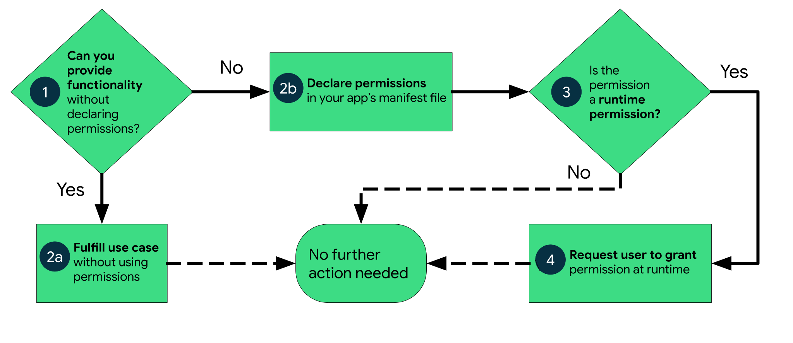

<section>

## The beginning of computing

- Computers used by professionals and enthusiast
- Limited mass distribution of softwares
- Built-in development tools

**Most users run their own code!**

**No need for security**

</section>

<section>

 ## Security on computers

  - Needed whith multi-user OS
  - Limit interactions between users
  - No security with respect to the code

  **Code runs with logged-in user's permissions!**

  You must trust the code will do things you would 

</section>

<section>

  ## Computers today

  - Security model mostly unchanged
  - Softwares with closed source
  - Most users can't read or write code
  - Download any software from Internet

  **A lot of security issues**

</section>

<section>

  ## Some security measures

  - Separated admin privileges (popups, sudo)
  - Signed application executables
  - Personal files access popups

</section>

<section>

  ## Application sandboxing

  - Treat code as an untrustworthy stranger
  - Apps can't do anything by default
  - Must use OS APIs that will inform the user

  **This is the model used on the web (js) and on Mobile OS**

</section>

<section>

  ## Android Sandbox

  <figure></figure> 

</section>

<section>

  ## Android Sandbox

  By default, no acces to:

  - Other app files
  - Content providers (contacts, photos, calendars, ...)
  - Sensors (microphone, camera, localisation, inertial, ...)
  - Network

</section>

<section>

  ## Types of permissions

  - **Install-time** permissions
  - **Runtime** permissions <small>require your app to go a step further and request the permission at runtime</small>

</section>

<section>

  ## Install-time permissions

  - **Automatically granted** when your app is installed <small>If the user accept it</small>
  - Data or action that present very **little risk** to the user's privacy and the operation of other apps.

</section>

<section>

  ## Runtime permissions

  - Don't assume that these permissions have been previously granted
  - Need to **request** runtime permissions in your app <small>just before the actual access</small>
  - The system presents a runtime **permission prompt** to the user
  - Need to **explain** why your app accesses this information <small>The user may deny</small>

</section>

<section>

  ## Android permissions

  <figure></figure>

</section>

<section>

  ## No permissions needed

  - **Delegate** the access to sensitive data to an other app that have the permission.
  - Examples:
      - The camera app for taking a picture
      - The Contact app for picking a contact
      - ...
  - Use the `Intent` mecanism

</section>

<section>

  ## Goals

  - **Control:** The user has control over the data that they share with apps.
  - **Transparency:** The user understands what data an app uses and why the app accesses this data.
  - **Data minimization:** An app accesses and uses only the data that's required for a specific task or action that the user invokes.

</section>

<section>

  ## Best practices

  - Request a **minimal** number of permissions <small>only the permissions that it needs to complete that action</small>
  - Associate runtime permissions with **specific** actions <small>Request permissions as late as possible</small>
  - Consider your app's **dependencies** <small>you inherit its permission requirements</small>
  - Be **transparent** <small>Explain what is accessed and why</small>
  - Make system accesses **explicit** <small>Use a mic indicator when recording audio</small>

</section>

