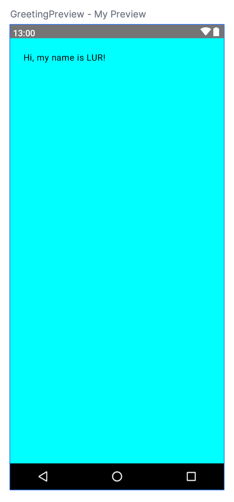
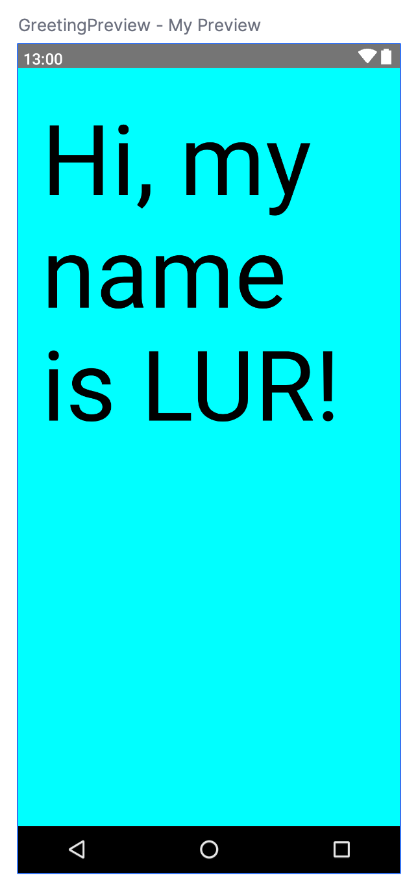
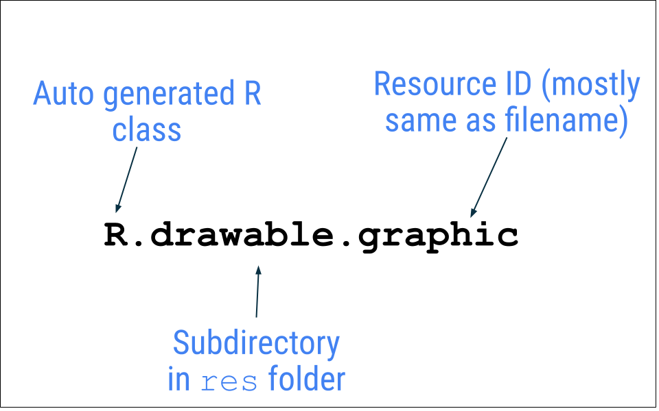
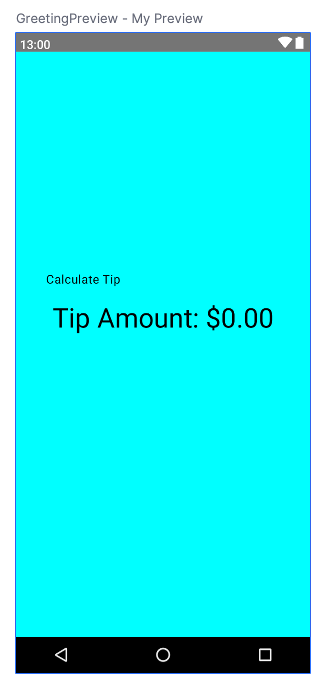
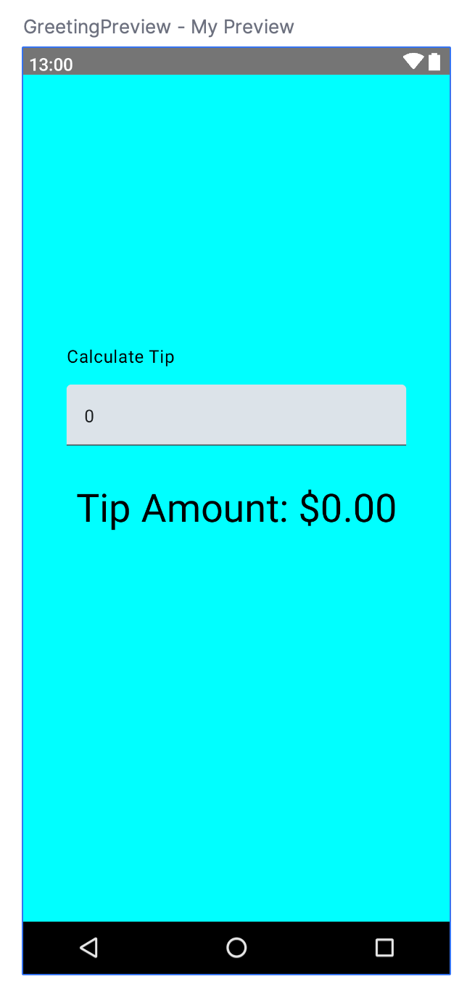
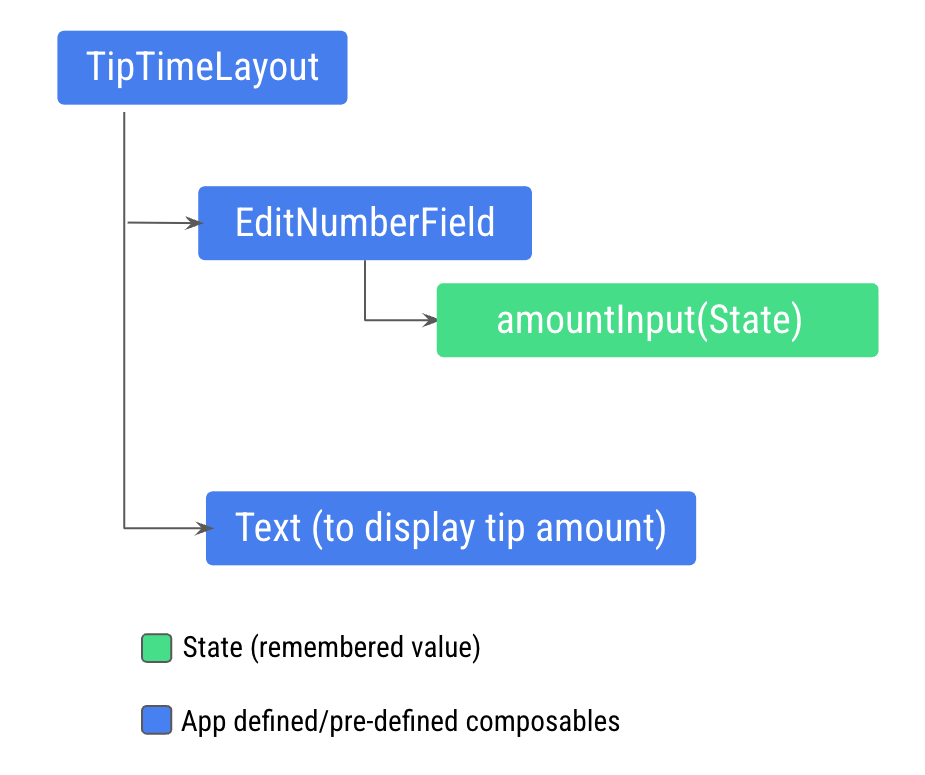
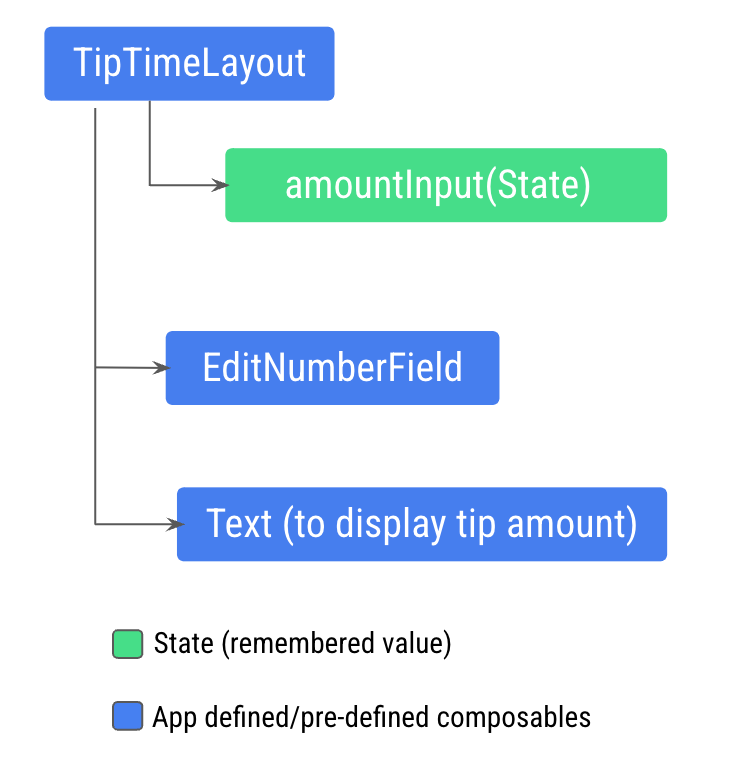

## Create a new project

1. Launch Android Studio.

1. In the **Welcome to Android** Studio dialog, click **New Project**.
    <figure>
    
    </figure>

    The **New Project window** opens with a list of templates provided by Android Studio.

    <figure>
    
    </figure>
1. Make sure the **Phone and Tablet** tab is selected.

1. Click the **Empty Activity** template to select it as the template for your project.

1. Click **Next**. The **New Project** dialog opens.
    <figure>
    
    </figure>

1. Configure your project as follows:

    The Name field is used to enter the name of your project, for this codelab type "Lab 1".

    Leave the **Package name** field as is. This is how your files will be organized in the file structure. In this case, the package name will be `com.example.lab1`. You can also use a domain name that your own in reverse order instead of `com.example`.

    Leave the **Save location** field as is. It contains the location where all the files related to your project are saved. Take a note of where that is on your computer so that you can find your files.

    Select **API 24: Android 7.0 (Nougat)** from the menu in the **Minimum SDK** field. Minimum SDK indicates the minimum version of Android that your app can run on.

1. Click **Finish**. This may take a while - this is a great time to get a cup of tea! While Android Studio is setting up, a progress bar and message indicates whether Android Studio is still setting up your project. It may look like this: 

    A message that looks similar to this informs you when the project set up is created: 

1. You may see a **What's New** pane which contains updates on new features in Android Studio. Close it for now.

1. Click **Split** on the top right of Android Studio  , this allows you to view both code and design. You can also click **Code** to view code only or click **Design** to view design only.

    After pressing Split you should see three areas:

    <figure>
    
    </figure>

    - The **Project** view (1) shows the files and folders of your project
    - The **Code** view (2) is where you edit code
    - The **Design** view (3) is where you preview what your app looks like

    In the **Design** view, you will see a blank pane with this text:

    <figure>
    
    </figure>

1. Click **Build & Refresh**. It may take a while to build but when it is done the preview shows a text box that says "**Hello Android!**". Empty Compose activity contains all the code necessary to create this app.

    <figure>
    
    </figure>

## Find project files

In this section you will continue to explore Android Studio by becoming familiar with the file structure.

1. In Android Studio, take a look at the **Project** tab. The **Project** tab shows the files and folders of your project. When you were setting up your project the package name was **com.example.lab1**. You can see that package right here in the **Project** tab. A package is basically a folder where code is located. Android Studio organizes the project in a directory structure made up of set of packages.

1. If necessary, select **Android** from the drop-down menu in the **Project** tab.

    <figure>
      
    </figure>

    This is the standard view and organization of files that you use. It's useful when you write code for your project because you can easily access the files you will be working on in your app. However, if you look at the files in a file browser, such as Finder or Windows Explorer, the file hierarchy is organized very differently.

1. Select **Project Source Files** from the drop-down menu. You can now browse the files in the same way as in any file browser.

    <figure>
      
    </figure>

1. Select **Android** again to switch back to the previous view. You use the **Android** view for this course. If your file structure ever looks strange, check to make sure you're still in **Android** view.

## Update the text

Now that you have gotten to know Android Studio, it's time to start making some modifications!

Look at the **Code** view of the `MainActivity.kt` file. Notice there are some automatically generated functions in this code, specifically the `onCreate()` and the `setContent()` functions.

```kotlin
class MainActivity : ComponentActivity() {
  override fun onCreate(savedInstanceState: Bundle?) {
    super.onCreate(savedInstanceState)
    setContent {
      Lab1Theme {
        // A surface container using the 'background' color from the theme
        Surface(
          modifier = Modifier.fillMaxSize(),
          color = MaterialTheme.colorScheme.background
        ) {
          Greeting("Android")
        }
      }
    }
  }
}
```

The `onCreate()` function is the entry point to this Android app and calls other functions to build the user interface. In Kotlin programs, the `main()` function is the entry point/starting point of execution. In Android apps, the `onCreate()` function fills that role.

The `setContent()` function within the `onCreate()` function is used to define your layout through composable functions. All functions marked with the `@Composable` annotation can be called from the `setContent()` function or from other Composable functions. The annotation tells the Kotlin compiler that this function is used by Jetpack Compose to generate the UI.

Next, look at the `Greeting()` function. The `Greeting()` function is a Composable function, notice the `@Composable` annotation above it. This Composable function takes some input and generates what's shown on the screen.

```kotlin
@Composable
fun Greeting(name: String, modifier: Modifier = Modifier) {
  Text(
    text = "Hello $name!",
    modifier = modifier
  )
}
```

You've learned about functions before, but there are a few differences with composable functions:

- You add the `@Composable` annotation before the function. 
- `@Composable` function names are capitalized.
- `@Composable` functions can't return anything.

Right now the `Greeting()` function takes in a name and displays Hello to that person.

1. Update the `Greeting()` function to introduce yourself instead of saying "Hello":

    ```kotlin
    @Composable
    fun Greeting(name: String, modifier: Modifier = Modifier) {
      Text(
        text = "Hi, my name is $name!",
        modifier = modifier
      )
    }
    ```

1. Android Studio should automatically update the preview.

Great! You changed the text, but it introduces you as Android, which is probably not your name. Next, you will personalize it to introduce you with your name!

The `GreetingPreview()` function is a cool feature that lets you see what your composable looks like without having to build your entire app. To enable a preview of a composable, annotate it with `@Composable` and `@Preview`. The `@Preview` annotation tells Android Studio that this composable should be shown in the design view of this file.

As you can see, the `@Preview` annotation takes in a parameter called `showBackground`. If `showBackground` is set to `true`, it will add a background to your composable preview.

Since Android Studio by default uses a light theme for the editor, it can be hard to see the difference between `showBackground = true` and `showBackground = false`.

Update the `GreetingPreview()` function with your name. Then rebuild and check out your personalized App!

```kotlin
@Preview(showBackground = true)
@Composable
fun GreetingPreview() {
    Lab1Theme {
        Greeting("LUR")
    }
}
```

You can pass multiple arguments to the annotation, as shown here.

```kotlin
@Preview(
    showBackground = true,
    showSystemUi = true,
    name = "My Preview"
)
@Composable
fun GreetingPreview() {
    Lab1Theme {
        Greeting("LUR")
    }
}
```

<figure>
  
</figure>

## Run your App

You can:

- [Run your App on the emulator](https://developer.android.com/codelabs/basic-android-kotlin-compose-emulator?continue=https%3A%2F%2Fdeveloper.android.com%2Fcourses%2Fpathways%2Fandroid-basics-compose-unit-1-pathway-2%23codelab-https%3A%2F%2Fdeveloper.android.com%2Fcodelabs%2Fbasic-android-kotlin-compose-emulator)
- [Run your App on an actual Android device](https://developer.android.com/codelabs/basic-android-kotlin-compose-connect-device?continue=https%3A%2F%2Fdeveloper.android.com%2Fcourses%2Fpathways%2Fandroid-basics-compose-unit-1-pathway-2%23codelab-https%3A%2F%2Fdeveloper.android.com%2Fcodelabs%2Fbasic-android-kotlin-compose-connect-device)

## Change the background color

Now you have the introduction text, but it's a little boring! In this section, you learn to change the background color.

To set a different background color for your introduction, you'll need to surround your text with a [`Surface`](https://developer.android.com/reference/kotlin/androidx/compose/material/package-summary#Surface(androidx.compose.ui.Modifier,androidx.compose.ui.graphics.Shape,androidx.compose.ui.graphics.Color,androidx.compose.ui.graphics.Color,androidx.compose.foundation.BorderStroke,androidx.compose.ui.unit.Dp,kotlin.Function0)). A `Surface` is a container that represents a section of UI where you can alter the appearance, such as the background color or border.

We can of course add a `Surface` Composable to our app but we already have one in the `onCreate()` method. We can just change its `color` parameter.

1. Set the `color` parameter of the `Surface` to `Color.Cyan`.

1. You need to import the `Color` type.

    ```kotlin
    import androidx.compose.ui.graphics.Color
    ```
1. In your code, the best practice is to keep your imports listed alphabetically and remove unused imports. To do this press **Help** on the top toolbar, type in **optimize imports**, and click on **Optimize Imports**.

1. If you run the app now, you will see the new background color. But the preview do not show it. It's because the `GreetingPreview()` function do not apply the same Surface. So let's add it:

    ```kotlin
    @Preview(
      showBackground = true,
      showSystemUi = true,
      name = "My Preview"
    )
    @Composable
    fun GreetingPreview() {
      Lab1Theme {
        Surface(
          color = Color.Cyan,
          modifier = Modifier.fillMaxSize()
        ) {
          Greeting(name = "LUR")
        }
      }
    }
    ```

1. Notice the updated preview:

    <figure></figure>

## Use Modifiers

Now your app has a background color, next you will add some space (padding) around the text.

A [`Modifier`](https://developer.android.com/reference/kotlin/androidx/compose/ui/Modifier) is used to augment or decorate a composable. One modifier you can use is the `padding` modifier, which adds space around the element (in this case, adding space around the text). This is accomplished by using the [`Modifier.padding()`](https://developer.android.com/reference/kotlin/androidx/compose/ui/Modifier#(androidx.compose.ui.Modifier).padding(androidx.compose.ui.unit.Dp)) function.

Every composable should have an optional parameter of the type `Modifier`. This should be the first optional parameter.

1. Add a padding to the `modifier` with a size of `24.dp`.

    ```kotlin
    @Composable
    fun Greeting(name: String, modifier: Modifier = Modifier) {
      Text(
        text = "Hi, my name is $name!",
        modifier = modifier.padding(24.dp)
      )
    }
    ```

1. Add these imports to the import statement section.
    ```kotlin
    import androidx.compose.ui.unit.dp
    import androidx.compose.foundation.layout.padding
    ```

    Make sure to use **Optimize Imports** to alphabetize the new imports.

1. Notice the updated preview.

    <figure>
    
    </figure>


## Change font size

You added text to your user interface. In this section, you learn how to change the size, text color, and other attributes that affect the appearance of the text element. You can also experiment with different font sizes and colors.

### Scalable pixels

The [scalable pixels (SP)](https://developer.android.com/reference/kotlin/androidx/compose/ui/unit/package-summary#(kotlin.Float).sp()) is a unit of measure for the font size. UI elements in Android apps use two different units of measurement: [density-independent pixels (DP)](https://developer.android.com/reference/kotlin/androidx/compose/ui/unit/package-summary#(kotlin.Int).dp()), which you use later for the layout, and scalable pixels (SP). By default, the SP unit is the same size as the DP unit, but it resizes based on the user's preferred text size under phone settings.

1. In the `MainActivity.kt` file, scroll to the `Text()` composable in the `Greeting()` function.

1. Pass the `Text()` function a `fontSize` argument as a second named argument and set it to a value of `100.sp`.

    ```kotlin
    @Composable
    fun Greeting(name: String, modifier: Modifier = Modifier) {
      Text(
        text = "Hi, my name is $name!",
        fontSize = 100.sp,
        modifier = modifier.padding(20.dp)
      )
    }
    ```

1. You need this import:

    ```kotlin
    androidx.compose.ui.unit.sp
    ```

1. Notice the updated preview of the font size. The reason for overlapping message is you need to specify the line height.

1. Update the `Text` composable to include the line height.

    ```kotlin
    @Composable
    fun Greeting(name: String, modifier: Modifier = Modifier) {
      Text(
        text = "Hi, my name is $name!",
        fontSize = 100.sp,
        lineHeight = 116.sp,
        modifier = modifier.padding(20.dp)
      )
    }
    ```

    <figure></figure>

## Tip Time

Let's build an interactive tip calculator that automatically calculates the tip amount when you enter the service amount. 

1. Rename the `Greeting()` function by right click its name and select **Refactor** and then **Rename...**. Type **TipTimeLayout** as the new name.

1. We can remove the `fontSize` and `lineHeight` parameters because we will not use this giant text size anymore.

1. Remove the `name` parameter as we don't need it anymore. The `Text` will now display the string **Calculate Tip**.

    ```kotlin
    @Composable
    fun TipTimeLayout(modifier: Modifier = Modifier) {
      Text(
        text = "Calculate Tip",
        modifier = modifier.padding(24.dp)
      )
    }
    ```

1. Update the calls to `TipTimeLayout()` to remove the string parameter.

## String resources

It is not a good practice to hardcode UI strings in our code. It make the app hard to translate in other languages. Instead, we can use a string resource.

Resources are the additional files and static content that your code uses, such as bitmaps, user-interface strings, animation instructions, and more. For more information about resources in Android, see [App resources overview](https://developer.android.com/guide/topics/resources/providing-resources).

You should always separate app resources, such as images and strings, from your code so that you can maintain them independently. At runtime, Android uses the appropriate resource based on the current configuration. For example, you might want to provide a different UI layout based on the screen size or different strings based on the language setting.

### Grouping resources

You should always place each type of resource in a specific subdirectory of your project's res/ directory. For example, here's the file hierarchy for a simple project:

```
MyProject/
    src/
        MyActivity.kt
    res/
        drawable/
            graphic.png
        mipmap/
            icon.png
        values/
            strings.xml
```

As you can see in this example, the `res/` directory contains all the resources in subdirectories, which includes a `drawable/` directory for an image resource, a `mipmap/` directory for launcher icons, and a `values/` directory for string resources. To learn more about the usage, format, and syntax for app resources, see [Resource types overview](https://developer.android.com/guide/topics/resources/available-resources).

### Accessing resources

Jetpack Compose can access the resources defined in your Android project. Resources can be accessed with resource IDs that are generated in your project's `R` class.

An `R` class is an automatically generated class by Android that contains the IDs of all resources in the project. In most cases, the resource ID is the same as the filename. For example, the image in the previous file hierarchy can be accessed with this code:

```kotlin
R.drawable.graphic
```

<figure></figure>

### `strings.xml`

The file `strings.xml` located in the `values/` directory contains the string resources. Here is the content of that file:

```xml
<resources>
  <string name="app_name">lab1</string>
</resources>
```

Let's add a entry for our "Calculate Tip" string:

```xml
<resources>
  <string name="app_name">lab1</string>
  <string name="calculate_tip">Calculate Tip</string>
</resources>
```

We can now use that resource in our code:

```kotlin
@Composable
fun TipTimeLayout(modifier: Modifier = Modifier) {
  Text(
    text = stringResource(R.string.calculate_tip),
    modifier = modifier.padding(24.dp)
  )
}
```

## UI Hierarchy

Let's add another `Text` to display the amout.

1. After the name `Text` composable, add another `Text` composable that accepts a text argument set to a string resource named `tip_amount`.

1. Add the `tip_amount` string resource. But with a placeholder for another string.

    ```xml
    <resources>
      <string name="app_name">lab1</string>
      <string name="calculate_tip">Calculate Tip</string>
      <string name="tip_amount">Tip Amount: %s</string>
    </resources>
    ```

1.  We can set the values for placeholders with additional arguments in the `stringResource()` function.

    ```kotlin
    @Composable
    fun TipTimeLayout(modifier: Modifier = Modifier) {
      Text(
        text = stringResource(R.string.calculate_tip),
        modifier = modifier.padding(24.dp)
      )
      Text(
        text = stringResource(R.string.tip_amount, "$0.00")
      )
    }
    ```

1. Notice the preview.

A composable function might describe several UI elements. However, if you don't provide guidance on how to arrange them, Compose might arrange the elements in a way that you don't like. For example, the previous code generates two text elements that overlap each other because there's no guidance on how to arrange the two composables.

The UI hierarchy is based on containment, meaning one component can contain one or more components, and the terms parent and child are sometimes used. The context here is that the parent UI elements contain children UI elements, which in turn can contain children UI elements. In this section, you will learn about `Column`, `Row`, and `Box` composables, which can act as parent UI elements.

<figure>
  
</figure>

Use `Box` layout to stack elements on top of one another. `Box` layout also lets you configure the specific alignment of the elements that it contains.

`Column`, `Row`, and `Box` are composable functions that take composable content as arguments, so you can place items inside these layout elements. For example, each child element inside a `Row` composable is placed horizontally next to each other in a row.

Let's arrange the text elements in your app in a column to avoid overlap.

1. In the `MainActivity.kt` file, scroll to the `TipTimeLayout()` function.

1. Add the `Column` composable around the text elements so that it shows a column with two text elements. Select the two `Text` composables, click on the light bulb. Select `Surround with widget` > `Surround with Column`.

1. Android Studio auto imports `Column` function for you. Scroll to the top and notice the import section. The import `androidx.compose.foundation.layout.Column` should have been added.

1. Move the padding `Modifier` at the `Column` level.

    ```kotlin
    @Composable
    fun TipTimeLayout(modifier: Modifier = Modifier) {
      Column (
        modifier = modifier.padding(24.dp)
      ) {
        Text(
          text = stringResource(R.string.calculate_tip)
        )
        Text(
          text = stringResource(R.string.tip_amount, "$0.00")
        )
      }
    }
    ```

    The preview looks much better now that there's no overlap. But we can improve it even more.

1. To set children's position within a `Row`, set the `horizontalArrangement` and `verticalAlignment` arguments. For a `Column`, set the `verticalArrangement` and `horizontalAlignment` arguments.

    The arrangement property is used to arrange the child elements when the size of the layout is larger than the sum of its children.

    For example: when the size of the `Column` is larger than the sum of its children sizes, a `verticalArrangement` can be specified to define the positioning of the children inside the `Column`. Below is an illustration of different vertical arrangements:

    <figure>
      
    </figure>

    Similarly, when the size of the `Row` is larger than the sum of its children sizes, a `horizontalArrangement` can be specified to define the positioning of the children inside the `Row`. Below is an illustration of different horizontal arrangements:

    <figure>
    
    </figure>

    To align the texts in the center of the screen add a parameter called `verticalArrangement` set it to `Arrangement.Center`.

    ```kotlin
    @Composable
    fun TipTimeLayout(modifier: Modifier = Modifier) {
      Column (
        modifier = modifier.padding(24.dp),
        verticalArrangement = Arrangement.Center
      ) {
        Text(
          text = stringResource(R.string.calculate_tip)
        )
        Text(
          text = stringResource(R.string.tip_amount, "$0.00")
        )
      }
    }
    ```

1. We can also change the alignement in the cross axis with Alignments parameters. To center the childrens of our `Column` horizontally, add an `horizontalAlignment` parameter set to  `Alignment.CenterHorizontally`

    ```kotlin
    @Composable
    fun TipTimeLayout(modifier: Modifier = Modifier) {
      Column (
        modifier = modifier.padding(24.dp),
        verticalArrangement = Arrangement.Center,
        horizontalAlignment = Alignment.CenterHorizontally
      ) {
        Text(
          text = stringResource(R.string.calculate_tip)
        )
        Text(
          text = stringResource(R.string.tip_amount, "$0.00")
        )
      }
    }
    ```

1. Let's add more modifiers to this app to make it pretty and make it behave nicelly in most situations.

    ```kotlin
    @Composable
    fun TipTimeLayout() {
      Column(
        modifier = Modifier
          .statusBarsPadding()
          .padding(horizontal = 40.dp)
          .safeDrawingPadding(),
        horizontalAlignment = Alignment.CenterHorizontally,
        verticalArrangement = Arrangement.Center
      ) {
        Text(
          text = stringResource(R.string.calculate_tip),
          modifier = Modifier
            .padding(bottom = 16.dp, top = 40.dp)
            .align(alignment = Alignment.Start)
        )
        Text(
          text = stringResource(R.string.tip_amount, "$0.00"),
          style = MaterialTheme.typography.displaySmall
        )
        Spacer(modifier = Modifier.height(150.dp))
      }
    }
    ```

    <figure></figure>


## Take input from the user

In this section, you add the UI element that lets the user enter the bill amount in the app.

The `TextField` composable function lets the user enter text in an app.

Add the `TextField` composable to the app:

1. In the `MainActivity.kt` file, add an `EditNumberField()` composable function, that takes a `Modifier` parameter.

1. In the body of the `EditNumberField()` function below `TipTimeLayout()`, add a `TextField` that accepts a `value` named parameter set to an empty string and an `onValueChange` named parameter set to an empty lambda expression:

    ```kotlin
    @Composable
    fun EditNumberField(modifier: Modifier = Modifier) {
      TextField(
        value = "",
        onValueChange = {},
        modifier = modifier
      )
    }
    ```

1. Notice the parameters that you passed:
    
    - The `value` parameter is a text box that displays the string value you pass here.
    - The `onValueChange` parameter is the lambda callback that's triggered when the user enters text in the text box.

1. Import this function:

    ```kotlin
    import androidx.compose.material3.TextField
    ```

1. In the `TipTimeLayout()` composable, on the line after the first text composable function, call the `EditNumberField()` function, passing the following modifier.

    ```kotlin
    import androidx.compose.foundation.layout.fillMaxWidth

    @Composable
    fun TipTimeLayout() {
      Column(
        modifier = Modifier
          .statusBarsPadding()
          .padding(horizontal = 40.dp)
          .verticalScroll(rememberScrollState())
          .safeDrawingPadding(),
        horizontalAlignment = Alignment.CenterHorizontally,
        verticalArrangement = Arrangement.Center
      ) {
        Text(
          ...
        )
        EditNumberField(modifier = Modifier.padding(bottom = 32.dp).fillMaxWidth())
        Text(
          ...
        )
        ...
      }
    }
    ```

1. In the **Design** pane, you should see the `Calculate Tip` text, an empty text box and the `Tip Amount` text composable.


## Use state in Compose

State in an app is any value that can change over time. In this app, the state is the bill amount.

Add a variable to store state:

1. At the beginning of the `EditNumberField()` function, use the `val` keyword to add an `amountInput` variable set it to `"0"` value:

    ```kotlin
    val amountInput = "0"
    ```

    This is the state of the app for the bill amount.

1. Set the `value` named parameter to an `amountInput` value:

    ```kotlin
    TextField(
      value = amountInput,
      onValueChange = {},
      modifier = modifier
    )
    ```

3. Check the preview. The text box displays the value set to the state variable as you can see in this image:

    <figure></figure>

1. Run the app in the emulator, try to enter a different value. The hardcoded state remains unchanged because the `TextField` composable doesn't update itself. It updates when its `value` parameter changes, which is set to the `amountInput` property.

The `amountInput` variable represents the state of the text box. Having a hardcoded state isn't useful because it can't be modified and it doesn't reflect user input. You need to update the state of the app when the user updates the bill amount.

## The Composition

The composables in your app describe a UI that shows a column with some text, a spacer, and a text box. The text shows a `Calculate Tip` text, and the text box shows a `0` value or whatever the default value is.

Compose is a declarative UI framework, meaning that you declare how the UI should look in your code. If you wanted your text box to show a `100` value initially, you'd set the initial value in the code for the composables to a `100` value.

What happens if you want your UI to change while the app is running or as the user interacts with the app? For example, what if you wanted to update the `amountInput` variable with the value entered by the user and display it in the text box? That's when you rely on a process called recomposition to update the Composition of the app.

The Composition is a description of the UI built by Compose when it executes composables. Compose apps call composable functions to transform data into UI. If a state change happens, Compose re-executes the affected composable functions with the new state, which creates an updated UI—this is called recomposition. Compose schedules a recomposition for you.

When Compose runs your composables for the first time during initial composition, it keeps track of the composables that you call to describe your UI in a Composition. Recomposition is when Compose re-executes the composables that may have changed in response to data changes and then updates the Composition to reflect any changes.

The Composition can only be produced by an initial composition and updated by recomposition. The only way to modify the Composition is through recomposition. To do this, Compose needs to know what state to track so that it can schedule the recomposition when it receives an update. In your case, it's the `amountInput` variable, so whenever its value changes, Compose schedules a recomposition.

You use the `State` and `MutableState` types in Compose to make state in your app observable, or tracked, by Compose. The `State` type is immutable, so you can only read the value in it, while the `MutableState` type is mutable. You can use the `mutableStateOf()` function to create an observable `MutableState`. It receives an initial value as a parameter that is wrapped in a `State` object, which then makes its `value` observable.

The value returned by the `mutableStateOf()` function:

- Holds state, which is the bill amount.
- Is mutable, so the value can be changed.
- Is observable, so Compose observes any changes to the value and triggers a recomposition to update the UI.

Add a cost-of-service state:

1. In the `EditNumberField()` function, change the `val` keyword before the `amountInput` state variable to the `var` keyword:

    ```kotlin
    var amountInput = "0"
    ```

    This makes amountInput mutable.

1. Use the `MutableState<String>` type instead of the hardcoded `String` variable so that Compose knows to track the `amountInput` state and then pass in a `"0"` string, which is the initial default value for the `amountInput` state variable:

    ```kotlin
    import androidx.compose.runtime.MutableState
    import androidx.compose.runtime.mutableStateOf

    var amountInput: MutableState<String> = mutableStateOf("0")
    ```

    The `amountInput` initialization can also be written like this with type inference:

    ```kotlin
    var amountInput = mutableStateOf("0")
    ```

    The `mutableStateOf()` function receives an initial `"0"` value as an argument, which then makes `amountInput` observable. This results in this compilation warning in Android Studio, but you fix it soon:

    ```
    Creating a state object during composition without using remember.
    ```

1. In the `TextField` composable function, use the `amountInput.value` property:

    ```kotlin
    TextField(
      value = amountInput.value,
      onValueChange = {},
      modifier = modifier
    )
    ```

    Compose keeps track of each composable that reads state `value` properties and triggers a recomposition when its `value` changes.

1. In the `onValueChange` named parameter's lambda expression, set the `amountInput.value` property to the `it` variable:

    ```kotlin
    @Composable
    fun EditNumberField(modifier: Modifier = Modifier) {
      var amountInput = mutableStateOf("0")
      TextField(
        value = amountInput.value,
        onValueChange = { amountInput.value = it },
        modifier = modifier
      )
    }
    ```

    The `onValueChange` callback is triggered when the text box's input changes. In the lambda expression, the `it` variable contains the new value.

    You are updating the state of the `TextField` (that is the `amountInput` variable), when the `TextField` notifies you that there is a change in the text through `onValueChange` callback function.

1. Run the app and enter text in the text box. The text box still shows a `0`.

When the user enters text in the text box, the `onValueChange` callback is called and the `amountInput` variable is updated with the new value. The `amountInput` state is tracked by Compose, so the moment that its value changes, recomposition is scheduled and the `EditNumberField()` composable function is executed again. In that composable function, the `amountInput` variable is reset to its initial `0` value. Thus, the text box shows a `0` value.

With the code you added, state changes cause recompositions to be scheduled.

However, you need a way to preserve the value of the `amountInput` variable across recompositions so that it's not reset to a `0` value each time that the `EditNumberField()` function recomposes.

## Use remember function to save state

Composable methods can be called many times because of recomposition. The composable resets its state during recomposition if it's not saved.

Composable functions can store an object across recompositions with the `remember`. A value computed by the `remember` function is stored in the Composition during initial composition and the stored value is returned during recomposition. Usually `remember` and `mutableStateOf` functions are used together in composable functions to have the state and its updates be reflected properly in the UI.

Use the `remember` function in `EditNumberField()` function:

1. In the `EditNumberField()` function, initialize the `amountInput` variable with the `by remember` Kotlin property delegate, by surrounding the call to `mutableStateOf()` function with `remember`.

1. In the `mutableStateOf()` function, pass in an empty string instead of a static `"0"` string:

    ```kotlin
    var amountInput by remember { mutableStateOf("") }
    ```

    Now the empty string is the initial default value for the amountInput variable. `by` is a [Kotlin property delegation](https://kotlinlang.org/docs/delegated-properties.html). The default getter and setter functions for the `amountInput` property are delegated to the `remember` class's getter and setter functions, respectively.

1. You need these imports:

    ```kotlin
    import androidx.compose.runtime.remember
    import androidx.compose.runtime.getValue
    import androidx.compose.runtime.setValue
    ```

    Adding the delegate's getter and setter imports lets you read and set amountInput without referring to the MutableState's value property.

    Updated `EditNumberField()` function should look like this:

    ```kotlin
    @Composable
    fun EditNumberField(modifier: Modifier = Modifier) {
      var amountInput by remember { mutableStateOf("") }
      TextField(
        value = amountInput,
        onValueChange = { amountInput = it },
        modifier = modifier
      )
    }
    ```
1. Run the app and enter some text in the text box. You should see the text you typed now.

## Add a label to the text box

Every text box should have a label that lets users know what information they can enter.

Modify the `EditNumberField()` function to add a label to the text field:

1. In the `EditNumberField()` function's `TextField()` composable function , add a `label` named parameter set to an empty lambda expression:

    ```kotlin
    TextField(
    //...
      label = { }
    )
    ```

1. In the lambda expression, call the `Text()` function that accepts a `stringResource(R.string.bill_amount)`:

    ```kotlin
    label = { Text(stringResource(R.string.bill_amount)) },
    ```

1. Add the string resource in the `strings.xml` file:

    ```xml
    <resources>
      <string name="app_name">lab1</string>
      <string name="calculate_tip">Calculate Tip</string>
      <string name="tip_amount">Tip Amount: %s</string>
      <string name="bill_amount">Bill Amount</string>
    </resources>
    ```

1. In the `TextField()` composable function, add `singleLine` named parameter set to a `true` value:

    ```kotlin
    TextField(
      // ...
      singleLine = true,
    )
    ```

    This condenses the text box to a single, horizontally scrollable line from multiple lines.

1. Add the `keyboardOptions` parameter set to a `KeyboardOptions()`:

    ```kotlin
    import androidx.compose.foundation.text.KeyboardOptions

    TextField(
      // ...
      keyboardOptions = KeyboardOptions(),
    )
    ```

    Android provides an option to configure the keyboard displayed on the screen to enter digits, email addresses, URLs, and passwords, to name a few. To learn more about other keyboard types, see KeyboardType.

1. Set the keyboard type to number keyboard to input digits. Pass the `KeyboardOptions` function a `keyboardType` named parameter set to a `KeyboardType.Number`:

    ```kotlin
    import androidx.compose.ui.text.input.KeyboardType

    TextField(
      // ...
      keyboardOptions = KeyboardOptions(keyboardType = KeyboardType.Number),
    )
    ```

    The completed `EditNumberField()` function should look like this code snippet:

    ```kotlin
    @Composable
    fun EditNumberField(modifier: Modifier = Modifier) {
      var amountInput by remember { mutableStateOf("") }
      TextField(
        value = amountInput,
        onValueChange = { amountInput = it },
        singleLine = true,
        label = { Text(stringResource(R.string.bill_amount)) },
        keyboardOptions = KeyboardOptions(keyboardType = KeyboardType.Number),
        modifier = modifier
      )
    }
    ```

1. Run the app.

## Display the tip amount

In this section, you implement the main functionality of the app, which is the ability to calculate and display the tip amount.

In the `MainActivity.kt` file, add a private calculateTip() function. You will use this function to calculate the tip amount:

```kotlin
private fun calculateTip(amount: Double, tipPercent: Double = 15.0): String {
  val tip = tipPercent / 100 * amount
  return NumberFormat.getCurrencyInstance().format(tip)
}
```

In the above method you are using `NumberFormat` to display the format of the tip as currency.

Now your app can calculate the tip, but you still need to format and display it with the class.

The text entered by the user in the text field composable is returned to the `onValueChange` callback function as a `String` even though the user entered a number. To fix this, you need to convert the `amountInput` value, which contains the amount entered by the user.

1. In `EditNumberField()` composable function, create a new variable called `amount` after the `amountInput` definition. Call the `toDoubleOrNull` function on the `amountInput` variable, to convert the `String` to a `Double`:

    ```kotlin
    val amount = amountInput.toDoubleOrNull()
    ```

    The `toDoubleOrNull()` function is a predefined Kotlin function that parses a string as a `Double` number and returns the result or `null` if the string isn't a valid representation of a number.

1. At the end of the statement, add an `?:` [Elvis operator](https://kotlinlang.org/docs/reference/null-safety.html#elvis-operator) that returns a `0.0` value when amountInput is `null`:

    ```kotlin
    val amount = amountInput.toDoubleOrNull() ?: 0.0
    ```

1. After the `amount` variable, create another `val` variable called `tip`. Initialize it with the `calculateTip()`, passing the `amount` parameter.

    ```kotlin
    val tip = calculateTip(amount)
    ```

    The `EditNumberField()` function should look like this code snippet:

    ```kotlin
    @Composable
    fun EditNumberField(modifier: Modifier = Modifier) {
      var amountInput by remember { mutableStateOf("") }

      val amount = amountInput.toDoubleOrNull() ?: 0.0
      val tip = calculateTip(amount)

      TextField(
          value = amountInput,
          onValueChange = { amountInput = it },
          label = { Text(stringResource(R.string.bill_amount)) },
          modifier = Modifier.fillMaxWidth(),
          singleLine = true,
          keyboardOptions = KeyboardOptions(keyboardType = KeyboardType.Number)
      )
    }
    ```

## Show the calculated tip amount

You have written the function to calculate the tip amount, the next step is to display the calculated tip amount:

1. In the `TipTimeLayout()` function at the end of the `Column()` block, notice the text composable that displays `$0.00`. You will update this value to the calculated tip amount.

    You need to access the `amountInput` variable in the `TipTimeLayout()` function to calculate and display the tip amount, but the `amountInput` variable is the state of the text field defined in the `EditNumberField()` composable function, so you can't call it from the `TipTimeLayout()` function yet. This image illustrates the structure of the code:

    <figure></figure>

    This structure won't let you display the tip amount in the new `Text` composable because the `Text` composable needs to access the `amount` variable calculated from the `amountInput` variable. You need to expose the amount variable to the `TipTimeLayout()` function. This image illustrates the desired code structure, which makes the `EditNumberField()` composable stateless:

    <figure></figure>

    This pattern is called state hoisting. In the next section, you hoist, or lift, the state from a composable to make it stateless.

## Understand stateful versus stateless composables

You should hoist the state when you need to:

- Share the state with multiple composable functions.
- Create a stateless composable that can be reused in your app.

When you extract state from a composable function, the resulting composable function is called stateless. That is, composable functions can be made stateless by extracting state from them.

A *stateless* composable is a composable that doesn't have a state, meaning it doesn't hold, define, or modify a new state. On the other hand, a *stateful* composable is a composable that owns a piece of state that can change over time.

State hoisting is a pattern of moving state to its caller to make a component stateless.

When applied to composables, this often means introducing two parameters to the composable:

- A `value: T` parameter, which is the current value to display.
- An `onValueChange: (T) -> Unit` – callback lambda, which is triggered when the value changes so that the state can be updated elsewhere, such as when a user enters some text in the text box.

Hoist the state in `EditNumberField()` function:

1. Update the `EditNumberField()` function definition, to hoist the state by adding the `value` and `onValueChange` parameters:

    ```kotlin
    @Composable
    fun EditNumberField(
      value: String,
      onValueChange: (String) -> Unit,
      modifier: Modifier = Modifier
    ) {
    //...
    ```

    The `value` parameter is of `String` type, and the `onValueChange` parameter is of `(String) -> Unit` type, so it's a function that takes a `String` value as input and has no return value. The `onValueChange` parameter is used as the `onValueChange` callback passed into the `TextField` composable.

1. In the `EditNumberField()` function, update the `TextField()` composable function to use the passed in parameters:

    ```kotlin
    TextField(
      value = value,
      onValueChange = onValueChange,
      // Rest of the code
    )
    ```

1. Hoist the state, move the remembered state from the `EditNumberField()` function to the `TipTimeLayout()` function:

    ```kotlin
    @Composable
    fun TipTimeLayout() {
      var amountInput by remember { mutableStateOf("") }

      val amount = amountInput.toDoubleOrNull() ?: 0.0
      val tip = calculateTip(amount)
      
      Column(
        //...
      ) {
        //...
      }
    }
    ```

1. You hoisted the state to `TipTimeLayout()`, now pass it to `EditNumberField()`. In the `TipTimeLayout()` function, update the `EditNumberField()` function call to use the hoisted state:

    ```kotlin
    EditNumberField(
      value = amountInput,
      onValueChange = { amountInput = it },
      modifier = Modifier
        .padding(bottom = 32.dp)
        .fillMaxWidth()
    )
    ```

    This makes `EditNumberField` stateless. You hoisted the UI state to its ancestor, `TipTimeLayout()`. The `TipTimeLayout()` is the state `(amountInput)` owner now.

## Positional formatting

Positional formatting is used to display dynamic content in strings. For example, imagine that you want the **Tip amount** text box to display an `xx.xx` value that could be any amount calculated and formatted in your function. To accomplish this in the `strings.xml` file, the string resource has a placeholder argument, like this code snippet:

```xml
// No need to copy.

// In the res/values/strings.xml file
<string name="tip_amount">Tip Amount: %s</string>
```

In the compose code, you can have multiple, and any type of, placeholder arguments. A `string` placeholder is `%s`.

Notice the text composable in `TipTimeLayout()`, you pass in the formatted tip as an argument to the `stringResource()` function.

```kotlin
// No need to copy
Text(
  text = stringResource(R.string.tip_amount, "$0.00"),
  style = MaterialTheme.typography.displaySmall
)
```

1. In the function, `TipTimeLayout()`, use the `tip` property to display the tip amount. Update the `Text` composable's `text` parameter to use the `tip` variable as a parameter.

    ```kotlin
    Text(
      text = stringResource(R.string.tip_amount, tip),
      // ...
    ```

    To summarize, you hoisted the `amountInput` state from the `EditNumberField()` into the `TipTimeLayout()` composable. For the text box to work as before, you have to pass in two arguments to the `EditNumberField()` composable function: the `amountInput` value and the lambda callback that updates the `amountInput` value from the user's input. These changes let you calculate the tip from the `amountInput` property in the `TipTimeLayout()` to display it to the user.

1. Run the app on the emulator or device and then enter a value in the bill amount text box. The tip amount of 15 percent of the bill amount is displayed.

Congratulations !!

## Crédits

- [Build a simple app with text composables (codelabs)](https://developer.android.com/codelabs/basic-android-kotlin-compose-text-composables)
- [Intro to state in Compose (codelabs)](https://developer.android.com/codelabs/basic-android-kotlin-compose-using-state)


