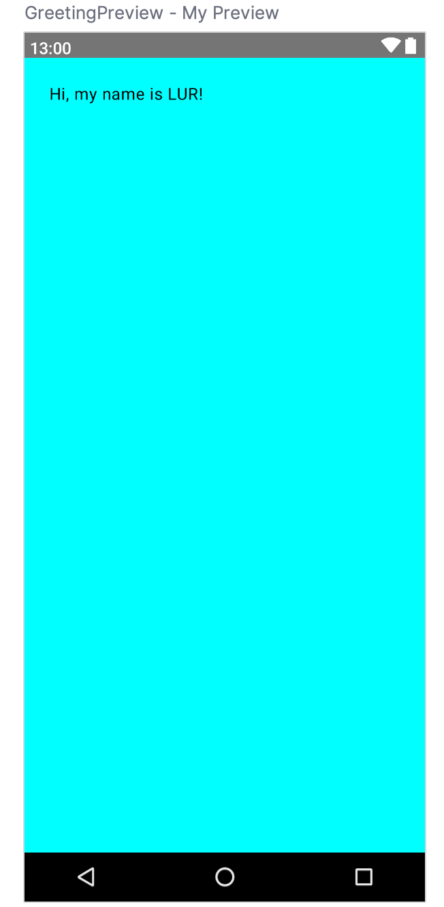

## Create a new project

1. Launch Android Studio.

1. In the **Welcome to Android** Studio dialog, click **New Project**.
    <figure>
    
    </figure>

    The **New Project window** opens with a list of templates provided by Android Studio.

    <figure>
    
    </figure>
1. Make sure the **Phone and Tablet** tab is selected.

1. Click the **Empty Activity** template to select it as the template for your project.

1. Click **Next**. The **New Project** dialog opens.
    <figure>
    
    </figure>

1. Configure your project as follows:

    The Name field is used to enter the name of your project, for this codelab type "Lab 1".

    Leave the **Package name** field as is. This is how your files will be organized in the file structure. In this case, the package name will be `com.example.lab1`. You can also use a domain name that your own in reverse order instead of `com.example`.

    Leave the **Save location** field as is. It contains the location where all the files related to your project are saved. Take a note of where that is on your computer so that you can find your files.

    Select **API 24: Android 7.0 (Nougat)** from the menu in the **Minimum SDK** field. Minimum SDK indicates the minimum version of Android that your app can run on.

1. Click **Finish**. This may take a while - this is a great time to get a cup of tea! While Android Studio is setting up, a progress bar and message indicates whether Android Studio is still setting up your project. It may look like this: 

    A message that looks similar to this informs you when the project set up is created: 

1. You may see a **What's New** pane which contains updates on new features in Android Studio. Close it for now.

1. Click **Split** on the top right of Android Studio  , this allows you to view both code and design. You can also click **Code** to view code only or click **Design** to view design only.

    After pressing Split you should see three areas:

    <figure>
    
    </figure>

    - The **Project** view (1) shows the files and folders of your project
    - The **Code** view (2) is where you edit code
    - The **Design** view (3) is where you preview what your app looks like

    In the **Design** view, you will see a blank pane with this text:

    <figure>
    
    </figure>

1. Click **Build & Refresh**. It may take a while to build but when it is done the preview shows a text box that says "**Hello Android!**". Empty Compose activity contains all the code necessary to create this app.

    <figure>
    
    </figure>

## Find project files

In this section you will continue to explore Android Studio by becoming familiar with the file structure.

1. In Android Studio, take a look at the **Project** tab. The **Project** tab shows the files and folders of your project. When you were setting up your project the package name was **com.example.lab1**. You can see that package right here in the **Project** tab. A package is basically a folder where code is located. Android Studio organizes the project in a directory structure made up of set of packages.

1. If necessary, select **Android** from the drop-down menu in the **Project** tab.

    <figure>
      
    </figure>

    This is the standard view and organization of files that you use. It's useful when you write code for your project because you can easily access the files you will be working on in your app. However, if you look at the files in a file browser, such as Finder or Windows Explorer, the file hierarchy is organized very differently.

1. Select **Project Source Files** from the drop-down menu. You can now browse the files in the same way as in any file browser.

    <figure>
      
    </figure>

1. Select **Android** again to switch back to the previous view. You use the **Android** view for this course. If your file structure ever looks strange, check to make sure you're still in **Android** view.

## Update the text

Now that you have gotten to know Android Studio, it's time to start making some modifications!

Look at the **Code** view of the `MainActivity.kt` file. Notice there are some automatically generated functions in this code, specifically the `onCreate()` and the `setContent()` functions.

```kotlin
class MainActivity : ComponentActivity() {
  override fun onCreate(savedInstanceState: Bundle?) {
    super.onCreate(savedInstanceState)
    setContent {
      Lab1Theme {
        // A surface container using the 'background' color from the theme
        Surface(
          modifier = Modifier.fillMaxSize(),
          color = MaterialTheme.colorScheme.background
        ) {
          Greeting("Android")
        }
      }
    }
  }
}
```

The `onCreate()` function is the entry point to this Android app and calls other functions to build the user interface. In Kotlin programs, the `main()` function is the entry point/starting point of execution. In Android apps, the `onCreate()` function fills that role.

The `setContent()` function within the `onCreate()` function is used to define your layout through composable functions. All functions marked with the `@Composable` annotation can be called from the `setContent()` function or from other Composable functions. The annotation tells the Kotlin compiler that this function is used by Jetpack Compose to generate the UI.

Next, look at the `Greeting()` function. The `Greeting()` function is a Composable function, notice the `@Composable` annotation above it. This Composable function takes some input and generates what's shown on the screen.

```kotlin
@Composable
fun Greeting(name: String, modifier: Modifier = Modifier) {
  Text(
    text = "Hello $name!",
    modifier = modifier
  )
}
```

You've learned about functions before, but there are a few differences with composable functions:

- You add the `@Composable` annotation before the function. 
- `@Composable` function names are capitalized.
- `@Composable` functions can't return anything.

Right now the `Greeting()` function takes in a name and displays Hello to that person.

1. Update the `Greeting()` function to introduce yourself instead of saying "Hello":

    ```kotlin
    @Composable
    fun Greeting(name: String, modifier: Modifier = Modifier) {
      Text(
        text = "Hi, my name is $name!",
        modifier = modifier
      )
    }
    ```

1. Android Studio should automatically update the preview.

Great! You changed the text, but it introduces you as Android, which is probably not your name. Next, you will personalize it to introduce you with your name!

The `GreetingPreview()` function is a cool feature that lets you see what your composable looks like without having to build your entire app. To enable a preview of a composable, annotate it with `@Composable` and `@Preview`. The `@Preview` annotation tells Android Studio that this composable should be shown in the design view of this file.

As you can see, the `@Preview` annotation takes in a parameter called `showBackground`. If `showBackground` is set to `true`, it will add a background to your composable preview.

Since Android Studio by default uses a light theme for the editor, it can be hard to see the difference between `showBackground = true` and `showBackground = false`.

Update the `GreetingPreview()` function with your name. Then rebuild and check out your personalized App!

```kotlin
@Preview(showBackground = true)
@Composable
fun GreetingPreview() {
    Lab1Theme {
        Greeting("LUR")
    }
}
```

You can pass multiple arguments to the annotation, as shown here.

```kotlin
@Preview(
    showBackground = true,
    showSystemUi = true,
    name = "My Preview"
)
@Composable
fun GreetingPreview() {
    Lab1Theme {
        Greeting("LUR")
    }
}
```

<figure>
  
</figure>

## Change the background color

Now you have the introduction text, but it's a little boring! In this section, you learn to change the background color.

To set a different background color for your introduction, you'll need to surround your text with a [`Surface`](https://developer.android.com/reference/kotlin/androidx/compose/material/package-summary#Surface(androidx.compose.ui.Modifier,androidx.compose.ui.graphics.Shape,androidx.compose.ui.graphics.Color,androidx.compose.ui.graphics.Color,androidx.compose.foundation.BorderStroke,androidx.compose.ui.unit.Dp,kotlin.Function0)). A `Surface` is a container that represents a section of UI where you can alter the appearance, such as the background color or border.

1. To surround the text with a Surface, highlight the line of text, press (`Alt+Enter` for Windows or `Option+Enter` on Mac), and then select **Surround with widget**.

1. Choose **Surround with Container**.

    The default container it will give you is `Box`, but you can change this to another container type. You will learn about `Box` layout later.

1. Delete `Box` and type `Surface()` instead.

1. It's a best practice to have your Composable accept a `Modifier` parameter, and pass that `modifier` to its first child.

1. To the Surface container add a color parameter, set it to `Color.Cyan`.

    ```kotlin
    @Composable
    fun Greeting(name: String, modifier: Modifier = Modifier) {
      Surface(
        color = Color.Cyan,
        modifier = modifier
      ) {
        Text(
          text = "Hi, my name is $name!",
        )
      }
    }
    ```

1. You need to import the `Color` type.

    ```kotlin
    import androidx.compose.ui.graphics.Color
    ```

1. In your code, the best practice is to keep your imports listed alphabetically and remove unused imports. To do this press **Help** on the top toolbar, type in **optimize imports**, and click on **Optimize Imports**.

1. Notice the updated preview.

    <figure>
    
    </figure>

## Use Modifiers

Now your text has a background color, next you will add some space (padding) around the text.

A [`Modifier`](https://developer.android.com/reference/kotlin/androidx/compose/ui/Modifier) is used to augment or decorate a composable. One modifier you can use is the `padding` modifier, which adds space around the element (in this case, adding space around the text). This is accomplished by using the [`Modifier.padding()`](https://developer.android.com/reference/kotlin/androidx/compose/ui/Modifier#(androidx.compose.ui.Modifier).padding(androidx.compose.ui.unit.Dp)) function.

Every composable should have an optional parameter of the type `Modifier`. This should be the first optional parameter.

1. Add a padding to the `modifier` with a size of `24.dp`.

    ```kotlin
    @Composable
    fun Greeting(name: String, modifier: Modifier = Modifier) {
      Surface(
        color = Color.Cyan,
        modifier = modifier
      ) {
        Text(
          text = "Hi, my name is $name!",
          modifier = modifier.padding(24.dp)
        )
      }
    }
    ```

1. Add these imports to the import statement section.
    ```kotlin
    import androidx.compose.ui.unit.dp
    import androidx.compose.foundation.layout.padding
    ```

    Make sure to use **Optimize Imports** to alphabetize the new imports.

1. Notice the updated preview.

    <figure>
    
    </figure>

## Run your App

You can:

- [Run your App on the emulator](https://developer.android.com/codelabs/basic-android-kotlin-compose-emulator?continue=https%3A%2F%2Fdeveloper.android.com%2Fcourses%2Fpathways%2Fandroid-basics-compose-unit-1-pathway-2%23codelab-https%3A%2F%2Fdeveloper.android.com%2Fcodelabs%2Fbasic-android-kotlin-compose-emulator)
- [Run your App on an actual Android device](https://developer.android.com/codelabs/basic-android-kotlin-compose-connect-device?continue=https%3A%2F%2Fdeveloper.android.com%2Fcourses%2Fpathways%2Fandroid-basics-compose-unit-1-pathway-2%23codelab-https%3A%2F%2Fdeveloper.android.com%2Fcodelabs%2Fbasic-android-kotlin-compose-connect-device)

The App don't look the same than the preview. It's because we have an extra `Surface` with parameters in the `onCreate()` method. We can remove this Surface and use its parameters in our `Greeting()` Composable.

```kotlin
class MainActivity : ComponentActivity() {
  override fun onCreate(savedInstanceState: Bundle?) {
    super.onCreate(savedInstanceState)
    setContent {
      Lab1Theme {
        Greeting("Android")
      }
    }
  }
}

@Composable
fun Greeting(name: String, modifier: Modifier = Modifier) {
  Surface(
    color = Color.Cyan,
    modifier = modifier.fillMaxSize()
  ) {
    Text(
      text = "Hi, my name is $name!",
      modifier = modifier.padding(24.dp)
    )
  }
}
```

<figure>
  
</figure>

## Change font size

You added text to your user interface. In this section, you learn how to change the size, text color, and other attributes that affect the appearance of the text element. You can also experiment with different font sizes and colors.

### Scalable pixels

The [scalable pixels (SP)](https://developer.android.com/reference/kotlin/androidx/compose/ui/unit/package-summary#(kotlin.Float).sp()) is a unit of measure for the font size. UI elements in Android apps use two different units of measurement: [density-independent pixels (DP)](https://developer.android.com/reference/kotlin/androidx/compose/ui/unit/package-summary#(kotlin.Int).dp()), which you use later for the layout, and scalable pixels (SP). By default, the SP unit is the same size as the DP unit, but it resizes based on the user's preferred text size under phone settings.

1. In the `MainActivity.kt` file, scroll to the `Text()` composable in the `Greeting()` function.

1. Pass the `Text()` function a `fontSize` argument as a second named argument and set it to a value of `100.sp`.

    ```kotlin
    @Composable
    fun Greeting(name: String, modifier: Modifier = Modifier) {
      Surface(
        color = Color.Cyan,
        modifier = modifier.fillMaxSize()
      ) {
        Text(
          text = "Hi, my name is $name!",
          fontSize = 100.sp,
          modifier = modifier.padding(20.dp)
        )
      }
    }
    ```

1. You need this import:

    ```kotlin
    androidx.compose.ui.unit.sp
    ```

1. Notice the updated preview of the font size. The reason for overlapping message is you need to specify the line height.

1. Update the `Text` composable to include the line height.

    ```kotlin
    @Composable
    fun Greeting(name: String, modifier: Modifier = Modifier) {
      Surface(color = Color.Cyan) {
        Text(
          text = "Hi, my name is $name!",
          fontSize = 100.sp,
          lineHeight = 116.sp,
          modifier = modifier.padding(20.dp)
        )
      }
    }
    ```

## Student Card

Let's create a Student Card App!

1. Rename the `Greeting()` function by right click its name and select **Refactor** and then **Rename...**

1. Just pass the value of the `name` parameter to the `Text` composable.

1. Pass the function a `matricule` parameter of type `String` for your signature.

1. After the name `Text` composable, add another `Text` composable that accepts a text argument set to the `matricule` value.

1. Add a `fontSize` named argument set to a value of `36.sp`.


    ```kotlin
    @Composable
    fun StudentCard(name: String, matricule: String, modifier: Modifier = Modifier) {
      Surface(
        color = Color.Cyan,
        modifier = modifier
      ) {
        Text(
          text = name,
          fontSize = 100.sp,
          lineHeight = 116.sp,
          modifier = modifier.padding(20.dp)
        )
        Text(
          text = matricule,
          fontSize = 36.sp,
        )
      }
    }
    ```

1. Add the `matricule` parameter to the two calls to the `StudentCard()` function in `GreetingPreview()` and in `onCreate()`.

    ```kotlin
    @Preview(
      showBackground = true,
      showSystemUi = true,
      name = "My Preview"
    )
    @Composable
    fun GreetingPreview() {
      Lab1Theme {
        StudentCard("Quentin Lurkin", "LUR")
      }
    }
    ```

1. Notice the preview.

    <figure>
    
    </figure>

A composable function might describe several UI elements. However, if you don't provide guidance on how to arrange them, Compose might arrange the elements in a way that you don't like. For example, the previous code generates two text elements that overlap each other because there's no guidance on how to arrange the two composables.

## UI Hierarchy

The UI hierarchy is based on containment, meaning one component can contain one or more components, and the terms parent and child are sometimes used. The context here is that the parent UI elements contain children UI elements, which in turn can contain children UI elements. In this section, you will learn about `Column`, `Row`, and `Box` composables, which can act as parent UI elements.

<figure>
  
</figure>

`Column`, `Row`, and `Box` are composable functions that take composable content as arguments, so you can place items inside these layout elements. For example, each child element inside a `Row` composable is placed horizontally next to each other in a row.

Let's arrange the text elements in your app in a column to avoid overlap.

1. In the `MainActivity.kt` file, scroll to the `StudentCard()` function.

1. Add the `Column` composable around the text elements so that it shows a column with two text elements. Select the two `Text` composables, click on the light bulb. Select `Surround with widget` > `Surround with Column`.

1. Android Studio auto imports `Column` function for you. Scroll to the top and notice the import section. The import `androidx.compose.foundation.layout.Column` should have been added.

1. Move the padding `Modifier` at the `Column` level.

    ```kotlin
    @Composable
    fun StudentCard(name: String, matricule: String, modifier: Modifier = Modifier) {
      Surface(
        color = Color.Cyan,
        modifier = modifier.fillMaxSize()
      ) {
        Column(modifier = modifier.padding(20.dp)) {
          Text(
            text = name,
            fontSize = 100.sp,
            lineHeight = 116.sp
          )
          Text(
            text = matricule,
            fontSize = 36.sp
          )
        }
      }
    }
    ```

    The preview looks much better now that there's no overlap. But we can improve it even more.

1. To align the greeting in the center of the screen add a parameter called `verticalArrangement` set it to `Arrangement.Center`.

    ```kotlin
    @Composable
    fun StudentCard(name: String, matricule: String, modifier: Modifier = Modifier) {
      Surface(
        color = Color.Cyan,
        modifier = modifier.fillMaxSize()
      ) {
        Column (
          verticalArrangement = Arrangement.Center,
          modifier = modifier.padding(20.dp)
        ) {
          Text(
            text = name,
            fontSize = 100.sp,
            lineHeight = 116.sp,
          )
          Text(
            text = matricule,
            fontSize = 36.sp
          )
        }
      }
    }
    ```

<!-- 1. To further beautify your app, align the greeting text to the center using `textAlign`. -->

## Add an image

