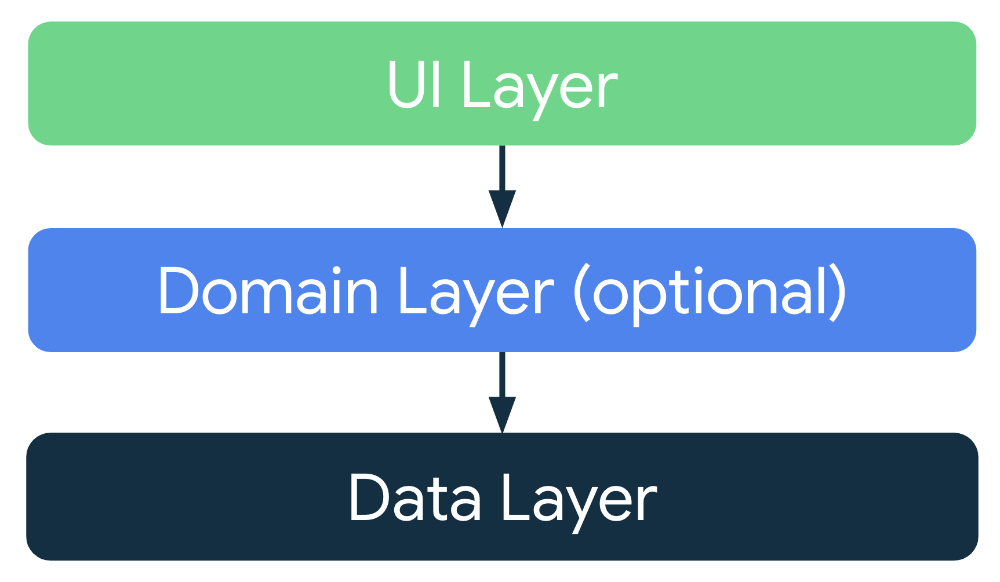
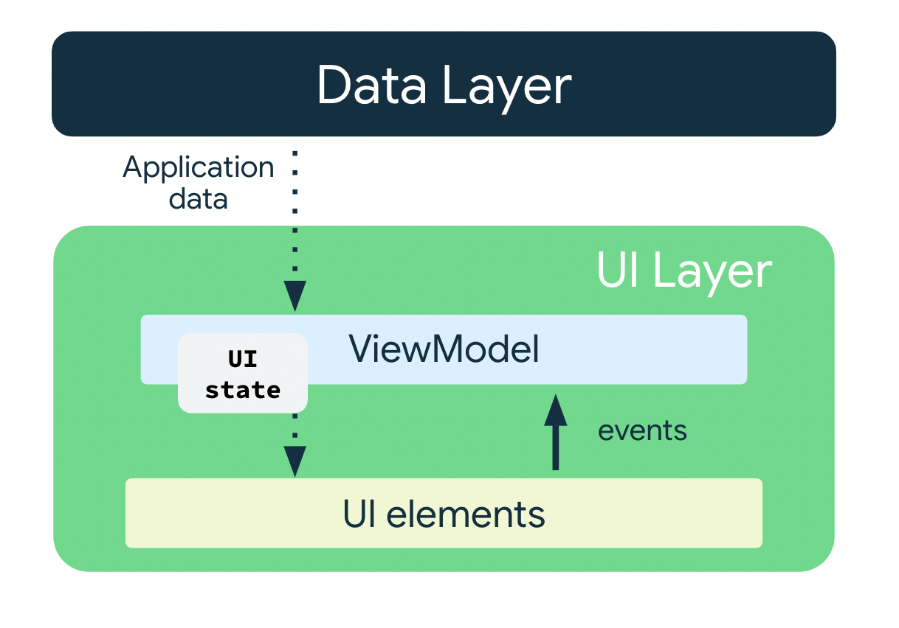
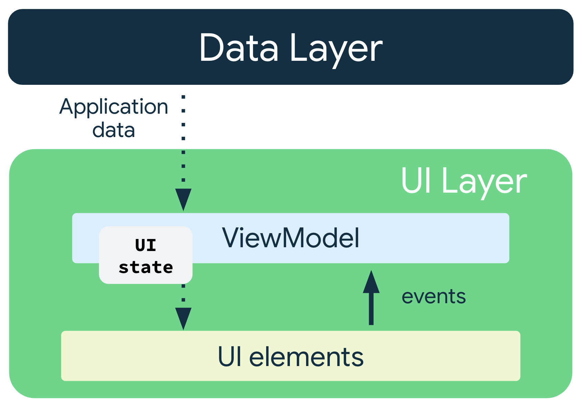

## Download starter code

To get started, download the starter code:

[Download zip](https://github.com/google-developer-training/basic-android-kotlin-compose-training-cupcake/archive/refs/heads/starter.zip)

## Learn about app architecture

An app's architecture provides guidelines to help you allocate the app responsibilities between the classes. A well-designed app architecture helps you scale your app and extend it with additional features. Architecture can also simplify team collaboration.

The most common [architectural principles](https://developer.android.com/jetpack/guide#common-principles) are **separation of concerns** and **driving UI from a model**.

- **Separation of concerns**: The separation of concerns design principle states that the app is divided into classes of functions, each with separate responsibilities.
- **Drive UI from a model**: The drive UI from a model principle states that you should drive your UI from a model, preferably a persistent model. Models are components responsible for handling the data for an app. They're independent from the UI elements and app components in your app, so they're unaffected by the app's lifecycle and associated concerns.

### Recommended app architecture

Considering the common architectural principles mentioned in the previous section, each app should have at least two layers:

- **UI layer:** a layer that displays the app data on the screen but is independent of the data.
- **Data layer:** a layer that stores, retrieves, and exposes the app data.

You can add another layer, called the domain layer, to simplify and reuse the interactions between the UI and data layers. This layer is optional and beyond the scope of this course.

<figure></figure>

#### UI layer

The role of the UI layer, or presentation layer, is to display the application data on the screen. Whenever the data changes due to a user interaction, such as pressing a button, the UI should update to reflect the changes.

The UI layer is made up of the following components:

- **UI elements:** components that render the data on the screen. You build these elements using [Jetpack Compose.](https://developer.android.com/jetpack/compose)
- **State holders:** components that hold the data, expose it to the UI, and handle the app logic. An example state holder is [ViewModel](https://developer.android.com/topic/libraries/architecture/viewmodel).

<figure></figure>

#### ViewModel

The `ViewModel` component holds and exposes the state the UI consumes. The UI state is application data transformed by `ViewModel`. `ViewModel` lets your app follow the architecture principle of driving the UI from the model.

`ViewModel` stores the app-related data that isn't destroyed when the activity is destroyed and recreated by the Android framework. Unlike the activity instance, `ViewModel` objects are not destroyed. The app automatically retains `ViewModel` objects during configuration changes so that the data they hold is immediately available after the recomposition.

To implement `ViewModel` in your app, extend the `ViewModel` class, which comes from the architecture components library and stores app data within that class.

#### UI State

The UI is what the user sees, and the UI state is what the app says they should see. The UI is the visual representation of the UI state. Any changes to the UI state immediately are reflected in the UI.

<figure></figure>

*UI is a result of binding UI elements on the screen with the UI state.*

```kotlin
// Example of UI state definition, do not copy over

data class NewsItemUiState(
  val title: String,
  val body: String,
  val bookmarked: Boolean = false,
  ...
)
```

#### Immutability

The UI state definition in the example above is immutable. Immutable objects provide guarantees that multiple sources do not alter the state of the app at an instant in time. This protection frees the UI to focus on a single role: reading state and updating UI elements accordingly. Therefore, you should never modify the UI state in the UI directly, unless the UI itself is the sole source of its data. Violating this principle results in multiple sources of truth for the same piece of information, leading to data inconsistencies and subtle bugs.

## In the starter code

1. In the `build.gradle.kts (Module :app)` file, in the section `dependencies`, you should should see some `ViewModel` dependencies.

1. In the `ui` package, you should see the `OrderViewModel` class that extend `ViewModel`.

1. In the `data` package, you should see the `OrderUIState` class. It is a data class.

### StateFlow

`StateFlow` is a data holder observable flow that emits the current and new state updates. Its `value` property reflects the current state value. To update state and send it to the flow, assign a new value to the value property of the `MutableStateFlow` class.

In Android, `StateFlow` works well with classes that must maintain an observable immutable state.

A `StateFlow` is exposed from the `OrderUiState` so that the composables can listen for UI state updates and make the screen state survive configuration changes.

### Backing property

A backing property lets you return something from a getter other than the exact object.

For `var` property, the Kotlin framework generates getters and setters.

For getter and setter methods, you can override one or both of these methods and provide your own custom behavior. To implement a backing property, you override the getter method to return a read-only version of your data. The following example shows a backing property:

```kotlin
//Example code, no need to copy over

// Declare private mutable variable that can only be modified
// within the class it is declared.
private var _count = 0 

// Declare another public immutable field and override its getter method. 
// Return the private property's value in the getter method.
// When count is accessed, the get() function is called and
// the value of _count is returned. 
val count: Int
  get() = _count
```

As another example, say that you want the app data to be private to the `ViewModel`:

Inside the `ViewModel` class:

- The property `_count` is `private` and mutable. Hence, it is only accessible and editable within the `ViewModel` class.

Outside the `ViewModel` class:

- The default visibility modifier in Kotlin is `public`, so `count` is `public` and accessible from other classes like UI controllers. A `val` type cannot have a setter. It is immutable and read-only so you can only override the `get()` method. When an outside class accesses this property, it returns the value of `_count` and its value can't be modified. This backing property protects the app data inside the `ViewModel` from unwanted and unsafe changes by external classes, but it lets external callers safely access its value.

In the `OrderViewModel` class, you should see a backing property named `_uiState` and a property named `uiState` of the type `StateFlow<OrderUiState>`. The `asStateFlow()` makes this mutable state flow a read-only state flow.

With this setup, `_uiState` is accessible and editable only within the `OrderViewModel`. The UI can read its value using the read-only property, `uiState`.

## Architecting your Compose UI

In Compose, the only way to update the UI is by changing the state of the app. What you can control is your UI state. Every time the state of the UI changes, Compose recreates the parts of the UI tree that changed. Composables can accept state and expose events. For example, a `TextField`/`OutlinedTextField` accepts a value and exposes a callback `onValueChange` that requests the callback handler to change the value.

```kotlin
//Example code no need to copy over

var name by remember { mutableStateOf("") }
OutlinedTextField(
  value = name,
  onValueChange = { name = it },
  label = { Text("Name") }
)
```

Because composables accept state and expose events, the unidirectional data flow pattern fits well with Jetpack Compose. This section focuses on how to implement the unidirectional data flow pattern in Compose, how to implement events and state holders, and how to work with `ViewModels` in Compose.

### Unidirectional data flow

A *unidirectional data flow* (UDF) is a design pattern in which state flows down and events flow up. By following unidirectional data flow, you can decouple composables that display state in the UI from the parts of your app that store and change state.

The UI update loop for an app using unidirectional data flow looks like the following:

- **Event:** Part of the UI generates an event and passes it upward—such as a button click passed to the ViewModel to handle—or an event that is passed from other layers of your app, such as an indication that the user session has expired.
- **Update state:** An event handler might change the state.
- **Display state:** The state holder passes down the state, and the UI displays it.

<figure></figure>

The use of the UDF pattern for app architecture has the following implications:

- The `ViewModel` holds and exposes the state the UI consumes.
- The UI state is application data transformed by the `ViewModel`.
- The UI notifies the `ViewModel` of user events.
- The `ViewModel` handles the user actions and updates the state.
- The updated state is fed back to the UI to render.
- This process repeats for any event that causes a mutation of state.

### Pass the data

In the `CupcakeScreen()`, The `ViewModel` instance is used to access the `uiState` using `collectAsState()`.

The `collectAsState()` function collects values from this [`StateFlow`](https://kotlin.github.io/kotlinx.coroutines/kotlinx-coroutines-core/kotlinx.coroutines.flow/-state-flow/index.html) and represents its latest value via [`State`](https://developer.android.com/reference/kotlin/androidx/compose/runtime/State). The [`StateFlow.value`](https://kotlin.github.io/kotlinx.coroutines/kotlinx-coroutines-core/kotlinx.coroutines.flow/-state-flow/value.html) is used as an initial value. Every time there would be a new value posted into the `StateFlow`, the returned `State` updates, causing recomposition of every [`State.value`](https://developer.android.com/reference/kotlin/androidx/compose/runtime/State#value()) usage.

In the `CupcakeScreen` function, notice the first argument of the type `OrderViewModel` with a default value of `viewModel()`.

In the `CupcakeScreen` function, notice the variable called `uiState`. It use the `by` delegate and call `collectAsState()` on `viewModel.uiState`.

This approach ensures that whenever there is a change in the `viewModel.uiState` value, recomposition occurs for the composables using the `uiState` value.

## Continue the app

Continue this app on [**Navigate between screens with Compose**](https://developer.android.com/codelabs/basic-android-kotlin-compose-navigation)

## Credits

- [ViewModel and State in Compose](https://developer.android.com/codelabs/basic-android-kotlin-compose-viewmodel-and-state)


