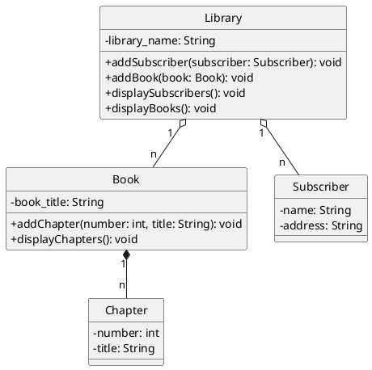

## Bases du C#

1. Pour vous familiariser avec la syntaxe du C#, traduisez le programme suivant en C#&nbsp;:

   ```python
   from math import sqrt

   print("Recherche des racines de ax^2 + bx + c")
   a = int(input("Coefficient a : "))
   b = int(input("Coefficient b : "))
   c = int(input("Coefficient c : "))

   # Calcul du discriminant
   delta = b**2 - 4 * a * c
   print("Discriminant :", delta)

   # Test des trois cas possibles et affichage des racines du trinôme
   if delta < 0:
     print ("Pas de racine réelle")
   elif delta == 0:
     x = -b / (2*a)
     print ("Une racine réelle double :", x)
   else :
     x1 = (-b - sqrt(delta)) / (2*a)
     x2 = (-b + sqrt(delta)) / (2*a)
     print ("Deux racines réelles distinctes :", x1, "et", x2)
   ```

   Voici les constructions qu'il vous faut savoir faire en C# :

   - insérer un commentaire dans un code source;
   - variable : déclaration, initialisation et utilisation;
   - lecture et écriture à la console avec l'objet `Console`;
   - conversion de données avec l'objet `Convert`;
   - calcul d’une racine carrée avec l'objet `Math`;
   - construction d’expressions booléennes pour définir des conditions;
   - utilisation de l'instruction `if-else`.

2. Vous devez maintenant améliorer le programme pour gérer le cas où l'utilisateur entre du texte qui n’est pas valide, c'est-à-dire qui ne représente pas un nombre. Tant qu'il n’a pas renseigné une valeur valide, le programme doit continuer à lui demander en boucle la valeur attendue. Pour cela, vous allez devoir découvrir le fonctionnement des concepts suivants&nbsp;:
   - définition d’une fonction;
   - utilisation de l'instruction `while`;
   - utilisation du mécanisme d'exception `try-catch`.

## Agrégation et composition: Bibliothèque

Nous allons modéliser une bibliothèque qui contient des livres, chaque livre étant composé de chapitres, et chaque bibliothèque ayant des abonnés.

### Relations:

- **Composition :** Chaque livre est composé de plusieurs chapitres. Si un livre est supprimé, ses chapitres le sont aussi. Un chapitre ne peut pas exister sans un livre.
- **Agrégation :** Chaque bibliothèque a une liste d'abonnés (des personnes). Les abonnés peuvent exister en dehors de la bibliothèque, et peuvent être abonnés à plusieurs bibliothèques.

### Classes:



### Remarques :

- Les différents liens dans ce diagramme se matérialiseront par des attributs de type `List<...>` qui ne sont pas représentés dans le diagramme.
- Il faudra sans doute ajouter quelques méthodes `ToString()`.

- Écrivez aussi un programme qui construit quelques objets et montre que les méthodes fonctionnent.
