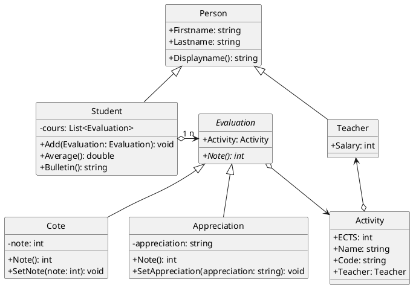

## Gestion des évaluations

Vous devez écrire (une partie d') un programme qui permet de gérer les évaluations des étudiants pour
plusieurs activités différentes. En particulier, vous allez devoir faire deux choses :

1. dessiner le diagramme de séquence lors d'un appel à la méthode `Bulletin()` de la classe `Student`;
2. définir les différentes classes qui permettent de représenter les étudiants, les enseignants, les activités et les évaluations;
3. **Bonus**: créer un programme qui va lire des données depuis un fichier texte pour créer les différents objets correspondants, et en établissant les bons liens entre les objets ainsi créés.

Voici quelques informations par rapport aux éléments que votre programme doit pouvoir gérer :

- un étudiant et un enseignant sont tous les deux des personnes;
- une activité possède un unique responsable qui doit être un enseignant;
- une évaluation est toujours liée à une activité et se compose d’une note chiffrée, un nombre flottant compris entre 0 et 20;
- chaque étudiant possède plusieurs évaluations;
- il y a deux types d’évaluation : directement un nombre entier sous la forme d’une cote ou indirectement à l'aide d'une appréciation codée (N, C, B, TB ou X) qui peut être traduite en points (20, 16, 12, 8, 4);
- on peut obtenir la moyenne d’un étudiant, sur toutes les évaluations qu'il a reçues.

Le diagramme ci-dessous montre une organisation possible du code qui résulte de l'analyse de ces différents éléments. Définissez vos classes les unes à la suite des autres en vérifiant à chaque fois, à l'aide d’un simple programme qui crée une instance de votre classe et en appelle les méthodes et propriétés, qu'elles sont correctes. À vous de trouver l'ordre dans lequel vous pouvez définir les classes sur base de leurs relations et du diagramme de séquence que vous avez fait au préalable.

## Bonus: importation depuis des fichiers

Une fois cela fait, vous devez définir des formats de fichiers textes permettant de stocker les données relatives aux enseignants, activités, étudiants et évaluations. Écrivez ensuite un programme permettant de lire ces fichiers pour reconstruire tous les objets, pour ensuite parcourir la liste des étudiants et générer le bulletin de chacun d’eux, dans un fichier texte.
