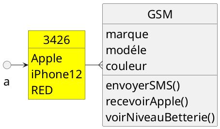
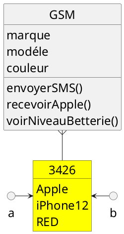
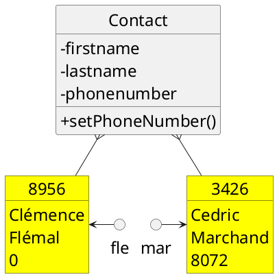
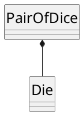
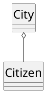
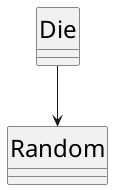

## Objectifs

- Programmer de façon **professionnelle**

  - Beaucoup d'aspects

- Rendre le code **maintenable**
  - Facile à modifier

## C\#

- Nous utiliserons le **C#**
  - Développé par Microsoft
  - Développement d'application Windows
  - Unity
  - Développement Multi-plateforme
  - langage **compilé**
  - **typé statiquement**

## Objets

- Un **objet** possède deux types de membres
  - des attributs (caractéristiques)
  - des méthodes (fonctionnalités)
- **L\'état de l\'objet** peut varier tout au long de l\'exécution
  [Défini par l\'ensemble des valeurs des attributs]{.small}

## Classes

- Une classe permet de **construire** des objets [Il s\'agit d\'un
  modèle qui décrit les attributs et fonctionnalités]{.small}
- Un objet est une **instance** d\'une classe [On crée un nouvel objet
  à partir d\'une classe]{.small}

## Instances

**Trois éléments** distincts sont à identifier

1.  Une **classe** est un modèle
2.  Un objet est une **instance** d\'une classe
3.  Une variable stocke une **référence** vers l\'objet

<figure id="schema">

</figure>



## Alias

- Une variable est une **référence** vers un objet [La variable permet
  d\'accéder à l\'objet et ainsi le manipuler]{.small}
- Un **alias** réfère le même objet qu\'une autre variable

<figure id="alias">

</figure>



## Définir une classe

- Définition d\'une classe Contact représentant un **contact**
  [Caractérisé par un prénom, un nom et un numéro de
  téléphone]{.small}

```cs
class Contact
{
  private string firstname, lastname;
  private int phonenumber;

  public Contact(string firstname, string lastname)
  {
    this.firstname = firstname;
    this.lastname = lastname;
    this.phonenumber = 0;
  }

  public void SetPhoneNumber(int phonenumber) {
    this.phonenumber = phonenumber;
  }
}
```

## Constructeur et variable d\'instance

- Le **constructeur** initialise l\'état de l\'objet [L\'instantiation
  invoque implicitement le constructeur]{.small}
- Initialisation des **variables d\'instance** [On affecte une valeur
  à chaque variable d\'instance]{.small}

## Vie d\'un objet

Trois étapes principales dans la **vie d\'un objet**

- Création de l\'objet (_initialisation_)
- Appel de méthode et changement d\'état (_utilisation_)
- Destruction de l\'objet (_finalisation_)

```cs
Contact lur = new Contact("Quentin", "Lurkin")
lur.SetPhoneNumber(4242)
```

## Variable d\'instance

- Une **variable d\'instance** est liée à l\'objet [Sa valeur fait
  partie de l\'état de l\'objet]{.small}
- Peuvent avoir une certaine **visibilité** [Uniquement accessible
  dans la classe ou visible de l\'extérieur]{.small}

```cs
class Contact
{
  private string firstname, lastname;
  private int phonenumber;

  // [...]
}
```

## Instanciation

- On peut créer plusieurs instances d\'une classe [Chaque instance a
  son identité propre]{.small}

<figure id="instanciation">

</figure>



## Méthode

- Une **méthode** (d\'instance) représente une fonctionnalité [Elle
  agit sur une instance spécifique, l\'objet cible]{.small}
- Mot réservé spécifique pour accéder à l\'**objet cible** [Référence
  vers l\'objet cible (this)]{.small}
- Peuvent avoir une certaine **visibilité** [Uniquement accessible
  dans la classe ou visible de l\'extérieur]{.small}

```cs
class Contact
{
  // ...

  public void SetPhoneNumber(int phonenumber) {
    this.phonenumber = phonenumber;
  }
}

```

## Surcharge de méthode

- Plusieurs méthodes peuvent avoir le **même nom** [Pour autant que
  les types de la liste de paramètres différent]{.small}

```cs
class Contact
{
  private string firstname, lastname;
  private int phonenumber;

  public Contact(string firstname, string lastname, int phonenumber)
  {
    this.firstname = firstname;
    this.lastname = lastname;
    this.phonenumber = phonenumber;
  }

  public Contact(string firstname, string lastname):
  this(firstname, lastname, 0)
  {}

  public void SetPhoneNumber(int phonenumber) {
    this.phonenumber = phonenumber;
  }

  public void SetPhoneNumber(string phonenumber) {
    this.phonenumber = Convert.ToInt32(phonenumber);
  }
}

```

## Résolution de la surcharge

- Étapes de la résolution de la **surcharge de méthodes**
  1.  Construction liste des types des paramètres réels
  2.  Identification des méthodes accessibles avec le type statique
  3.  Recherche d'une méthode avec la même liste de types
  4.  Recherche des méthodes avec paramètres compatibles
  5.  Choix de la méthode la plus spécifique

## Relation entre classes

- Une classe définit un nouveau type de donnée [On peut l\'utiliser
  pour définir des objets de ce type]{.small}
- Plusieurs classes peuvent être liées entre elle [Plusieurs types de
  relation sont possibles entre classes]{.small}
- Création de dépendances entre classes [Et donc entre les instances
  de ces classes]{.small}

## Représentation d\'un dé{.code}

```cs
public class Die
{
  public readonly int nbFaces; // Constante
  private int visibleFace;
  private static Random generator = new Random();

  public int VisibleFace{
      get { return visibleFace; }
  }

  public Die() : this(6){} // Appel de l'autre constructeur

  public Die(int faces)
  {
      nbFaces = faces;
      Roll();
  }

  public void Roll()
  {
      visibleFace = generator.Next(nbFaces) + 1;
  }
}
```

## Création de dés

```cs
Die d1 = new Die(); // Dé à 6 faces
Die d2 = new Die(12); // Dé à 12 faces

Console.WriteLine(d1.VisibleFace);
Console.WriteLine(d2.VisibleFace);
```

<figure id="dices">

</figure>

## Représentation d'une paire de dés{.code}

```cs
public class PairOfDice
{
  private readonly int nbFaces;
  private int visibleFace1, visibleFace2;
  private static Random generator = new Random();

  public PairOfDice(int faces)
  {
      nbFaces = faces;
      visibleFace1 = generator.Next(nbFaces) + 1;
      visibleFace2 = generator.Next(nbFaces) + 1;
  }

  public void PrintFaces()
  {
      Console.WriteLine(String.Format("{0}, {1}", visibleFace1, visibleFace2));
  }
}
```

## Composition de classe

- Définir une nouvelle classe à partir d'autres [En déclarant des
  variables d'instance des types utilisés]{.small}
- Éviter la répétition de code inutile [Facilite les corrections et
  les évolutions]{.small}
- Construire des objets à partir de blocs simples [Comme on le fait
  dans la vraie vie\...]{.small}

## Représentation d'une paire de dés (2)

```cs
public class PairOfDice
{
  private int nbFaces;
  private Die die1, die2;        // Composition à partir
                                  // de deux objets Die
  public PairOfDice(int faces)
  {
      nbFaces = faces;
      die1 = new Die(faces);
      die2 = new Die(faces);
  }

  public void PrintFaces()
  {
      Console.WriteLine(String.Format("{0}, {1}", die1.VisibleFace , die2.VisibleFace));
  }
}
```

## Relation de composition

- Une classe A est composée à partir d'une classe B [Une instance de A
  a des variables d'instance de type B]{.small}
- Également appelée relation has-a (ou is-made-up-of ) [Une instance
  de A has-a une(des) instance(s) de B]{.small}

<figure id="composition">

</figure>



## Lien fort entre les instances composées

- Objets contenus **fortement liés** à l'objet contenant [Ils
  disparaissent de la mémoire avec l'objet contenant]{.small}
- Instances contenues **créées en même temps** que la contenante [Lors
  de l'initialisation de l'instance contenante]{.small}
- **Avantages** et inconvénients
  - On construit sur l'existant, plus grande modularité
  - Redondance et duplication de données (nombre de faces)
  - Souplesse et évolutivité (différents nombres de faces possible)

## Agrégation

- Généralisation de la composition, sans l'appartenance [Deux objets
  indépendamment créés vont pouvoir être agrégés]{.small}
- Suppression de l'objet contenant sans toucher aux contenus

<figure id="aggregation">

</figure>



## Composition et agrégation

- Relation de contenance entre objets
- Existence indépendante de l'objet contenu ou non
  - Oui dans le cas d'une agrégation (owns-a)
  - Non dans le cas d'une composition (is-made-up-of)

## Relation d\'association

- Relation d'utilisation entre deux classes (use) [Beaucoup plus
  générale que composition et agrégation]{.small}
- Plusieurs situations possibles d'utilisation
  - Recevoir un objet en paramètre
  - Renvoyer un objet
  - Utiliser un objet dans le corps d'une méthode

<figure id="association">

</figure>



## Comparaison des relations

- Classement des relations en fonction de leur force [Association \<
  Agrégation \< Composition]{.small}

|             | cycles de vie indépendants | appartenance |
| ----------- | -------------------------- | ------------ |
| association | oui                        | **non**      |
| agrégation  | oui                        | oui          |
| composition | **non**                    | oui          |

## Couplage et cohésion

- Classes **couplées** si l'une dépend de l'implémentation de l'autre
  [Une classe accède aux variables d'instance de l'autre\...]{.small}
- **Cohésion** d'une classe mesure son niveau d'indépendance [Classe
  cohérente facilement maintenable et réutilisable]{.small}
- Il faut minimiser ↓ le couplage et maximiser ↑ la cohésion [Règle de
  bonne pratique en programmation orientée objet]{.small}
