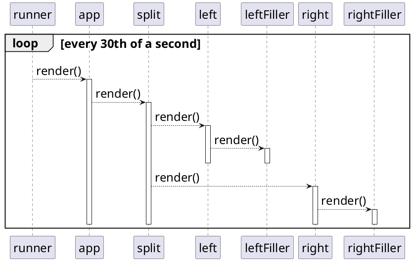
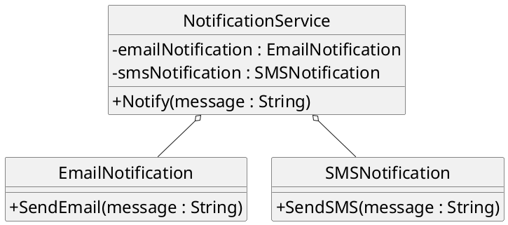
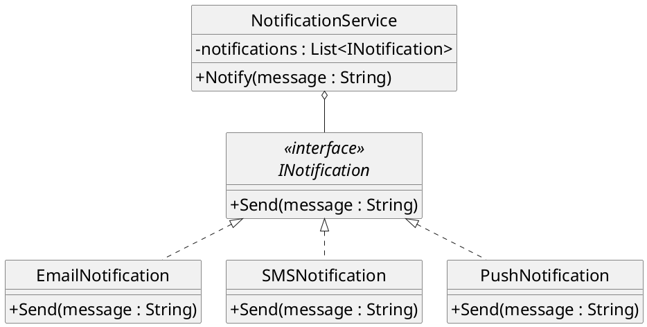

## Interface

- Une **interface** ne contient que des entêtes de méthode [Visibilité
  publique forcée des méthodes]{.small}
- Permet de définir un **contrat** avec un utilisateur [Définition
  d'un ensemble de méthodes qui devront être présentes]{.small}

```cs
public interface Complex
{
    double Real();
    double Imag();
    double Abs();
    double Arg();
}
```

## Relation d'implémentation

- Une classe peut **implémenter** une interface [Doit fournir un corps
  pour toutes les méthodes de l'interface]{.small}

```cs
public class CartesianComplex : Complex
{
    private readonly double a, b;

    public CartesianComplex(double a, double b)
    {
        this.a = a;
        this.b = b;
    }

    public double Real() { return a; }
    public double Imag() { return b; }
    public double Abs() { return Math.Sqrt (a*a + b*b); }
    public double Arg() { return Math.Acos (a / Abs()); }
}
```

## Polymorphisme avec interface

- Plusieurs classes peuvent implémenter la même interface [Permet du
  polymorphisme comme avec l'héritage]{.small}

```cs
public class PolarComplex : Complex
{
    private readonly double r, theta;

    public PolarComplex(double r, double theta)
    {
        this.r = r;
        this.theta = theta;
    }

    public double Real() { return r * Math.Cos(theta); }
    public double Imag() { return r * Math.Sin(theta); }
    public double Abs() { return r; }
    public double Arg() { return theta; }
}
```

## Polymorphisme avec interface

- **Somme de nombres complexes** facilitée par polymorphisme [Il
  suffit de passer par les méthodes de l'interface]{.small}

```cs
List<Complex> list = new List<Complex>();
list.Add(new CartesianComplex(2, -1));
list.Add(new PolarComplex(2, Math.PI / 2));
list.Add(new CartesianComplex(-1, 1));

double a = 0;
double b = 0;
foreach(Complex c in list)
{
    a += c.Real();
    b += c.Imag();
}

Complex sum = new CartesianComplex(a, b);
Console.WriteLine(sum);
```

```terminal
1 + 2i
```

## Implémentation multiple

- Une classe peut **implémenter plusieurs interfaces** [Ce qui lève la
  limitation des langages sans héritage multiple]{.small}
- La **relation implements** est également une relation _is-a_

## Interface Segregation Principle

- Éviter les grosses interfaces généralistes
- Ne pas forcer à implémenter des méthode inutile.
- On évite comme ça d\'introduire du couplage inutile.

## Défaut d'ISP

```plantuml {.build}
hide circle
skinparam classAttributeIconSize 0
skinparam defaultFontSize 24
hide interface fields

interface Entity <<interface>> {
  poop()
  yell()
  kill()
  move()
}

class GameLoop {
  + make_poop(entity: Entity)
  + make_move(entity: Entity)
  + make_kill(entity: Entity)
  + make_noise(entity: Entity)
  + search_and_destroy(entity: Entity)
}

class MurderRobot implements Entity {
  + poop()
  + yell()
  + kill()
  + move()
}

class Dog implements Entity {
  + poop()
  + yell()
  + kill()
  + move()
}

class DefenseTower implements Entity {
  + poop()
  + yell()
  + kill()
  + move()
}

GameLoop -right-> Entity
```

## Défaut d'ISP {.code}

```cs
// Cette classe doit implémenter des méthodes inutiles
class DefenseTower : Entity {
  public override void poop() {
    throw new NotImplementedException();
  }

  public override void yell() {
    throw new NotImplementedException();
  }

  public override void kill() {
    ShootGiantArrow();
  }

  public override void move() {
    throw new NotImplementedException();
  }
}

class GameLoop {

  // Cette méthode n'utilise que "poop()"
  public void make_poop(Entity entity) {
    toilet = new Toilet();
    entity.poop();
    toilet.flush();
  }

  // ...
}
```

## Respect d'ISP

```plantuml {.build}
hide circle
skinparam classAttributeIconSize 0
skinparam defaultFontSize 24
hide interface fields

interface Pooper <<interface>> {
  poop()
}

interface Yeller <<interface>> {
  yell()
}

interface Killer <<interface>> {
  kill()
}

interface Mover <<interface>> {
  move()
}

interface MoverKiller <<interface>> implements Mover, Killer


class GameLoop {
  + make_poop(pooper: Pooper)
  + make_move(mover: Mover)
  + make_kill(killer: Killer)
  + make_noise(yeller: Yeller)
  + search_and_destroy(mk: MoverKiller)
}

class MurderRobot implements MoverKiller {
  + kill()
  + move()
}

class Dog implements Pooper, Yeller, Mover {
  + poop()
  + yell()
  + move()
}

class DefenseTower implements Killer {
  + kill()
}

GameLoop --> Pooper
GameLoop --> Mover
GameLoop --> Killer
GameLoop --> Yeller
GameLoop --> MoverKiller
```

## Classe abstraite

- **Intermédiaire** entre l'interface et la classe concrète [Certaines
  méthodes communes peuvent être implémentées]{.small}
- Une classe abstraite n'est **pas instanciable**

```cs
public abstract class Complex
{
    public abstract double Real();
    public abstract double Imag();

    public virtual double Abs()
    {
        double a = Real();
        double b = Imag();
        return Math.Sqrt(a*a + b*b);
    }

    public virtual double Arg()
    {
        return Math.Acos(Real()/Abs());
    }
}
```

## Classe abstraite

- Deux **modificateurs** de méthode
  - Méthode sans corps à redéfinir dans les sous-classes
    (`abstract`)
  - Méthode avec corps mais redéfinissable (`virtual`)

```cs
public abstract class Complex
{
    public abstract double Real();
    public abstract double Imag();

    public virtual double Abs()
    {
        double a = Real();
        double b = Imag();
        return Math.Sqrt(a*a + b*b);
    }

    public virtual double Arg()
    {
        return Math.Acos(Real()/Abs());
    }
}
```

## Classe abstraite

- Une classe abstraite est **étendue** en classe concrète [Il faut
  définir le corps des méthodes abstraites]{.small}

```cs
public class CartesianComplex : Complex
{
    private readonly double a, b;

    // a + bi
    public CartesianComplex(double a, double b)
    {
        this.a = a;
        this.b = b;
    }

    public override double Real() { return a; }
    public override double Imag() { return b; }

    public override string ToString()
    {
        return String.Format("{0} + {1}i", a, b);
    }
}
```

## Classe abstraite

- On peut redéfinir une méthode définie dans la classe abstraite [Il
  s'agit d'une simple redéfinition de méthode]{.small}

```cs
public class PolarComplex : Complex
{
    private readonly double r, theta;

    public PolarComplex(double r, double theta)
    {
        this.r = r;
        this.theta = theta;
    }

    public override double Real() { return r * Math.Cos(theta); }
    public override double Imag() { return r * Math.Sin(theta); }

    public override double Abs() { return r; }
    public override double Arg() { return theta ; }
}
```

## Hiérarchie de classe

- Une interface est une **classe abstraite pure** [Et ne contenant pas
  de constructeur, ni de variables d'instance]{.small}
- Une sous-classe d'une classe abstraite peut être **abstraite** [Si
  elle ne fournit pas de corps à toutes les méthodes
  abstraites]{.small}

## Open / Closed Principle

- Open: Le code doit être ouvert aux extensions [On doit pouvoir
  ajouter des fonctionnalités]{.small}
- Closed: le code doit être fermé aux modifications [Sans modifier le
  code existant]{.small}

## OCP: Exemple

- Bibliothèque d'**application console riche** [Rendu de Widgets en texte dans la console]{.small}

```plantuml {.build}
hide circle
skinparam classAttributeIconSize 0
skinparam defaultFontSize 24

class Runner {
  - root: Widget
  + run(fps: int): void
  + ProcessKey(key: ConsoleKeyInfo): void
}

abstract class Widget {
  + Parent: Widget
  + Children: ImmutableList<Widget>
  + AddChild(child: Widget): void
  + RemoveChild(child: Widget): void
  + {abstract} render(int left, int top, int width, int height): void
}

class Split {
  + render(int left, int top, int width, int height): void
}

class Border {
  + Title: string
  + Footnote: string
  + render(int left, int top, int width, int height): void
}

Widget <|-- Split
Widget <|-- Border
Widget o-- Widget
Widget o-- Widget
Runner o-- Widget
```

## Runner {.code}

```cs
class Runner
{
    private Widget root;
    private bool running = false;

    public Runner(Widget root) {
        this.root = root;
    }

    public virtual void ProcessKey(ConsoleKeyInfo key) {
        if (key.Key == ConsoleKey.Q) {
            running = false;
        }
    }

    public void run(int fps)
    {
        Console.CursorVisible = false;
        int frame_time = 1000 / fps;
        running = true;
        while (running)
        {
            int height = Console.BufferHeight;
            int width = Console.BufferWidth;
            while (Console.KeyAvailable)
            {
                ConsoleKeyInfo key = Console.ReadKey(true);
                ProcessKey(key);
            }
            Console.Clear();
            root.render(0, 0, width, height);
            Thread.Sleep(frame_time);
        }
        Console.Clear();
    }
}
```

## Widget {.code}

```cs
using System.Collections.Immutable;

class TooMuchChildrenException : Exception {
  public TooMuchChildrenException(int max_children) :
    base(String.Format("Maximum number ({0}) of children reached", max_children)) {}
}

abstract class Widget {
  private Widget? parent;
  private List<Widget> children;
  private int max_children;

  public Widget(int max_children) {
    parent = null;
    children = new List<Widget>();
    this.max_children = max_children;
  }

  public Widget() : this(0) {}

  public Widget? Parent {
    get { return parent; }
  }

  public void AddChild(Widget child) {
    if (children.Count == max_children) {
      throw new TooMuchChildrenException(max_children);
    }

    children.Add(child);
    child.parent = this;
  }

  public void RemoveChild(Widget child) {
    children.Remove(child);
    child.parent = null;
  }

  public ImmutableList<Widget> Children {
    get { return children.ToImmutableList(); }
  }

  public Widget Child {
    get { return children[0]; }
  }

  public bool HasChildren {
    get { return children.Count > 0; }
  }

  public abstract void render(int left, int top, int width, int height);
}
```

## Border {.code}

```cs
class Border : Widget
{
  private string title;
  private string footnote;

  public Border(string title, string footnote) : base(1) {
    this.title = title;
    this.footnote = footnote;
  }

  public Border() : this("", "") {}

  public string Title {
    get { return title; }
    set { title = value; }
  }

  public string Footnote {
    get { return footnote; }
    set { footnote = value; }
  }

  private void write_h_line(string txt, int width) {
    for (int i = 0; i < width/2 - txt.Length/2; i++)
    {
      Console.Write("━");
    }
    Console.Write(txt);
    for (int i = 0; i < width - width / 2 - (txt.Length - txt.Length/2); i++)
    {
      Console.Write("━");
    }
  }

  public override void render(int left, int top, int width, int height)
  {
    Console.SetCursorPosition(left, top);
    Console.Write("┏");
    write_h_line(Title, width-2);
    Console.Write("┓");

    for (int i = 1; i < height - 1; i++)
    {
      Console.SetCursorPosition(left, top + i);
      Console.Write("┃");
      Console.SetCursorPosition(left + width - 1, top + i);
      Console.Write("┃");
    }

    Console.SetCursorPosition(left, top + height - 1);
    Console.Write("┗");
    write_h_line(Footnote, width-2);
    Console.Write("┛");

    if (HasChildren) {
      Child.render(left+1, top+1, width-2, height-2);
    }
  }
}
```

## Split {.code}

```cs
class Split : Widget {
  public Split() : base(2) {}
  public override void render(int left, int top, int width, int height)
  {
    Children[0].render(left, top, width/2, height);
    Children[1].render(width/2 + 1, top, width - width/2, height);
  }
}
```

## Program.cs {.code}

```cs
Border app = new Border(" My App ", "[Q: Quit]");

Split split = new Split();

app.AddChild(split);

split.AddChild(new Border(" Left ", ""));
split.AddChild(new Border(" Right ", ""));

Runner runner = new Runner(app);

runner.run(30);
```

## OCP: Example

- Ajout d'une fonctionnalité sans changer le code des classes existantes

- Ajout de la classe `Filler` [sous-classe de `Widget`]{.small}

## Filler {.code}

```cs
class Filler : Widget {
  public override void render(int left, int top, int width, int height)
  {
    string txt = String.Format("{0} x {1}", width, height);
    Console.SetCursorPosition(left + width/2 - txt.Length/2, top + height/2);
    Console.Write(txt);
  }
}
```

## Program.cs {.code}

```cs
Border app = new Border(" My App ", "[Q: Quit]");

Split split = new Split();

app.AddChild(split);

Widget left = new Border(" Left ", "");
Widget right = new Border(" Right ", "");

split.AddChild(left);
split.AddChild(right);

left.AddChild(new Filler());
right.AddChild(new Filler());

Runner runner = new Runner(app);

runner.run(30);
```

## Diagramme de séquence



## Dependency Inversion Principle

- les modules de haut niveau ne doivent pas dépendre des modules de bas niveau.
- On en devrait dépendre que de classe abstraite ou d'interface.
- Cela aide à maintenir l\'OCP

## Défaut de DIP



## Défaut de DIP {.code}

```cs
class EmailNotification
{
  public void SendEmail(string message)
  {
    Console.WriteLine("Sending email: " + message);
  }
}

class SMSNotification
{
  public void SendSMS(string message)
  {
    Console.WriteLine("Sending SMS: " + message);
  }
}

class NotificationService
{
  private EmailNotification emailNotification = new EmailNotification();
  private SMSNotification smsNotification = new SMSNotification();

  public void Notify(string message)
  {
    emailNotification.SendEmail(message);
    smsNotification.SendSMS(message);
  }
}
```

## Respect du DIP



## Respect du DIP {.code}

```cs
public interface INotification
{
  void Send(string message);
}

public class EmailNotification : INotification
{
  public void Send(string message)
  {
    Console.WriteLine("Sending email: " + message);
  }
}

public class SMSNotification : INotification
{
  public void Send(string message)
  {
    Console.WriteLine("Sending SMS: " + message);
  }
}

public class NotificationService
{
  private readonly List<INotification> notifications;

  public NotificationService(List<INotification> notifications)
  {
    this.notifications = notifications;
  }

  public void Notify(string message)
  {
    foreach (var notification in notifications)
    {
      notification.Send(message);
    }
  }
}

public class PushNotification : INotification
{
  public void Send(string message)
  {
    Console.WriteLine("Sending Push Notification: " + message);
  }
}
```
