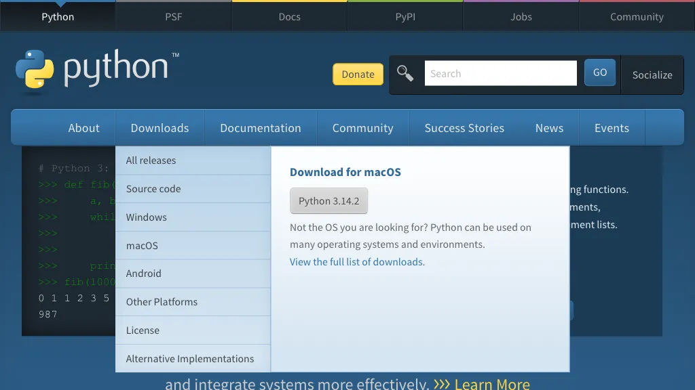
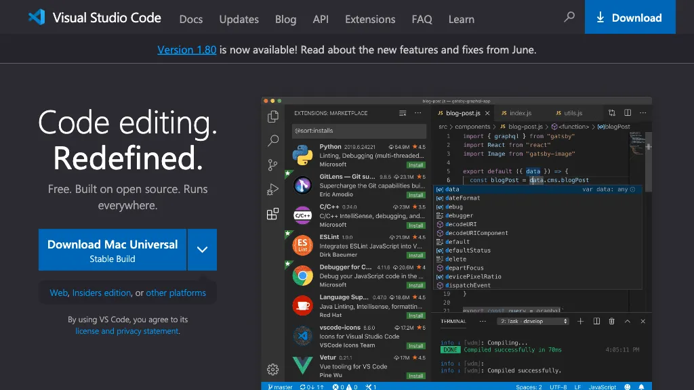

<script type="module" defer>
Doc.setChapterNb(1)
</script>

## Qu'est-ce qu'un programme?

De manière générale, un programme est une suite d'actions à entreprendre visant à atteindre un but. On peut par exemple dire d'une recette de cuisine que c'est un programme pour réaliser un plat (cf <span data-link='oeuf'>figure</span>). On parle également de programme pour un lave-linge où, suivant le type de linge, la suite d'actions (rotations du tambour) est différente.

<figure id='oeuf' data-ref='figure'>
    <div></div>
    <figcaption>Cuire un œuf</figcaption>
</figure>
<script type="module" defer>
    const draw = await Doc.Draw('#oeuf > div', 350, 500)
    const start = draw.start().move(1, 2)
    const hot = draw.round('faire chauffer la poêle').belowOf(start)
    const oil = draw.round('mettre de l\'huile dans la poêle').belowOf(hot)
    const egg = draw.round('casser l\'œuf dans la poêle').belowOf(oil)
    const salt = draw.round('ajouter du sel et du poivre').belowOf(egg)
    const dummyTop = draw.dummy().belowOf(salt)
    const cooked = draw.round('Est-ce que c\'est cuit ?').belowOf(dummyTop)
    const if1 = draw.diamond().belowOf(cooked)
    const non = draw.node('non').belowOf(if1)
    const wait = draw.round('On attend 10 secondes').belowOf(non)
    const oui = draw.node('oui').absolute(if1, 50, 0)
    const dummyRight = draw.dummy().rightOf(wait)
    const dummyLeft = draw.dummy().leftOf(if1)
    const end = draw.end().belowOf(wait)
    draw.polyline([start, '-->', hot, '-->', oil, '-->', egg, '-->', salt, '--', dummyTop, '-->', cooked, '-->', if1])
    draw.polyline([if1, '', non, '-->', wait, '-|', dummyLeft, '|->', dummyTop])
    draw.polyline([if1, '', oui, '-|', dummyRight, '|->', end])
    draw.done()
</script>

Un programme est donc constitué d'une suite d'instructions à exécuter dans un certain ordre.

Dans le domaine de l'informatique, un programme est une suite d'instructions visant à la résolution d'un problème. La résolution d'une équation du deuxième degré que vous avez apprise en secondaire ressemble déjà beaucoup à un programme informatique (cf <span data-link='d2deg'>figure</span>).

<figure id='d2deg' data-ref='figure'>
    <div></div>
    <figcaption>Second degré</figcaption>
</figure>
<script type="module" defer>
    const draw = await Doc.Draw('#d2deg > div', 600, 600)
    const start = draw.start()
    const delta = draw.round('calculer <code>b*b-4*a*c</code> et appeler le résultat D').belowOf(start)
    const test_delta = draw.round('Est-ce que D est négatif ?').belowOf(delta)
    const if1 = draw.diamond().belowOf(test_delta)
    const oui1 = draw.node('oui').absolute(if1, 50, 0)
    const non1 = draw.node('non').belowOf(if1)
    const test_null = draw.round('Est-ce que D est nul ?').belowOf(non1)
    const if2 = draw.diamond().belowOf(test_null)
    const oui2 = draw.node('oui').absolute(if2, 50, 0)
    const non2 = draw.node('non').belowOf(if2)
    const root1 = draw.round('La 1<sup>re</sup> racine est <code>(-b+sqrt(D))/(2*a)</code>').belowOf(non2)
    const root2 = draw.round('La 2<sup>e</sup> racine est <code>(-b-sqrt(D))/(2*a)</code>').belowOf(root1)
    const dummy = draw.dummy().belowOf(root2)
    const end = draw.end().belowOf(dummy)
    const noroot = draw.round('Pas de racine réelle').width(150).absolute(test_null, 270, -30)
    const droot = draw.round('La racine double est <code>-b/(2*a)</code>').width(150).absolute(if2, 170, 0)
    draw.polyline([start, '-->', delta, '--', test_delta, '-->', if1, '--', non1, '--', test_null, '-->', if2, '--', non2, '--', root1, '--', root2, '--', dummy, '-->', end])
    draw.polyline([if2, '--', oui2, '-->', droot, '|->', dummy])
    draw.polyline([if1, '--', oui1, '-|>', noroot, '|-', dummy])
    draw.done()
</script>

### Code et langage de programmation

Les figures <span data-link='oeuf'></span> et <span data-link='d2deg'></span> sont des représentations graphiques de programmes. On les appelle organigrammes ou encore diagrammes d'activité. Un vrai programme se fait dans un langage de programmation. Un programme écrit dans un langage de programmation se présente donc comme du texte. Ce texte est appelé le code source du programme.

Une façon d'écrire en texte le programme de résolution d'une équation du second degré pourrait être la suivante :

<figure id="code_2deg" data-ref='code'>

<pre>
b*b-4*a*c <strong>&#8594;</strong> D
<strong>si</strong> D &lt; 0 <strong>alors:</strong>
    <strong>affiche</strong> <span class='hljs-string'>"Pas de solution réelle"</span>
<strong>sinon:</strong>
    <strong>si</strong> D = 0 <strong>alors:</strong>
        <strong>affiche</strong> <span class='hljs-string'>"La racine double est"</span> -b/(2*a)
    <strong>sinon:</strong>
        <strong>affiche</strong> <span class='hljs-string'>"La 1<sup>re</sup> racine est"</span> (-b-sqrt(D))/(2*a)
        <strong>affiche</strong> <span class='hljs-string'>"La 2<sup>e</sup> racine est"</span> (-b+sqrt(D))/(2*a)
</pre>

<figcaption>Pseudo code, second degré</figcaption>
</figure>

Le texte ci-dessus est souvent appelé "pseudo-code" car il a une structure très proche d'un vrai code de programme mais il n'est écrit dans aucun langage de programmation particulier.

Pour écrire un vrai programme, il faut choisir un langage de programmation et respecter sa syntaxe. Le langage que nous allons utiliser dans ce cours est le **Python**. Voici la version Python du précédent pseudo-code:

<figure id='python_2deg' data-ref='code'>

```python
D = b*b-4*a*c
if D < 0:
    print("Pas de solution réelle")
else:
    if D == 0:
        print("La racine double est", -b/(2*a))
    else:
        print("La 1re racine est", (-b-sqrt(D))/(2*a))
        print("La 2e racine est", (-b+sqrt(D))/(2*a))
```
<figcaption>Python, second degré</figcaption>
</figure>

Dans un programme, chaque ligne du code est une instruction. Les instructions sont exécutées dans l'ordre où elles apparaissent dans le code du programme.

"Les instructions sont exécutées...", mais comment sont elle exécutées et par quoi&nbsp;? Où se trouve ce fameux code du programme&nbsp;?

Pour bien comprendre tout cela, nous allons devoir nous intéresser au fonctionnement d'un ordinateur.

## Qu'est ce qu'un ordinateur ?

Nous allons ici essayer de comprendre comment un ordinateur fait pour exécuter du code. Pour pouvoir programmer nous n'avons pas besoin de tout connaître dans les détails. Mais, comprendre les bases du fonctionnement d'un ordinateur nous aidera pour le programmer et pour l'utiliser correctement.

Un ordinateur est, avant tout, un système composé de plusieurs éléments: Processeur, Mémoire, Stockage, périphériques, ...

<figure id="system" data-ref="figure">

<figcaption>CPU, RAM, et stockage</figcaption>
</figure>

### Le processeur

Le processeur *(**CPU**: Central Processing Unit)* exécute les instructions d'un programme une par une. Ces instructions proviennent de **la mémoire**. Après avoir exécuter une instruction, il passe automatiquement à celle qui suit dans la mémoire. Certaines instructions peuvent cependant le faire sauter à un tout autre endroit de la mémoire pour continuer l'exécution.

Les instructions manipulent généralement **des données**. Par exemple, l'instruction permettant d'additionner va nécessiter d'aller chercher les valeurs à additionner. Les données sont elles aussi en mémoire. Et **les résultats** des calculs sont eux aussi sauver en mémoire une fois qu'ils ont été calculés.

En bref, le processeur est donc grosso-modo capable de deux choses: Calculer et Sauver/lire des valeurs en mémoire.

Encore une petite remarque à propos du processeur : il ne comprend que le langage pour lequel il a été conçu. On appelle ce langage **le jeux d'instruction du processeur** ou encore **langage machine**. Il existe des jeux d'instruction différents pour chaque architecture de processeur (x86, ARM, ...).

### La mémoire

La mémoire *(**RAM**: Random Access Memory)* contient **les instructions** du programme et **les données** qu'il manipule. Sa taille ne dépasse généralement pas quelques giga-octet (Go).

On peut se représenter la mémoire comme une longue liste de cases ayant chacune un numéro. Lorsque le processeur veut obtenir une instruction ou une donnée en mémoire, il doit mentionner le numéro de la case qu'il souhaite consulter.

Pour garder ses données, la mémoire à besoin d'être alimentée ce qui veut dire que le contenu de la mémoire est perdu si on lui coupe le courant. On dit que la mémoire est **volatile**.

Quand nous écrirons des programme, nous manipulerons beaucoup la mémoire par l'intermédiaire **des variables**.

### Le stockage

Puisque la mémoire est volatile et limitée en taille, comment stocke-t-on de grandes quantités de données et comment fait-on quand on éteint l'ordinateur ? On utilise un **stockage de masse**.

Il en existe plusieurs sortes&nbsp;:
- Disque **SSD** (Solid State Drive)
- Disque dur (**HDD**: Hard Disk Drive)
- Clé **USB** (Universal Serial Bus)
- carte **SD** (Secure Digital)
- ...

Le stockage de masse contient **des fichiers** et **des répertoires**. Un répertoire peut contenir plusieurs fichiers et plusieurs autres répertoires. Le contenu du stockage de masse est donc organisé en une **hiérarchie** de répertoires et chaque élément dans cette hiérarchie peut être localisé par son **chemin d'accès**. Le chemin d'accès est constitué de la suite de répertoires à ouvrir pour atteindre l'élément.

Exemple:
- Sous Windows: C:\Users\lur\Documents\note.txt
- Sous MacOS: /Users/lur/note.txt

Lorsqu'un programme doit être exécuté, ses instructions se trouvent initialement dans un fichier dans le stockage de masse. Les fichiers contenant des instructions pour le processeur sont appelés des **fichiers exécutable** (sous Windows on les reconnaît car leurs noms finissent par ".exe"). Pour exécuter un de ces fichiers, le **système d'exploitation** (**OS**: Operating System) va d'abord le **copier** dans la mémoire. Le processeur pourra alors commencer à en exécuter les instructions.

De même, pour qu'un programme en cours d'exécution puisse accéder au contenu d'un fichier, il devra d'abord le **charger** en mémoire.

Les opérations d'écriture et de lecture de fichiers sont beaucoup plus **lentes** que les accès à des données en RAM. Les stockages de masse n'ont pas besoin d'être alimenté pour conserver les données (ils sont **persistants**) et peuvent contenir jusqu'à plusieurs tera-octet (**To**&nbsp;:&nbsp;~1000 Go).

Comme nous l'avons vu, un programme se présente en pratique comme un simple texte et nous sauverons ce texte dans un fichier.

## Langage de programmation

Les fichiers contenant des programmes contiennent les instructions du programme dans **le langage propre au processeur**. Par exemple, le jeu d'instructions des processeurs x86 *(i3, i5, i7, amd ryzen, ...)* est complètement différent de celui des processeurs ARM *(Apple Silicon, Snapdragon, ...)*.

Ces jeux d'instructions sont fait pour s'exécuter aussi efficacement que possible par le processeur. Mais ils sont particulièrement difficile à lire et à écrire par un être humain.

Pour créer un programme on passe donc généralement par **un langage de programmation**.

Un langage de programmation est fait pour être **écrit** et **lu** par un être humain. Le code source d'un programme est un **simple fichier texte**. Le code source doit ensuite être traduit en langage machine pour pouvoir être exécuter par le processeur. En fonction du moment où cette traduction a lieu, on distingue deux grandes familles de langage de programmation: les langages compilés et les langages interprétés.

Dans un **langage compilé**, la traduction se fait par un programme appelé **compilateur**. Le compilateur génère un fichier exécutable à partir du fichier de code source. Le contenu de ce fichier exécutable peut ensuite être exécuter directement par le processeur et le compilateur **n'est plus nécessaire**.

Dans un **langage interprété**, la traduction se fait par un programme appelé **interpréteur**. L'interpréteur ne produit pas de fichier exécutable. Il exécute directement chaque instruction qu'il rencontre dans le code source. On a donc le processeur qui exécute l'interpréteur et l'interpréteur qui exécute notre code source. Dans ce cas, l'interpréteur est nécessaire pour **chaque exécution** du code source.

Le langage que nous allons utiliser dans ce cours est un langage interprété nommé **Python**. Pour exécuter un programme Python, il est nécessaire d'installer l'interpréteur Python.

## Exécuter mon premier programme Python !

La première chose à faire est d'installer l'interpréteur Python. Pour cela, il faut commencer par le télécharger sur <https://python.org>. **Attention&nbsp;: Sous Windows, cochez la case "Add Python to PATH" durant l'installation&nbsp;!**

<figure id="python_org" data-ref="figure">

<figcaption>Site de Python</figcaption>
</figure>

Cela fait, nous avons l'interpréteur Python installé. Cet interpréteur va nous permettre d'exécuter nos programmes. Il ne va par contre pas nous aider à écrire notre programme.

Comme le code d'un programme est un simple texte, la seule chose dont on a besoin pour écrire un programme est un **éditeur de texte** (bloc-note sous Windows, TextEdit sous MacOS, ...). Il est cependant plus pratique d'utiliser un éditeur **spécialisé** pour écrire le code. Ces éditeurs facilitent fortement l'écriture et la lisibilité du code (Visual Studio Code, Notepad++, Sublime Text, ...). Dans ce cours nous utiliserons **Visual Studio Code** comme éditeur.

Pour installer Visual Studio Code, il faut le télécharger sur le site <https://code.visualstudio.com/>. **Sous Windows, durant l'installation, cochez les cases&nbsp;:**
- **Ajouter l'action "Ouvrir avec Code" au menu contextuel de fichier...**
- **Ajouter l'action "Ouvrir avec Code" au menu contextuel de répertoire...**
- **Ajouter à PATH...**

<figure id="code_visualstudio_com" data-ref="figure">

<figcaption>Site de Visual Studio Code</figcaption>
</figure>

Visual Studio Code *(VSCode)* est un éditeur open source qui supporte plusieurs langages. On peut lui ajouter des fonctionnalités en installant des extensions. Il existe une **extension Python** qi ajoute pas mal de fonctionnalités utiles lorsqu'on développe des programmes en Python. Pour installer cette extension il suffit de cliquer sur l'icône extensions (<svg width="0.9em" height="0.9em" viewBox="0 0 50 50">
    <rect
        x="2"
        y="8"
        width="20"
        height="20"
        ry="3"
        rx="3"
        style="fill: none; stroke: #000; stroke-width: 3px"
    />
    <rect
        x="22"
        y="28"
        width="20"
        height="20"
        ry="3"
        rx="3"
        style="fill: none; stroke: #000; stroke-width: 3px"
    />
    <rect
        x="2"
        y="28"
        width="20"
        height="20"
        ry="3"
        rx="3"
        style="fill: none; stroke: #000; stroke-width: 3px"
    />
    <rect
        x="28"
        y="2"
        width="20"
        height="20"
        ry="3"
        rx="3"
        style="fill: none; stroke: #000; stroke-width: 3px"
    />
    </svg>), taper "python" dans le champ de recherche et cliquer sur installer.

Une fois VSCode installé, nous pouvons créer un **nouveau fichier** avec le contenu suivant&nbsp;:

<figure id="helloworld" data-ref="code">

```python
print('Hello World !')
```
<figcaption>Le fichier <code>hello.py</code></figcaption>
</figure>

Une fois le code écrit, **enregistrez** le fichier sous le nom `hello.py`. Faites attention au **répertoire** dans lequel vous sauvez votre fichier. Nous aurons en effet besoin de connaître **le chemin d'accès** de notre fichier pour l'exécuter avec l'interpréteur Python. Le fait de faire terminer le nom du fichier par l'extension `.py` est une **convention** qui aide à identifier le **type de contenu** d'un fichier sans avoir nécessairement besoin de l'ouvrir.

Maintenant que notre fichier est créé, nous allons pourvoir l'exécuter avec l'interpréteur Python. Le problème, c'est que l'interpréteur n'a **pas d'interface graphique**&nbsp;!

Il est probable que la plupart des programme que vous avez eu l'habitude d'utiliser par le passé soit des programme ayant une interface graphique. On interagit généralement avec ce genre de programme en cliquant sur l'interface graphique avec la souris de l'ordinateur. L'interpréteur Python, lui, n'a pas d'interface graphique et les programmes que nous allons créer dans un premier temps n'en auront pas non plus. Il va donc falloir que nous apprenions à utiliser le **Terminal** pour interagir avec des programme en **lignes de commande**.

Nous nous pencherons sur l'utilisation du Terminal dans la section suivante. Pour le moment, nous allons essayer de lancer rapidement notre premier programme. Lancez un Terminal (Application "Powershell" sous windows et "Terminal" sous MacOS) et tapez **la commande** qui suit pour démarrer l'interpréteur avec notre fichier `hello.py`. Le chemin d'accès mentionné est **un exemple**. Vous devez utiliser le chemin d'accès du fichier que **vous avez créé précédemment**. **Attention: le premier caractère `>` représente l'invite de commande. Vous ne devez pas le taper**. Sous MacOS, vous devrez sans doute utiliser la commande `python3` à la place de `python`. Prenez garde aussi au format du chemin d'accès; il est différent entre Windows et MacOS.

**Sous Windows&nbsp;:**

<pre class='terminal'>
<b>> python C:\Users\lur\Documents\Programmation\hello.py</b>
</pre>

**Sous MacOS&nbsp;:**

<pre class='terminal'>
<b>> python3 /Users/lur/Documents/Programmation/hello.py</b>
</pre>

Validez avec la touche **Enter**. Vous devriez maintenant voir apparaître le message **"Hello World !"** dans le Terminal en dessous de la commande que vous avez tapée.

**Félicitations vous venez d'exécuter votre premier programme&nbsp;!**

Il faut bien avouer que de taper le chemin complet du fichier est un petit peu fastidieux. Nous allons donc essayer d'en apprendre un peu plus sur le Terminal pour pouvoir l'utiliser plus efficacement.

### Terminal

Une bonne partie de l'utilisation d'un ordinateur passe par la création, l'édition et la gestion de fichiers dans l'arborescence de dossiers du stockage de masse. Bien que de nos jour la plupart des gens fasse ces opérations en utilisant une interface graphique, il est aussi possible de les réaliser en **ligne de commande dans un terminal**.

Sous Windows, il y a plusieurs programmes permettant d'utiliser les lignes de commande&nbsp;:
- cmd: invite de commande
- Powershell

Sous MacOS, le programme s'appelle simplement "Terminal".

Les développeurs et les ingénieurs sont **régulièrement** amenés à utiliser le terminal. Il est donc important d'apprendre les bases de son utilisation.

La première notion à intégré est la notion de **répertoire courant**. Lorsqu'on utilise le terminal, il y a toujours un dossier de l'arborescence qui est considéré comme notre position actuelle. On peut afficher le chemin de ce dossier avec la commande `pwd` pour *print working directory*. Beaucoup de commandes agissent directement sur le répertoire courant.

<pre class="terminal">
<b>> pwd</b>
C:\Users\lur
</pre>

La commande `ls` permet de **lister** le contenu du répertoire courant

<pre class="terminal">
<b>> ls</b>
Desktop Documents
</pre>

La commande `cd` (*change directory*) permet de **changer le répertoire courant**. 

<pre class="terminal">
<b>> cd Documents</b>
<b>> pwd</b>
C:\Users\lur\Documents
</pre>

On indique le **nouveau répertoire courant** par son chemin relatif ou absolut&nbsp;:

- **Un chemin absolu** indique un éléments de l'arborescence de fichiers en partant de **la racine** de celle-ci&nbsp;:
  - Sous Windows&nbsp;: `C:\Users\lur`
  - Sous MacOS ou Linux&nbsp;: `/Users/lur`
- **Un chemin relatif** l'indique en partant du répertoire courant. Si le répertoire courant est `C:\Users` alors le chemin relatif `lur\Documents\hello.py` correspond au chemin absolu `C:\Users\lur\Documents\hello.py`.

**Remarques&nbsp;:**
- Dans un chemin, l'utilisation de `..` permet de **remonter** d'un repertoire. La commande `cd ..` permet donc de passer au répertoire **parent**. Un `.` seul représente le répertoire **courant**. Le chemin relatif mentionné plus haut peut donc aussi s'écrire `.\lur\Documents\hello.py`.
- Windows utilise des **anti-slash** (`\`) pour séparer les différentes parties du chemin alors que MacOS et Linux utilisent des **slash** (`/`).
- Dans la plupart des terminaux, la **touche tabulation** (`Tab ↹`) permet d'**auto-compléter** les éléments des chemins.

<figure id="tab" data-ref="figure">

<figcaption>La touche <code>Tab</code></figcaption>
</figure>

- La **touche <code>&#8593;</code>** permet de reprendre des **commandes précédentes**.

Du coup pour pouvoir démarrer notre programme Python plus facilement, il suffit de mettre le répertoire contenant le fichier `.py`  comme répertoire courant&nbsp;:

<pre class='terminal'>
<b>> pwd</b>
C:\Users\lur
<b>> cd Documents\Programmation</b>
<b>> pwd</b>
C:\Users\lur\Documents\Programmation
<b>> python hello.py</b>
</pre>

De plus, si on souhaite relancer le programme, il suffit d'appuyer sur <code>&#8593;</code> pour récupérer la dernière commande et puis de valider avec `Enter`.

Sachez aussi qu'il est possible d'ouvrir un Terminal **dans l'interface de VSCode**. Si vous ouvrez votre répertoire de travail dans VSCode *(File &#8594; Open Folder...)*, tous les terminaux que vous ouvrirez commenceront automatiquement avec votre répertoire de travail comme répertoire courant! 

### La variable d'envirronement `PATH`

Nous avons vu plus haut que l'interpréteur Python était un programme dont les instructions en langage machine se trouvent dans un **fichier exécutable** nommé `python.exe` (sous Windows). Mais comment fait le Terminal pour savoir **où se trouve** ce fichier exécutable lorsqu'on tape la commande `python`?

En réalité le fichier `python.exe` peut se trouver à plusieurs endroits. Si vous avez fait une installation simple sous Windows, il se trouve normalement dans&nbsp;:

<p class='center'><code>C:\Users\lur\AppData\Local\Programs\Python\Python<span class="pypathversion">3XX</span>\python.exe</code></p>

Et on peut démarrer un programme dans le terminal en utilisant ce chemin complet&nbsp;:

<pre class='terminal' style='font-size: 50%'>
<b>> C:\Users\lur\AppData\Local\Programs\Python\Python311\python.exe C:\Users\lur\Documents\Programmation\hello.py</b>
</pre>

Mais ce n'est pas très pratique.

Pour éviter d'avoir à taper les chemins entier des fichiers exécutables, **la variable `PATH`** contient une **liste de dossiers** dans laquelle le système d'exploitation va pouvoir chercher.

Lors de l'installation de l'interpréteur Python, vous avez normalement coché la case **"Add Python to PATH"**. Cela a fait en sorte que le programme d'installation ajoute le répertoire <code>C:\\...\Python<span class="pypathversion">3XX</span></code> à la liste de dossiers de la variable `PATH`. Et maintenant, à chaque fois que l'on utilise la commande `python`, le système d'exploitation **cherche** un programme nommé `python.exe` dans les dossiers listés **dans `PATH`** et il le trouve dans <code>C:\\...\Python<span class="pypathversion">3XX</span></code>.

Pour finir, voici un schema qui récapitule les opérations qui ont lieu quand on lance une commande (`python`) dans le terminal&nbsp;:

<figure id="command" data-ref="figure">
    <div></div>
    <figcaption>Exécution de la commande python par le terminal</figcaption>
</figure>
<script type="module" defer>
    const draw = await Doc.Draw('#command > div', 500, 700)
    const start = draw.start().move(1, 2)
    const command = draw.round('Réception de la commande <code>python hello.py</code>').belowOf(start)
    const path = draw.round('Recherche <code>python.exe</code> dans les répertoires de <code>PATH</code>').belowOf(command)
    const dia1 = draw.diamond().belowOf(path)
    const found = draw.round('<code>C:\\...\\Python<span class="pypathversion">3XX</span>\\python.exe</code> trouvé, chargement en RAM').belowOf(dia1)
    const run = draw.round('Exécution de l\'interpréteur par le CPU').belowOf(found)
    const fetch = draw.round('L\'interpréteur demande à l\'OS le fichier <code>hello.py</code>').belowOf(run)
    const file = draw.round('<code>hello.py</code> est un chemin relatif, recherche à partir du <strong>répertoire courant</strong>').belowOf(fetch)
    const dia2 = draw.diamond().belowOf(file)
    const foundpy = draw.round('<code>hello.py</code> trouvé, chargement en RAM').belowOf(dia2)
    const running = draw.round('L\'interpréteur exécute le code Python 🙌').classes('success').belowOf(foundpy)
    const end = draw.end().belowOf(running)
    const exenotfound = draw.round('<code>python.exe</code> non trouvé').rightOf(found)
    const error1 = draw.round('Erreur&nbsp;: commande <code>python</code> inconnue').classes('error').belowOf(exenotfound)
    const enderror1 = draw.end().belowOf(error1)
    const pynotfound = draw.round('<code>hello.py</code> non trouvé').rightOf(foundpy)
    const error2 = draw.round('Erreur&nbsp;: fichier <code>hello.py</code> introuvable').classes('error').belowOf(pynotfound)
    const enderror2 = draw.end().belowOf(error2)
    draw.polyline([start, '-->', command, '-->', path, '-->', dia1, '-->', found, '-->', run, '-->', fetch, '-->', file, '-->', dia2, '-->', foundpy, '-->', running, '-->', end])
    draw.polyline([dia1, '-|>', exenotfound, '-->', error1, '-->', enderror1])
    draw.polyline([dia2, '-|>', pynotfound, '-->', error2, '-->', enderror2])
    draw.done()
</script>

## Erreurs et débuggage

Nous avions vu, plus haut, un exemple de programme pour résoudre les équations du second degré&nbsp;:

<figure id='python_2deg' data-ref='code'>

```python
D = b*b-4*a*c
if D < 0:
    print("Pas de solution réelle")
else:
    if D == 0:
        print("La racine double est", -b/(2*a))
    else:
        print("La 1re racine est", (-b-sqrt(D))/(2*a))
        print("La 2e racine est", (-b+sqrt(D))/(2*a))
```
<figcaption>Python, second degré</figcaption>
</figure>

Il est maintenant temps d'essayer de l'exécuter. Sauvez ce programme **dans un nouveau fichier**, `2nd_order.py` et essayez de le lancer&nbsp;:

<pre class="terminal" style="font-size: 85%">
<b>> python 2nd_order.py</b>
Traceback (most recent call last):
  File "C:\Users\lur\Programmation\2nd_order.py", line 1, in &lt;module&gt;
    D = b*b-4*a*c
        ^
NameError: name 'b' is not defined
</pre>

Il semblerait que quelque chose se soit mal passé. Ce que nous avons là est **un message d'erreur**. C'est un des grands avantages de la programmation. Lorsqu'on fait une erreur, il y a généralement un message d'erreur pour nous aider à la corriger. Il est important d'apprendre à lire ces messages car **toute l'information** dont on a besoin pour **corriger** l'erreur se trouve généralement **dans le message**.

Ici le message d'erreur nous indique que le problème se trouve dans le fichier `2nd_order.py` à la **ligne 1**. Le caractère `^` indique à quel endroit de la ligne se trouve l'erreur. Et la dernière ligne du message est **une description de l'erreur**. Ici, on nous dit que le nom `b` n'est pas définit.

En effet, nous n'avons, dans ce programme, pas définit **les valeurs** de `a`, `b` et `c`. Python ne peut donc pas effectuer le calcul `b*b-4*a*c`. Le message d'erreur nous parle de `b` car c'est la première variable non définie qu'il rencontre.

Ajoutons des définitions pour ces 3 variables&nbsp;:

<figure id='python_2deg_corrected' data-ref='code'>

```python
a = 1
b = 0
c = -4
D = b*b-4*a*c
if D < 0:
    print("Pas de solution réelle")
else:
    if D == 0:
        print("La racine double est", -b/(2*a))
    else:
        print("La 1re racine est", (-b-sqrt(D))/(2*a))
        print("La 2e racine est", (-b+sqrt(D))/(2*a))
```
<figcaption>définitions des valeurs <code>a</code>, <code>b</code> et <code>c</code></figcaption>
</figure>

Relançons le programme&nbsp;:

<pre class="terminal" style="font-size: 85%">
<b>> python 2nd_order.py</b>
Traceback (most recent call last):
  File "C:\Users\lur\Programmation\2nd_order.py", line 11, in &lt;module&gt;
    print("La 1re racine est", (-b-sqrt(D))/(2*a))
                                   ^^^^
NameError: name 'sqrt' is not defined
</pre>

Encore une erreur, la fonction `sqrt()` qui permet de calculer les racines carrées n'est pas chargée par défaut en Python. Comme nous ne l'avons pas chargée, le nom `sqrt` n'est pas définit. Ajoutons **l'importation** de la fonction `sqrt`&nbsp;:

<figure id='python_2deg_corrected_2' data-ref='code'>

```python
from math import sqrt

a = 1
b = 0
c = -4
D = b*b-4*a*c
if D < 0:
    print("Pas de solution réelle")
else:
    if D == 0:
        print("La racine double est", -b/(2*a))
    else:
        print("La 1re racine est", (-b-sqrt(D))/(2*a))
        print("La 2e racine est", (-b+sqrt(D))/(2*a))
```
<figcaption>Chargement de la fonction <code>sqrt</code></figcaption>
</figure>

Relançons le programme&nbsp;:

<pre class="terminal">
<b>> python 2nd_order.py</b>
La 1re racine est -2.0
La 2e racine est 2.0
</pre>

**Et voilà !** Ça marche.

Nous avons eu ici un exemple classique de rédaction de programme. **On écrit du code, on teste, on lit les messages d'erreur, on corrige et on recommence.**

<script type="module" defer>
  fetch("https://endoflife.date/api/python.json")
    .then((response) => response.json())
    .then((data) => {
      const version = data[0].latest;
      const shortVersion = version.split(".").slice(0, 2).join(".");
      const pathVersion = shortVersion.split(".").join("")
      document.querySelectorAll(".pyversion").forEach((elem) => {
        elem.innerHTML = version;
      });
      document.querySelectorAll(".pyshortversion").forEach((elem) => {
        elem.innerHTML = shortVersion;
      });
      document.querySelectorAll(".pypathversion").forEach((elem) => {
        elem.innerHTML = pathVersion;
      });
    });
</script>
