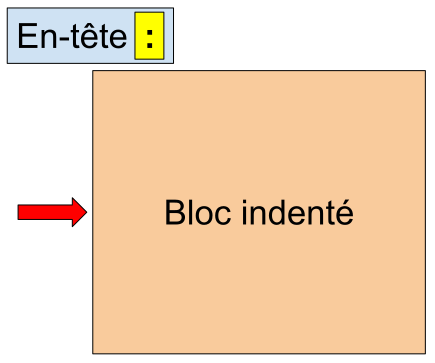

<script type="module" defer>
Doc.setChapterNb(2)
</script>

      
## Variables, valeurs et types

Dans le programme de résolution d'équations du second degré, nous avons utilisé plusieurs variables, `a`, `b`, `c` et `D`.

Une variable est une sorte de boite possédant un nom et pouvant contenir une valeur. Pour mettre une valeur dans la variable, on utilise le signe `=`. Une fois la valeur de la variable définie son contenu peut être utiliser dans le code en utilisant sont nom.

```python
a = 42
print(a) # affiche 42
```
*Remarque: le caractère `#` permet d'indiquer que le reste de la ligne est un commentaire. Les commentaires sont ignorés par l'interpréteur Python.*

<figure id="variable" data-ref="figure">
<svg width="50%" viewBox="0 0 1780 941" version="1.1">
  <g>
    <rect
      x="718.473"
      y="186.234"
      width="511.1"
      height="511.1"
      style="fill: none; stroke: #000; stroke-width: 15.66px"
    />
    <text
      x="435.195px"
      y="507.148px"
      style="
        font-family: 'Consolas', monospace;
        font-size: 266.667px;
        fill: #008802;
      "
    >
      a
    </text>
    <text
      x="832.291px"
      y="528.046px"
      style="
        font-family: 'Consolas', monospace;
        font-size: 266.667px;
        fill: #0053d8;
      "
    >
      42
    </text>
    <ellipse
      cx="916.27"
      cy="448.593"
      rx="556.47"
      ry="374.94"
      style="fill: none; stroke: #de0000; stroke-width: 15.66px"
    />
    <text
      x="1207.1px"
      y="72.482px"
      style="font-size: 100px; fill: #de0000"
    >
      La variable
    </text>
    <text
      x="1366.77px"
      y="895.116px"
      style="font-size: 100px; fill: #0053d8"
    >
      La valeur
    </text>
    <text
      x="-6.862px"
      y="728.803px"
      style="font-size: 100px; fill: #008802"
    >
      Le nom
    </text>
    <path
      d="M483.334,598.628l23.199,-35.414l23.767,35.035"
      style="
        fill: none;
        stroke: #008802;
        stroke-width: 15.66px;
        stroke-linejoin: miter;
        stroke-miterlimit: 10;
      "
    />
    <path
      d="M359.8,693.598c138.621,-3.775 147.112,-42.337 146.733,-130.384"
      style="fill: none; stroke: #008802; stroke-width: 15.66px"
    />
    <path
      d="M950.341,624.014l24.803,-34.31l22.13,36.091"
      style="
        fill: none;
        stroke: #0053d8;
        stroke-width: 15.66px;
        stroke-linejoin: miter;
        stroke-miterlimit: 10;
      "
    />
    <path
      d="M1333.51,859.91c-199.807,-4.867 -365.219,-12.486 -358.367,-270.206"
      style="fill: none; stroke: #0053d8; stroke-width: 15.66px"
    />
  </g>
</svg>
<figcaption>Variable et valeur</figcaption>
</figure>

Il est important ici de constater que le signe `=` a une signification très **différente** de ce que l'on retrouve en **mathématique**. En programmation, le `=` prend **la valeur qui est à sa droite** pour la mettre dans **la variable qui est à sa gauche**. Cela signifie que `42 = a` n'a aucun sens en Python.

La valeur de la variable peut être modifiée en lui assignant une autre valeur.

```python
a = 42
print(a) # affiche 42
a = 0
print(a) # affiche 0
```

Il y d'autres moyens de mettre la valeur `42` dans la variable `a`&nbsp;:

```python
a = 21 + 21
a = 2 * 21
# ...
```

La valeur qui est à droite du signe `=` peut être écrite directement; on parle alors d'un **littéral**. Ou elle peut être le résultat d'un calcul. Plus généralement, on appelle **expressions** tous ce qui a une valeur. Un littéral est donc une expression mais toutes les expressions ne sont pas des littéraux.

## Types de valeurs

Les valeurs peuvent être de différents types :

- Les entiers (`int`)

```python
a = 42 # littéral
a = 2 * 21 # expression
```

- Les nombre à virgule flottante (`float`)

```python
a = 0.42 # littéral
a = 42e-2 # littéral en notation scientifique
a = 1 / 2 # expression
```

- Les chaînes de caractères (`str`: *string*). Les *strings* sont un cas particulier d'une famille de types plus générale qu'on appelle **les séquences**.

```python
a = "hello" # littéral
b = 'coucou' # littéral
c = 2 * a + "!!" # expression
```

- Les booléens (`bool`)

```python
a = True # littéral
b = a or 5 < 0 # expression
```

- **Et bien d'autres...**

Physiquement, le contenu des variables est sauvé dans la **RAM** de l'ordinateur. Dans la RAM, toutes les valeurs sont sauvegardées avec des `1` et des `0`. C'est le **type** de la valeur qui indique à Python comment interpréter ces `1` et ces `0`.

Il est important de garder à l'esprit les types des valeurs que l'on manipule car les **opérations** que l'on peut effectuer avec chaque type ne sont pas les mêmes et ne font pas toujours la même chose&nbsp;:

<figure id='operations_type' data-ref='code'>

```python
i = 21
print(i + i) # affiche 42
s = "21"
print(s + s) # affiche 2121
print(i + s) # interdit
```
<figcaption>Somme entre <code>int</code> et <code>float</code></figcaption>
</figure>

Pour illustrer cela, apportons une petite modification au programme de résolution d'équations du second degré. Bien que le programme fonctionne, il est nécessaire de modifier les définitions de `a`, `b` et `c` pour résoudre une autre équations. Ce n'est pas idéal. Nous allons donc faire en sorte que le programme **demande à l'utilisateur** d'entrer les valeurs des coefficients de l'équation. Pour cela, on utilise la fonction `input()`. Cette dernière **interrompt** l'exécution du programme pour permettre à l'utilisateur d'entrer quelque chose au clavier. Elle laisse ensuite le programme **reprendre** et renvoie la valeur tapée&nbsp;:

<figure id='python_2deg_corrected_2' data-ref='code'>

```python
from math import sqrt

a = input('entrez la valeur de a : ')
b = input('entrez la valeur de b : ')
c = input('entrez la valeur de c : ')
D = b*b-4*a*c
if D < 0:
    print("Pas de solution réelle")
else:
    if D == 0:
        print("La racine double est", -b/(2*a))
    else:
        print("La 1re racine est", (-b-sqrt(D))/(2*a))
        print("La 2e racine est", (-b+sqrt(D))/(2*a))
```
<figcaption>Utilisation de <code>input</code></figcaption>
</figure>

Relançons le programme et entrons les valeurs demandées&nbsp;:

<pre class="terminal" style="font-size: 85%">
<b>> python 2nd_order.py</b>
entrez la valeur de a : 1
entrez la valeur de b : 0
entrez la valeur de c : -4
Traceback (most recent call last):
  File "C:\Users\lur\Programmation\2nd_order.py", line 5, in &lt;module&gt;
    D = b*b-4*a*c
        ~^~
TypeError: can't multiply sequence by non-int of type 'str'
</pre>

Voilà un nouveau message d'erreur ! Celui-ci nous indique que lors du calcul de `b*b`, on ne peut pas multiplier une séquence par une valeur de type `str`. On se rend compte ici que lorsqu'on a tapé `0` pour indiquer la valeur de `b`, la fonction `input()` a renvoyé une valeur **de type `str`**. Et cela pose problème pour la suite des calculs.

En fait, il s'agit du comportement normal de la fonction `input()`. comme cette fonction demande à l'utilisateur d'entrer quelque chose au clavier, elle ne fait que renvoyer la suite de caractères qui a été tapée. **`input()` renvoie donc toujours une valeur de type `str`**.

Pour pouvoir continuer les calculs, il faut **convertir** la chaîne de caractères en nombre. Comme l'utilisateur pourrait taper des nombres à virgule, nous allons les convertir en `float`. Pour cela, il existe une fonction `float()` qui convertit ce qu'on lui passe en paramètre en valeur de type `float`.

Ajoutons donc la fonction `float()` à notre programme. Notez que l'on peut directement utiliser la valeur renvoyée par `input()` comme **paramètre** de `float()`&nbsp;:

<figure id='python_2deg_corrected_3' data-ref='code'>

```python
from math import sqrt

a = float(input('entrez la valeur de a : '))
b = float(input('entrez la valeur de b : '))
c = float(input('entrez la valeur de c : '))
D = b*b-4*a*c
if D < 0:
    print("Pas de solution réelle")
else:
    if D == 0:
        print("La racine double est", -b/(2*a))
    else:
        print("La 1re racine est", (-b-sqrt(D))/(2*a))
        print("La 2e racine est", (-b+sqrt(D))/(2*a))
```
<figcaption>Utilisation de <code>float</code></figcaption>
</figure>

Relançons le programme&nbsp;:

<pre class="terminal">
<b>> python 2nd_order.py</b>
entrez la valeur de a : 1
entrez la valeur de b : 0
entrez la valeur de c : -4
La 1re racine est -2.0
La 2e racine est 2.0
</pre>

Parfait !

**Dans un premier temps les fonctions `input()` et `print()` seront nos seuls moyens de communication avec l'utilisateur. On utilise `input()` pour recevoir des données de l'utilisateur. Et on utilise `print()` pour afficher les résultats.**

## Expressions

En programmation, une expression est tous ce qui a une valeur. On dit aussi qu'une expression **renvoie** une valeur. Une expression peut donc être&nbsp;:

- **un littéral**, c'est à dire, une valeur écrite littéralement,

```python
42            # Littéral entier
3.141592      # Littéral flottant
'Hello World' # Littéral chaîne de caractères
True          # Littéral booléen
```

- **un nom de variable définie**, dans ce cas la valeur de l'expression est la valeur de la variable,

```python
a = 42        # Définition de la variable a
a             # expression valant 42
```

- **un appel de fonction**, comme par exemple la fonction `sqrt`,

```python
from math import sqrt
sqrt(4)       # Expression valant 2.0
```

- **une combinaison d'expressions**, grâce à des opérateurs. 

### Opérateurs

Comme nous l'avons vu dans le <span data-link="operations_type">code</span>, les opérateurs disponibles et la façon de combiner les valeurs dépend de leurs types.

Les opérateurs suivants sont définis pour **les valeurs numériques**&nbsp;:

<figure id='number_operators' data-ref='code'>

```python
1 + 2 # somme de deux nombres
1 - 2 # différence de deux nombres
2 * 2 # produit de deux nombres
4 ** 2 # puissance de deux nombres (ici 4²)
4 / 2 # quotient de deux nombre
5 // 2 # division entière
5 % 2 # modulo, reste de la division entière
```
<figcaption>Opérations sur les nombres</figcaption>
</figure>

Les deux dernières opérations nécessitent probablement un peu d'explications. Lorsqu'on parle de la division entière de `5` par `2` on veut savoir combien de fois `2` entre **entièrement** dans `5`. `2` entre deux fois dans `5`, en effet, `2 x 2 => 4`. `2` n'entre pas trois fois dans `5` car `3 x 2 => 6` ce qui est plus grand que `5`.

Le **reste** de la division entière de `5` par `2` est la partie de `5` **qui n'a pas pu être divisée** lors de la division entière. Comme on ne peut mettre que deux fois `2` dans `5` et que `2 x 2 => 4`, il reste `1` qui n'a pas pu être divisé. On dit donc que le reste de la division entière de `5` par `2` est égale à `1`.

Souvenez vous des divisions écrites que vous avez apprises en primaire. Si vous vous arrêtez avant de calculer les décimales, vous obtenez la division entière et le reste.

<figure id="division" data-ref="figure">

<figcaption>Division écrite</figcaption>
</figure>

Il y a plein de moment où la division entière et le modulo peuvent être utiles. Par exemple, si vous voulez convertir un nombre quelconque de minutes (disons 200) en heures/minutes. Pour obtenir le nombre d'heure, il suffit de faire une division entière par 60: `200 // 60 => 3`. Nous avons donc 3 heures. Et pour obtenir le nombre de minutes restantes, on utilise le modulo 60: `200 % 60 => 20`. Il reste donc 20 minutes. 200 minutes correspond à 3 heures et 20 minutes.

### Opérateurs de comparaison

Les opérateurs de comparaison renvoient un **booléen** en fonction de deux valeurs à comparer. Par exemple `4 < 3 => False` et `3.5 > 0 => True`.

<figure id='comparators' data-ref='code'>

```python
a < b # inférieur à
a > b # supérieur à
a <= b # inférieur ou égale à
a >= b # supérieur ou égale à
a == b # égale à
a != b # différent de
```
<figcaption>Opérateurs de comparaison</figcaption>
</figure>

Les comparaisons fonctionnent aussi sur les chaines de caractères. Un `str` est inférieur à un autre `str` s'il vient avant dans l'ordre alphabétique (`'aab' < 'abc' => True`).

### Opérateurs booléens

Les opérateurs booléens permettent de **combiner** des valeurs booléennes entre elles. Ces opérateurs sont le `and`, le `or` et le `not`. La valeur renvoyée est aussi booléenne. Voici la **table de vérité** qui indique le résultat de chaque opération possible&nbsp;:

<figure id="trues_table" data-ref='table'>
<table class='center'>
    <thead>
        <tr>
            <th><code>a</code></th>
            <th><code>b</code></th>
            <th><code>not a</code></th>
            <th><code>a and b</code></th>
            <th><code>a or b</code></th>
        </tr>
    </thead>
    <tbody>
        <tr>
            <td><code>True</code></td>
            <td><code>True</code></td>
            <td><code>False</code></td>
            <td><code>True</code></td>
            <td><code>True</code></td>
        </tr>
        <tr>
            <td><code>True</code></td>
            <td><code>False</code></td>
            <td><code>False</code></td>
            <td><code>False</code></td>
            <td><code>True</code></td>
        </tr>
        <tr>
            <td><code>False</code></td>
            <td><code>False</code></td>
            <td><code>True</code></td>
            <td><code>False</code></td>
            <td><code>False</code></td>
        </tr>
        <tr>
            <td><code>False</code></td>
            <td><code>True</code></td>
            <td><code>True</code></td>
            <td><code>False</code></td>
            <td><code>True</code></td>
        </tr>
    </tbody>
</table>
<figcaption>Table de vérité</figcaption>
</figure>

### Priorité des opérateurs

Il est bien sûr possible de combiner toutes ces opérations pour créer des expressions plus **complexes**. Il est intéressant de savoir que Python suis la même **priorité** des opérations que celle que vous avez vue en Mathématique (Les multiplication sont évaluées avant les additions). Voici, en détail, les priorités des opérations en Python (des plus prioritaires au moins prioritaires):

<figure id="operation_precedence" data-ref='table'>
<table>
    <tr>
        <th>Opération</th>
        <th>Description</th>
    </tr>
    <tr>
        <td><code>**</code></td>
        <td>Puissance</td>
    </tr>
    <tr>
        <td><code>-</code> </td>
        <td>Négatif (<code>-x</code>)</td>
    </tr>
    <tr>
        <td><code>*</code>, <code>/</code>, <code>//</code>, <code>%</code></td>
        <td>Multiplication, Division, ...</td>
    </tr>
    <tr>
        <td><code>+</code>, <code>-</code></td>
        <td>Addition et soustraction</td>
    </tr>
    <tr>
        <td><code>&lt;</code>, <code>&lt;=</code>, <code>&gt;</code>, <code>&gt;=</code>, <code>==</code>, <code>!=</code></td>
        <td>Comparaisons</td>
    </tr>
    <tr>
        <td><code>not</code></td>
        <td>NON booléen</td>
    </tr>
    <tr>
        <td><code>and</code></td>
        <td>ET Booléen</td>
    </tr>
    <tr>
        <td><code>or</code></td>
        <td>OU Booléen</td>
    </tr>
</table>
<figcaption>Priorité des opérations</figcaption>
</figure>

Comme en Math, il est possible d'utiliser des **parenthèses** pour contrôler l'ordre d'évaluation des opérateurs. Nous en avons déjà utilisé dans le programme de résolution d'équations du second degré, `(-b-sqrt(D))/(2*a)`.

Voici un exemple d'expression complexe:

```python
1 + 3.14 * 6 <= 6 % 2**2 and 'aab' > 'abc' or True == (not 42 != 21 + 21)
```

## Le contrôle de flux

Les instructions d'un programme s'exécutent toujours **dans l'ordre** dans lequel elles sont écrites dans le programme. On appelle cette séquence d'instructions le **flux** du programme. Il est possible de réaliser des embranchements et des boucles dans ce flux.

### Les instructions conditionnelles

Dans un programme, il est souvent intéressant d'avoir des portions de code qui ne s'exécutent que si certaines **conditions sont remplies**. Cela permet au programme de réagir en fonction des circonstances.

Pour cela, on utilise le `if`. Voici un exemple&nbsp;:

<div class="row">
<div class="span6 middle">

```python
a = −5
if a < 0:
   print("a est négatif")
```

</div>
<div class="span6">
<figure id='if' data-ref='figure'>
    <div></div>
    <figcaption>Le <code>if</code></figcaption>
</figure>
<script type="module" defer>
    const draw = await Doc.Draw('#if > div', 220, 300)
    const start = draw.start()
    const assign = draw.round('On met la valeur <code>-5</code> dans <code>a</code>').belowOf(start)
    const cond = draw.round('<code>a</code> est inférieur à 0&nbsp;?').belowOf(assign)
    const if1 = draw.diamond().belowOf(cond)
    const oui = draw.node('oui').belowOf(if1)
    const non = draw.node('non').absolute(if1, 50, 0)
    const disp = draw.round('Affiche <code>a est négatif</code>').belowOf(oui)
    const dummy = draw.dummy().rightOf(disp)
    const end = draw.end().belowOf(disp)
    draw.polyline([start, '-->', assign, '-->', cond, '-->', if1, '--', oui, '-->', disp, '-->', end])
    draw.polyline([if1, '--', non, '-|', dummy, '|->', end])
    draw.done()
</script>
</div>
</div>

Nous pouvons voir qu'il y a une condition après le `if`. Une **condition** est une expression dont la valeur est **booléenne**.

L'instruction `if` est le premier exemple d'**instruction composée** que nous rencontrons. Une instruction composée comporte une ligne d'en-tête se terminant par un `:` suivie d'un bloc d'instructions **indentées** *(décalées vers la droite)*.

<figure id="indentation" data-ref="figure">

<figcaption>Instructions composée</figcaption>
</figure>

**Attention : toutes les instructions du bloc doivent être indentées de la même manière. En particulier, on ne peut pas indenter une ligne avec des espaces et une autre avec des tabulations même si cela semble visuellement identique ! Dans VSCode, il est possible d'activé l'affichage des caractères blancs pour identifier plus facilement les espaces et les tabulations**

Il est possible de définir un bloc à exécuter si la condition est fausse avec l'instruction `else` *(sinon)*&nbsp;:

<div class="row">
<div class="span5 middle">

```python
a = −5
if a < 0:
   print("a est négatif")
else:
   print("a est positif")
```

</div>
<div class="span7">
<figure id='if_else' data-ref='figure'>
    <div></div>
    <figcaption>Le <code>if else</code></figcaption>
</figure>
<script type="module" defer>
    const draw = await Doc.Draw('#if_else > div', 350, 350)
    const start = draw.start().move(1, 2)
    const assign = draw.round('On met la valeur <code>-5</code> dans <code>a</code>').belowOf(start)
    const cond = draw.round('<code>a</code> est inférieur à 0&nbsp;?').belowOf(assign)
    const if1 = draw.diamond().belowOf(cond)
    const oui = draw.node('oui').belowOf(if1)
    const non = draw.node('non').absolute(if1, 50, 0)
    const dispOui = draw.round('Affiche <code>a est négatif</code>').belowOf(oui)
    const dispNon = draw.round('Affiche <code>a est positif</code>').rightOf(oui)
    const end = draw.end().belowOf(dispOui)
    draw.polyline([start, '-->', assign, '-->', cond, '-->', if1, '--', oui, '-->', dispOui, '-->', end])
    draw.polyline([if1, '--', non, '-|>', dispNon, '|->', end])
    draw.done()
</script>
</div>
</div>

L'instruction `elif` (contraction de "`else if`") permet d'avoir plus de deux branches&nbsp;:

```python
a = −5
if a == 0:
   print("a est nul")
elif a < 0:
   print("a est négatif")
else:
   print("a est positif")
```

<figure id='if_elif_else' data-ref='figure'>
    <div></div>
    <figcaption>Le <code>if elif else</code></figcaption>
</figure>
<script type="module" defer>
    const draw = await Doc.Draw('#if_elif_else > div', 550, 300)
    const start = draw.start().move(1, 2)
    const assign = draw.round('On met la valeur <code>-5</code> dans <code>a</code>').belowOf(start)
    const if1 = draw.diamond().belowOf(assign)
    const neg = draw.node('<s>a == 0</s><br>a < 0').belowOf(if1)
    const pos = draw.node('<s>a == 0<br>a < 0</s>').rightOf(if1)
    const nul = draw.node('a == 0').leftOf(if1)
    const dispNeg = draw.round('Affiche <code>a est négatif</code>').belowOf(neg)
    const dispPos = draw.round('Affiche <code>a est positif</code>').rightOf(neg)
    const dispNul = draw.round('Affiche <code>a est nul</code>').leftOf(neg)
    const end = draw.end().belowOf(dispNeg)
    draw.polyline([start, '-->', assign, '-->', if1, '--', neg, '-->', dispNeg, '-->', end])
    draw.polyline([if1, '--', pos, '-->', dispPos, '|->', end])
    draw.polyline([if1, '--', nul, '-->', dispNul, '|->', end])
    draw.done()
</script>

Dans ce dernier exemple, il est important de comprendre que Python choisi **la première branche pour laquelle la condition est vraie**. Si la première condition <code class="nowrap">a == 0</code> est vraie, alors la deuxième condition n'est même pas évaluée. Par contre, si on arrive dans la deuxième branche, celle du `elif`, cela **implique** que la première condition était fausse et donc que `a != 0`.

### Les boucles

Dans un programme, il arrive très souvent qu'il faille exécuter une même portion de code un certain nombre de fois. C'est d'ailleurs un des grands points forts de l'informatique : **exécuter des opérations répétitives à une vitesse prodigieuse**.

Pour réaliser une boucle dans le flux d'exécution du programme, on utilise l'instruction composée `while`&nbsp;:

<div class="row">
<div class="span5 middle">

```python
i = 0
while i < 5:
    i = i + 1
    print(i)
```

</div>
<div class="span7">
<figure id='while' data-ref='figure'>
    <div></div>
    <figcaption>Le <code>while</code></figcaption>
</figure>
<script type="module" defer>
    const draw = await Doc.Draw('#while > div', 350, 350)
    const start = draw.start().move(1, 2)
    const init = draw.round('Met la valeur <code>0</code> dans <code>i</code>').belowOf(start)
    const back = draw.dummy().belowOf(init)
    const cond = draw.round('i < 5 ?').belowOf(back)
    const if1 = draw.diamond().belowOf(cond)
    const oui = draw.node('oui').belowOf(if1)
    const non = draw.node('non').rightOf(if1)
    const dummy = draw.dummy().leftOf(if1)
    const inc = draw.round('Incrémente <code>i</code>').belowOf(oui)
    const show = draw.round('Affiche la veleur de <code>i</code>').belowOf(inc)
    const end = draw.end().belowOf(show)
    draw.polyline([start, '-->', init, '--', back, '-->', cond, '-->', if1, '--', oui, '-->', inc, '-->', show, '-|', dummy, '|->', back])
    draw.polyline([if1, '--', non, '|->' , end])
    draw.done()
</script>
</div>
</div>

**L'instruction while exécute son bloc tant que sa condition est vraie.**

Dans ce cas-ci, le bloc commence par l'incrémentation de `i`. Cette instruction nécessite une petite explication. Il s'agit ici encore d'un exemple flagrant de la différence qu'il existe entre le `=` de la programmation et le `=` des mathématiques. En effet, l'expression `i = i + 1` n'a **aucun sens en mathématique**. Elle est cependant parfaitement valide *(et très courante)* en programmation. Elle signifie "mettre la valeur de l'expression `i + 1` *(quelle que soit la valeur de `i`)* dans la variable `i`". Il faut comprendre ici que la valeur de l'expression `i + 1` **est calculée d'abord**. Puis, cette valeur est assignée à `i` c'est-à-dire qu'elle va remplacer la valeur qu'avait `i`. En bref, l'instruction `i = i + 1` augmente la valeur de `i` de `1`.

Le bloc se termine par l'affichage de `i`.

Nous avons donc un bloc d'instructions qui sera répété tant que `i` sera inférieur à `5` et ce bloc incrémente puis affiche `i`. Comme `i` démarre à `0`, l'affichage final sera le suivant&nbsp;:

<div class="terminal">
1
2
3
4
5
</div>

Il est a noter que la condition du `while` est testée **avant le début de chaque tour de boucle**. Il peut donc arriver que la boucle ne fasse aucun tour si la condition est fausse dès le départ.

**Il est bien sûr évident qu'il faut s'arranger pour que la condition ne soit pas vraie pour toujours car, dans ces conditions, la boucle ne s'arrêterait jamais et le programme serait bloqué.**

```python
n = 1
while n <= 5:
   print(n)      # boucle infinie !!
```

```python
n = 1
while n > 0:
   print(n)
   n += 1        # boucle infinie !!
```

Il est également possible de contrôler le déroulement de la boucle à partir de l'intérieur du bloc avec les instructions `break` et `continue`.

L'instruction `break` permet de mettre **immédiatement** fin à la boucle&nbsp;:

```python
# recherche le plus petit naturel non nul divisible par 38 et 46
n = 1
while True:
   if n % 38 == 0 and n % 46 == 0:
      break
   n += 1
print(n, "est le plus petit nombre divisible par 38 et 46")
```

L'instruction `continue` permet de mettre immédiatement fin au tour de boucle **en cours**&nbsp;:

```python
# affiche tous les nombres pairs plus petits que 100
n = 0
while n <= 100:
   n += 1
   if n % 2 != 0:
      continue
   print(n)
```

