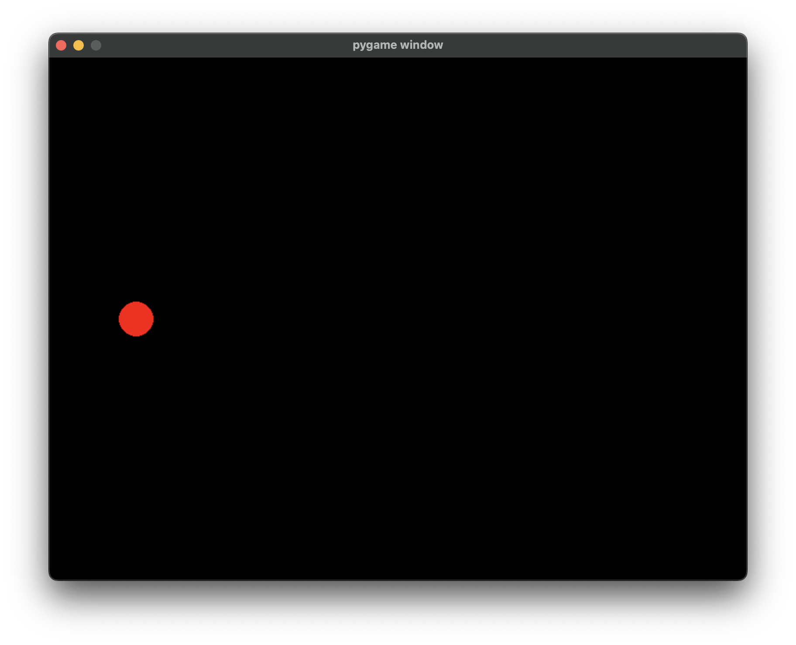

<script type="module" defer>
Doc.setChapterNb(4)
</script>

Jusqu'à présent, nous avons toujours présenté nos résultats à l'utilisateur en affichant des chaînes de caractères avec la fonction `print()`. Il est maintenant temps d'aller plus loin et de commencer à créer des **applications graphiques**. On entend par applications graphiques, des applications qui s'ouvriront dans une fenêtre et qui pourront recevoir des **événements** (clavier, souris, ...). Les fenêtres et les événements sont gérés par **le système d'exploitation**. Il faudra donc interagir avec l'OS pour réaliser ce genre d'application.

## Bibliothèque

Comme vous le savez peut-être, Python est un langage extrêmement populaire. C'est dû en partie au fait que Python est assez facile à apprendre mais aussi au fait qu'il existe énormément de **bibliothèques** pour Python.

Une bibliothèque est un ensemble de fonctionnalités que l'on peut **installer** en plus de l'installation de base de Python. Ces bibliothèques peuvent être créées par n'importe qui. Il existe plusieurs moyen de les rendre disponibles au monde entier mais le plus courant est le dépôt de paquets [PyPI](https://pypi.org).

Nous n'allons pas apprendre ici à créer et publier des paquets mais nous allons devoir en installer un. En effet, nous allons créer nos applications graphiques grâce à la bibliothèque [Pygame](https://www.pygame.org). Pygame a l'avantage d'être facile à utiliser. De plus, c'est une librairie de bas niveau qui permet de bien comprendre ce qu'il se passe dans une application graphique.

### Installation

Pour installer une bibliothèque provenant de PyPI, on utilise le module `pip` *(Pip Install Package)* de Python. Cela veut dire que nous allons utiliser l'interpréteur Python pour installer la bibliothèque. Comme toujours, l'interpréteur s'utilise en ligne de commande et nous allons donc taper la commande suivante pour installer Pygame&nbsp;:

<div class="terminal">
> python -m pip install pygame
</div>

Une fois que vous validerez la commande, vous verrez que le téléchargement de Pygame commence.

Lorsque Pygame est installé, il est possible de l'importer dans vos programmes&nbsp;:

```python
import pygame
```

## Premier programme graphique

Voici le code d'un programme simple utilisant Pygame&nbsp;:

```python
import pygame

# initialisation de pygame
pygame.init()

# demande une fenêtre de 800x600 pixels
screen = pygame.display.set_mode((800, 600))

# boucle jusqu'à ce qu'on quitte
while not pygame.event.peek(pygame.QUIT):

    # dessine un cercle rouge centré en (100, 300) de
    # rayon 20 dans le tampon caché
    pygame.draw.circle(screen, (255, 0, 0), (100, 300), 20)

    # échange les tampons
    pygame.display.flip()
```

<figure>
  
</figure>

Nous pouvons voir dans ce programme que toutes les fonctionnalités de Pygame sont accessibles en tapant "`pygame.`". On dit que `pygame` est un **espace de noms**. Les espaces de noms permettent aux différentes bibliothèques d'utiliser les mêmes noms de fonctions sans qu'il y ait de conflits entre elles.

Un autre élément important dans le programme ci-dessus est qu'il se compose essentiellement d'une boucle `while`. Les programmes en ligne de commande que nous avons réalisés jusqu'à présent, quittaient immédiatement après avoir affiché leurs résultats. Les applications graphiques ne se comportent généralement pas comme ça. Elles **continuent de tourner** tant qu'on ne ferme pas la fenêtre. Le `while` qui est ici tourne tant que l'application ne reçoit pas **l'événement `pygame.QUIT`**. Cette boucle garde donc le programme en exécution. L'événement `pygame.QUIT` peut être déclenché de plusieurs façons. L'une d'entre elles est de fermer la fenêtre de l'application. 

Avant de démarrer la boucle, on peut voir qu'il est nécessaire d'initialiser Pygame et de demander **au système d'exploitation** d'ouvrir une fenêtre.

Pour bien comprendre ce qu'il se passe dans la boucle, il faut savoir que chaque fenêtre contient au moins **deux tampons de dessin**. L'un d'eux est utilisé par la carte graphique de l'ordinateur pour afficher le contenu de la fenêtre à l'écran. Si on dessine sur ce tampon, le résultat est directement visible à l'écran. Cela peut poser problème car le dessin de l'interface d'un programme ne se fait pas instantanément et les étapes intermédiaires du dessin peuvent être visibles. C'est pour palier à ce problème qu'il existe un deuxième tampon de dessin qui est caché. L'idée est de faire le dessin de l'application sur le tampon caché et de ne l'**échanger** avec l'autre qu'au moment où le dessin est terminé. Dans la boucle, nous faisons donc deux choses&nbsp;: nous dessinons un cercle rouge dans le tampon caché de la fenêtre puis nous échangeons les tampons.

## Animations

Le programme que nous venons de réaliser redessine le cercle rouge à chaque tour de boucle exactement au même endroit. On a donc l'impression que rien ne se passe dans notre application. Nous pourrions essayer de changer la position du cercle **à chaque fois** qu'on le dessine. Cela permettrait de donner l'impression que le cercle bouge.

<figure id="anim" data-ref="code">

```python
import pygame

# initialisation de pygame
pygame.init()

# demande une fenêtre de 800x600 pixels
screen = pygame.display.set_mode((800, 600))

xCircle = 100

# boucle jusqu'à ce qu'on quitte
while not pygame.event.peek(pygame.QUIT):

    # dessine un rectangle noir pour effacer l'image
    pygame.draw.rect(screen, (0, 0, 0), pygame.Rect(0, 0, 800, 600))

    # dessine un cercle rouge centré en (xCircle, 300) de rayon 20
    pygame.draw.circle(screen, (255, 0, 0), (xCircle, 300), 20)
    
    # déplace le cercle
    xCircle += 1

    # affiche l'image qui vient d'être dessinée
    pygame.display.flip()
```

  <figcaption>Cercle animé</figcaption>
</figure>

Dans ce code, nous avons créé une variable `xCircle` qui servira pour l'abscisse du centre du cercle et nous modifions sa valeur à chaque tour de boucle. Vous pouvez aussi voir qu'avant de dessiner le cercle, nous **effaçons le tampon**. Si nous ne le faisions pas, nous verrions toujours les cercles dessinés aux tours de boucle précédents.

En fonction de votre ordinateur, il est possible que l'animation du cercle soit trop rapide. En effet, dans son état actuel, la boucle `while` peut faire plusieurs centaines de tours par seconde. C'est **inutile** d'en faire autant sachant que la plupart des écrans ne se rafraichissent que 60 fois par seconde. Nous allons donc utiliser une `Clock` de Pygame pour **temporiser** notre boucle `while`.

```python
import pygame

# initialisation de pygame
pygame.init()

# demande une fenêtre de 800x600 pixels
screen = pygame.display.set_mode((800, 600))

xCircle = 100

# la clock sert à limiter le nombre d'images par seconde
clock = pygame.time.Clock()

# boucle jusqu'à ce qu'on quitte
while not pygame.event.peek(pygame.QUIT):

    # attend qu'il se soit passé au moins 1/60
    # de seconde depuis le dernier tick
    clock.tick(60)

    # dessine un rectangle noir pour effacer l'image
    pygame.draw.rect(screen, (0, 0, 0), pygame.Rect(0, 0, 800, 600))

    # dessine un cercle rouge centré en (xCircle, 300) de rayon 20
    pygame.draw.circle(screen, (255, 0, 0), (xCircle, 300), 20)
    
    # déplace le cercle
    xCircle += 1

    # affiche l'image qui vient d'être dessinée
    pygame.display.flip()
```

L'instruction `pygame.time.Clock()` crée une valeur de type `Clock`. Ce type de valeur a été créé par la bibliothèque Pygame. Remarquez que la valeur de type `Clock` est sauvegardée dans une variable nommée `clock` *(avec un c minuscule)*. Il s'agit là d'une pratique assez courante en programmation. Une fois créée, la `clock` nous fournit la fonctionnalité `tick` qui nous permet de temporiser le programme.

La vitesse du cercle devrait maintenant être raisonnable et identique d'un ordinateur à l'autre.

## Événements

On utilise généralement la souris et le clavier pour interagir avec une application graphique. Le système d'exploitation envoie ces interactions à notre application sous forme **d'événements**.

Dans le code que nous avons écrit plus haut, nous gérions déjà un événement particulier&nbsp;: `pygame.QUIT`. Cet événement est envoyé à notre application quand l'utilisateur la quitte *(par exemple en fermant la fenêtre)*.

Tous les événements que le système d'exploitation envoie à notre application sont conservés par Pygame dans une **file d'attente**.

Pour gérer l'événement `pygame.QUIT`, nous avons utilisé la fonction `pygame.event.peek()` qui permet de vérifier si un événement d'un **type particulier** attend dans la file. La fonction `pygame.event.peek()` est surtout pratique quand on n'a qu'un type d'événement à gérer.

Pour gérer plusieurs types d'événements, nous allons utiliser une boucle pour parcourir la file d'événements. Nous allons donc transformer notre

```python
# boucle jusqu'à ce qu'on quitte
while not pygame.event.peek(pygame.QUIT):
	# ...
```
en

```python
# boucle infinie
while True
  # Boucler sur tous les events
  for event in pygame.event.get():
	  # Faire quelque chose avec l'event
```

Nous pouvons voir que la boucle principale de notre programme est devenue une boucle infinie et qu'à chacun de ses tours, nous parcourons **tous les événements** de la file avec le `for event in ...`.

Pour continuer de gérer l'événement `pygame.QUIT`, il faut faire quelque chose avec dans la boucle `for`. Ajoutons donc un `if` qui s'exécutera pour ce type d'événement&nbsp;:

```python
while True
  for event in pygame.event.get():
	  if event.type == pygame.QUIT:
      sys.exit()  # nécessite d'importer le module sys
```

Lorsque le type de l'événement est `pygame.QUIT`, on met fin au programme avec `sys.exit()`. Si l'on souhaite gérer d'autres types d'événements, il suffit d'ajouter les `if` correspondants.

### Événements clavier

Il y a deux types d'événements qui nous intéressent lorsqu'on veut gérer le clavier&nbsp;:

- `pygame.KEYDOWN` : il a lieu lorsqu'une touche est **appuyée**,

- `pygame.KEYUP` : il a lieu lorsqu'une touche est **relâchée**.

Pour savoir à **quelle touche** un événement clavier se rapporte, il faut inspecter `event.key`.

Voici l'exemple de notre cercle rouge qui bouge. Lorsqu'on appuie sur espace (`event.key == pygame.K_SPACE`), il change de sens.

```python
import pygame
import sys

pygame.init()

screen = pygame.display.set_mode((800, 600))

clock = pygame.time.Clock()

xCircle = 100
vxCircle = 1

while True:
	clock.tick(60)
	for event in pygame.event.get():
		if event.type == pygame.QUIT:
			sys.exit()
		# Change la vitesse de la balle si on appuie sur espace
		if event.type == pygame.KEYDOWN and event.key == pygame.K_SPACE:
			vxCircle = -vxCircle
		
	pygame.draw.rect(screen, (0, 0, 0), pygame.Rect(0, 0, 800, 600))

	pygame.draw.circle(screen, (255, 0, 0), (xCircle, 300), 20)
	
	# déplace le cercle
	xCircle += vxCircle

	pygame.display.flip()
```

### Événements souris

Nous allons voir trois types d'événements souris&nbsp;:

- `pygame.MOUSEBUTTONDOWN` : il a lieu quand on **enfonce** un bouton de la souris.

- `pygame.MOUSEBUTTONUP` : il a lieu quand on **relâche** un bouton de la souris.

- `pygame.MOUSEMOTION` : il a lieu lorsqu'on **déplace** la souris.

Pour les événements concernant les boutons de la souris, on peut consulter `event.button` pour savoir de **quel bouton** il s'agit. La valeur de `event.button` sera 1, 2 ou 3 en fonction du bouton pressé (gauche, milieu ou droit).

Les événements de bouton contiennent aussi **la position** de la souris au moment du clic. `event.pos` contient les coordonnées `(x, y)` de la souris au moment de l'événement.

Les événements `pygame.MOUSEMOTION` contiennent aussi la position de la souris dans `event.pos`. Ils contiennent également la **différence de position** depuis l'événement de déplacement précédent dans `event.rel`.

A titre d'exemple, on pourrait faire en sorte que le cercle rouge de notre programme précédent suive les déplacements **horizontaux** de la souris&nbsp;:

```python
import pygame
import sys

pygame.init()

screen = pygame.display.set_mode((800, 600))

clock = pygame.time.Clock()

xCircle = 100

while True:
	clock.tick(60)
	for event in pygame.event.get():
		if event.type == pygame.QUIT:
			sys.exit()
		# Change la position de la balle quand la souris se déplace
		if event.type == pygame.MOUSEMOTION:
			xCircle = event.pos[0]
		
	pygame.draw.rect(screen, (0, 0, 0), pygame.Rect(0, 0, 800, 600))

	pygame.draw.circle(screen, (255, 0, 0), (xCircle, 300), 20)

	pygame.display.flip()
```

## Documentation

La bibliothèque `pygame` offre, bien entendu, beaucoup **d'autres possibilités**. Par exemple, nous n'avons vu que les fonctions de dessin `pygame.draw.circle` et `pygame.draw.rect` mais il en existe bien d'autres. Pour les découvrir, vous pouvez vous rendre sur [la documentation officielle de Pygame](https://www.pygame.org/docs/).

## Exercices

1. Écrire un programme qui demande un nombre de côtés et qui affiche un polygone régulier avec le nombre de côtés demandé. La fonction [`pygame.draw.line()`](https://www.pygame.org/docs/ref/draw.html#pygame.draw.line) peut vous aider. *Indice: un polygone régulier est inscrit dans un cercle, vous devriez connaitre les équations paramétriques d'un cercle*.

1. Écrire un programme qui dessine une spirale.

1. A partir du <span data-link="anim">code</span>, faites bouger le cercle en x et en y et faites le rebondir sur les bords de la fenêtre.

1. Même exercice que le précédent, mais le programme demande un nombre de cercles à l'utilisateur et anime ensuite le nombre de cercles demandé.

1. Écrire un programme qui permet de cliquer dans une fenêtre et qui dessine des lignes entre chaque point cliqué.
