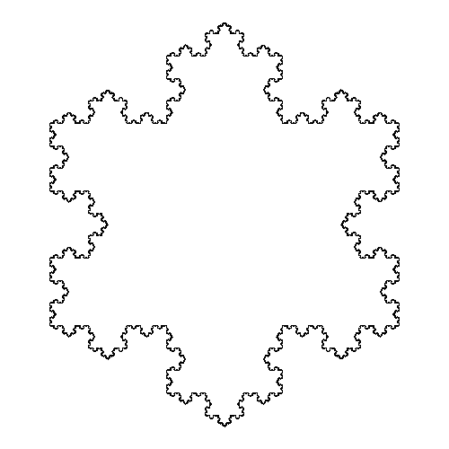

Une fonction est un **sous-programme** à qui on fournit des valeurs *(les valeurs d'entrée)* et qui peut produire un résultat *(une valeur de sortie)*.

Nous avons déjà utilisé la fonction `print().` Cette fonction est une fonction prédéfinie du Python. Elle prend un paramètre *(une valeur d'entrée, la valeur à afficher)* et ne renvoie **pas de résultat**. Par contre, elle a bien une utilité puisqu'elle affiche la valeur de son paramètre à l'écran.

Le Python contient déjà beaucoup de fonctions prédéfinies mais l'objectif de ce chapitre est de voir comment **ajouter** de nouvelles fonctions au langage. L'intérêt de créer ses propres fonctions est double. Premièrement, lorsqu'un programme devient un peu long, il est possible et même fortement recommandé de le **diviser** en plusieurs fonctions pour que la complexité de chaque partie *(chaque fonction)* reste maitrisable. Deuxièmement, il arrive régulièrement qu'un programme utilise plusieurs fois la même séquence d'instructions. Là encore, les fonctions permettent de **ne pas devoir écrire plusieurs fois la même chose**.

Pour définir une fonction, on utilise l'instruction composée `def` :

```python
def nom_de_la_fonction:
  bloc_d_instructions
```

Le code ci-dessus constitue la définition de la fonction, c'est-à-dire, l'ajout de la fonction au langage. Définir une fonction ne sert à rien si on n'utilise pas la fonction quelque part. Pour utiliser la fonction (on dit souvent « appeler » la fonction), on utilise son nom suivit des parenthèses contenant les éventuels paramètres comme on l'a fait à chaque fois qu'on a utilisé la fonction `print()`. Il est important de bien différencier la définition de la fonction et le ou les appels à la fonction.

## Fonctions sans paramètre et sans valeur de retour

La fonction dont la définition est la suivante&nbsp;:

```python
def hello():
  print('Hello World!')
```

affiche `Hello World!`.

Elle ne prend aucun paramètre *(les parenthèses sont vides)* et affichera donc exactement la même chose à chaque fois qu'elle sera utilisée.

Elle ne renvoie aucune valeur. Cela veut dire que ça n'a **aucun intérêt** d'écrire `a = hello()` (quelle valeur pourrait bien se retrouver dans a?). Cela n'empêche pas la fonction d'être utile puisqu'elle affiche un message.

## Fonctions avec un paramètre et sans valeur de retour

L'utilité de la fonction `hello()` est quand même très limitée. Elle ne sait faire qu'une chose très précise : afficher `Hello World!`.

On peut facilement la rendre plus utile en utilisant un **paramètre**. Celui-ci sera un nom de personne à saluer.

Voici la définition de la fonction modifiée :

```python
def hello(name):
  print('Hello ' + name + '!')
```

et voici quelques appels avec les résultats correspondants :

```python
hello('LUR')   # affichera Hello LUR!
hello('1BA')   # affichera Hello 1BA!
hello('ECAM')  # affichera Hello ECAM!
```

## Fonctions avec plusieurs paramètres et sans valeur de retour

Pouvoir passer un paramètre à une fonction est très utile mais il serait intéressant de pouvoir en passer **plusieurs**. Nous pourrions passer l'heure de la journée pour adapter le message de salutation&nbsp;:

```python
def hello(name, hour):
  msg = 'Bonjour'
  if hour > 12:
    msg = 'Bon après-midi'
  if hour > 16:
    msg = 'Bonsoir'
  if hour > 22:
    msg = 'Bonne nuit'

  print(msg + ' ' + name + '!')
```

Il est donc maintenant possible d'appeler la fonction comme suit&nbsp;:

```python
hello('Quentin', 17)   # affichera Bonsoir Quentin!
```

Par contre, il n'est plus possible de l'appeler en ne mentionnant qu'un seul paramètre comme avant. Il serait intéressant de pouvoir appeler la fonction des deux manières : soit on ne mentionne qu'un paramètre et on utilise `Bonjour`, soit on mentionne deux paramètres et le message est adapté à l'heure. Et bien c'est possible et relativement simple à obtenir. Il suffit pour cela de donner des **valeurs par défaut** aux paramètres :

```python
def hello(name, hour=10):
  msg = 'Bonjour'
  if hour > 12:
    msg = 'Bon après-midi'
  if hour > 16:
    msg = 'Bonsoir'
  if hour > 22:
    msg = 'Bonne nuit'

  print(msg + ' ' + name + '!')
```

Avec cette définition, il est possible d'appeler la fonction des deux façons&nbsp;:

```python
hello('Quentin', 17)        # affichera Bonsoir Quentin!
hello('Lurkin')             # affichera Bonjour Lurkin!
hello(hour=15, name='ECAM') # affichera Bon après-midi ECAM!
```

Comme on le voit dans le troisième appel, il est possible de **nommer explicitement** les paramètres auxquels on veut donner une valeur et donc de les mentionner dans un autre ordre si on le souhaite.

## Fonctions avec valeur de retour

Les fonctions que nous avons écrites jusqu'à présent ne renvoient pas de valeur. C'est-à-dire que ça n'a aucun sens d'écrire `a = hello(...)` (vous pouvez essayer de faire `print(a)` après avoir fait `a = hello('LUR')`). Il est cependant possible pour une fonction de **renvoyer** une valeur en utilisant le mot-clé `return`. Voici un exemple avec la fonction valeur absolue&nbsp;:

```python
def abs(x):
  if x < 0:
    res = −x
  else :
    res = x
  return res
```

Cette fonction renvoie la valeur absolue du paramètre. On peut donc écrire&nbsp;:

```python
a = abs(-2)
print(a)    # affichera 2
```

Ici, la valeur absolue de -2 est mise dans `a` puis on affiche la valeur de `a`.

Il est important ici de constater qu'une fonction qui renvoie une valeur peut être utilisée partout où une valeur peut être utilisée. En particulier, elle peut être utilisée à l'intérieur d'une expression ou comme paramètre d'une autre fonction :

```python
print(3 ∗ abs(−2) − 1)   # affichera 5
```

## Utilité des fonctions

### Éviter les répétitions

La première utilité des fonctions est bien évidemment d'**éviter de devoir écrire plusieurs fois une même portion de code**. On conçoit aisément que si, à chaque fois qu'on veut calculer une valeur absolue, il faut réécrire le code de la fonction `abs()`, cela va vite devenir lourd.

Outre le fait de gagner du temps et de la place (moins de lignes de code), le fait de ne pas devoir répéter du code a plusieurs avantages :

- lorsqu'on doit écrire plusieurs fois la même chose, on a toutes les chances de se tromper à un moment ou à un autre (même en faisant des « copier/coller »).
- il est particulièrement pénible, lorsqu'une modification doit être apportée, de **devoir répéter cette modification** à plusieurs endroits du programme. De plus, on risque là aussi de se tromper ou d'oublier une des répétitions.

### Structurer le programme

Les fonctions peuvent, cependant, être utiles même si on ne les appelle qu'une seule fois. Observons le programme suivant&nbsp;:

```python
n=1
nb = 10
while nb > 0:
  divisors = 0
  d=1
  while d <= n:
    if n % d == 0:
      divisors += 1
    d += 1
  if divisors == 2:
    print(n)
    nb -= 1
  n += 1 
```

Ce programme ne comporte aucune fonction. Il sert à afficher les 10 premiers nombres premiers. Si on examine le code, on se rend compte qu'il contient deux boucles imbriquées, ce qui fait de lui un programme plutôt **complexe**. Lorsqu'on écrit un programme de ce genre, il est très facile de faire une erreur quelque part et il est, en général, assez pénible de la retrouver.

Examinons maintenant le même programme **découpé en fonctions**&nbsp;:

```python
def isDivisor(d, n):
  return n % d == 0

# n strictement supérieur à 1 (1 n'est jamais premier)
def isPrime(n):
  d=2
  while not isDivisor(d, n):
    d += 1
  return d == n

def printPrimes(nb):
  n=2
  while nb > 0:
    if isPrime(n):
      print(n)
      nb -= 1
    n += 1

nb_prime = 10
printPrimes(nb_prime)
```

Chaque fonction n'est appelée qu'une seule fois. L'intérêt n'est donc pas d'éviter des répétitions de code. Même si le programme global semble plus long, chaque fonction individuelle est **courte et simple**, ce qui en facilite l'écriture et la compréhension. De plus, chaque fonction peut être testée individuellement, ce qui simplifiera la recherche d'erreur. Ceci nous amène au plus important conseil de ce cours :

<p class="big">Il vaut mieux beaucoup de petites fonctions que peu de grandes fonctions !</p>

## Variables locales et globales

Dès qu'on commence à utiliser des fonctions, la notion de variables **locales** et **globales** entre en jeu.

Une variable globale est une variable définie pour l'ensemble du programme tandis qu'une variable locale est définie pour une fonction particulière. Dans notre programme d'affichage de nombres premiers dans sa version « découpée en fonctions », il y a une variable globale : `nb_prime`. On reconnait qu'elle est globale car elle est définie **en dehors de toute fonction**. Elle est définie pour l'ensemble du programme et est donc accessible même à l'intérieur des fonctions.

Les variables locales, quant à elles, sont définies **à l'intérieur d'une fonction** : par exemple, la variable `d` de la fonction `isPrime()`. Ce type de variable n'est accessible **qu'à l'intérieur** de la fonction où elle est définie. L'avantage de ce cloisonnement de variables est que l'on peut **réutiliser** le même nom de variable dans plusieurs fonctions : par exemple on peut voir qu'il y a une variable locale nommée `d` dans la fonction `isDivisor()`. La variable `d` de la fonction `isPrime()` et la variable `d` de la fonction `isDivisor()` sont deux variables complètement indépendantes. Si les variables locales n'étaient pas cloisonnées à l'intérieur de leurs fonctions, il faudrait, à chaque fois qu'on veut utiliser une nouvelle variable, trouver un nom qui n'a pas encore été utilisé. Cela peut très vite devenir un problème lorsque le programme devient un peu long. Le cloisonnement nous permet donc d'écrire les fonctions sans se soucier de ce qui est fait dans les autres.

```python
def fct():
  a = 20

fct()
print(a)
```

Le programme ci-dessus vous affichera&nbsp;:

<div class="terminal">
NameError: name 'a' is not defined
</div>

Par contre une variable globale est accessible dans les fonctions&nbsp;:

```python
a = 20

def fct():
  print(a)

fct()
```

Ce programme affichera bien 20.

Que se passe-t-il lorsqu'une variable locale a le même nom qu'une variable globale ?

```python
a=20

def fct():
  a = 30
  print('dans fct:', a)

fct()
print('hors fct:', a)
```

Le programme ci-dessus affichera&nbsp;:

<div class="terminal">
30
20
</div>

Au début, nous définissons une variable globale `a`. Ensuite, dans la fonction, nous donnons une nouvelle valeur à `a` mais, en faisant cela, nous ne modifions pas la variable globale. En effet, c'est une variable locale nommée `a` qui est créée et qui prend la valeur `30`. Le `print()` de la fonction affiche donc la valeur de la variable locale. Cette variable locale masque la variable globale portant le même nom. Pour finir, le deuxième `print()` affiche la valeur de la variable globale qui est bien restée à `20`.

On remarque donc qu'il n'est pas possible de modifier une variable globale de l'intérieur d'une fonction. En fait, il s'agit ici du comportement par défaut des variables globales. Il est possible de modifier ce comportement en utilisant l'instruction `global`&nbsp;:

```python
a = 20

def fct():
  global a
  a = 30

fct()
print(a)
```

Le programme ci-dessus affichera `30`. Le fait d'avoir déclaré `a` comme globale dans la fonction permet d'écrire dans la variable globale sans créer de variable locale.

<p class="big">Il est important de préciser ici que l'usage de l'instruction <code>global</code> est considéré comme une mauvaise pratique et qu'il faut absolument éviter de l'utiliser.</p>

**Petite remarque supplémentaire** : si vous définissez une variable locale dans une fonction, elle est définie dans toute la fonction, **même avant sa définition**. Le code suivant donne donc une erreur&nbsp;

```python
a=20

def fct():
  print('avant la définition de a:', a)
  a = 30

fct()
print('hors fct:', a)
```
<div class="terminal">
UnboundLocalError: cannot access local variable 'a' where it is
 not associated with a value
</div>

Comme une variable `a` est définie dans la fonction, le `print()` à la première ligne de la fonction `fct()` tente d'en utiliser la valeur. Mais à ce moment-là de la fonction, la variable `a` n'a pas encore reçu de valeur. On obtient donc le message d'erreur `UnboundLocalError`.

## Les fonctions récursives

En programmation, rien n'interdit à une fonction de **s'appeler elle-même**. Les fonctions qui s'appellent elles-mêmes sont appelées des **fonctions récursives**.

Voici un exemple avec la fonction factorielle&nbsp;:

```python
def fact(n):
  if n > 1:
    return n ∗ fact(n−1)
  else:
    return 1
```

On voit ici qu'il y a un appel récursif dans la fonction. Il est bien sûr extrêmement important qu'une fonction récursive ne se rappelle pas **éternellement**. Pour cela, une fonction récursive comporte toujours un **cas de base**, c'est-à-dire, un cas où la valeur de fonction peut être déterminée sans appel récursif. Dans le cas de la fonction factorielle, il s'agit du cas `n <= 1`. Il faut également que la suite d'appels récursifs finisse toujours par attendre le cas de base.

## Les modules

Lorsqu'on crée des fonctions qui peuvent être utiles dans plusieurs programmes ou que le fichier du programme devient très long, il est intéressant de créer des modules.

Ces modules sont semblables au module `math` que nous avons déjà utilisé auparavant. Ils contiennent des définitions de fonctions et peuvent être importés (`from ... import ...`) dans un programme qui pourra alors utiliser ces fonctions.

### Le module `turtle`

Avant de créer nos propres modules, nous allons examiner un des modules **prédéfinis** du Python qui nous servira par la suite.

Le module `turtle` sert à réaliser des dessins en faisant se déplacer une « tortue ». Voici un exemple :

```python
from turtle import *

for i in range(4):
  forward(100)
  left(90)

done()
```

La première ligne sert bien sûr à importer toutes les fonctions du module `turtle`.

Vient ensuite une boucle qui effectue 4 tours. A chacun d'entre eux, la « tortue » avancera de 100 pixels et tournera de 90° vers la gauche. Durant tous ces déplacements, la « tortue » trace une ligne derrière elle, ce qui aboutit au dessin suivant :

<figure></figure>

Dans l'image ci-dessus, la flèche représente la « tortue ».

Voici quelques fonctions utiles pour manipuler la « tortue » :

<table>
  <thead>
    <tr>
      <th>Fonctions</th>
      <th>Descriptions</th>
    </tr>
  </thead>
  <tbody>
    <tr>
      <td><code>forward(distance)</code></td>
      <td>Avancer d'une distance donnée</td>
    </tr>
    <tr>
      <td><code>backward(distance)</code></td>
      <td>Reculer d'une distance donnée</td>
    </tr>
    <tr>
      <td><code>up()</code></td>
      <td>Relever le crayon (pour pouvoir avancer sans dessiner)</td>
    </tr>
    <tr>
      <td><code>down()</code></td>
      <td>Abaisser le crayon</td>
    </tr>
    <tr>
      <td><code>color(couleur)</code></td>
      <td>Changer la couleur du crayon. <code>couleur</code> peut être un nom de couleur en anglais (<code>'red'</code>, <code>'blue'</code>, ...)</td>
    </tr>
    <tr>
      <td><code>left(angle)</code></td>
      <td>Tourner à gauche d'un angle donné (en degrés).</td>
    </tr>
    <tr>
      <td><code>right(angle)</code></td>
      <td>Tourner à droite d'un angle donné (en degrés).</td>
    </tr>
    <tr>
      <td><code>width(épaisseur)</code></td>
      <td>Changer l'épaisseur du crayon.</td>
    </tr>
    <tr>
      <td><code>goto(x, y)</code></td>
      <td>Aller à l'endroit de coordonnées x, y</td>
    </tr>
    <tr>
      <td><code>reset()</code></td>
      <td>Effacer tout</td>
    </tr>
    <tr>
      <td><code>done()</code></td>
      <td>Permet que la fenêtre de résultat reste ouverte une fois le dessin terminé.</td>
    </tr>
  </tbody>
</table>

### Notre propre module

Pour écrire un module, il suffit de créer un script contenant des définitions de fonctions. Comme exemple, nous allons créer un module nommé `shape` qui contiendra des fonctions permettant de dessiner des formes avec la « tortue ».

Nous créons donc un fichier nommé `shape.py` contenant le code suivant&nbsp;:

```python
from turtle import ∗

def square(cote, couleur):
  color(couleur)
  for i in range(4):
    forward(cote)
    right(90)
```

On peut ensuite créer un programme qui utilise notre module&nbsp;:

```python
from shape import ∗

up()
goto(−150, 50)

for i in range(10):
  down()
  square(25, 'red') 
  up()
  forward(30)

done()
```

Pour que le programme puisse trouver le module `shape`, il faut que les deux fichiers soient **dans le même répertoire**.

<figure></figure>

### La variable `__name__`

La variable globale `__name__` est définie dans chaque fichier Python. Elle contient un string égal au nom du module. Dans le programme principal (le fichier lancé avec la commande `python`), elle vaut `"__main__"`.

Pour avoir une partie d'un module qui ne s'exécute que quand on le lance comme un programme (quand on le lance directement avec la commande `python`), on teste souvent la variable `__name__`&nbsp;:

```python
# à la fin du fichier shape.py
if __name__ == "__main__":
    square(10, 'blue')
    done()
```

Le code ci-dessus permet de tester la fonction `square` en lançant le fichier shape.py&nbsp;:

<div class="terminal">
> python shape.py
</div>

Et cela affichera le carré bleu de côté 10.

Mais lorsqu'on lancera le fichier qui importe `shape` et qui dessine 10 carrés rouges, le contenu du `if __name__ == "__main__":` ne sera pas exécuté et le carré bleu ne sera pas affiché.

## Exercices

1. Écrire une fonction nommée `unique()` qui reçoit une liste en paramètre et qui renvoie une nouvelle liste contenant une fois chaque élément de la liste d'entrée, dans l'ordre d'apparition de la 1ère occurrence.

1. Écrire une fonction nommée `zipper()` qui reçoit 2 listes en paramètres et qui renvoie une liste contenant les éléments des deux listes alternés. Attention, les deux listes peuvent être de tailles différentes.

1. Écrire une fonction nommée `fibo()` qui prend un entier `n` en paramètre et qui renvoie le `n`<sup>ième</sup> terme de la suite de Fibonacci. La suite de Fibonacci est une suite où chaque terme est égal à la somme des deux termes précédents. Les deux premiers termes sont égaux à 1. Les termes sont numérotés à partir de 1.

1. Écrire une fonction nommée `pgcd()` qui prend deux entiers en paramètres et renvoie le "Plus Grand Commun Diviseur". Le PGCD peut être calculé en utilisant les relations suivantes: $$ "pgcd"(a, b) = cases( a &"si" b = 0, "pgcd"(b, a % b) &"sinon") $$

1. Écrire un programme qui affiche la figure suivante&nbsp;:
<figure></figure>
Cette figure est composée de trois courbes construites selon le principe suivant&nbsp;:
<figure></figure>
Vous pouvez utiliser <code>turtle</code> ou <code>pygame</code>.

1. Écrire un programme qui résout le problème des Tours de Hanoï.

    <figure></figure>

    Le problème consiste en trois poteaux (A, B et C) et un certain nombre de disques de différentes tailles, empilés par ordre décroissant de taille sur le poteau A. L'objectif est de déplacer tous les disques du poteau A vers le poteau C, en suivant les règles suivantes :

    - Vous ne pouvez déplacer qu'un disque à la fois.
    - Un disque ne peut être placé que sur un autre disque plus grand ou sur un poteau vide.

    Votre programme doit demander le nombre de disques à déplacer `n` et afficher la séquence de mouvements nécessaires pour résoudre le problème, en respectant les règles ci-dessus.

    Votre programme doit afficher chaque mouvement sous la forme "Déplacez un disque de A vers C".

    Exemple de sortie pour `n = 3`&nbsp;:

    <div class="terminal">
    Déplacez un disque de A vers C
    Déplacez un disque de A vers B
    Déplacez un disque de C vers B
    Déplacez un disque de A vers C
    Déplacez un disque de B vers A
    Déplacez un disque de B vers C
    Déplacez un disque de A vers C
    </div>

    Ce qui correspond aux étapes suivantes&nbsp;:

    <figure></figure>
