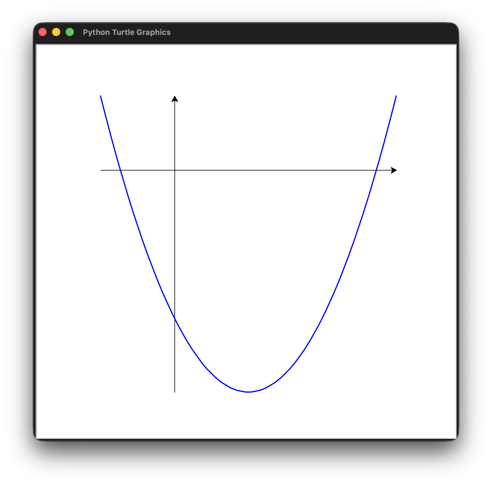
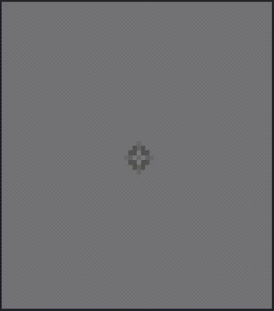

1. Créez une fonction `append()` qui prend un tuple et une valeur à ajouter à sa
   fin. Comme les tuples sont non modifiables, le tuple original ne peut pas
   être modifié mais il est possible de renvoyer un nouveau tuple contenant les
   éléments du tuple de départ et celui à ajouter.
1. Créez un petit module de manipulation de vecteurs 2D. Dans ce module, un
   vecteur sera un tuple de 2 `floats`. Le module devra contenir les fonctions
   suivantes:
   - `add()`: renvoie la somme de 2 vecteurs.
   - `scale()`: renvoie le produit d'un vecteur par un `float`.
   - `length()`: renvoie la norme d'un vecteur.
   - `dot()`: renvoie le produit scalaire de 2 vecteurs.
   - `normalize()`: renvoie le vecteur unitaire d'un vecteur.
1. Écrire un programme qui utilise le module `turtle` pour dessiner une spirale.
1. Utilisez `turtle` pour créer une fonction nommée `plot()` qui reçoit une
   fonction `f(x)` et qui affiche le graphique de cette fonction entre deux
   bornes.

   ```python
   # Exemple d'utilisation
   def f(x):
     return x**2 - 2*x - 2

   plot(f, -1, 3)
   ```

   

   _Remarque: En plus des fonctions de vues au cours, les fonctions `width()`,
   `stamp()` et `hideturtle()` du module `turtle` peuvent vous aider à améliorer
   le style de votre graphique_

## Défis {.nocount}

1. Faisons un programme avec [stge.py](../../slides/slides4/stge.py) qui simule
   la propagation d'ondes à la surface d'un liquide.

   

   Nous utiliserons la fonction `pixels()` de `stge` pour afficher une grille de
   pixels de couleurs. Les couleurs (des niveaux de gris) représenteront des
   hauteurs d'une surface de liquide.

   La fonction `pixels()` prend une liste de liste (grille 2D) de pixels. Un
   pixel est un tuple de 3 entiers `(rouge, vert, bleu)` entre 0 et 255. Pour
   obtenir des niveaux de gris, les trois composantes doivent être égales. Vous
   pouvez donc afficher 256 niveaux de gris différents.

   Au repos, toutes les hauteurs sont à zéro. Elles oscilleront dans les
   positifs et dans les négatifs au cours de la simulation.

   Dans la formule suivante, pour le pixel `(x, y)`, nous appelons $C_(x,y)$ la
   hauteur à la frame courante, $P_(x, y)$ la hauteur de à la frame précédente
   et $N_(x, y)$ la hauteur à la frame suivante:

   $$
   N_(x, y) = 2C_(x, y) - P_(x, y) + c^2 Delta t^2(C_(x-1, y) +
   C_(x+1, y) + C_(x, y-1) + C_(x, y+1) - 4C_(x, y))
   $$

   $c$ représente la vitesse de propagation de l'onde et $Delta t$ l'intervalle
   de temps entre deux frames, $1/30$ de seconde par défaut.

   Pour que la simulation reste stable nous vous conseillons de ne pas utiliser
   une trop grande valeur de $c$ et d'appliquer une légère atténuation:

   $$N_(x, y) = 0.99 * N_(x, y)$$

   Pour les bords, vous aurez besoin d'une hauteur de voisin se trouvant en
   dehors de la grille. Dans ces cas là, vous pouvez réutiliser la hauteur au
   bord:

   $$C_(-1, y) = C_(0, y)$$

   Pour interagir avec la surface, imposez la hauteur d'un pixel à l'appui d'une
   touche.
