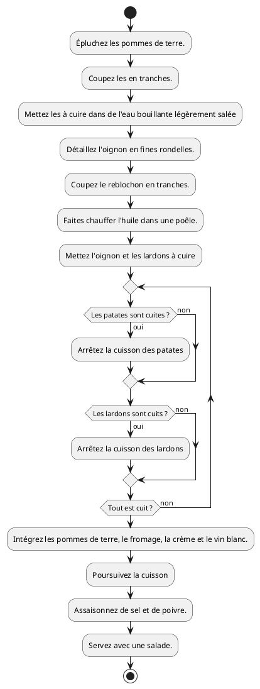
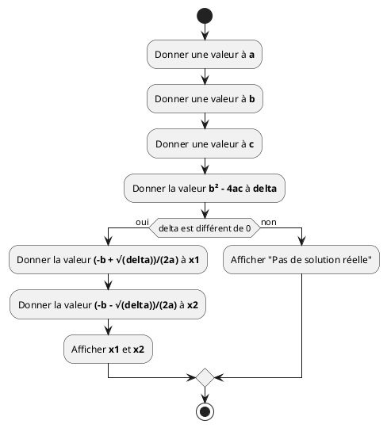
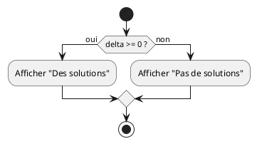
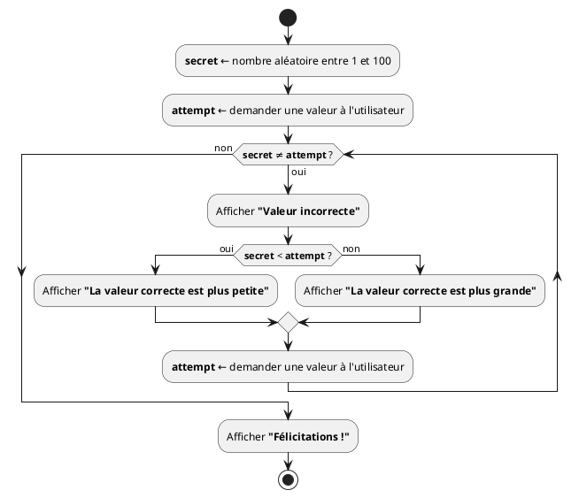
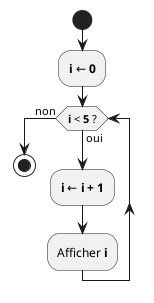
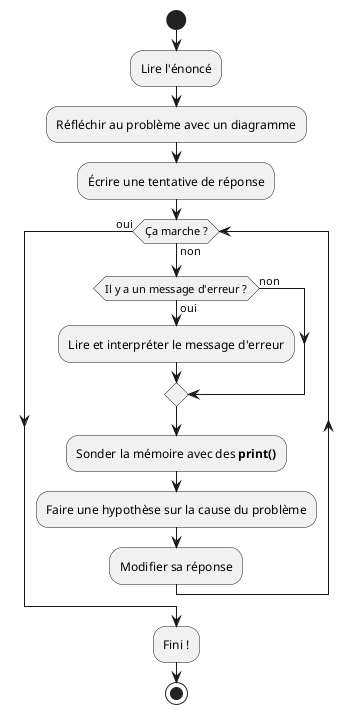
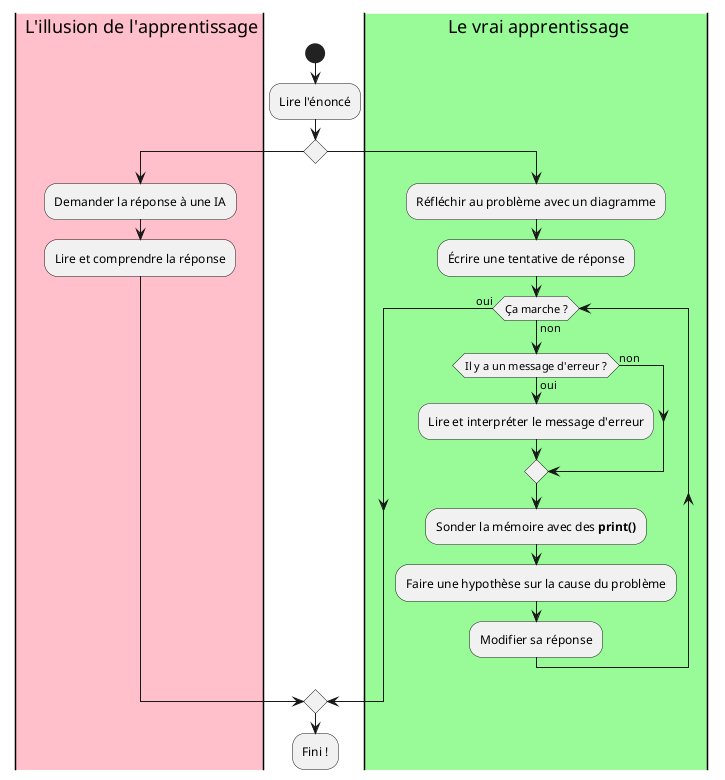

## Informations générales

- 7h30 de **théorie**, 7h30 d'**exercices**
- Les documents utilisés sont sur

  **<https://quentin.lurkin.xyz/courses/python1ba/>**

- Évaluation :
  - Examen écrit de type **QCM (100%)**

## Qu'est-ce qu'un programme ?

- Une **suite d'opérations** pour obtenir un **résultat**
- Les opérations sont exécutées
  - **une à la fois**,
  - **l'une après l'autre**.
- Comme une recette de cuisine

```python {.build}
from script import recipe_step, slide

steps = [
  "Épluchez les pommes de terre.",
  "Coupez les en tranches.",
  "Mettez les à cuire dans de l'eau bouillante légèrement salée pour 10 à 15 min.",
  "Détaillez l'oignon en fines rondelles.",
  "Coupez le reblochon en tranches.",
  "Faites chauffer l'huile dans une poêle.",
  "Mettez l'oignon et les lardons à cuire pour 5 min.",
  "Intégrez les pommes de terre, le fromage, la crème et le vin blanc.",
  "Poursuivez la cuisson ± 5 min à feu modéré.",
  "Assaisonnez de sel et de poivre.",
  "Servez avec une salade.",
]

wp = ["./img/Taques_Seule.png", "./img/Patates.png", "./img/Oignons.png", "./img/Lardons.png", "./img/Reblochon.png"]

tbl = []

title = "Recette de cuisine"

__output__ = []
__output__ += slide(title, recipe_step(steps, [], wp, tbl))
wp[1] = "./img/Patates_Épluchées.png"
__output__ += slide(title, recipe_step(steps, [0], wp, tbl))
wp[1] = "./img/Patates_En_Tranches.png"
__output__ += slide(title, recipe_step(steps, [1], wp, tbl))
del(wp[1])
wp[0] = "./img/Cuisson_Patates.png"
__output__ += slide(title, recipe_step(steps, [2], wp, tbl))
wp[1] = "./img/Oignons_En_Tranches.png"
__output__ += slide(title, recipe_step(steps, [3], wp, tbl))
wp[3] = "./img/Reblochon_En_Tranches.png"
__output__ += slide(title, recipe_step(steps, [4], wp, tbl))
wp[0] = "./img/Poêle_Chauffe.png"
__output__ += slide(title, recipe_step(steps, [5], wp, tbl))
wp[0] = "./img/Cuisson_Lardons_Oignons.png"
del(wp[1])
del(wp[1])
__output__ += slide(title, recipe_step(steps, [6], wp, tbl))
wp[0] = "./img/Cuisson_Lardons_Oignons_Patates_Reblochon.png"
del(wp[1])
__output__ += slide(title, recipe_step(steps, [7], wp, tbl))
wp[0] = "./img/Tartiflette_Cuite.png"
__output__ += slide(title, recipe_step(steps, [8], wp, tbl))
__output__ += slide(title, recipe_step(steps, [9], wp, tbl))
wp[0] = "./img/Taques_Seule.png"
tbl.append("./img/Plat_Tartiflette.png")
tbl.append("./img/Salade.png")
__output__ += slide(title, recipe_step(steps, [10], wp, tbl))
```

## Recette de cuisine

- Chaque opération **modifie l'état** de l'espace de travail
- Le résultat de chaque opération **dépend de l'état** de l'espace de travail

## Diagramme d'activités

:::row

::::span6



::::

::::{.span6}

- Un diagramme d'activités est une représentation graphique d'une séquence
  d'opérations.

- Il peut contenir des embranchements et des boucles.

- Il est très utile pour représenter un programme.

- C'est un support intéressant pour parler d'un programme avec quelqu'un
  d'autre.

::::

:::

## Diagramme d'un programme

- **Algorithme** de résolution d'une équation du second degré:



## RAM _(Random Access Memory)_

- **RAM** ⇒ L'**espace de travail** pour un programme informatique
- **Variable** ⇒ Morceau de mémoire (RAM)
  - Auquel on a donné un **nom**
  - Pouvant sauver une **valeur**
- Le signe `=` sert à **assigner** une valeur à une variable
  - ⚠️ Il **ne** définit **pas** une identité comme en mathématiques ⚠️
  - Il donne l'**instruction** de **stocker** la **valeur** de l'expression se
    trouvant à sa droite dans la **variable** dont le nom est à sa gauche
- Une **expression** est un morceau de code qui produit une **valeur**

## Types de valeurs

- Les entiers (`int`)

  ```python
  a = 42           # expression littérale
  a = 2 * 21       # expression arithmétique
  ```

- Les nombres à virgule flottante (`float`)

  ```python
  a = 0.42         # littéral
  a = 42e-2        # littéral en notation scientifique
  a = 1 / 2        # expression arithmétique
  ```

## Types de valeurs

- Les chaînes de caractères (`string`)

  ```python
  a = "hello"      # littéral
  b = 2 * a + "!!" # expression
  ```

- Les booléens (`bool`)

  ```python
  a = True         # littéral
  b = a or 5 < 0   # expression booléenne
  ```

- **Et bien d'autres...**

```python {.build}
# Ce script génère plusieurs slides
from script import code_step, loadfile, slide
title = "Variables, expressions et valeurs"
src = """
a = 42     # expression littérale
b = a      # lecture d'une variable
a = 3 + 4  # calcul
b = a
a = a + 1
print(a)   # Affiche la valeur de a
"""
ram = {"a": 42}
__output__ = []
__output__ += slide(title, code_step(src, [1], ram))
ram["b"] = 42
__output__ += slide(title, code_step(src, [2], ram))
ram["a"] = 7
__output__ += slide(title, code_step(src, [3], ram))
ram["b"] = 7
__output__ += slide(title, code_step(src, [4], ram))
ram["a"] = 8
__output__ += slide(title, code_step(src, [5], ram))
__output__ += slide(title, code_step(src, [6], ram, "8"))
```

## Opérations sur les nombres

- Les opérateurs suivants sont définis pour **les valeurs numériques**

  ```python
  a = 1 + 2    # somme de deux nombres
  a = 1 - 2    # différence de deux nombres
  a = 2 * 2    # produit de deux nombres
  a = 4 ** 2   # puissance de deux nombres
  a = 4 / 2    # quotient de deux nombres
  a = 5 // 2   # division entière
  a = 5 % 2    # modulo, reste de la division entière
  ```

## `if` en Python

:::row

::::span6

En C (Arduino)

```c
if(delta >= 0) {
    digitalWrite(13, HIGH);
}
else {
    digitalWrite(13, LOW);
}
```

::::

::::span6

En Python

```python
if delta >= 0:
    print("Des solutions")
else:
    print("Pas de solutions")
```

::::

:::



## Conditions

- Le `if` permet d'exécuter un bloc seulement si une condition est remplie

  ```python
  note = -5
  if note < 0:
    print("notes négatives interdites !")
    note = 0
  if note > 20:
    print("notes limitées à 20 !")
    note = 20
  print('note =', note)
  ```

- **Instruction bloc** : L'entête fini par `:` et le bloc est **indenté** à
  droite

- Tabulations ou espaces pour l'indentation, **doit être identique pour toutes
  les lignes du bloc**

## Écrire la condition

- Une condition est une **expression à valeur booléenne**
- **Comparaison** de deux valeurs :
  - Égalité (`==`) et différence (`!=`)
  - Strictement plus grand/petit (`>`, `<`)
  - Plus grand/petit ou égal (`>=`, `<=`)

```python
a = 12 == 3 * 4      # a vaut True
b = "Eat" > "Drink"  # b vaut True
c = a != b           # c vaut False
```

## Sinon (`else`)

- Il est possible de définir un bloc à exécuter si la condition est fausse avec
  l'instruction `else` (sinon)

```python
a = -5
if a < 0:
   print("a est négatif")
else:
   print("a est positif")
```

```python {.build}
# Ce script génère plusieurs slides
from script import code_step, loadfile, slide
title = "Second degré en Python"
src = loadfile("./bazooka.py")
ram = {"a": 1}
__output__ = []
__output__ += slide(title, code_step(src, [4], ram))
ram["b"] = -5
__output__ += slide(title, code_step(src, [5], ram))
ram["c"] = 6
__output__ += slide(title, code_step(src, [6], ram))
ram["delta"] = 1
__output__ += slide(title, code_step(src, [8], ram))
ram["&lt;tmp&gt;"] = True
__output__ += slide(title, code_step(src, [10], ram))
del(ram["&lt;tmp&gt;"])
ram["x1"] = 2
__output__ += slide(title, code_step(src, [11], ram))
ram["x2"] = 3
__output__ += slide(title, code_step(src, [12], ram))
__output__ += slide(title, code_step(src, [13], ram, "x1: 2 x2: 3"))
```

## Jeu: deviner un entier

Le jeu consiste à deviner un nombre secret. À chaque tentative, on nous indique
si on est trop bas ou trop haut.

## Deviner un entier: diagramme d'activités



## Demander des valeurs

```python
value = input("Entrez un entier entre 1 et 100: ")
```

- `input(...)` est une expression dont la valeur sera égale à la réponse de
  l'utilisateur
- Elle renvoie toujours des `str`
- Conversion des `str` en entiers avec la fonction `int()`

```python
attempt = int(value)
```

## Boucle `while`

- Le `while` exécute son bloc **tant que** sa condition est vraie

:::row

::::span8

```python
i = 0
while i < 5:
    i = i + 1
    print(i)
```

```terminal
1
2
3
4
5
```

::::

::::span4



::::

:::

```python {.build}
# Ce script génère plusieurs slides
from script import code_step, loadfile, slide
title = "Boucle <code>while</code>"
src = """
i = 0
while i < 5:
    i = i + 1
    print(i)
"""
ram = {}
stdout = ""
__output__ = []
__output__ += slide(title, code_step(src, [], ram, stdout))
ram["i"] = 0
__output__ += slide(title, code_step(src, [1], ram, stdout))
ram["&lt;tmp&gt;"] = True
__output__ += slide(title, code_step(src, [2], ram, stdout))
del(ram["&lt;tmp&gt;"])
ram["i"] = ram["i"] + 1
__output__ += slide(title, code_step(src, [3], ram, stdout))
stdout += str(ram["i"]) + "\n"
__output__ += slide(title, code_step(src, [4], ram, stdout))
ram["&lt;tmp&gt;"] = True
__output__ += slide(title, code_step(src, [2], ram, stdout))
del(ram["&lt;tmp&gt;"])
ram["i"] = ram["i"] + 1
__output__ += slide(title, code_step(src, [3], ram, stdout))
stdout += str(ram["i"]) + "\n"
__output__ += slide(title, code_step(src, [4], ram, stdout))
ram["&lt;tmp&gt;"] = True
__output__ += slide(title, code_step(src, [2], ram, stdout))
del(ram["&lt;tmp&gt;"])
ram["i"] = ram["i"] + 1
__output__ += slide(title, code_step(src, [3], ram, stdout))
stdout += str(ram["i"]) + "\n"
__output__ += slide(title, code_step(src, [4], ram, stdout))
ram["&lt;tmp&gt;"] = True
__output__ += slide(title, code_step(src, [2], ram, stdout))
del(ram["&lt;tmp&gt;"])
ram["i"] = ram["i"] + 1
__output__ += slide(title, code_step(src, [3], ram, stdout))
stdout += str(ram["i"]) + "\n"
__output__ += slide(title, code_step(src, [4], ram, stdout))
ram["&lt;tmp&gt;"] = True
__output__ += slide(title, code_step(src, [2], ram, stdout))
del(ram["&lt;tmp&gt;"])
ram["i"] = ram["i"] + 1
__output__ += slide(title, code_step(src, [3], ram, stdout))
stdout += str(ram["i"]) + "\n"
__output__ += slide(title, code_step(src, [4], ram, stdout))
ram["&lt;tmp&gt;"] = False
__output__ += slide(title, code_step(src, [2], ram, stdout))
```

## Devinette en Python {.code}

```python {.build}
from script import hl, loadfile
__output__ = hl(loadfile("./game.py"))
```

```python {.build}
# Ce script génère plusieurs slides
from script import code_step, loadfile, slide
title = "Devinette en Python"
src = loadfile("./game.py")
ram = {}
__output__ = []
stdout = ""
__output__ += slide(title, code_step(src, [], ram, stdout, 0.6))
ram["secret"] = 42
__output__ += slide(title, code_step(src, [3], ram, stdout, 0.6))
ram["&lt;tmp&gt;"] = "\"50\""
ram["attempt"] = 50
stdout += "Entrez un entier entre 1 et\n100: 50\n"
__output__ += slide(title, code_step(src, [5], ram, stdout, 0.6))
ram["&lt;tmp&gt;"] = True
__output__ += slide(title, code_step(src, [7], ram, stdout, 0.6))
stdout += "Valeur incorrecte\n"
del(ram["&lt;tmp&gt;"])
__output__ += slide(title, code_step(src, [8], ram, stdout, 0.6))
ram["&lt;tmp&gt;"] = True
__output__ += slide(title, code_step(src, [10], ram, stdout, 0.6))
del(ram["&lt;tmp&gt;"])
stdout += "La valeur correcte est plus\npetite\n"
__output__ += slide(title, code_step(src, [11], ram, stdout, 0.6))
ram["&lt;tmp&gt;"] = "\"42\""
ram["attempt"] = 42
stdout += "Entrez un entier entre 1 et\n100: 42\n"
__output__ += slide(title, code_step(src, [15], ram, stdout, 0.6))
ram["&lt;tmp&gt;"] = False
__output__ += slide(title, code_step(src, [7], ram, stdout, 0.6))
stdout += "Félicitations !"
del(ram["&lt;tmp&gt;"])
__output__ += slide(title, code_step(src, [17], ram, stdout, 0.6))

```

## Essai - Erreur

:::row

::::{.span6 .middle}

- Ne pas avoir peur d'**essayer**
- Vous ferez des **erreurs** [C'est normal]{.small}
- **Lisez** les messages d'erreur [Ils sont là pour vous aider]{.small}

::::

::::span6



::::

:::

## IA



## Utilisation de l'IA

- L'IA peut accélérer le travail d'un développeur **expérimenté**
- L'IA mal utilisée **empêche** le développeur débutant d'**acquérir de
  l'expérience** [Ne pas lui demander de faire les exercices à votre
  place]{.small}
- Utilisation **judicieuse** de l'IA durant l'apprentissage:
  - Demander des **explications** supplémentaires [Sur un concept, sur un
    message d'erreur, ...]{.small}
  - Demander des **exercices** supplémentaires

## Recap

- Faire un **diagramme** vous aidera à réfléchir au problème. [Vous devrez en
  faire un à l'examen !]{.small}
- L'**état** des variables en RAM est important.
  - On le **manipule** à chaque instruction
  - Il conditionne le **résultat** de chaque instruction
- Les `if` permettent de créer des **embranchements** dans le flux du programme.
- Les `while` permettent de créer des **boucles** dans le flux du programme.
- Pour **apprendre** à programmer, le plus important est de **programmer** !
- Faire des **erreurs** est normal. [À chaque erreur que vous corrigez
  **vous-même**, vous apprenez un peu plus.]{.small}
