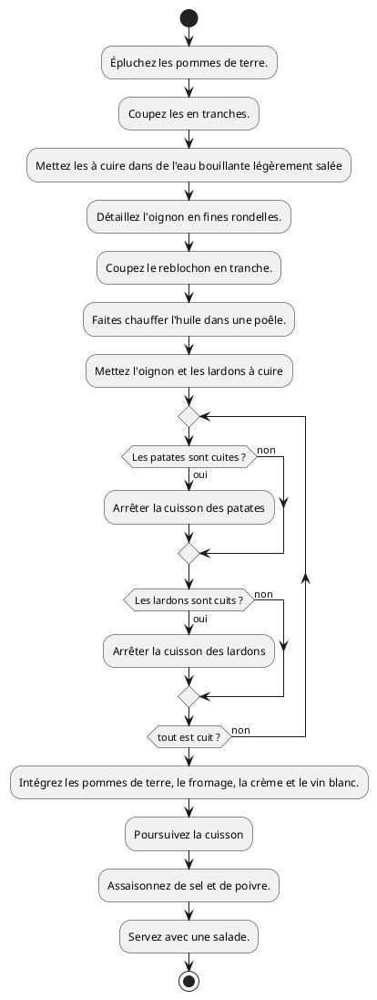
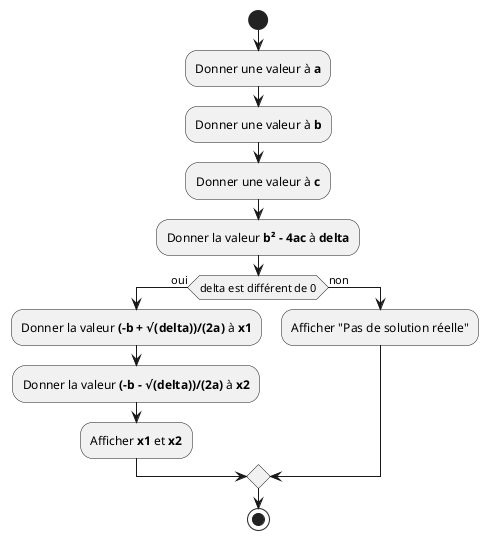
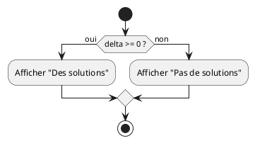

## Informations générales

- 7h30 de **théorie**, 7h30 d'**exercices**
- Les documents utilisés sont sur

  **<https://quentin.lurkin.xyz/courses/python1ba/>**

- Évaluation :
  - Examen écrit de type **QCM (100%)**

## Qu'est ce qu'un programme ?

- Une suite d'opérations pour obtenir un résultat
- les opérations sont exécutées
  - une à la fois,
  - l'une après l'autre.
- Comme une recette de cuisine

```python {.build}
from script import recipe_step, slide

steps = [
  "Épluchez les pommes de terre.",
  "Coupez les en tranches.",
  "Mettez les à cuire dans de l'eau bouillante légèrement salée pour 10 à 15 min.",
  "Détaillez l'oignon en fines rondelles.",
  "Coupez le reblochon en tranche.",
  "Faites chauffer l'huile dans une poêle.",
  "Mettez l'oignon et les lardons à cuire pour 5 min.",
  "Intégrez les pommes de terre, le fromage, la crème et le vin blanc.",
  "Poursuivez la cuisson ± 5 min à feu modéré.",
  "Assaisonnez de sel et de poivre.",
  "Servez avec une salade.",
]

wp = ["./img/Taques_Seule.png", "./img/Patates.png", "./img/Oignons.png", "./img/Lardons.png", "./img/Reblochon.png"]

tbl = []

title = "Recette de cuisine"

__output__ = []
__output__ += slide(title, recipe_step(steps, [], wp, tbl))
wp[1] = "./img/Patates_Épluchées.png"
__output__ += slide(title, recipe_step(steps, [0], wp, tbl))
wp[1] = "./img/Patates_En_Tranches.png"
__output__ += slide(title, recipe_step(steps, [1], wp, tbl))
del(wp[1])
wp[0] = "./img/Cuisson_Patates.png"
__output__ += slide(title, recipe_step(steps, [2], wp, tbl))
wp[1] = "./img/Oignons_En_Tranches.png"
__output__ += slide(title, recipe_step(steps, [3], wp, tbl))
wp[3] = "./img/Reblochon_En_Tranches.png"
__output__ += slide(title, recipe_step(steps, [4], wp, tbl))
wp[0] = "./img/Poêle_Chauffe.png"
__output__ += slide(title, recipe_step(steps, [5], wp, tbl))
wp[0] = "./img/Cuisson_Lardons_Oignons.png"
del(wp[1])
del(wp[1])
__output__ += slide(title, recipe_step(steps, [6], wp, tbl))
wp[0] = "./img/Cuisson_Lardons_Oignons_Patates_Reblochon.png"
del(wp[1])
__output__ += slide(title, recipe_step(steps, [7], wp, tbl))
wp[0] = "./img/Tartiflette_Cuite.png"
__output__ += slide(title, recipe_step(steps, [8], wp, tbl))
__output__ += slide(title, recipe_step(steps, [9], wp, tbl))
wp[0] = "./img/Taques_Seule.png"
tbl.append("./img/Plat_Tartiflette.png")
tbl.append("./img/Salade.png")
__output__ += slide(title, recipe_step(steps, [10], wp, tbl))
```

## Recette de cuisine

- Chaque opération **modifie l'état** de l'espace de travail
- Le résultat de chaque opération **dépend de l'état** de l'espace de travail

## Diagramme d'activité

:::row

::::span6



::::

::::{.span6}

- Un diagramme d'activité est une représentation graphique d'une séquence
  d'opérations.

- Il peut contenir des embranchements et des boucles

- Il est très utile pour représenter un programme

- C'est un support intéressant pour parler d'un programme avec quelqu'un d'autre

::::

:::

## Diagramme d'un programme



## RAM _(Random Access Memory)_

- **RAM** ⇒ L'**espace de travail** pour un programme informatique
- **Variable** ⇒ Morceau de mémoire (RAM)
  - Auquel on a donné un **nom**
  - Pouvant sauver une **valeur**
- Le signe `=` sert à **assigner** une valeur à une variable
  - ⚠️ Il **ne** définit **pas** une identité comme en mathématiques ⚠️
  - Il donne l'**instruction** de **stocker** la **valeur** de l'expression se
    trouvant à sa droite dans la **variable** dont le nom est à sa gauche
- Une **expression** est un morceau de code qui produit une **valeur**

```python {.build}
# Ce script génère plusieurs slides
from script import code_step, loadfile, slide
title = "Variables, expressions et valeurs"
src = """
a = 42     # expression littérale
b = a      # lecture d'une variable
a = 3 + 4  # calcul
b = a
a = a + 1
print(a)   # Affiche la valeur de a
"""
ram = {"a": 42}
__output__ = []
__output__ += slide(title, code_step(src, [1], ram))
ram["b"] = 42
__output__ += slide(title, code_step(src, [2], ram))
ram["a"] = 7
__output__ += slide(title, code_step(src, [3], ram))
ram["b"] = 7
__output__ += slide(title, code_step(src, [4], ram))
ram["a"] = 8
__output__ += slide(title, code_step(src, [5], ram))
__output__ += slide(title, code_step(src, [6], ram, "8"))
```

## `if` en Python

:::row

::::span6

En C (Arduino)

```c
if(delta >= 0) {
    digitalWrite(13, HIGH);
}
else {
    digitalWrite(13, LOW);
}
```

::::

::::span6

En Python

```python
if delta >= 0:
    print("Des solutions")
else:
    print("Pas de solutions")
```

::::

:::



La partie `else` est optionnelle

```python {.build}
# Ce script génère plusieurs slides
from script import code_step, loadfile, slide
title = "Second degré en Python"
src = loadfile("./bazooka.py")
ram = {"a": 1}
__output__ = []
__output__ += slide(title, code_step(src, [4], ram))
ram["b"] = -5
__output__ += slide(title, code_step(src, [5], ram))
ram["c"] = 6
__output__ += slide(title, code_step(src, [6], ram))
ram["delta"] = 1
__output__ += slide(title, code_step(src, [8], ram))
ram["&lt;tmp&gt;"] = True
__output__ += slide(title, code_step(src, [10], ram))
del(ram["&lt;tmp&gt;"])
ram["x1"] = 2
__output__ += slide(title, code_step(src, [11], ram))
ram["x2"] = 3
__output__ += slide(title, code_step(src, [12], ram))
__output__ += slide(title, code_step(src, [13], ram, "x1: 2 x2: 3"))
```

## while

## Essaie - Erreur

- Debuggage

## IA

## Recap
