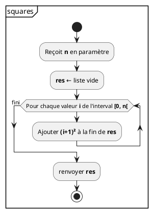

## Qu'est-ce qu'un ordinateur ?

Un ordinateur est un système composé de plusieurs éléments

- Processeur,
- Mémoire,
- Stockage,
- périphériques.

## Processeur

```python {.build}
from script import loadfile
__output__ = loadfile('cpu.svg.html')
```

## Processeur

- Central Processing Unit (CPU)
- Exécute des instructions
- Programme = suite d'instructions
- Un programme manipule des données

## Mémoire

```python {.build}
from script import loadfile
__output__ = loadfile('ram.svg.html')
```

## Mémoire

- Random Access Memory (RAM)
- Contient le programme et les données utilisée par le processeur
- Rapide
- Taille limitée
- Volatile

## Stockage

```python {.build}
from script import loadfile
__output__ = loadfile('storage.svg.html')
```

## Stockage

- Solid State Drive (SSD) ou Hard Disk Drive (HDD) "disque dur"
- Contient des programmes et des données
- Lent
- Taille importante
- Persistant
- Organisé en fichiers et répertoires

## Interpréteur

Le CPU exécute mes programmes Python ?

- **Non**, pas directement
- Python est un langage interprété.
- L'interpréteur Python (`python.exe`) exécute les programmes Python.
- `python.exe` est en **langage machine** et est exécuté par le CPU.
- **L'interpréteur Python est indispensable pour exécuter un programmes Python
  !**

## Installation

**Interpréteur:**

- Version actuelle: <span class="pyversion">3.X.X</span>
- Télécharger sur [python.org](https://www.python.org/downloads)
- Cocher la case **"Add Python <span class="pyshortversion">3.X</span> to
  PATH"**

**Éditeur:**

- Pour écrire les fichiers contenant le texte de nos programmes
- [Zed](https://zed.dev/)

## Terminal

- `pythion.exe` n'a pas d'interface graphique. Il faut l'utiliser depuis un
  terminal.
- `Powershell` sous Windows, `Terminal` sous MacOS

<pre class="terminal">
<b>> pwd</b>
C:\Users\lur

<b>> ls</b>
Desktop Documents

<b>> cd Documents</b>

<b>> pwd</b>
C:\Users\lur\Documents

<b>> python --version</b>
Python <span class="pyversion">3.X.X</span>
</pre>

## Python dans le terminal

- Mode interactif

<pre class="terminal">
<b>> python</b>
Python <span class="pyversion">3.X.X</span> ...
Type "help", "copyright", "credits" or "license" for more
information.

>>> 1 + 1
2

>>> exit()
</pre>

## Python dans le terminal

- Mode script

<p class="file-title"><em style>hello.py</em></p>
<pre><code class='lang-python'>print('Hello World')
</code></pre>

<pre class="terminal">
<b>> python hello.py</b>
Hello World
</pre>

```js {.script}
fetch('https://endoflife.date/api/python.json')
  .then((response) => response.json())
  .then((data) => {
    const version = data[0].latest
    const shortVersion = version.split('.').slice(0, 2).join('.')
    document.querySelectorAll('.pyversion').forEach((elem) => {
      elem.innerHTML = version
    })
    document.querySelectorAll('.pyshortversion').forEach((elem) => {
      elem.innerHTML = shortVersion
    })
  })
```

## Fonctions

- Nous avons déjà vu plusieurs fonctions prédéfinies :

  `print()`, `sqrt()`, `input()`, `int()`, ...

- Une fonction est une "**boite noire**" qui **peut** recevoir une ou plusieurs
  **valeurs** en arguments et **peut** renvoyer une valeur de **sortie**.
- Définir ses propres fonctions sert à deux choses :
  - **Eviter de répéter** plusieurs fois le même code.
  - **Structurer** les longs programmes en les découpant en **petites parties
    simples**.

## Fonctions sans argument ni valeur de retour

- Voici la **définition** d'une fonction qui affiche la table de 7 :

```python
def table7():
    n = 1
    while n <= 10:
        print(n, "x 7 =", n * 7)
        n += 1
```

- Une fois la fonction définie, on peut l'**appeler** autant de fois qu'on veut
  :

```python
# affichons 2 fois la table de 7
table7()
table7()
```

**Une fonction n'est exécutée que lorsqu'on l'appelle**

## Fonctions sans argument ni valeur de retour

- La fonction `table7()` ne retourne rien :

```python
x = table7() # affiche la table de 7
print(x)     # affiche None
```

- Comme elle ne prend pas de paramètre, elle fait toujours **la même chose**.

## Fonctions avec arguments

- Les **valeur(s)** reçue(s) en paramètre(s) sont utilisée(s) lors de
  l'exécution de la fonction :

```python
# définition de la fonction table().
def table(base):
    n=1
    while n <= 10:
        print(n, "x", base, "=", n * base)
        n += 1

# appels à la fonction table()
table(3)       # affiche la table de 3
table(base=8)  # affiche la table de 8
a = 42
table(a)       # affiche la table de 42
```

## Fonctions avec arguments

- On peut aussi avoir plusieurs arguments :

```python
# définition de la fonction table().
def table(base, start, length):
    n = start
    while n < start + length:
        print(n, "x", base, "=", n * base)
        n += 1

# appels à la fonction table()
table(3, 1, 10)
table(base=8, start=5, length=2)
```

## Fonctions avec arguments

- On peut aussi avoir des valeurs par défaut pour les arguments :

```python
# définition de la fonction table().
def table(base, start=1, length=10):
    n = start
    while n < start + length:
        print(n, "x", base, "=", n * base)
        n += 1

# appels à la fonction table()
table(8, 5, 2)
table(8)
table(8, 5)
table(8, length=2)
```

## Fonctions avec valeur de retour

- Le mot-clé `return` permet de définir la valeur de retour :

```python
# définition de la fonction multiply()
def multiply(a, b):
    return a * b

res = multiply(7, 9)   # appel à la fonction. N'affiche rien.
print(res)             # affiche 63
print(multiply(6, 7))  # affiche 42
```

## Fonctions avec valeur de retour

- On peut utiliser une fonction dans le corps d'une autre :

```python
# définition de multiply()
def multiply(a, b):
    return a * b

# définition de table()
def table(base, start=1, length=10):
    n = start
    while n < start + length:
        # utilisation de multiply()
        print(n, "x", base, "=", multiply(n, base))
        n += 1

# appel à la fonction table()
table(5, length=3)
```

## Fonctions avec valeur de retour

- Lorsque le mot-clé `return` est rencontré, la fonction **s'arrête** et le
  programme se poursuit après l'appel. [Cela permet quelques
  simplifications]{.small}

```python
def abs(x):
    if x < 0:
        return -x
    else:
        return x
```

```python
# version simplifiée
def abs(x):
    if x < 0:
        return -x
    return x
```

## Variables locales et globales

- Dès que l'on a des fonctions, il faut comprendre la différence entre variables
  locales et globales.
- Une variable globale est définie **en dehors de toute fonction**. Elle est
  accessible dans **l'ensemble du programme**.
- Une variable locale est définie **dans une fonction**. Elle est accessible
  uniquement **dans cette fonction**.

```python
def tvac(amount):
    n = 1 + interest / 100
    return amount * n

interest = 21
n = 25
r = tvac(n)
print(r)
```

```python {.build}
# Ce script génère plusieurs slides
from script import code_step, slide, ref
title = "Variables locales et globales"
src = """
def tvac(amount):
    n = 1 + interest / 100
    return amount * n

interest = 21
n = 25
r = tvac(n)
print(r)
"""
ram = {}
__output__ = []
__output__ += slide(title, code_step(src, [], ram))
ram["tvac"] = ref("function")
__output__ += slide(title, code_step(src, [1], ram))
ram["interest"] = 21
__output__ += slide(title, code_step(src, [5], ram))
ram["n"] = 25
__output__ += slide(title, code_step(src, [6], ram))
tvac = {"amount": ram["n"]}
ram["function tvac"] = tvac
__output__ += slide(title, code_step(src, [7], ram))
tvac["n"] = 1.21
__output__ += slide(title, code_step(src, [2], ram))
tvac[ref("return")] = tvac["amount"] * tvac["n"]
__output__ += slide(title, code_step(src, [3], ram))
ram["r"] = tvac[ref("return")]
__output__ += slide(title, code_step(src, [7], ram))
del(ram["function tvac"])
__output__ += slide(title, code_step(src, [8], ram, str(ram["r"])))
```

## Que va-t-il s'afficher ?

```python
def fun():
    a = 12

fun()

print(a)
```

```python {.build}
from script import code_step, slide, ref
title = "Que va-t-il s'afficher ?"
src = """
def fun():
    a = 12

fun()

print(a)
"""
ram = {}
__output__ = []
__output__ += slide(title, code_step(src, [], ram))
ram["fun"] = ref("function")
__output__ += slide(title, code_step(src, [1], ram))
fun = {}
ram["function fun"] = fun
__output__ += slide(title, code_step(src, [4], ram))
fun["a"] = 12
__output__ += slide(title, code_step(src, [2], ram))
del(ram["function fun"])
__output__ += slide(title, code_step(src, [5], ram))
out = """Traceback (most recent call last):
  File "example.py", line 6, in <module>
    print(a)
          ^
NameError: name 'a' is not defined
"""
__output__ += slide(title, code_step(src, [6], ram, out, term_size=0.8))
```

## Variables locales et globales

- Une variable locale est **inaccessible** hors de la fonction où elle est
  définie

```python
def fun():
    a = 12 # variable locale à fun

fun()

print(a) # inaccessible ici
```

## Que va-t-il s'afficher ?

```python
def fun():
    print(a)

a = 12
fun()
```

```python {.build}
from script import code_step, slide, ref
title = "Que va-t-il s'afficher ?"
src = """
def fun():
    print(a)

a = 12
fun()
"""
ram = {}
__output__ = []
__output__ += slide(title, code_step(src, [], ram))
ram["fun"] = ref("function")
__output__ += slide(title, code_step(src, [1], ram))
ram["a"] = 12
__output__ += slide(title, code_step(src, [4], ram))
fun = {}
ram["function fun"] = fun
__output__ += slide(title, code_step(src, [5], ram))
out = str(ram["a"])
__output__ += slide(title, code_step(src, [2], ram, out))
del(ram["function fun"])
__output__ += slide(title, code_step(src, [], ram, out))
```

## Variables locales et globales

- Une variable globale est accessible **partout** :

```python
def fun():
    print(a) # accès à la variable 'a' globale

a = 12
fun()
```

## Que va-t-il s'afficher ?

```python
def fun():
    a = 42
    print("dans fun :", a)

a = 12
fun()

print("en dehors de fun :", a)
```

```python {.build}
from script import code_step, slide, ref
title = "Que va-t-il s'afficher ?"
src = """
def fun():
    a = 42
    print("dans fun :", a)

a = 12
fun()

print("en dehors de fun :", a)
"""
ram = {}
__output__ = []
__output__ += slide(title, code_step(src, [], ram))
ram["fun"] = ref("function")
__output__ += slide(title, code_step(src, [1], ram))
ram["a"] = 12
__output__ += slide(title, code_step(src, [5], ram))
fun = {}
ram["function fun"] = fun
__output__ += slide(title, code_step(src, [6], ram))
fun["a"] = 42
__output__ += slide(title, code_step(src, [2], ram))
out = f"dans fun : {fun["a"]}"
__output__ += slide(title, code_step(src, [3], ram, out))
del(ram["function fun"])
__output__ += slide(title, code_step(src, [7], ram, out))
out += f"\nen dehors de fun : {ram["a"]}"
__output__ += slide(title, code_step(src, [8], ram, out))
```

## Variables locales et globales

- Lorsqu'une variable locale porte le même nom qu'une globale, **priorité à la
  locale**

```python
def fun():
    a = 42
    print("dans fun :", a)     # 'a' locale masque 'a' globale

a = 12
fun()
print("en dehors de fun :", a) # seule 'a' globale accessible ici
```

## Que va-t-il s'afficher ?

```python
def fun():
    print("globale? :", a)
    a = 42

a = 12
fun()
```

```python {.build}
from script import code_step, slide, ref
title = "Que va-t-il s'afficher ?"
src = """
def fun():
    print("globale? :", a)
    a = 42

a = 12
fun()
"""
ram = {}
__output__ = []
__output__ += slide(title, code_step(src, [], ram))
ram["fun"] = ref("function")
__output__ += slide(title, code_step(src, [1], ram))
ram["a"] = 12
__output__ += slide(title, code_step(src, [5], ram))
fun = {"a": ref("unbound")}
ram["function fun"] = fun
__output__ += slide(title, code_step(src, [6], ram))
out = """Traceback (most recent call last):
  File "example.py", line 6, in <module>
    fun()
    ~~~^^
  File "/Users/lur/Desktop/expr.py", line 2, in fun
    print("globale? :", a)
                        ^
UnboundLocalError: cannot access local variable 'a'
where it is not associated with a value
"""
__output__ += slide(title, code_step(src, [2], ram, out, term_size=0.5))
```

## Variables locales et globales

- Priorité à la locale **même avant sa définition dans la fonction**

```python
def fun():
    # ici 'a' local existe déjà mais n'a pas encore de valeur

    print("globale? :", a)  # erreur: accès à 'a' local sans valeur
    a = 42

a = 12
fun()
```

## Les séquences

- Les séquences sont des **types** de valeur :
  - Les chainés de caractères (`str`)

    ```python
    a = "hello"      # littéral
    b = 2 * a + "!!" # expression
    c = '6' + '7'    # '67'
    ```

  - Les listes (`list`)

    ```python
    a = [1, 2, 3, 4]    # littéral
    a = [1, 2] + [3, 4] # expression
    ```

## Les séquences

- Les chaînes de caractères et les listes sont des séquences [représente une
  suite ordonnée de valeurs]{.small}
- Une séquence stocke **zéro**, **une** ou **plusieurs** valeurs
- Les valeurs d’une séquence possèdent un numéro d'**ordre** dans la séquence
  [l'indice de l'élément]{.small}

```python
l = [2, 42, 3.1416, 34]       # 'l' est une séquence de valeurs
s = "Le Python, c'est bon !"  # 's' est une séquence de caractères
```

## Opérations sur les séquences

- L'opérateur `+` entre deux séquences permet de créer une **nouvelle séquence**
  contenant les deux opérandes bout-à-bout [On appelle cette opération la
  concaténation]{.small}

- L'opérateur `*` entre un entier `n` et une séquence permet de créer une
  **nouvelle séquence** contenant `n` fois la séquence de départ.

```python
f = [1, 2] + [3, 4]  # [1, 2, 3, 4]
g = 3 * "hello"      # "hellohellohello"
```

## Test d’appartenance

- L'opérateur `in` permet de vérifier si une valeur se trouve dans une séquence.
  [Ou si une sous-chaine est dans une chaine de caractères]{.small}

```python
L = [1, 2, 42, 3]
if 42 in L:
    print("OK")

S = 'Python'
if 'hon' not in S:
    print("KO")
```

## Accès aux éléments

- Il est possible d’accéder aux éléments individuels [Pour cela, on utilise les
  crochets `[]`]{.small}
- Chaque éléments est repéré par son numéro d’ordre [Le numéro d’ordre est
  appelé **indice**]{.small}
- Les indices commencent à **zéro** [Les indices négatifs permettent d’indiquer
  un élément en partant de la fin de la séquence]{.small}

## Le _slicing_

- Il est possible de référencer une sous-séquence c-à-d une "tranche" de la
  séquence. On sépare les deux indices délimitant la tranche par un "`:`"
- La tranche `[m:n]` référence la sous-séquence qui va du
  `m`<span style="font-size: 0.5em">ième</span> élément (**compris**) au
  `n`<span style="font-size: 0.5em">ième</span> élément (**non-compris**).
- Si on omet le premier indice, la tranche démarre au début de la séquence [Idem
  avec le deuxième indice et la fin de la séquence]{.small}

```python
s = "Le Python, c'est bon !"
print(s[3:9])   # affiche 'Python'
print(s[17:-2]) # affiche 'bon'
print(s[17:])   # affiche 'bon !'
print(s[:9])    # affiche 'Le Python'
```

- Un _slice_ produit une **nouvelle séquence**

## La longueur d’une séquence

- Il est possible de connaitre le nombre d’éléments contenus dans une séquence
  grâce à la fonction `len()`

```python
s = "Le Python, c'est bon !"
print(len(s)) # affiche 22
```

## Un `str` est immuable

- On peut modifier un élément d’une liste

```python
s = [1, 2, 42, 4, 5]
s[2] = 3
print(s)   # affiche [1, 2, 3, 4, 5]
```

- Une fois créée, une chaine de caractères ne peut plus être modifiée

```python
s = "Le Python, c'est bon !"
s[17] = "c"     # provoque une erreur !
```

## Liste

- Une liste est une séquence permettant de stocker tous types de valeurs

```python
numbers = [1, 2, 3, 4, 5]
words = ["I", "love", "Python"]
mixed = [1, "duck-billed platypus", True]
nested = [[1, 2], [3, 4]]
```

- On peut supprimer un élément d’une liste.

```python
numbers = [1, 2, 2, 3, 4, 5]
del(numbers[1])
print(numbers) # affiche [1, 2, 3, 4, 5]
```

## Ajout d'éléments

- On peut ajouter un élément à la **fin** d'une liste.

```python
numbers = [1, 2, 3, 4, 5]
numbers.append(6)
print(numbers)  # affiche [1, 2, 3, 4, 5, 6]
```

- On peut insérer un élément à un **indice** précis.

```python
numbers = [1, 2, 4, 5]
numbers.insert(2, 3)  # insère 3 à l'indice 2
print(numbers)        # affiche [1, 2, 3, 4, 5]
```

## Attention aux copies

- Que va-t-il s'afficher ?

```python
words = ['I', 'like', 'Python']
mots = words
mots[1] = 'love'
print(words)
print(mots)
```

```python {.build}
from script import code_step, slide, ref
title = "Que va-t-il s'afficher ?"
src = """
words = ['I', 'like', 'Python']
mots = words
mots[1] = 'love'
print(words)
print(mots)
"""
ram = {}
__output__ = []
__output__ += slide(title, code_step(src, [], ram))
ram["words"] = ref("ref1")
ram[ref("ref1")] = ['"I"', '"like"', '"Python"']
__output__ += slide(title, code_step(src, [1], ram))
ram["mots"] = ram["words"]
__output__ += slide(title, code_step(src, [2], ram))
ram[ref("ref1")][1] = '"love"'
__output__ += slide(title, code_step(src, [3], ram))
out = "['I', 'love', 'Python']"
__output__ += slide(title, code_step(src, [4], ram, out))
out += "\n['I', 'love', 'Python']"
__output__ += slide(title, code_step(src, [5], ram, out))
```

## Attention aux copies

- Les listes sont manipulées via des références

```python
words = ['I', 'like', 'Python']
mots = words     # ici on ne copie que la référence
mots[1] = 'love'
print(words)
print(mots)
```

## Attention aux copies

- Il explicitement créer une **nouvelle liste**

```python
words = ['I', 'like', 'Python']
mots = list(words)
mots[1] = 'love'
print(words)
print(mots)
```

```python {.build}
from script import code_step, slide, ref
title = "Que va-t-il s'afficher ?"
src = """
words = ['I', 'like', 'Python']
mots = list(words)
mots[1] = 'love'
print(words)
print(mots)
"""
ram = {}
__output__ = []
__output__ += slide(title, code_step(src, [], ram))
ram["words"] = ref("ref1")
ram[ref("ref1")] = ['"I"', '"like"', '"Python"']
__output__ += slide(title, code_step(src, [1], ram))
ram[ref("ref2")] = ['"I"', '"like"', '"Python"']
__output__ += slide(title, code_step(src, [2], ram))
ram["mots"] = ref("ref2")
__output__ += slide(title, code_step(src, [2], ram))
ram[ref("ref2")][1] = '"love"'
__output__ += slide(title, code_step(src, [3], ram))
out = "['I', 'like', 'Python']"
__output__ += slide(title, code_step(src, [4], ram, out))
out += "\n['I', 'love', 'Python']"
__output__ += slide(title, code_step(src, [5], ram, out))
```

## Créer une copie d'une liste

- On peut imaginer plusieurs moyen de créer explicitement une nouvelle liste

```python
numbers = [1, 2, 3, 4, 5]
copy1 = list(numbers)  # la fonction 'list()' crée une liste
copy2 = numbers * 1    # le '*' crée une liste
copy3 = numbers + []   # le '+' crée une liste
copy4 = numbers[:]     # le slice crée une liste
```

## Passage par référence

- Le même phénomène se produit lors du passage d'une liste à une fonction

```python
def more_love(l):
  l[1] = "love"

words = ['I', 'like', 'Python']
fun(words)

print(words)
```

```python {.build}
from script import code_step, slide, ref
title = "Passage par référence"
src = """
def more_love(l):
  l[1] = "love"

words = ['I', 'like', 'Python']
fun(words)

print(words)
"""
ram = {}
__output__ = []
__output__ += slide(title, code_step(src, [], ram))
ram["more_love"] = ref("function")
__output__ += slide(title, code_step(src, [1], ram))
ram["words"] = ref("ref1")
ram[ref("ref1")] = ['"I"', '"like"', '"Python"']
__output__ += slide(title, code_step(src, [4], ram))
fun = {"l": ram["words"]}
ram["function more_love"] = fun
__output__ += slide(title, code_step(src, [5], ram))
ram[fun["l"]][1] = '"love"'
__output__ += slide(title, code_step(src, [2], ram))
del(ram["function more_love"])
__output__ += slide(title, code_step(src, [6], ram))
__output__ += slide(title, code_step(src, [7], ram, "['I', 'love', 'Python']"))
```

## Boucler dans une séquence

- Pour parcourir les éléments d'une séquence, on peut utiliser une boucle
  `while`.

```python
numbers = [2, 5, 7, 2, 1]
i = 0
while i < len(numbers):
    print(numbers[i])
    i += 1     # raccourci pour i = i + 1
```

- On peut aussi utiliser la boucle `for ... in` [Où `n` prendra successivement
  chaque valeur de `numbers`]{.small}

```python
numbers = [2, 5, 7, 2, 1]
for n in numbers:
    print(n)
```

- Cela marche aussi avec les chaines de caractères.

## Intervalles

- Un intervalle est une séquence numérique logique.

- Créé avec la fonction `range()`

```python
range(5)         # [0, 1, 2, 3, 4]
range(1, 5)      # [1, 2, 3, 4]
range(1, 8, 2)   # [1, 3, 5, 7]
range(5, 0, -1)  # ???
```

- Souvent utilisé dans les boucles `for`

```python
for i in range(5):
    print(i)
```

- **Un intervalle n'est pas une liste** [Mais on peut créer une liste à partir
  d'un intervalle avec la fonction `list()`]{.small}

## Example

- `squares()` est une fonction qui retourne une liste contenant les `n` premiers
  nombres naturels au carré.

:::row

::::span6

```python
def squares(n):
    res = []
    for i in range(n):
        res.append((i+1)**2)
    return res
```

::::

::::span6



::::

:::
