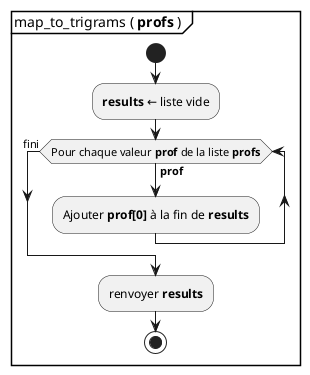
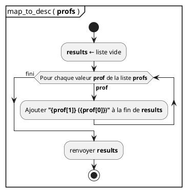

## Traitement de l'information

- **Informatique** = traitement de l'information
- L'information prend souvent la forme de **listes**

```python
profs = [
  ['LUR', 'Quentin Lurkin'],
  ['LRG', 'André Lorge'],
  ['FKY', 'Martin Fockedey'],
  ['FLE', 'Clémence Flémal'],
]
```

- les traitements que l'on peut faire sur des listes tombent souvent dans l'une
  de ces **4 catégories**:
  - transformation,
  - filtrage,
  - accumulation,
  - tri.

## Transformation

- _**Mapping**_ en anglais
- Il s'agit d'appliquer le **même traitement** à tous les éléments d'une liste
- On obtient la **liste des résultats**
- **Exemple**

:::row

::::span6

```python
# Transforme une liste de profs
profs = [
  ['LUR', 'Quentin Lurkin'],
  ['LRG', 'André Lorge'],
  ['FKY', 'Martin Fockedey'],
]
```

::::

::::span6

```python
# En une liste de trigrammes
trigrams = [
  'LUR'
  'LRG',
  'FKY',
]

```

::::

:::

## Mapping: diagramme

- Mapping des profs en trigrammes:



```python {.build}
from script import code_step, slide, ref
title = "Mapping: code"
src = """
def map_to_trigrams(profs):
  results = []
  for prof in profs:
    results.append(prof[0])
  return results

profs = [
  ['LUR', 'Quentin Lurkin'],
  ['LRG', 'André Lorge'],
  ['FKY', 'Martin Fockedey'],
]

trigrams = map_to_trigrams(profs)
print(trigrams)
"""
ram = {}
__output__ = []
__output__ += slide(title, code_step(src, [], ram))
ram["map_to_trigrams"] = ref("function")
__output__ += slide(title, code_step(src, [1], ram))
ram["profs"] = ref("r1")
ram[ref("r1")] = [ref("r2"), ref("r3"), ref("r4")]
ram[ref("r2")] = ["'LUR'", "'Quentin Lurkin'"]
ram[ref("r3")] = ["'LRG'", "'André Lorge'"]
ram[ref("r4")] = ["'FKY'", "'Martin Fockedey'"]
__output__ += slide(title, code_step(src, [7, 8, 9, 10, 11], ram))
fun = {"profs": ref("r1")}
ram["map_to_trigrams function"] = fun
__output__ += slide(title, code_step(src, [13], ram))
fun["results"] = ref("r5")
ram[ref("r5")] = "[]"
__output__ += slide(title, code_step(src, [2], ram))
fun["prof"] = ref("r2")
__output__ += slide(title, code_step(src, [3], ram))
ram[ref("r5")] = ["'LUR'"]
__output__ += slide(title, code_step(src, [4], ram))
fun["prof"] = ref("r3")
__output__ += slide(title, code_step(src, [3], ram))
ram[ref("r5")].append("'LRG'")
__output__ += slide(title, code_step(src, [4], ram))
fun["prof"] = ref("r4")
__output__ += slide(title, code_step(src, [3], ram))
ram[ref("r5")].append("'FKY'")
__output__ += slide(title, code_step(src, [4], ram))
fun[ref("return")] = ref('r5')
__output__ += slide(title, code_step(src, [5], ram))
ram["trigrams"] = ref('r5')
del(ram['map_to_trigrams function'])
__output__ += slide(title, code_step(src, [13], ram))
out = "['LUR', 'LRG', 'FKY']"
__output__ += slide(title, code_step(src, [14], ram, out))
```

## Transformation structure

- Un _mapping_ suit toujours la **même structure**:
  - création de la **nouvelle liste** initialement vide
  - **parcours** des éléments de la liste d'entrée
  - **ajout** des résultats à la fin de la nouvelle liste
- Autre exemple:

:::row

::::span6

```python
# Transforme une liste de profs

profs = [
  ['LUR', 'Quentin Lurkin'],
  ['LRG', 'André Lorge'],
  ['FKY', 'Martin Fockedey'],
]
```

::::

::::span6

```python
# En une liste de descriptions
# prêtes à être affichées
trigrams = [
  'Quentin Lurkin (LUR)'
  'André Lorge (LRG)',
  'Martin Fockedey (FKY)',
]
```

::::

:::

## Mapping: diagramme



```python {.build}
from script import code_step, slide, ref
title = "Mapping: code"
src = """
def map_to_desc(profs):
  results = []
  for prof in profs:
    desc = f"{prof[1]} ({prof[0]})"
    results.append(desc)
  return results

profs = [
  ['LUR', 'Quentin Lurkin'],
  ['LRG', 'André Lorge'],
  ['FKY', 'Martin Fockedey'],
]

desc = map_to_trigrams(profs)
print(desc)
"""
ram = {}
disclaimer = "Toutes les références ne sont pas représentées"
__output__ = []
__output__ += slide(title, code_step(src, [], ram, disclaimer=disclaimer))
ram["map_to_desc"] = ref("function")
__output__ += slide(title, code_step(src, [1], ram, disclaimer=disclaimer))
ram["profs"] = "[...]"
__output__ += slide(title, code_step(src, [8, 9, 10, 11, 12], ram, disclaimer=disclaimer))
fun = {"profs": ref("ref global profs")}
ram["map_to_trigrams function"] = fun
__output__ += slide(title, code_step(src, [14], ram, disclaimer=disclaimer))
fun["results"] = "[]"
__output__ += slide(title, code_step(src, [2], ram, disclaimer=disclaimer))
fun["prof"] = ["'LUR'", "'Quentin Lurkin'"]
__output__ += slide(title, code_step(src, [3], ram, disclaimer=disclaimer))
fun["desc"] = "'Quentin Lurkin (LUR)'"
__output__ += slide(title, code_step(src, [4], ram, disclaimer=disclaimer))
fun["results"] = [fun['desc']]
__output__ += slide(title, code_step(src, [5], ram, disclaimer=disclaimer))
fun["prof"] = ["'LRG'", "'André Lorge'"]
__output__ += slide(title, code_step(src, [3], ram, disclaimer=disclaimer))
fun["desc"] = "'André Lorge (LRG)'"
__output__ += slide(title, code_step(src, [4], ram, disclaimer=disclaimer))
fun["results"].append(fun['desc'])
__output__ += slide(title, code_step(src, [5], ram, disclaimer=disclaimer))
fun["prof"] = ["'FKY'", "'Martin Fockedey'"]
__output__ += slide(title, code_step(src, [3], ram, disclaimer=disclaimer))
fun["desc"] = "'Martin Fockedey (FKY)'"
__output__ += slide(title, code_step(src, [4], ram, disclaimer=disclaimer))
fun["results"].append(fun['desc'])
__output__ += slide(title, code_step(src, [5], ram, disclaimer=disclaimer))
fun[ref("return")] = ref("ref results")
__output__ += slide(title, code_step(src, [6], ram, disclaimer=disclaimer))
ram["desc"] = fun['results']
del(ram["map_to_trigrams function"])
__output__ += slide(title, code_step(src, [14], ram, disclaimer=disclaimer))
out = "['Quentin Lurkin (LUR)', 'André Lorge (LRG)', 'Martin Fockedey (FKY)']"
__output__ += slide(title, code_step(src, [15], ram, out, disclaimer=disclaimer, term_size=0.38))
```

## Mapping

- Ces deux derniers exemples ont la **même structure**
- Seul le **contenu** de la boucle est différent
- Ce sont des _**mappings**_
- Il est possible de créer une fonction qui ne contient que la structure d'un
  _mapping_.
- Il nous faudra juste un moyen de passer **le traitement à réaliser**.

## Les fonctions sont des valeurs

- Une fonction peut être **assignée** à une variable

```python
from math import cos, pi

a = cos # Pas de parenthèse! On n'appelle pas la fonction.
        # On l'assigne à la variable `a`

a(pi/2) # `a` fait référence à la fonction `cos`. Si on
        # appelle `a`, on appelle `cos`
```

## Les fonctions sont des valeurs

- On peut passer une fonction **en paramètre** à une autre fonction

```python
# la structure d'un mapping. `processing` est la fonction
# qui sera appliquée aux éléments de `L`
def map(processing, L):
  results = []
  for elem in L:
    results.append(processing(elem))
  return results

# transforme 1 prof
def describe(prof):
  return f"{prof[1]} ({prof[0]})"

# on transforme tous les profs
descriptions = map(describe, profs)

def get_trigram(prof):
  return prof[0]

trigrams = map(get_trigram, profs)
```

## La fonction `map`

- La fonction `map` existe déjà en Python [Pas besoin de la créer]{.small}

## Le filtrage

## L'accumulation
