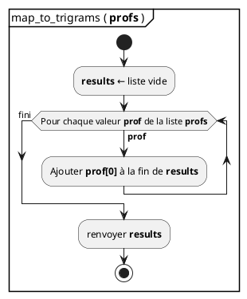
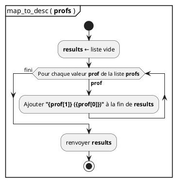
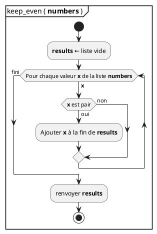
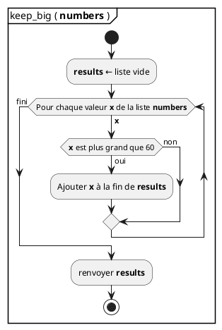
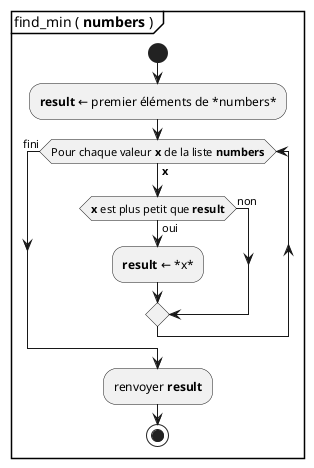
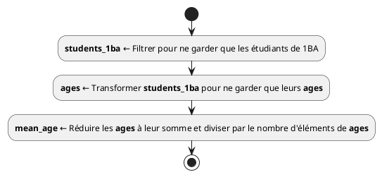
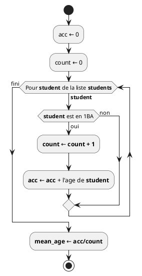

## Traitement de l'information

- **Informatique** = traitement de l'information
- L'information prend souvent la forme de **listes**

```python
profs = [
  ['LUR', 'Quentin Lurkin'],
  ['LRG', 'André Lorge'],
  ['FKY', 'Martin Fockedey'],
  ['FLE', 'Clémence Flémal'],
]
```

- les traitements que l'on peut faire sur des listes tombent souvent dans l'une
  de ces **4 catégories**:
  - transformation,
  - filtrage,
  - accumulation,
  - tri.

## Transformation

- _**Mapping**_ en anglais
- Il s'agit d'appliquer le **même traitement** à tous les éléments d'une liste
- On obtient la **liste des résultats**
- **Exemple**

:::row

::::span6

```python
# Transforme une liste de profs
profs = [
  ['LUR', 'Quentin Lurkin'],
  ['LRG', 'André Lorge'],
  ['FKY', 'Martin Fockedey'],
]
```

::::

::::span6

```python
# En une liste de trigrammes
trigrams = [
  'LUR'
  'LRG',
  'FKY',
]

```

::::

:::

## Mapping: diagramme

- Mapping des profs en trigrammes:



```python {.build}
from script import code_step, slide, ref
title = "Mapping: code"
src = """
def map_to_trigrams(profs):
  results = []
  for prof in profs:
    results.append(prof[0])
  return results

profs = [
  ['LUR', 'Quentin Lurkin'],
  ['LRG', 'André Lorge'],
  ['FKY', 'Martin Fockedey'],
]

trigrams = map_to_trigrams(profs)
print(trigrams)
"""
ram = {}
__output__ = []
__output__ += slide(title, code_step(src, [], ram))
ram["map_to_trigrams"] = ref("function")
__output__ += slide(title, code_step(src, [1], ram))
ram["profs"] = ref("r1")
ram[ref("r1")] = [ref("r2"), ref("r3"), ref("r4")]
ram[ref("r2")] = ["'LUR'", "'Quentin Lurkin'"]
ram[ref("r3")] = ["'LRG'", "'André Lorge'"]
ram[ref("r4")] = ["'FKY'", "'Martin Fockedey'"]
__output__ += slide(title, code_step(src, [7, 8, 9, 10, 11], ram))
fun = {"profs": ref("r1")}
ram["map_to_trigrams function"] = fun
__output__ += slide(title, code_step(src, [13], ram))
fun["results"] = ref("r5")
ram[ref("r5")] = "[]"
__output__ += slide(title, code_step(src, [2], ram))
fun["prof"] = ref("r2")
__output__ += slide(title, code_step(src, [3], ram))
ram[ref("r5")] = ["'LUR'"]
__output__ += slide(title, code_step(src, [4], ram))
fun["prof"] = ref("r3")
__output__ += slide(title, code_step(src, [3], ram))
ram[ref("r5")].append("'LRG'")
__output__ += slide(title, code_step(src, [4], ram))
fun["prof"] = ref("r4")
__output__ += slide(title, code_step(src, [3], ram))
ram[ref("r5")].append("'FKY'")
__output__ += slide(title, code_step(src, [4], ram))
fun[ref("return")] = ref('r5')
__output__ += slide(title, code_step(src, [5], ram))
ram["trigrams"] = ref('r5')
del(ram['map_to_trigrams function'])
__output__ += slide(title, code_step(src, [13], ram))
out = "['LUR', 'LRG', 'FKY']"
__output__ += slide(title, code_step(src, [14], ram, out))
```

## Transformation structure

- Un _mapping_ suit toujours la **même structure**:
  - création de la **nouvelle liste** initialement vide
  - **parcours** des éléments de la liste d'entrée
  - **ajout** des résultats à la fin de la nouvelle liste
- Autre exemple:

:::row

::::span6

```python
# Transforme une liste de profs

profs = [
  ['LUR', 'Quentin Lurkin'],
  ['LRG', 'André Lorge'],
  ['FKY', 'Martin Fockedey'],
]
```

::::

::::span6

```python
# En une liste de descriptions
# prêtes à être affichées
trigrams = [
  'Quentin Lurkin (LUR)'
  'André Lorge (LRG)',
  'Martin Fockedey (FKY)',
]
```

::::

:::

## Mapping: diagramme



```python {.build}
from script import code_step, slide, ref
title = "Mapping: code"
src = """
def map_to_desc(profs):
  results = []
  for prof in profs:
    desc = f"{prof[1]} ({prof[0]})"
    results.append(desc)
  return results

profs = [
  ['LUR', 'Quentin Lurkin'],
  ['LRG', 'André Lorge'],
  ['FKY', 'Martin Fockedey'],
]

desc = map_to_trigrams(profs)
print(desc)
"""
ram = {}
disclaimer = "Toutes les références ne sont pas représentées"
__output__ = []
__output__ += slide(title, code_step(src, [], ram, disclaimer=disclaimer))
ram["map_to_desc"] = ref("function")
__output__ += slide(title, code_step(src, [1], ram, disclaimer=disclaimer))
ram["profs"] = "[...]"
__output__ += slide(title, code_step(src, [8, 9, 10, 11, 12], ram, disclaimer=disclaimer))
fun = {"profs": ref("ref global profs")}
ram["map_to_trigrams function"] = fun
__output__ += slide(title, code_step(src, [14], ram, disclaimer=disclaimer))
fun["results"] = "[]"
__output__ += slide(title, code_step(src, [2], ram, disclaimer=disclaimer))
fun["prof"] = ["'LUR'", "'Quentin Lurkin'"]
__output__ += slide(title, code_step(src, [3], ram, disclaimer=disclaimer))
fun["desc"] = "'Quentin Lurkin (LUR)'"
__output__ += slide(title, code_step(src, [4], ram, disclaimer=disclaimer))
fun["results"] = [fun['desc']]
__output__ += slide(title, code_step(src, [5], ram, disclaimer=disclaimer))
fun["prof"] = ["'LRG'", "'André Lorge'"]
__output__ += slide(title, code_step(src, [3], ram, disclaimer=disclaimer))
fun["desc"] = "'André Lorge (LRG)'"
__output__ += slide(title, code_step(src, [4], ram, disclaimer=disclaimer))
fun["results"].append(fun['desc'])
__output__ += slide(title, code_step(src, [5], ram, disclaimer=disclaimer))
fun["prof"] = ["'FKY'", "'Martin Fockedey'"]
__output__ += slide(title, code_step(src, [3], ram, disclaimer=disclaimer))
fun["desc"] = "'Martin Fockedey (FKY)'"
__output__ += slide(title, code_step(src, [4], ram, disclaimer=disclaimer))
fun["results"].append(fun['desc'])
__output__ += slide(title, code_step(src, [5], ram, disclaimer=disclaimer))
fun[ref("return")] = ref("ref results")
__output__ += slide(title, code_step(src, [6], ram, disclaimer=disclaimer))
ram["desc"] = fun['results']
del(ram["map_to_trigrams function"])
__output__ += slide(title, code_step(src, [14], ram, disclaimer=disclaimer))
out = "['Quentin Lurkin (LUR)', 'André Lorge (LRG)', 'Martin Fockedey (FKY)']"
__output__ += slide(title, code_step(src, [15], ram, out, disclaimer=disclaimer, term_size=0.38))
```

## Mapping

- Ces deux derniers exemples ont la **même structure**
- Seul le **contenu** de la boucle est différent
- Ce sont des _**mappings**_
- Il est possible de créer une fonction qui ne contient que la structure d'un
  _mapping_.
- Il nous faudra juste un moyen de passer **le traitement à réaliser**.

## Les fonctions sont des valeurs

- Une fonction peut être **assignée** à une variable

```python
from math import cos, pi

a = cos # Pas de parenthèse! On n'appelle pas la fonction.
        # On l'assigne à la variable `a`

a(pi/2) # `a` fait référence à la fonction `cos`. Si on
        # appelle `a`, on appelle `cos`
```

## Les fonctions sont des valeurs

- On peut passer une fonction **en paramètre** à une autre fonction

```python
# la structure d'un mapping. `processing` est la fonction
# qui sera appliquée aux éléments de `L`
def map(processing, L):
  results = []
  for elem in L:
    results.append(processing(elem))
  return results

# transforme 1 prof
def describe(prof):
  return f"{prof[1]} ({prof[0]})"

# on transforme tous les profs
descriptions = map(describe, profs)

def get_trigram(prof):
  return prof[0]

trigrams = map(get_trigram, profs)
```

## La fonction `map`

- La fonction `map` existe déjà en Python [Pas besoin de la créer]{.small}

## Le filtrage

- Il s'agit de créer une **nouvelle** liste ne contenant que les éléments de la
  liste d'entrée **respectant une certaine condition**.
- Exemple:

```python
# A partir de cette liste
numbers = [42, 165, 69, 18, 24]

# On veut obtenir celle-ci qui ne contient que les nombre pairs
even = [42, 18, 24]

# Ou ne garder que les nombres plus grands que 60
big = [165, 69]
```

## Filtrage: Diagramme

:::row

::::span6



::::

::::span6



::::

:::

## La fonction `filter`

- La structure d'un **filtrage** est toujours la même
- Il est possible de créer une fonction qui ne contient que la structure du
  filtrage.
- On passera la **condition** sous forme d'une **fonction booléenne** renvoyant
  `True` pour les valeurs à garder.

## Code `filter` {.code}

```python
def filter(condition, L):
  res = []
  for item in L:
    if condition(item):
      res.append(item)
  return res

def is_even(x):
  return x % 2 == 0

def is_big(x):
  return x > 60

numbers = [42, 165, 69, 18, 24]

even = filter(is_even, L)
big = filter(is_big, L)
```

## Une fonction peut renvoyer une fonction

- La fonction `is_big` est trop spécifique [La limite des nombres _big_ devrait
  être paramètrable]{.small}
- Heureusement, on peut créer une fonction qui sert à **créer la fonction de
  condition**

```python
# Cette fonction crée et renvoie la fonction condition
def is_bigger_than(value):
  def condition(x):
    return x > value
  return condition

numbers = [42, 165, 69, 18, 24]

is_big = is_bigger_than(60)
is_very_big = is_bigger_than(100)

big = filter(is_big, numbers)             # [165, 69]
very_big = filter(is_very_big, numbers)   # [165]
```

```python {.build}
from script import code_step, slide, ref
title = "Filter: code"
src = """
def filter(condition, L):
  res = []
  for item in L:
    if condition(item):
      res.append(item)
  return res

def is_bigger_than(value):
  def condition(x):
    return x > value
  return condition

numbers = [42, 165, 69, 18, 24]

is_big = is_bigger_than(60)

big = filter(is_big, numbers)
print(big)
"""
numbers = [42, 165, 69, 18, 24]
ram = {}
disclaimer = "Toutes les références ne sont pas représentées"
__output__ = []
__output__ += slide(title, code_step(src, [], ram, disclaimer=disclaimer))
ram['filter'] = ref("function1")
__output__ += slide(title, code_step(src, [1], ram, disclaimer=disclaimer))
ram['is_bigger_than'] = ref("function2")
__output__ += slide(title, code_step(src, [8], ram, disclaimer=disclaimer))
ram['numbers'] = [42, 165, 69, 18, 24]
__output__ += slide(title, code_step(src, [13], ram, disclaimer=disclaimer))
fun = {}
fun["value"] = 60
ram['function is_bigger_than'] = fun
__output__ += slide(title, code_step(src, [15], ram, disclaimer=disclaimer))
fun['condition'] = ref('function3 value=60')
__output__ += slide(title, code_step(src, [9], ram, disclaimer=disclaimer))
fun[ref('return')] = fun['condition']
__output__ += slide(title, code_step(src, [11], ram, disclaimer=disclaimer))
ram["is_big"] = fun[ref('return')]
del(ram['function is_bigger_than'])
__output__ += slide(title, code_step(src, [15], ram, disclaimer=disclaimer))
fun = {}
fun['condition'] = ram['is_big']
fun['L'] = ref('numbers')
ram['function filter'] = fun
__output__ += slide(title, code_step(src, [17], ram, disclaimer=disclaimer))
fun['res'] = "[]"
__output__ += slide(title, code_step(src, [2], ram, disclaimer=disclaimer))

for item in numbers:
  fun['item'] = item
  __output__ += slide(title, code_step(src, [3], ram, disclaimer=disclaimer))
  cond = {}
  cond['x'] = fun['item']
  fun['function condition value=60'] = cond
  __output__ += slide(title, code_step(src, [4], ram, disclaimer=disclaimer))
  cond[ref('return')] = item > 60
  __output__ += slide(title, code_step(src, [10], ram, disclaimer=disclaimer))
  fun[ref('tmp')] = cond[ref('return')]
  del(fun['function condition value=60'])
  __output__ += slide(title, code_step(src, [4], ram, disclaimer=disclaimer))
  cond_res = fun[ref('tmp')]
  del(fun[ref('tmp')])
  if cond_res:
    if fun['res'] == "[]":
      fun['res'] = []
    fun['res'].append(fun['item'])
    __output__ += slide(title, code_step(src, [5], ram, disclaimer=disclaimer))

fun[ref('return')] = ref('res')
__output__ += slide(title, code_step(src, [6], ram, disclaimer=disclaimer))
ram['big'] = fun['res']
del(ram['function filter'])
__output__ += slide(title, code_step(src, [17], ram, disclaimer=disclaimer))
__output__ += slide(title, code_step(src, [18], ram, str(ram['big']), disclaimer=disclaimer))
```

## La fonction `filter`

- La fonction `filter` existe déjà en Python

## L'accumulation

- Il s'agit de calculer **une** valeur à partir de toutes les valeur d'une liste
- Exemple

```python
# A partir de cette liste
numbers = [42, 165, 69, 18, 24]

# Obtenir la valeur minimale
minimum = 18

# Ou obtenir la somme des éléments
total = 318
```

## Accumulation: Diagramme

:::row

::::span6



::::

::::span6

```plantuml {.build}
@startuml
partition "sum ( **numbers** ) " {
  start
  :**result** ← 0;
  while (Pour chaque valeur **x** de la liste **numbers**) is (**x**)
    **result** ← **result + x**
  endwhile (fini)
  :renvoyer **result**;
  stop
}
@enduml
```

::::

:::

## Accumulation

- La structure commune est que:
  - Le résultat est initialisé avec **une valeur** _(et non une liste)_
  - Le contenu de la boucle **met à jour le résultat** sur base d'**une valeur**
    de la liste d'entrée
- L'accumulation est aussi appelé **réduction**
- La **variable** qui contient le résultat et qui est mise à jour à chaque tour
  de boucle est souvent appelée l'**accumulateur**
- La fonction qui factorise la structure d'une réduction est souvent appelée
  `reduce()`
- Elle reçoit la valeur initiale de l'accumulateur et une fonction de mise à
  jour

## La fonction `reduce()` {.code}

```python
# la fonction `update` reçoit la valeur de l'accumulateur et un élément de la liste
def reduce(update, L, initial):
  acc = initiale
  for item in L:
    acc = update(acc, item)
  return acc

numbers = [42, 165, 69, 18, 24]

def add(a, b):
  return a + b

def min(a, b):
  if a < b:
    return a
  return b

total = reduce(add, numbers, 0)
minimum = reduce(min, numbers, numbers[0])
```

## La fonction `reduce()`

- La fonction `reduce` existe déjà dans le package `functools`
- Si on ne lui passe pas de valeur initiale, elle utilise la première valeur de
  la liste et commence la boucle au deuxième élément.

```python
from functools import reduce

numbers = [42, 165, 69, 18, 24]

def add(a, b):
  return a + b

def min(a, b):
  if a < b:
    return a
  return b

# Les appels deviennent plus simples avec le `reduce` de `functools`
total = reduce(add, numbers)
minimum = reduce(min, numbers)
```

## Exemple plus complexe

- On veut l'age moyen des étudiants de 1BA

```python
students = [
  ['Pierre', '1BA', 17],
  ['Mohamed', '2BA', 18],
  ['Paul', '1BA', 18],
  ['Jacques', '1BA', 17],
  ['Claudine', '2BA', 19],
  ['Charlotte', '1BA', 18],
  ['John', '1BA', 20],
  ['Pauline', '1BA', 17],
  ['Tom', '2BA', 24],
]
```

## Fonctions utiles

- Définissons ces fonctions utiles et très simples

```python
NAME = 0
BLOCK = 1
AGE = 2

def is_1BA(student):
  return student[BLOCK] == '1BA'

def get_age(student):
  return student[AGE]
```

## En décomposant

:::row

::::span7

```python
from functools import reduce

students_1ba = filter(is_1BA, students)
ages = map(get_age, students_1ba)
mean_age = reduce(add, ages) / len(ages)
```

::::

::::span5



::::

:::

## Sans décomposer

:::row

::::span7

```python
acc = 0
count = 0
for student in students:
  if is_1BA(student):
    count += 1
    acc += get_age(student)
mean_age = acc/count
```

::::

::::span5



::::

:::
