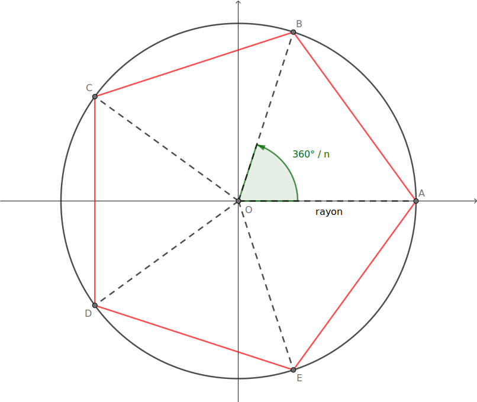
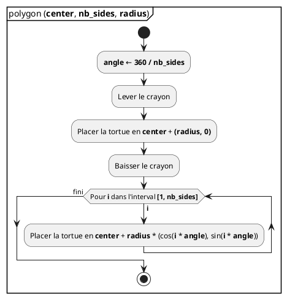
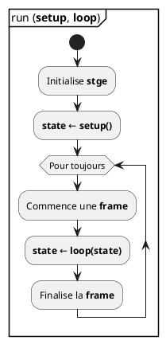

## Tuples

- Séquence **non modifiable** d'éléments [Les éléments d'un tuple ne peuvent pas
  être réassignés et on ne peut pas en ajouter ou en enlever]{.small}

- **Définition** d'un tuple avec `()` [Parenthèses pas obligatoires lorsqu'au
  moins un élément]{.small}

  ```python
  # Tuple vide
  a = ()

  # Tuples contenant un seul élément
  b = 1,
  c = (1,)

  # Tuples contenant trois éléments
  d = 1, 2, 3
  e = (1, 2, 3)
  ```

- **Utilisation** d'un tuple similaire à celle des listes

## Emballage et déballage

- On peut **emballer** plusieurs valeurs dans un tuple [Elles sont toutes
  accessibles à partir d'une seule variable]{.small}

- On peut **déballer** un tuple dans plusieurs variables [Chaque variable reçoit
  la valeur d'un élément du tuple]{.small}

```python
t = 1, 2, 3
print(t)

a, b, c = t
print(a, b, c)
```

```terminal
(1, 2, 3)
1 2 3
```

- Toutes les séquences peuvent se déballer (`tuple`, `list`, `str`, ...)

## Les énumérations

- La fonction `enumerate()` permet d'énumérer les éléments d'une séquence
- Elle génère une séquence de tuple contenant un numéro d'ordre et un élément

```python
L = ['un', 'deux', 'trois']
print(enumerate(L))        # affiche <enumerate at 0x10035e570>
print(list(enumerate(L)))  # affiche [(0, 'un'), (1, 'deux'), (2, 'trois')]
```

- Les tuples peuvent être déballés pendant un `for`

```python
for i, value in enumerate(L):
    print("l'élément d'indice", i, "est", value)
```

```terminal
l'élément d'indice 0 est un
l'élément d'indice 1 est deux
l'élément d'indice 2 est trois
```

## Modules

- Un gros programme est **rarement** écrit en un fichier.
  - Longs fichiers → pas pratique.
  - Travail à plusieurs.
- Un même module peut être utiliser dans **plusieurs** projets.

## Utilisation d'un module

- Importation d'un module:

  ```python
  import turtle

  turtle.forward(90)
  turtle.done()
  ```

- Importation des fonctions d'un module:

  ```python
  from turtle import forward, done

  forward(90)
  done()
  ```

- Pour importer toutes les fonctions, on utilise le `*` _(non recommandé)_:

  ```python
  from turtle import *
  ```

## Définition d'un module

- Créer un fichier `.py` contenant des **définitions de fonctions**.
- _Exemple:_ définissons le module `shape` dans le fichier `shape.py`.

```python
from turtle import color, up, down, goto, done

def polygon(center, nbsides, radius, col='black'):
    # Dessiner un polygone régulier

def square(center, radius, col='black'):
    polygon(center, 4, radius, col)
```

- On peut importer un module dans un autre.

## Dessiner un polygone régulier



## Polygone: Diagramme



## Polygone: Code {.code}

```python
from turtle import color, up, down, goto, done
from math import cos, sin, pi


def polygon(center, nb_sides, radius, col="black"):
    x, y = center  # déballage de séquence
    angle = 2 * pi / nb_sides
    up()
    goto(x + radius, y)
    down()
    color(col)
    for i in range(1, nb_sides+1):
        goto(
            x + radius * cos(i * angle),
            y + radius * sin(i * angle),
        )


def square(center, radius, col="black"):
    polygon(center, 4, radius, col)
```

## Définition d'un module

- On peut ensuite écrire le programme suivant:

```python
from shape import square, polygone, done

polygon((150, 150), 5, 100, 'red')
square((-50, -50), 50, 'blue')

done()
```

- [Documentation de `turtle`](https://docs.python.org/3/library/turtle.html)

## `import` égal exécution

- Lors de l'import d'un module, **tout** le code du module est exécuté
- Ce n'est pas toujours désirable
- Un même fichier est parfois **exécuté comme programme** et parfois **importé
  comme module**.

## La variable `__name__`

- La variable globale `__name__` est définie dans chaque fichier Python :
  - Elle contient un `string` égal au **nom du module**.
  - Dans le programme principal, elle vaut `"__main__"`.
- Pour qu'un module puisse aussi être exécuté comme un programme, on teste
  souvent la variable `__name__`:

  ```python
  # ...

  if __name__ == "__main__":
      polygon((0, 0), 5, 200, 'blue')
      done()
  ```

## Application interactive

- Nous vous avons préparé un petit module permettant de faire des applications
  interactives dans le terminal: [`stge.py`](./stge.py)

## `stge.py`: Utilisation

:::row

::::span8

```python

import stge

def setup():
  # cette fonction doit renvoyer
  # l'état initial de l'application
  return state

def loop(state):
  # cette fonction reçoit l'état précédent
  # de l'application et renvoie l'état suivant
  return state

stge.run(setup, loop)
```

::::

::::span4



::::

:::

## Fonctions disponibles

- `stge.quit()`: Termine l'application
- `stge.size()`: Renvoie la taille du terminal
- `stge.write_at()`: Affiche à une position déterminée du terminal
- `stge.keypresses()`: Renvoie les touches appuyées depuis la dernière _frame_
- `stge.pixels()`: Affiche une grille de pixels en utilisant le caractère
  "demi-bloc"

Utilisez la documentation incluse dans Zed pour savoir comment utiliser ces
fonctions

## Exemple

- Un entier est affiché au milieu de l'écran. La touche `espace` le fait
  augmenter de `1`. La touche `q` quitte le programme.

```python
import stge

def setup():
  return 0

def loop(state):
  width, height = stge.size()

  for key in stge.keypresses():
    if key == "SPACE":
      state += 1
    if key == "q":
      stge.quit()

  stge.write_at(width//2, height//2, state)
  return state

stge.run(setup, loop)
```

## Game Mode

Faisons un petit jeu
