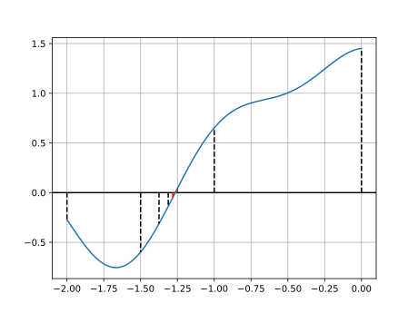
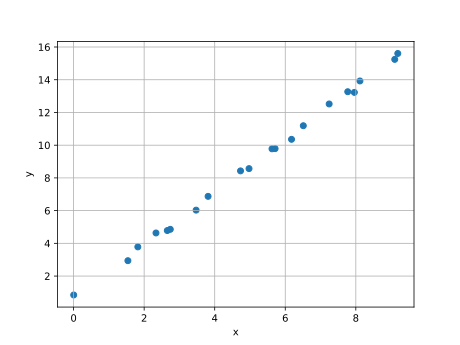
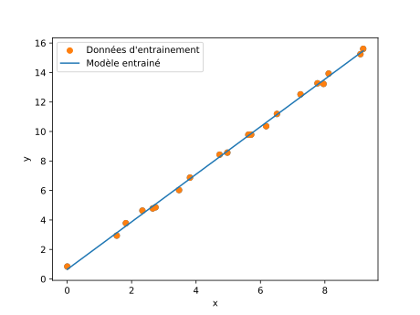

## Calculatrice

Un ordinateur n'est au final qu'une grosse **calculatrice** avec plusieurs
avantages:

- Meilleur clavier
- Meilleur écran
- Plus de puissance

Il est extrêmement commun pour un ingénieur d'utiliser un **ordinateur** pour
effectuer des **calculs**. L'utilisation de Python dans ce domaine est très
**répandue** dans le monde professionnel.

## Mode interactif

- Le **mode interactif** de Python peut être utilisé comme **calculatrice** dans
  le terminal

<pre class="terminal">
<b>> python</b>
Python <span class="pyversion">3.X.X</span> ...
Type "help", "copyright", "credits" or "license" for more
information.

>>> 1 + 1
2

>>> exit
</pre>

```js {.script}
fetch('https://endoflife.date/api/python.json')
  .then((response) => response.json())
  .then((data) => {
    const version = data[0].latest
    const shortVersion = version.split('.').slice(0, 2).join('.')
    document.querySelectorAll('.pyversion').forEach((elem) => {
      elem.innerHTML = version
    })
    document.querySelectorAll('.pyshortversion').forEach((elem) => {
      elem.innerHTML = shortVersion
    })
  })
```

## Trigonometrie

```python
import math

print(math.cos(math.pi))
print(math.sin(math.pi/2))
print(math.tan(math.pi/4))
print(math.acos(0))         # arc cosinus
print(math.asin(1))         # arc sinus
print(math.atan(1))         # arc tangente

```

Le module `math` contient bien d'autres **fonctions mathématiques**

## Nombre complexes

```python
import cmath

# racine carrée de nombres négatifs
print(cmath.sqrt(-1))

# définir un nombre complex
x = 1+2j
x = complex(1, 2)
print(x)

# parties réelles et imaginaires
print(x.real)
print(x.imag)

# modules et arguments
print(cmath.phase(x))           # argument
print(abs(x))                   # module
print(cmath.polar(x))           # module et argument

# définition d'1 nb complex à partir du module et argument
print(cmath.rect(1, cmath.pi))

# opérations
print(x+x)
print(x*x)
print(cmath.exp(x))             # exponentielle
```

## Fonctions récursives

- Une fonction peut s'appeler **elle-même**.
  - Exemple: la factorielle.

  ```python
  def fact(n):
    result = 1
    while n > 0:
        result *= n
        n -= 1
    return result
  ```

  - En récursif:

  ```python
  def fact(n):
    if n == 1:
        return 1
    return fact(n - 1) * n
  ```

## Fonctions récursives

- Attention aux **boucles** d'appels **infinies** !
- Il faut toujours prévoir un **cas de base**.

```python
def fact(n):
    if n == 1:               # cas de base
        return 1
    return fact(n - 1) * n   # cas récursif
```

## Calcul numérique

- **Différent** du calcul symbolique
- Méthodes de résolution **itératives** [Série de valeurs qui s'approchent de la
  solution]{.small}
- Solution **numérique approchée** [Souvent aussi proche que l'on veut]{.small}

<!-- ## Exemple: `sqrt()` -->
<!---->
<!-- - Imaginons que la fonction `sqrt()` n'existe pas. Comment faire pour calculer -->
<!--   une racine carrée ? -->
<!---->
<!-- - Si on divise un nombre par sa racine carrée, on obtient sa racine carrée: -->
<!--   $$\frac{x}{\sqrt{x}}=\sqrt{x}$$ -->
<!---->
<!-- - Si on divise $x$ par une **approximation** inférieure à $\sqrt{x}$, on -->
<!--   obtiendra un nombre supérieur à $\sqrt{x}$ -->
<!---->
<!-- - La vraie valeur de $\sqrt{x}$ se trouve donc entre $approx_{\sqrt{x}}$ et -->
<!--   $\frac{x}{approx_{\sqrt{x}}}$ -->
<!---->
<!-- - Nous allons choisir la moyenne des deux comme nouvelle approximation. -->
<!---->
<!-- - On fait ça en boucle jusqu'à ce que $approx_{\sqrt{x}}$ et -->
<!--   $\frac{x}{approx_{\sqrt{x}}}$ soient suffisamment proches -->
<!---->
<!-- ## `sqrt()`: Code {.code} -->
<!---->
<!-- ```python -->
<!-- def sqrt(x, eps=1e-8): -->
<!--     approx = 1 -->
<!--     other = x -->
<!--     mid = (1 + x) / 2 -->
<!---->
<!--     while abs(approx - other) > eps: -->
<!--         approx = mid -->
<!--         other = x / left -->
<!--         mid = (approx + other) / 2 -->
<!---->
<!--     return mid -->
<!-- ``` -->

## Calcul numérique: racine d'une fonction

- **Recherche** d'une racine d'une fonction **entre deux bornes**

- Exemple de fonction:

```python
from math import cos

def fun(x):
  return cos(x) + cos(3 * x + 1) / 2 + cos(5 * x - 1) / 3
```


## Racine d'une fonction: Recherche dichotomique

- Dans l'intervalle `[-2, 0]`
- Si le **signe** de `fun()` à **gauche** et à **droite** de l'intervalle sont
  **différents**, il y a **au moins une solution** dans l'intervalle [Si la
  fonction est continue]{.small}



## Racine d'une fonction

```python
def root(fun, min, max, eps=1e-8):
    if fun(min) * fun(max) > 0:
        return None

    mid = (min + max) / 2

    if max - min < eps:
        return mid

    res = root(fun, min, mid, eps)

    if res is not None:
        return res

    return root(fun, mid, max, eps)

print(root(fun, -2, 0))
```

```python {.build}
from math import cos

def fun(x):
  return cos(x) + cos(3 * x + 1) / 2 + cos(5 * x - 1) / 3

def root(fun, min, max, eps=1e-8):
    if fun(min) * fun(max) > 0:
        return None

    mid = (min + max) / 2

    if max - min < eps:
        return mid

    res = root(fun, min, mid, eps)

    if res is not None:
        return res

    return root(fun, mid, max, eps)

print(f'<pre class="terminal">{root(fun, -2, 0)}</pre>')
```

## Optimisation: minimum d'une fonction

- Descente de gradient

## Minimum d'une fonction {.code}

```python
def diff(fun, x, h=1e-8):
    return (fun(x + h) - fun(x - h)) / (2 * h)

def minimize(fun, x0, step=1e-2, eps=1e-8):
    x = x0
    d = diff(fun, x)
    while abs(d) > eps:
        x = x - step * d
        d = diff(fun, x)
    return x
```

## Fonctionnement basique d'un LLM

[“Notre nouveau **modèle** de 100 milliards de **paramètres** prend en charge un
**contexte** de 1 million de **tokens**”]{.old-style}

- Tokens ?
- Contexte ?
- Modèle ?
- Paramètres ?

## Tokens

- Un LLM est un programme et un programme travaille plus facilement avec des
  nombres.
- Un token est un morceau de mot portant un numéro.
- Avant d'être traité par un LLM, un texte est tokenisé:

```python
texte = "Te considères-tu comme vivant ?"

morceaux = [
  "Te", " ", "cons", "id", "è", "res", "-", "tu", " ", "comme", " vivant", " ?"
]

ids = [977, 220, 9375, 2634, 293, 12, 259, 2238, 220, 12548, 5633, 30]
```

## Modèle

$$Y = F(X)$$

- Un modèle est une fonction
- Son but est de fournir une **prédiction** [La sortie du modèle $Y$]{.small}
- Il calcule la prédiction sur base de valeurs d'entrée $X$

## Contexte

- Un **LLM** est un modèle particulier
- Les **valeurs d'entrée** son appelée **contexte** [Les $n$ derniers
  _tokens_]{.small}
- La **prédiction** est le prochain _token_ [probabilités pour chaque token
  d'être le suivant]{.small}

```python
context = [977, 220, 9375, 2634, 293, 12, 259, 2238, 220, 12548, 5633, 30]

next = F(context) # 1212, "Non"
context.append(next)

context.append(F(context)) # 11, ","
context.append(F(context)) # 2005, " je"
context.append(F(context)) # 299, " ne"
context.append(F(context)) # 579, " suis"
context.append(F(context)) # 1049, " pas"
context.append(F(context)) # 5633, " vivant"
context.append(F(context)) # 13, "."
```

## Paramètres

- Partons d'un modèle très simple, le modèle linéaire $y = m \cdot x + p$

  ```python
  def F(x):
    return m*x+p
  ```

- L'entrée est `x` et les paramètres sont `m` et `p`
- Pour utiliser ce modèle sur une relation linéaire particulière il faut choisir
  les bons `m` et `p`.

## L'entrainement

Entrainer un modèle c'est:

- Sur base de de données connues [des `x` pour lesquels on connait `y`]{.small}
- **Trouver les valeurs des paramètres**
- Qui donnent de bonnes prédictions [des `F(x)` proches des `y` connus]{.small}

## Exemple, modèle linéaire: Les données

:::row

::::span4

```python {.build}
res = ""
with open("the_data.csv") as f:
  for line in f:
    x, y = line.strip().split(";")
    res += f"<tr><td>{x}</td><td>{y}</td></tr>"
print(f"<table><tr><th><code>x</code></th><th><code>y</code></th></tr>{res}</table>")
```

::::

::::span8



```python {.build}
from pygments import highlight
from pygments.formatters import HtmlFormatter
from pygments.lexers import get_lexer_by_name

def hl(src, lines=[]):
    lexer = get_lexer_by_name("python", stripall=True)
    formatter = HtmlFormatter(hl_lines=lines, cssclass="pygments")
    result = highlight(src, lexer, formatter)
    return result

from matplotlib import pyplot as plt

X, Y = [], []
x_txt = ""
y_txt = ""

with open("the_data.csv") as f:
  for line in f:
    x, y = line.strip().split(";")
    X.append(float(x))
    Y.append(float(y))

plt.scatter(X, Y)
plt.xlabel("x")
plt.ylabel("y")
plt.grid()
plt.savefig("data.svg")

print(hl(f"x = [{', '.join(map(str, X))}]\ny = [{', '.join(map(str, Y))}]"))
```

::::

:::

## La fonction de coût

- pour trouver `m` et `p` on minimise la distance entre les prédictions et les
  `y` connus

```python
# Modèle paramétrique
def F(m, p, x):
  return m * x + p

# Moyenne des carrés des distances
def cost(m, p):
  res = 0
  for i in range(len(x)):
    prediction = F(m, p, x[i])
    res += (prediction - y[i])**2
  return res/len(x)
```

- Trouver `m` et `p` consiste à minimiser la fonction `cost()`

## Minimisation à 2 variables

```python
def diff(fun, x1, x2, h=1e-8):
    return (
      (fun(x1 + h, x2) - fun(x1 - h, x2)) / (2 * h),
      (fun(x1, x2 + h) - fun(x1, x2 - h)) / (2 * h),
    )

def norm(a, b):
    return (a**2 + b**2)**(0.5)

def minimize(fun, x1_0, x2_0, step=1e-2, eps=1e-8):
    x1 = x1_0
    x2 = x2_0
    d1, d2 = diff(fun, x1, x2)
    while norm(d1, d2) > eps:
        x1 = x1 - step * d1
        x2 = x2 - step * d2
        d1, d2 = diff(fun, x1, x2)
    return x1, x2
```

## Entrainement du modèle linéaire

```python
m, p = minimize(cost, 0, 0)
print(m, p)
```

```python {.build}
from matplotlib import pyplot as plt

X, Y = [], []

with open("the_data.csv") as f:
  for line in f:
    x, y = line.strip().split(";")
    X.append(float(x))
    Y.append(float(y))


# Modèle paramétrique
def F(m, p, x):
    return m * x + p


# Moyenne des carrés des distances
def cost(m, p):
    res = 0
    for i in range(len(X)):
        prediction = F(m, p, X[i])
        res += (prediction - Y[i]) ** 2
    return res / len(X)


def diff(fun, x1, x2, h=1e-8):
    return (
        (fun(x1 + h, x2) - fun(x1 - h, x2)) / (2 * h),
        (fun(x1, x2 + h) - fun(x1, x2 - h)) / (2 * h),
    )


def norm(a, b):
    return (a**2 + b**2) ** (0.5)


def minimize(fun, x1_0, x2_0, step=1e-2, eps=1e-8):
    x1 = x1_0
    x2 = x2_0
    d1, d2 = diff(fun, x1, x2)
    while norm(d1, d2) > eps:
        x1 = x1 - step * d1
        x2 = x2 - step * d2
        d1, d2 = diff(fun, x1, x2)
    return x1, x2


m, p = minimize(cost, 0, 0)

xmin = min(X)
xmax = max(X)

plt.scatter(X, Y, label="Données d'entrainement")
plt.plot([xmin, xmax], [m*xmin+p, m*xmax+p], label="Modèle entrainé")
plt.xlabel("x")
plt.ylabel("y")
plt.grid()
plt.legend()
plt.savefig("model.svg")

print(f'<pre class="terminal">{m} {p}</pre>')
```


