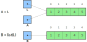
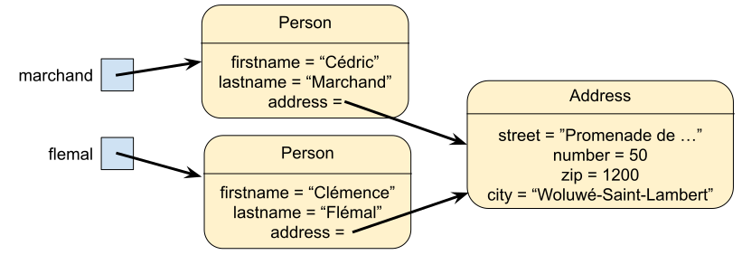

## Imbrication de données

- **Imbriquer** des données <small>Insertion d'une structure de données comme élément d'une autre</small>
- **Contraintes** selon la structure principale [Éléments d'un ensemble et clés d'un dictionnaire non modifiables]{.small}
- Représentation de **données complexes** [Bien organiser et définir la structure de données]{.small}

## Liste à deux dimensions

- On peut construire une liste dont les **éléments sont des listes**
- **Accès multiples** à faire pour accéder aux éléments imbriqués

```python
A = [1, 2]
B = [3, 4, 5]
L = [A, B]                # Équivalent à L = [[1, 2], [3, 4, 5]]

print(L[0][1])            # 2
print(L[1][2])            # 5
```

{width=50%}

## Parcours d'une liste à deux dimensions

- Parcours à l'aide d'une **double boucle** [Imbrication d'une boucle dans une autre, `while` ou `for`]{.small}
- La première boucle passe en revue les **listes imbriquées** [La seconde boucle parcourt les éléments de chaque liste imbriquée]{.small}

```python
L = [[1, 2], [3, 4, 5]]

for elem in L:            # elem est une liste
  for data in elem:       # data est un nombre entier
    print(data, end=' ')
  print('| ', end='')
```

```terminal
1 2 | 3 4 5 |
```

## Représentation d'une matrice

- **Matrice** représentée par une liste à deux dimensions [Toutes les listes imbriquées ont le même nombre d'éléments]{.small}
- Stockage d'une **liste des lignes** de la matrice
  - La première dimension représente les lignes
  - Colonnes représentées par la deuxième dimension

```python
M = [[1, 2, 3], [4, 5, 6]]
```

$$ M = mat(1, 2, 3; 4, 5, 6) "Par exemple, M[1][0] vaut 4" $$

## Parcours d'une matrice

- Dimension de la matrice obtenue avec la fonction `len` [La matrice a `len(M)` lignes et `len(M[0])` colonnes]{.small}
- Parcours avec boucle `while` et indices ou avec boucle `for`

```python
# Avec une boucle while
i = 0
while i < len(M):
	j = 0
	while j < len(M[0]):
		print(M[i][j])
		j += 1
	i += 1

# Avec une boucle for
for line in M:
	for elem in line:
		print(elem)
```

## Structures imbriquées

- Imbrication d'autres structures **dans des listes** [Liste de tuples, ensembles et dictionnaires]{.small}

```python
# Liste de tuples
coords = [(0,0), (7,-2), (4,5), (-3,-9)]

# Liste d'ensembles
lunches = [
  {'apple', 'banana', 'grape'},
  {'yogurt', 'cereals'},
  {'bread', 'cheese', 'ham'},
  {'sausage'}
]

# Liste de dictionnaires
contacts = [
  {'firstname': 'Alexis', 'lastname': 'King'},
  {'firstname': 'Brice', 'lastname': 'Monster'},
  {'firstname': 'Sébastien', 'lastname': 'Adams'}
]
```

## Structures imbriquées

- Structures imbriquées en **clés et valeurs** de dictionnaires [Les clés d'un dictionnaire doivent être non modifiables]{.small}

```python
# Tuples en clés d'un dictionnaire
config = {
  (0, 0): 'Arnaud',
  (2, 1): 'Louis',
  (-1, 3): 'Marie',
  (3, -1): 'Dan'
}

# Listes en valeurs d'un dictionnaire
config = {
  (0, 0): ['Arnaud', 'Pierre'],
  (2, 1): ['Louis'],
  (-1, 3): ['Marie', 'Éric', 'Tom'],
  (3, -1): ['Dan']
}
```

## Imbrication complexes

- On peut imbriquer des structures à plusieurs niveaux [Des séquences, ensembles et dictionnaires]{.small}

```python
address = {'street': "Promenade de l'Alma", 'number': 50,
  'zip': 1200, 'city': "Woluwé-Saint-Lambert"}
marchand = {'firstname': "Cédric", 'lastname': "Marchand",
  'address': address}

# Équivalent à
# marchand = {'firstname': "Cédric", 'lastname': "Marchand",
# 'address': {'street': "Promenade de l'Alma", 'number': 50,
# 'zip': 1200, 'city': "Woluwé-Saint-Lambert"}}

print(marchand['firstname'])          # Cédric
print(marchand['address']['city'])    # Woluwé-Saint-Lambert
```

## Attention aux références

- **Qu\'affiche le code suivant** après exécution ?
  - `magic1` appelle une méthode sur `data`
  - `magic2` modifie la variable locale `data`

```python
def magic1(data: list[int]):
    data.append(4)

def magic2(data: list[int]):
    data = []

a = [0, 1, 2, 3]
print(a)

magic1(a)
print(a)

magic2(a)
print(a)
```

## Copie

- Affecter une même liste à deux variables crée un **alias** [Même
  chose pour les séquences, les ensembles et les
  dictionnaires]{.small}
- On crée une **véritable copie** de liste avec la fonction `list` [Ou
  avec les fonctions `set`, `dict`\...]{.small}

```python
L = [1, 2, 3, 4, 5]
A = L                                   # A est un alias de L
A[0] = 42
print(L)                                # [42, 2, 3, 4, 5]

L = [1, 2, 3, 4, 5]
B = list(L)                             # B est une copie de L
B[0] = 42
print(L)                                # [1, 2, 3, 4, 5]
```

## Copie

{style="width: 25em"}

## Copie de structures imbriquées

- Pas de soucis de copies pour les **collections non modifiables**
- La copie ne se fait **pas en profondeur** [Seuls les éléments de
  \"premier niveau\" sont copiés]{.small}

```python
L = [[1, 2], [3, 4, 5]]
A = list(L)

A[1][0] = 42
print(L)                 # [[1, 2], [42, 4, 5]]
```

{style="width: 20em"}

## Module `copy`

- Deux fonctions proposées par le **module `copy`**
  - `copy` pour une copie \"_shallow_\"
  - `deepcopy` pour une copie \"_deep_\"
- Une **copie en profondeur** peut prendre du temps [Et aussi
  consommer beaucoup d\'espace mémoire]{.small}

```python
import copy

L = [[1], [2, 3], [4, 5, 6]]
A = copy.copy(L)                   # A est une copie shallow de L
B = copy.deepcopy(L)               # A est une copie deep de L
```

## Classes et objets

- problèmes avec l'utilisation de **dictionnaires** pour représenter des **objets complexes**.

```python
address = {'street': "Promenade de l'Alma", 'number': 50,
  'zip': 1200, 'city': "Woluwé-Saint-Lambert"}
marchand = {'firstname': "Cédric", 'lastname': "Marchand",
  'address': address}

print(type(address))      # <class dict>
print(type(marchand))     # <class dict>
```

- Le **type** d'un dictionnaire est `dict` [Impossible de différencier les types d'objects]{.small}

## Classes et objects

- Même problème avec les **annotations de types**

```python
from typing import Any

def fullname(person: dict[str, Any]) -> str:
  return f"{person['firstname']} {person['lastname']}"

def display_address(address: dict[str, Any]) -> str:
  return f"{address['street']}, {address['number']}\n{address['zip']} {address['city']}"

print(display_address(marchand))  # KeyError
```

- Ces annotations trop **vagues** ne permettent **pas** de détecter l'erreur
- Aucune aide pour **l'auto-completion** des **clés** d'un dictionnaire.

## Classes et objets

- L'idéal serait de pourvoir **créer les types** `Address` et `Person`
- `marchand` référencera alors une valeur du type `Person`
- `address` référencera une valeur du type `Address`
- Ces types s'appellent **classes**
- Les valeurs d'une classe s'appellent **objets** ou **instances**
- En réalité, tous les types que nous avons vu (`int`, `float`, `str`, `list`, ...) sont des classes. [Et les valeurs des objets]{.small}

## Création d'une classe

```python
class Address:
  def __init__(self, street: str, number: int, zip: int, city: str):
    self.street = street
    self.number = number
    self.zip = zip
    self.city = city


address = Address("Promenade de l'Alma", 50, 1200, "Woluwé-Saint-Lambert")
print(address.zip)        # 1200
```

- La classe `Address` contient une **méthode** nommée `__init__` qui sert à initialiser **un nouvel objet** de la classe. [Cette méthode est aussi appelée **le constructeur** de la classe]{.small}
- Le nouvel objet est dans la variable `self`.
- La méthode `__init__` peut recevoir autant de paramètres supplémentaires que l'on veut.
- Elle sert à initialiser les **attributs** de l'objet [`street`, `number`, `zip` et `city`]{.small}

## Fonctionnalités d'une classe

```python
class Address:
  def __init__(self, street: str, number: int, zip: int, city: str):
    self.street = street
    self.number = number
    self.zip = zip
    self.city = city

  def display(self):
    return f"{self.street}, {self.number}\n{self.zip} {self.city}"

address = Address("Promenade de l'Alma", 50, 1200, "Woluwé-Saint-Lambert")
print(address.display())        # Promenade de l'Alma, 50
                                # 1200 Woluwé-Saint-Lambert
```

- Comme nous l'avons vu avec la classe `list`, une classe peut avoir des fonctionnalités. [La fonctionnalité `append()` pour la classe `list` par exemple]{.small}

- Ces fonctionnalités sont appelées **méthodes** et sont des fonctions créées dans la classe et prenant l'objet à traiter en paramètre (`self`).

## Objet et classe

- Un objet est une **instance** d\'une classe [Une classe est un
  modèle à partir duquel on construit des objets]{.small}
- La classe définit **deux éléments** constitutifs des objets [Les
  attributs et les fonctionnalités de l\'objet]{.small}

## Attribut et fonctionnalité

- Un attribut est une **donnée** stockée dans un objet [Les valeurs
  des attributs définissent l\'état de l\'objet]{.small}
- Une **fonctionnalité** permet d\'effectuer une action [Obtenir une
  information sur l\'objet ou donner un ordre]{.small}

## Utilisation d\'un objet

- Pour pouvoir créer des objets, il faut une **classe** [Une
  définition unique permet de créer plusieurs objets]{.small}
- Une fois créée, interaction avec **attribut et fonctionnalité**
  [Utilisation de l\'opérateur d\'accès/appel sur l\'objet]{.small}

```python
# Construction d'un objet
address = Address("Promenade de l'Alma", 50, 1200, "Woluwé-Saint-Lambert")

# Accès à un attribut
print(address.zip)              # 1200

# Appel d'une méthode
print(address.display())        # Promenade de l'Alma, 50
                                # 1200 Woluwé-Saint-Lambert
```

## Définir une classe

- **Définition** d\'une classe avec le mot réservé `class`
  - Corps de la classe est un bloc de code indenté
  - Le corps de la classe peut contenir des définitions de méthodes
- Classe minimale grâce à l\'**instruction `pass`** [Aussi appelée
  instruction vide car ne fait rien]{.small}

```python
class Person:
    pass
```

## Créer une instance

- Un objet est une **instance** d\'une classe [À partir d\'une classe,
  on crée autant d\'objets que l\'on veut]{.small}

```python
a = Person()
b = Person()

```

{.half}

## Définir un constructeur

- **Initialisation** d\'un objet par la méthode spéciale `__init__`
  [Admet au moins un paramètre qui est `self`]{.small}
- Le paramètre `self` référence l\'**objet à construire** [Permet
  d\'accéder aux attributs et fonctionnalités de l\'objet]{.small}

```python
class Person:
  def __init__(self, firstname: str, lastname: str, address: Address):
    self.firstname = firstname
    self.lastname = lastname
    self.address = address
```

## Appeler un constructeur

- Méthode appelée au moment de la **création d\'un objet** [Initialise
  l\'objet, en donnant une valeur à ses variables]{.small}

```python
address = Address("Promenade de l'Alma", 50, 1200, "Woluwé-Saint-Lambert")
marchand = Person("Cédric", "Marchand", address)
flemal = Person("Clémence", "Flemal", address)
```



## Objet et référence

- Un objet est une **instance** d\'une classe [L\'instanciation d\'une
  classe produit un objet]{.small}
- Stockage d\'une **référence** vers l\'objet dans une variable
  [L\'adresse où l\'objet se situe en mémoire]{.small}

```python
print(marchand)
print(flemal)
```

```terminal
<__main__.Person object at 0x109678748>
<__main__.Person object at 0x109678780>
```

## Variable d\'instance

- **Variables d\'instance** attachées à un objet définissent son état
  [Chaque objet possède ses propres copies de ces variables]{.small}
- Accès aux variables d\'instance avec l\'**objet cible** [Ou `self` à
  l\'intérieur du code de la classe]{.small}

```python
print(marchand.firstname)
print(flemal.address.number)
```

```terminal
Cédric
50
```

## Programmation orientée objet

- La **programmation orientée objet** manipule des objets [Concepts et
  entités représentés par des objets]{.small}
- Représenter des objets **concrets ou conceptuels** du monde réel
  [Une personne, un moyen de transport, une date, une
  liste\...]{.small}
- Création de **nouveaux types de données** [Permet une programmation
  de plus haut niveau]{.small}

## État d\'un objet

- Chaque objet est unique et possède son propre **état** [Identité
  propre à chaque objet, avec ses propres attributs]{.small}
- L\'état d\'un objet est **modifiable ou non** - Objet immuable aura toujours le même état - État d\'un objet non modifiable ne peut être changé

## Identité d\'un objet

- **Identité** d\'un objet propre à chaque objet créé [Caractérisée
  par son emplacement en mémoire]{.small}
- Fonction prédéfinie **`id`** renvoie l\'identité

```python
prof = flemal
print(id(marchand))
print(id(flemal))
print(id(prof))
```

```terminal
4302577224
4329799752
4329799752
```

## Définir un vecteur dans le plan

- Deux variables d\'instance pour représenter les **coordonnées** [Les
  deux variables `self.x` et `self.y` représentent $(x, y)$]{.small}
- Une méthode `norm` pour calculer la **longueur du vecteur** [La
  norme vaut $sqrt(x^2 + y^2)$]{.small}

```python
class Vector:
  def __init__(self, x: float, y: float):
    self.x = x
    self.y = y

  def norm(self):
    return sqrt(self.x ** 2 + self.y ** 2)

u = Vector(1, -1)
print(u.norm())
```

```terminal
1.4142135623730951
```

## `self`

- La **variable d\'instance** est accessible dans toute la classe
  [Existe en mémoire pendant toute la durée de vie de
  l\'objet]{.small}
- Opposée à la **variable locale** qui n\'existe que dans la méthode

```python
class Vector:
  def __init__(self, x: float, y: float):
    pass

  def norm(self):
    return sqrt(x ** 2 + y ** 2)

u = Vector(1, -1)
print(u.norm())
```

```terminal
Traceback (most recent call last):
File "program.py", line 38, in
    print(u.norm())
File "program.py", line 35, in norm
    return sqrt(x ** 2 + y ** 2)
NameError: name 'x' is not defined
```

## Représentation d'un objet

- La méthode `__str__` construit une **représentation `str` de l'objet**
  [Renvoie une chaine de caractères lisible de l'objet]{.small}

```python
class Vector:
  def __init__(self, x: float, y: float):
    self.x = x
    self.y = y

  def __str__(self):
    return f'({self.x}, {self.y})'

u = Vector(1, -1)
print(u)
```

```terminal
(1, -1)
```

## Égalité

- L\'opérateur d\'égalité **compare les références** des variables [Le
  contenu des objets n\'est pas comparé]{.small}

```python
u = Vector(1, -1)
v = Vector(1, -1)
print(u == v)                  # False
```

## Alias

- Un **alias** est une copie de la référence vers un objet [Il n\'y a
  qu\'une seule copie de l\'objet en mémoire]{.small}

```python
u = Vector(1, -1)
v = u
print(u == v)                  # True
```

## Surcharge d'opérateur

- On peut **redéfinir** les opérateurs de comparaison [`__lt__` pour
  `<`, `__le__` pour `<=`, `__eq__` pour `==`\...]{.small}

```python
from typing import Self

class Vector:
  def __init__(self, x: float, y: float):
      self.x = x
      self.y = y

  def __eq__(self, other: Self):
      return self.x == other.x and self.y == other.y

  # ...

u = Vector(1, -1)
v = Vector(1, -1)
print(u == v)                  # True
print(u is v)                  # False
```

- Surcharge de l\'opérateur d\'égalité pour **comparer les objets**
  [Le contenu des objets sera comparé, et non plus les
  références]{.small}
- **Comparaison des identités** avec l\'opérateur `is` [Comparaison
  des références des objets]{.small}

## Surcharge d'opérateur

- On peut **redéfinir** les opérateurs arithmétiques [`__add__` pour
  `+`, `__sub__` pour `-`, `__mul__` pour `*`\...]{.small}

```python
from typing import Self

class Vector:
  def __init__(self, x: float, y: float):
    self.x = x
    self.y = y

  def __add__(self, other: Self):
    return Vector(self.x + other.x, self.y + other.y)

  # ...

u = Vector(1, -1)
v = Vector(2, 1)
print(u + v)

```

```terminal
(3, 0)
```

## Composition d'objets

- On peut **composer** plusieurs objets ensemble [En utilisant des
  variables d\'instance de type objet]{.small}

```python
class Rectangle:
  def __init__(self, lowerleft: Vector, width: float, height: float, angle: float = 0):
    self.lowerleft = lowerleft
    self.width = width
    self.height = height
    self.angle = angle

p = Vector(1, -1)
r = Rectangle(p, 100, 50)
print(r.lowerleft)             # (1, -1)
```

## Réutilisation de code

- On peut **réutiliser le code** définit pour les objets composés [Il
  suffit d\'appeler les méthodes des variables objet]{.small}

```python
class Rectangle:
  # ...

  def __str__(self):
    return f"Rectangle en {self.lowerleft} + de longueur {self.width}" \
           f"et de hauteur {self.height} incliné de {self.angle} degrés"

r = Rectangle(Vector(1, -1), 100, 50)
print(r)
```

```terminal
Rectangle en (1, -1) de longueur 100 et de hauteur 50 incliné
de 0 degrés
```

- Ici l'affichage en `str` de `self.lowerleft` fait appel à la méthode `__str__` de la classe `Vector`

## Simplification

- Reprenons la classe `Address`

```python
class Address:
  def __init__(self, street: str, number: int, zip: int, city: str):
    self.street = street
    self.number = number
    self.zip = zip
    self.city = city

  def display(self):
    return f"{self.street}, {self.number}\n{self.zip} {self.city}"
```

- L'écriture du constructeur semble très répétitive. [C'est très souvent le cas]{.small}
- Si on voulait lui ajouter une méthode `__eq__` elle serait aussi fort peu intéressante à écrire.
- Comme ce genre de classes est très courant, il existe une moyen plus court de les définir

## `dataclass`

```python
from dataclasses import dataclass

@dataclass
class Address:
  street: str
  number: int
  zip: int
  city: str

address = Address("Promenade de l'Alma", 50, 1200, "Woluwé-Saint-Lambert")
print(address.zip) # 1200
print(address)     # Address(street="Promenade de l'Alma", number=50,
                   #         zip=1200, city='Woluwé-Saint-Lambert')

address2 = Address("Promenade de l'Alma", 50, 1200, "Woluwé-Saint-Lambert")
print(address == address2) # True
```

- Une `dataclass` a automatiquement un constructeur, une méthode `__eq__`, une méthode `__str__` [Et d'autres choses qui dépassent le cadre de ce cours]{.small}

## `dataclass`

- On peut bien entendu ajouter d'autres méthodes

```python
from dataclasses import dataclass

@dataclass
class Address:
  street: str
  number: int
  zip: int
  city: str

  def display(self):
    return f"{self.street}, {self.number}\n{self.zip} {self.city}"
```

- et définir notre propre `__str__`

```python
from dataclasses import dataclass

@dataclass
class Address:
  street: str
  number: int
  zip: int
  city: str

  def display(self):
    return f"{self.street}, {self.number}\n{self.zip} {self.city}"

  def __str__(self):
    return self.display()
```

## `dataclass`

- réécrivons la classe `Vector` sous forme de `dataclass`

```python
from dataclasses import dataclass

@dataclass
class Vector:
  x: float
  y: float

  def __add__(self, other: Self):
    return Vector(self.x + other.x, self.y + other.y)

  def __str__(self):
    return f'({self.x}, {self.y})'
```
