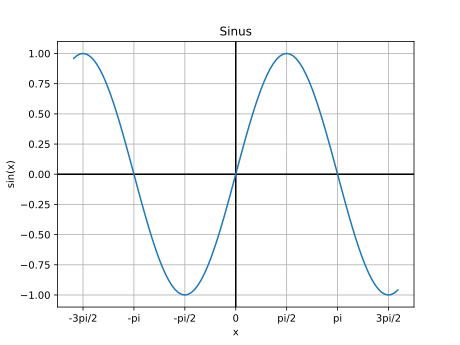
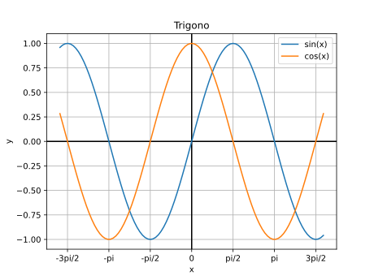
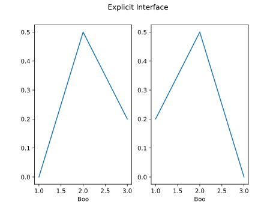
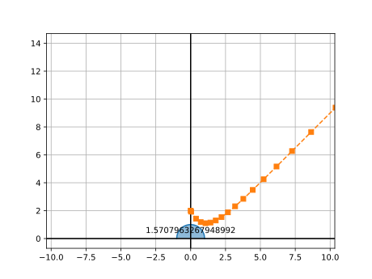
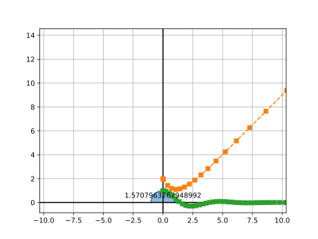

## Rappels

Un ordinateur n'est au final qu'une grosse **calculatrice** avec plusieurs
avantages:

- Meilleur clavier
- Meilleur écran
- Plus de puissance

Il est extrêmement commun pour un ingénieur d'utiliser un **ordinateur** pour
effectuer des **calculs**. L'utilisation de Python dans ce domaine est très
**répandue** dans le monde professionnel.

## Rappels: Calcul numérique

- **Différent** du calcul symbolique
- Méthodes de résolution **itératives** [Série de valeurs qui s'approchent de la
  solution]{.small}
- Solution **numérique approchée** [Souvent aussi proche que l'on veut]{.small}

## Outil: `numpy`

- Bibliothèque à **installer**

  ```terminal
  > python -m pip install numpy
  ```

- Permet de travailler **très efficacement** avec des **vecteurs de nombres**
- **Incontournable** pour le calcul numérique en Python

## `numpy`

- Utilisation d'un alias pour l'`import`

  ```python
  import numpy as np
  ```

- Création d'un vecteur

  ```python
  v = np.array([1, 1, 3])
  ```

- Opérations

  ```python
  print(2*v)                   # Multiplication par un scalaire
  print(v+v)                   # Somme
  print(v.dot(v))              # Produit scalaire
  print(v @ v)                 # Produit scalaire
  v2 = np.array([2, -1, 2]
  print(np.cross(v, v2)))      # Produit vectoriel
  print(np.linalg.norm(v))     # Norme
  ```

## Vecteurs

- Plusieurs manières de créer des vecteurs de valeurs [Depuis une structure
  Python, ou par des fonctions de Numpy]{.small}

```python
np.array([1, 2, 3])
np.zeros(5)
np.ones(10)
np.random.random(10)
np.random.randn(10)
np.linspace(0, 10, 5)
np.arange(0, 10, 0.2)
```

## Opérations

- Entre vecteur et scalaire

  ```python
  a = np.array([1, 2, 3, 4])
  a + 1       # [2, 3, 4, 5]
  2 * a       # [2, 4, 6, 8]
  a ** 2      # [1, 4, 9, 16]
  1 / a       # [1.0, 0.5, 0.3333, 0.25]
  a < 3    # [True, True, False, False]
  ```

- Entre vecteurs de même taille [élément par élément]{.small}

  ```python
  a = np.array([1, 2, 3, 4])
  b = np.array([5, 6, 7, 8])
  a + b    # [6, 8, 10, 12]
  a * b    # [5, 12, 21, 32]
  ```

## Fonctions vectorisées

- Fonctions qui s'applique sur tous les éléments d'un vecteur

```python
x = np.array([1, 2, 3])

# Fonction standard ne marche pas
y = math.sin(x) # Error

# Fonction vectorisée existe dans numpy
y = np.sin(x)
```

## Créer une fonction vectorisée

- La plupart des opérations de base sont déjà supportées par numpy.

- Mais il est facile de créer des fonctions vectorisées:

```python
@np.vectorize
def fun(a, b):
  if a > b:
    return 1
  return -1

x = np.array([1, 2, 3])
y = np.array([3, 2, 1])

print(fun(x, y))
```

## `numpy`: Calcul Matriciel

- `numpy` permet aussi de travailler avec des matrices

```python
A = np.array([[1, 2],
              [3, 4]])
```

## Même opérations que le vecteurs

- Opérations avec scalaires

  ```python
  A = np.array([[1, 2],
                [3, 4]])
  2*A         #[[2, 4],
              # [6, 8]]
  ```

- Opérations avec tableaux de même taille et produit matriciel

  ```python
  B = np.array([[5, 6], [7, 8]])
  A * B       # produit élément par élément
  A @ B       # produit matriciel
  ```

- Fonctions sur les tableaux

  ```python
  np.sin(A)   # [[ 0.84147098  0.90929743]
              #  [ 0.14112001 -0.7568025 ]]
  ```

## Attributs

```python
x = np.array([[1, 2],
              [3, 4],
              [5, 6]])

x.ndim   # Dimension => 2
x.shape  # Forme => (3, 2)
x.size   # Nombre total d’éléments => 6
x.dtype  # Type de données stockées => dtype('int32')
```

## Indexation

```python
x = np.array([[1, 2],
              [3, 4],
              [5, 6]])

x[0, 1]                 # x[0][1] => 2

# Slice
x[:2, 1]                # [2, 4]
x[[0, 2], :]            # [[1, 2], [5, 6]]

# Indexation booléenne
x[[[True , False],
   [False, True ],
   [True , True ]]]     # [1, 4, 5, 6]
x[x < 4]                # [1, 2, 3]

# Edition conditionnelle
x[x < 4] = 0            # [[0, 0],
                        #  [0, 4],
                        #  [5, 6]]
```

## Méthodes

```python
x = np.array([[1, 2],
              [3, 4],
              [5, 6]])
x.reshape((2, 3))  # [[1, 2, 3],
                   #  [4, 5, 6]]

x.flatten()        # [1, 2, 3, 4, 5, 6]
x.diagonal()       # [1, 4]
x.trace()          # 5
x.sum(axis=1)      # [3, 7, 11]
y = x.transpose()  # [[1, 3, 5],
                   #  [2, 4, 6]]
```

## Graphiques de fonctions

- Utilisation du module `matplotlib` [à installer]{.small}

```terminal
> python -m pip install matplotlib
```

- Fonctionne en tandem avec `numpy`

## Créer un graphique

- Importer matplotlib

  ```python
  from matplotlib import pyplot as plt
  ```

- Importer numpy

  ```python
  import numpy as np
  ```

- Créer les abscisses des échantillons

  ```python
  # 100 valeurs entre -2 et 2
  x = np.linspace(-5, 5, 100)
  ```

- Calculer les ordonnées

  ```python
  # np.sin est la version vectorisée de sin
  y = np.sin(x)
  ```

- Dessiner le graphique

  ```python
  plt.figure()
  plt.plot(x, y)
  plt.show()
  ```

```python {.build}
from matplotlib import pyplot as plt
import numpy as np
x = np.linspace(-5, 5, 100)
y = np.sin(x)
plt.figure()
plt.plot(x, y)
plt.savefig("sin.svg")
```


## Style

- Toutes les parties du graphique sont paramètrables

```python
from matplotlib import pyplot as plt
import numpy as np

x = np.linspace(-5, 5, 100)
y = np.sin(x)
plt.figure()
plt.title("Sinus")              # Donne un titre à la figure
plt.xlabel("x")                 # Affiche un nom sur l'axe des x
plt.ylabel("sin(x)")            # Affiche un nom sur l'axe des y
plt.grid()                      # Affiche une grille

# Configure les graduations de l'axe des x
plt.xticks(
  [-3*np.pi/2, -np.pi, -np.pi/2, 0, np.pi/2, np.pi, 3*np.pi/2], # positions
  labels=["-3pi/2", "-pi", "-pi/2", "0", "pi/2", "pi", "3pi/2"] # étiquettes
)

plt.axhline(color="k")          # Affiche une ligne noire pour l'axe des x
plt.axvline(color="k")          # Affiche une ligne noire pour l'axe des y
plt.plot(x, y)
plt.show()
```

```python {.build}
from matplotlib import pyplot as plt
import numpy as np

x = np.linspace(-5, 5, 100)
y = np.sin(x)
plt.figure()
plt.title("Sinus")
plt.xlabel("x")
plt.ylabel("sin(x)")
plt.grid()

plt.xticks(
  [-3*np.pi/2, -np.pi, -np.pi/2, 0, np.pi/2, np.pi, 3*np.pi/2],
  labels=["-3pi/2", "-pi", "-pi/2", "0", "pi/2", "pi", "3pi/2"]
)

plt.axhline(color="k")
plt.axvline(color="k")
plt.plot(x, y)
plt.savefig("sin_style.svg")
```



## Plusieurs courbes

```python
from matplotlib import pyplot as plt
import numpy as np

x = np.linspace(-5, 5, 100)
ysin = np.sin(x)
ycos = np.cos(x)
plt.figure()
plt.title("Trigono")
plt.xlabel("x")
plt.ylabel("y")
plt.grid()
plt.xticks(
  [-3*np.pi/2, -np.pi, -np.pi/2, 0, np.pi/2, np.pi, 3*np.pi/2],
  labels=["-3pi/2", "-pi", "-pi/2", "0", "pi/2", "pi", "3pi/2"]
)
plt.axhline(color="k")
plt.axvline(color="k")
plt.plot(x, ysin, label="sin(x)")     # on donne une étiquette à la courbe
plt.plot(x, ycos, label="cos(x)")     # on donne une étiquette à la courbe
plt.legend()                          # on demande d'afficher la légende
plt.show()
```

```python {.build}
from matplotlib import pyplot as plt
import numpy as np

x = np.linspace(-5, 5, 100)
ysin = np.sin(x)
ycos = np.cos(x)
plt.figure()
plt.title("Trigono")
plt.xlabel("x")
plt.ylabel("y")
plt.grid()
plt.xticks(
  [-3*np.pi/2, -np.pi, -np.pi/2, 0, np.pi/2, np.pi, 3*np.pi/2],
  labels=["-3pi/2", "-pi", "-pi/2", "0", "pi/2", "pi", "3pi/2"]
)
plt.axhline(color="k")
plt.axvline(color="k")
plt.plot(x, ysin, label="sin(x)")
plt.plot(x, ycos, label="cos(x)")
plt.legend()
plt.savefig("sin_cos.svg")
```



## Remarque `matplotlib` deux API

- Tous les exemples précédents ont été donnés dans l'**API implicite** de
  matplotlib [Qui ressemble plus à Matlab]{.small}
- Voici un exemple dans l'**API explicite**:

```python
from matplotlib import pyplot as plt
import numpy as np

x = np.linspace(-5, 5, 100)
ysin = np.sin(x)
ycos = np.cos(x)

fig, ax = plt.subplots()

ax.set_title("Trigono")
ax.set_xlabel("x")
ax.set_ylabel("y")
ax.grid()
ax.set_xticks([-3*np.pi/2, -np.pi, -np.pi/2, 0, np.pi/2, np.pi, 3*np.pi/2],
  labels=["-3pi/2", "-pi", "-pi/2", "0", "pi/2", "pi", "3pi/2"])
ax.axhline(color="k")
ax.axvline(color="k")
ax.plot(x, ysin, label="sin(x)")
ax.plot(x, ycos, label="cos(x)")
ax.legend()

plt.show()
```

```python {.build}
from matplotlib import pyplot as plt
import numpy as np

x = np.linspace(-5, 5, 100)
ysin = np.sin(x)
ycos = np.cos(x)

fig, ax = plt.subplots()

ax.set_title("Trigono")
ax.set_xlabel("x")
ax.set_ylabel("y")
ax.grid()
ax.set_xticks([-3*np.pi/2, -np.pi, -np.pi/2, 0, np.pi/2, np.pi, 3*np.pi/2],
  labels=["-3pi/2", "-pi", "-pi/2", "0", "pi/2", "pi", "3pi/2"])
ax.axhline(color="k")
ax.axvline(color="k")
ax.plot(x, ysin, label="sin(x)")
ax.plot(x, ycos, label="cos(x)")
ax.legend()

plt.savefig("sin_cos_explicit.svg")
```


## Deux API

::::: row

::: span6

### API implicite

```python
plt.subplot(1, 2, 1)
plt.plot([1, 2, 3], [0, 0.5, 0.2])

plt.subplot(1, 2, 2)
plt.plot([3, 2, 1], [0, 0.5, 0.2])

plt.suptitle('Implicit Interface')

for i in range(1, 3):
  plt.subplot(1, 2, i)
  plt.xlabel('Boo')

plt.show()
```

:::

::: span6

### API explicite

```python
fig, axs = plt.subplots(1, 2)

axs[0].plot([1, 2, 3], [0, 0.5, 0.2])
axs[1].plot([3, 2, 1], [0, 0.5, 0.2])

fig.suptitle('Explicit Interface')

for i in range(2):
  axs[i].set_xlabel('Boo')

plt.show()
```

:::

:::::

```python {.build}
from matplotlib import pyplot as plt
import numpy as np

fig, axs = plt.subplots(1, 2)

axs[0].plot([1, 2, 3], [0, 0.5, 0.2])
axs[1].plot([3, 2, 1], [0, 0.5, 0.2])

fig.suptitle('Explicit Interface')

for i in range(2):
  axs[i].set_xlabel('Boo')

plt.savefig("subplot.svg")
```



## Scipy

- **Algorithmes** et **fonctions utilitaires** construits sur numpy

- De **nombreuses fonctionnalités**

  - Intégration numérique
  - Optimisation
  - Distributions statistiques
  - ...

- Installation

```terminal
> python -m pip install scipy
```

## Recherche de racine

- `scipy` intègre la recherche dichotomique vue l'année passée

```python
from scipy import optimize

def fun(x):
  return np.cos(x)+np.cos(3*x+1)/2+np.cos(5*x-1)/3

root = optimize.bisect(fun, -2, 0, xtol=0.00001)  # xtol = 2e-12 par défaut

print(root)   # affiche -1.2646560668945312

x = np.linspace(-5, 5, 1000)
plt.figure()
plt.plot(x, fun(x))
plt.plot(root, 0, "o")  # affiche un point sur la figure
plt.grid()
plt.show()
```

```python {.build}
import numpy as np
from matplotlib import pyplot as plt
from scipy import optimize

def fun(x):
  return np.cos(x)+np.cos(3*x+1)/2+np.cos(5*x-1)/3

root = optimize.bisect(fun, -2, 0, xtol=0.00001)  # xtol = 2e-12 par défaut

x = np.linspace(-5, 5, 1000)
plt.figure()
plt.plot(x, fun(x))
plt.plot(root, 0, "o")  # affiche un point sur la figure
plt.grid()
plt.savefig("bisect.svg")
```


## Recherche de racine

- Avec la méthode de Newton

```python
from scipy import optimize

def fun(x):
  return np.cos(x)+np.cos(3*x+1)/2+np.cos(5*x-1)/3

root = optimize.newton(fun, -1)
print(root)  # -1.2646564339411952
```

- Converge plus vite
- Plus instable

## Intégrale définie

- Intégration numérique avec `integrate.quad`

```python
from scipy import integrate

def fun(x):
    return np.sqrt(1 - x**2)

result = integrate.quad(fun, -1, 1)
print(result)  # (pi/2, erreur)

x = np.linspace(-1, 1, 100)
y = fun(x)

plt.figure()
plt.fill_between(x, y, alpha=0.5) # colorie l'aire sous la courbe
plt.plot(x, y)
plt.grid()
plt.axis("equal")                 # même échelle sur les 2 axes
plt.xlim(-1.5, 1.5)               # limites de l'axe x
plt.axhline(color="k")
plt.axvline(color="k")
plt.annotate(str(result[0]), xy=(0, 0.4), ha="center") # ajoute un texte
plt.show()
```

```python {.build}
import numpy as np
from matplotlib import pyplot as plt
from scipy import integrate

def fun(x):
    return np.sqrt(1 - x**2)

result = integrate.quad(fun, -1, 1)

x = np.linspace(-1, 1, 100)
y = fun(x)

plt.figure()
plt.fill_between(x, y, alpha=0.5) # colorie l'aire sous la courbe
plt.plot(x, y)
plt.grid()
plt.axis("equal")                 # même échelle sur les 2 axes
plt.xlim(-1.5, 1.5)               # limites de l'axe x
plt.axhline(color="k")
plt.axvline(color="k")
plt.annotate(str(result[0]), xy=(0, 0.4), ha="center") # ajoute un texte
plt.savefig("integrate.svg")
```


## Algèbre Linéaire

```python
import numpy as np
from scipy import linalg

A = np.array([[1 , 2] , [3 , 4]])
b = np.array([[5] , [6]])
A.T            # transpose
linalg.det(A)  # déterminant
linalg.inv(A)  # inverse
A @ b          # produit matriciel
```

## Algèbre Linéaire

- Résolution de système d\'équations linéaires

$$ \begin{cases} 1x+2y=5 \\ 3x+4y=6 \end{cases} $$

$$ \begin{pmatrix} 1 & 2 \\ 3 & 4 \end{pmatrix} \begin{pmatrix} x \\ y \end{pmatrix} = \begin{pmatrix} 5 \\ 6 \end{pmatrix} $$

$$ \begin{pmatrix} x \\ y \end{pmatrix} = \begin{pmatrix} 1 & 2 \\ 3 & 4 \end{pmatrix}^{-1} \begin{pmatrix} 5 \\ 6 \end{pmatrix} $$

```python
import numpy as np
from scipy import linalg

A = np.array([[1 , 2] , [3 , 4]])
b = np.array([[5] , [6]])

linalg.inv(A).dot(b)
linalg.solve(A, b)

```

## Équations différentielles

- Équation différentielle avec conditions initiales

  $$ \frac{dy(t)}{dt} = t - y(t) $$

- Avec `scipy`

  ```python
  from matplotlib import pyplot as plt
  from scipy.integrate import solve_ivp
  import numpy as np

  def fun(t: float, y: float) -> float:
    return t-y

  sol = solve_ivp(
    fun=fun,
    t_span=[0, 15],
    y0=[2],
    rtol = 1e-5
  )

  plt.plot(sol.t, sol.y[0], '--s')
  plt.show()
  ```

```python {.build}
from matplotlib import pyplot as plt
from scipy.integrate import solve_ivp
import numpy as np

def fun(t: float, y: float) -> float:
  return t-y

sol = solve_ivp(
  fun=fun,
  t_span=[0, 15],
  y0=[2],
  rtol = 1e-5
)

plt.plot(sol.t, sol.y[0], '--s')
plt.savefig("first_order.svg")
```



## Équations différentielles d'ordres supérieurs

$$ \frac{d^2 y(t)}{dt^2} + \frac{dy(t)}{dt} + 2 y(t) = 0 $$

- `solve_ivp` ne supporte que le **premier ordre** mais il supporte les
  **systèmes d'équations** différentielles

- Nous pouvons poser que $g(t) = \frac{dy(t)}{dt}$ et réécrire l'équation sous
  forme d'un **système du premier ordre**

$$ \begin{cases} \frac{dy(t)}{dt} = g(t) \\ \frac{dg(t)}{dt} = -2 y(t) - g(t) \end{cases} $$

```python
from matplotlib import pyplot as plt
from scipy.integrate import solve_ivp
import numpy as np


def fun(t: float, Y: list[float]) -> list[float]:
  """
  Args:
    - `Y`: `Y[0]` is the value of `y(t)`
           `Y[1]` is the value of `g(t)`
    - `t`: is just the value of `t`

  Returns:
  A list with the value `y'(t)` and `g'(t)`
  """
  return [Y[1], -2*Y[0]-Y[1]]

sol = solve_ivp(
  fun=fun,
  t_span=[0, 15],
  y0=[1, 0],           # Conditions initiales pour y(t) et g(t)
  rtol = 1e-5
)

plt.plot(sol.t, sol.y[0], '--s')
plt.show()
```

```python {.build}
from matplotlib import pyplot as plt
from scipy.integrate import solve_ivp
import numpy as np

def fun(t: float, Y: list[float]) -> list[float]:
  return [Y[1], -2*Y[0]-Y[1]]

sol = solve_ivp(
  fun=fun,
  t_span=[0, 15],
  y0=[1, 0],
  rtol = 1e-5
)

plt.plot(sol.t, sol.y[0], '--s')
plt.savefig("second_order.svg")
```



## Opérations sur des tableaux de données avec `pandas`

- Manipulation de tableau de données [un peu comme Excel]{.small}
- Basé sur `numpy`
- Très utilisé dans le domaine des _Data Sciences_

```terminal
> pip install pandas
```

## Importer des données

- `pandas` permet d'importer de **multiples formats de données**.

```python
import pandas as ps

dataframe = ps.read_excel("foo.xlsx")
print(dataframe)
```

```terminal
  matricule             name  project  labs  exam
0       LUR   Quentin Lurkin       15    20    20
1       LRG      André Lorge       20    15    20
2       DLH  Quentin Delhaye       20    20    15
```

## Opérations sur les données

- Une fois les données dans un _Dataframe_, il est possible de les manipuler
  **très efficacement**.

```python
dataframe["total"] = (
  dataframe["project"] +
  dataframe["exam"] +
  dataframe["labs"]
) / 3
print(dataframe)
```

## Exporter des données

- On peut ensuite **exporter** les données

```python
dataframe.to_json("students_with_total.json")
```

## Documentations

- `numpy` : <https://numpy.org/doc/stable/>
- `matplotlib` : <https://matplotlib.org/stable/index.html>
- `scipy` : <https://docs.scipy.org/doc/scipy/>
- `pandas` : <https://pandas.pydata.org/docs/>
