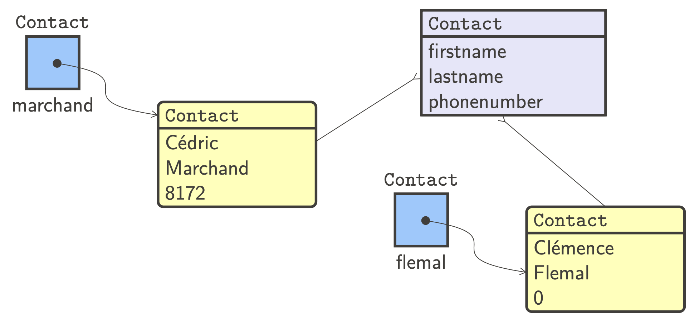
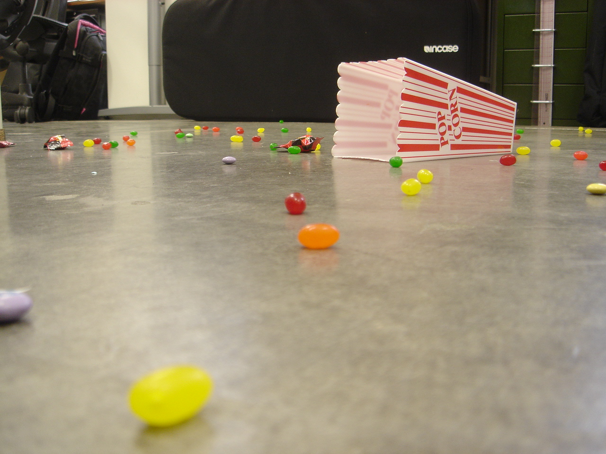
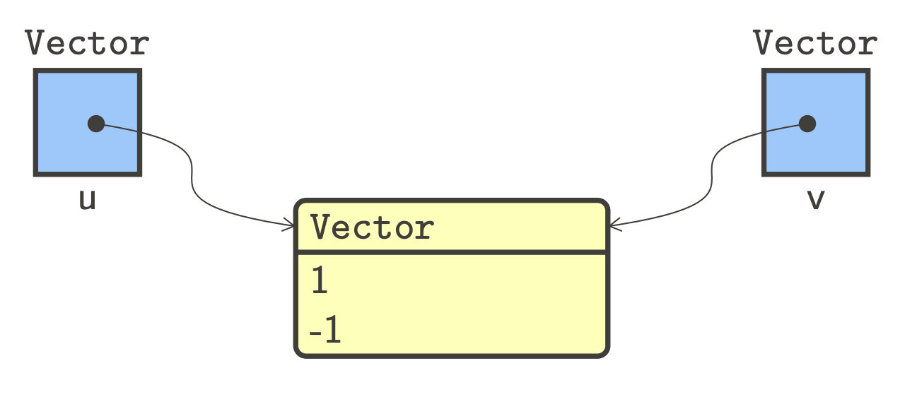

::: section
# IN2T - Informatique [Classes et objets]{.small}

Quentin Lurkin
:::

::: section
## Objectifs

-   Définition de **classes**
    -   Définition, constructeur et initialisation
    -   Variable d\'instance
    -   Définition et appel de méthode
-   Programmation **orientée objet**
    -   Méthodes *\"spéciales\"* (égalité et représentation d\'objets)
    -   Visibilité des attributs, encapsulation
    -   Conception orientée objet
:::

::: {.section .full}
## Classes


:::

::: section
## Objet et classe

-   Un objet est une **instance** d\'une classe [Une classe est un
    modèle à partir duquel on construit des objets]{.small}
-   La classe définit **deux éléments** constitutifs des objets [Les
    attributs et les fonctionnalités de l\'objet]{.small}
:::

::: section
## Attribut et fonctionnalité

-   Un attribut est une **donnée** stockée dans un objet [Les valeurs
    des attributs définissent l\'état de l\'objet]{.small}
-   Une **fonctionnalité** permet d\'effectuer une action [Obtenir une
    information sur l\'objet ou donner un ordre]{.small}

{.half}
:::

::: section
## Utilisation d\'un objet

-   Pour pouvoir créer des objets, il faut une **classe** [Une
    définition unique permet de créer plusieurs objets]{.small}
-   Une fois créée, interaction avec **attribut et fonctionnalité**
    [Utilisation de l\'opérateur d\'accès/appel sur l\'objet]{.small}

``` lang-python
            # Construction d'objets
            maxime = Person("Maxime", "Hockey")
            elise = Person("Elise", "Space")
            
            # Accès à un attribut
            print(maxime.firstname)              # Affiche 'Hockey'
            
            # Appel d'une méthode
            print(maxime.hasfriend(elise))       # Affiche 'True'
        
```
:::

::: section
## Définir une classe

-   **Définition** d\'une classe avec le mot réservé `class`
    -   Corps de la classe est un bloc de code indenté
    -   Le corps de la classe peut contenir des définitions de méthodes
-   Classe minimale grâce à l\'**instruction `pass`** [Aussi appelée
    instruction vide car ne fait rien]{.small}

``` lang-python
            class Contact:
                pass
        
```
:::

::: section
## Créer une instance

-   Un objet est une **instance** d\'une classe [À partir d\'une classe,
    on crée autant d\'objets que l\'on veut]{.small}

``` lang-python
            a = Contact()
            b = Contact()
        
```

{.half}
:::

::: section
## Définir un constructeur

-   **Initialisation** d\'un objet par la méthode spéciale `__init__`
    [Admet au moins un paramètre qui est `self`]{.small}
-   Le paramètre `self` référence l\'**objet à construire** [Permet
    d\'accéder aux attributs et fonctionnalités de l\'objet]{.small}

``` lang-python
            class Contact:
                def __init__(self, firstname, lastname, phonenumber):
                    self.firstname = firstname
                    self.lastname = lastname
                    self.phonenumber = phonenumber
        
```
:::

::: section
## Appeler un constructeur

-   Méthode appelée au moment de la **création d\'un objet** [Initialise
    l\'objet, en donnant une valeur à ses variables]{.small}

``` lang-python
            marchand = Contact("Cédric", "Marchand", 2693)
            flemal = Contact("Clémence", "Flemal", 0)
        
```

{.half}
:::

::: section
## Objet et référence

-   Un objet est une **instance** d\'une classe [L\'instanciation d\'une
    classe produit un objet]{.small}
-   Stockage d\'une **référence** vers l\'objet dans une variable
    [L\'adresse où l\'objet se situe en mémoire]{.small}

``` lang-python
            print(marchand)
            print(flemal)
        
```

``` lang-plaintext
            <__main__.Contact object at 0x109678748>
            <__main__.Contact object at 0x109678780>
        
```
:::

::: section
## Variable d\'instance

-   **Variables d\'instance** attachées à un objet définissent son état
    [Chaque objet possède ses propres copies de ces variables]{.small}
-   Accès aux variables d\'instance avec l\'**objet cible** [Ou `self` à
    l\'intérieur du code de la classe]{.small}

``` lang-python
            print(marchand.firstname)
            print(flemal.phonenumber)
        
```

``` lang-plaintext
            Cédric
            0
        
```
:::

::: section
## Plusieurs constructeurs

-   Paramètre optionnel pour offrir **plusieurs constructeurs**
    -   Définit une valeur par défaut pour les variables d\'instance
    -   D\'abord les obligatoires, puis les optionnelles

``` lang-python
            class Contact:
                def __init__(self, firstname, lastname, phonenumber=0):
                    self.firstname = firstname
                    self.lastname = lastname
                    self.phonenumber = phonenumber
            
            marchand = Contact("Cédric", "Marchand", 2693)
            flemal = Contact("Clémence", "Flemal")
        
```
:::

::: section
## Méthode

-   **Méthode** attachée à un objet réalisant une action dessus [La
    méthode reçoit d\'office un paramètre `self`, l\'objet
    cible]{.small}
-   **Appel d\'une méthode** sur un objet cible avec le point (`.`)

``` lang-python
            class Contact:
                def __init__(self, firstname, lastname):
                    self.firstname = firstname
                    self.lastname = lastname
                    self.phonenumber = 0
            
                def setphonenumber(self, number):
                    self.phonenumber = number
            
            marchand = Contact("Cédric", "Marchand")
            marchand.setphonenumber(2693)
        
```
:::

::: section
## Plusieurs méthodes

-   Comme pour le constructeur pour avoir **plusieurs méthodes**
    [Utilisation de la valeur spéciale `None` comme valeur par
    défaut]{.small}

``` lang-python
            class Contact:
                # [...]
                def changename(self, firstname=None, lastname=None):
                    if firstname is not None:
                        self.firstname = firstname
                    if lastname is not None:
                        self.lastname = lastname
        
```

``` lang-python
            lurkin.changename('John', 'Doe')
            lurkin.changename('John')
            lurkin.changename(lastname='Doe')
        
```
:::

::: section
## Définir un vecteur dans le plan (1)

-   Deux variables d\'instance pour représenter les **coordonnées** [Les
    deux variables `self.x` et `self.y` représentent \\((x,
    y)\\)]{.small}
-   Une méthode `norm` pour calculer la **longueur du vecteur** [La
    norme vaut \\(\\sqrt{x\^2 + y\^2}\\)]{.small}

``` lang-python
            class Vector:
                def __init__(self, x, y):
                    self.x = x
                    self.y = y
            
                def norm(self):
                    return sqrt(self.x ** 2 + self.y ** 2)
            
            u = Vector(1, -1)
            print(u.norm())
        
```

``` lang-plaintext
            1.4142135623730951
        
```
:::

::: section
## Exemple : Définir une musique

-   Un titre, une liste d\'artistes et une durée
-   Méthode `hasArtist` teste si un artiste a composé la musique

``` lang-python
            class Music:
                def __init__(self, title, artists, duration):
                    self.title = title
                    self.artists = artists
                    self.duration = duration
                
                def hasAuthor(self, name):
                    return name in self.artists
            
            m1 = Music('Easy Come Easy Go', ['Alice on the roof'], 213)
            print(m1.hasAuthor('Stromae'))
        
```

``` lang-plaintext
            False
        
```
:::

::: section
## Exemple : Définir une personne

-   Deux **éléments particuliers** à relever dans la classe `Person`
    -   Variables d\'instance pas en paramètre du constructeur
    -   Une méthode ne renvoie pas forcément quelque chose

``` lang-python
            class Person:
                def __init__(self, firstname, lastname):
                    self.firstname = firstname
                    self.lastname = lastname
                    self.friends = []
                
                def addfriend(self, p):
                    self.friends.append(p)
                
                def hasfriend(self, p):
                    return p in self.friends
        
```
:::

::: section
## Mot réservé `self`

-   La **variable d\'instance** est accessible dans toute la classe
    [Existe en mémoire pendant toute la durée de vie de
    l\'objet]{.small}
-   Opposée à la **variable locale** qui n\'existe que dans la méthode

``` lang-python
            class Vector:
                def __init__(self, x, y):
                    pass
                
                def norm(self):
                    return sqrt(x ** 2 + y ** 2)
            
            u = Vector(1, -1)
            print(u.norm())
        
```

``` lang-plaintext
            Traceback (most recent call last):
            File "program.py", line 38, in 
                print(u.norm())
            File "program.py", line 35, in norm
                return sqrt(x ** 2 + y ** 2)
            NameError: name 'x' is not defined
        
```
:::

::: section
## Fonction vs méthode (1)

-   Une **méthode** est une fonction associée à un objet
    -   La méthode peut agir sur les variables d\'instance de l\'objet
    -   La méthode est appelée sur un objet cible
-   Fonction agissant sur un **tuple** [Tuple passé en paramètre de
    manière explicite]{.small}

``` lang-python
            def norm(v):
                x, y = v
                return sqrt(x ** 2 + y ** 2)
            
            u = (1, -1)
            print(norm(u))
        
```
:::

::: section
## Fonction vs méthode (2)

-   Une **méthode** est une fonction associée à un objet
    -   La méthode peut agir sur les variables d\'instance de l\'objet
    -   La méthode est appelée sur un objet cible
-   Méthode agissant sur un **objet cible** [Objet cible passé de
    manière implicite]{.small}

``` lang-python
            class Vector:
                def __init__(self, x, y):
                    self.x = x
                    self.y = y
                
                def norm(self):
                    return sqrt(self.x ** 2 + self.y ** 2)
            
            u = Vector(1, -1)
            print(u.norm())
        
```
:::

::: section
## Résumé : définition d\'une classe

-   **Deux éléments** à définir dans le corps d\'une classe
    -   Le constructeur initialise les variables d\'instance
    -   Les méthodes interrogent ou agissent sur l\'objet
-   **Plusieurs** constructeurs et versions d\'une méthode [À l\'aide
    des paramètres optionnels]{.small}

``` lang-python
            class NomDeLaClasse:
                def __init__(self, pc1, pc2, ...):
                    self.varinst1 = pc1
                    self.varinst2 = pc2
                    self.autrevarinst = valeur
                
                def methode(self, pm1, pm2, ...):
                    # ... agir sur l'objet ...
        
```
:::

::: section
## Résumé : utilisation d\'un objet

-   **Création d\'un objet** à partir du nom de la classe
    -   Appel implicite du constructeur `__init__`
    -   Même nombre de valeurs `vc`\\(\_i\\) que de paramètres
        `pc`\\(\_i\\)
-   Stockage d\'une **référence vers l\'objet** dans une variable
    [Utilisation de cette variable pour agir sur l\'objet]{.small}

``` lang-python
            var = NomDeLaClasse(vc1, vc2, ...)
            
            var.methode(vm1, vm2, ...)
        
```
:::

::: {.section .full}
## Programmation orientée objets


:::

::: section
## Représentation d\'un objet

-   La méthode `__str__` construit une **représentation de l\'objet**
    [Renvoie une chaine de caractères lisible de l\'objet]{.small}

``` lang-python
            class Vector:
                def __init__(self, x, y):
                    self.x = x
                    self.y = y
                
                def __str__(self):
                    return '(' + str(self.x) + ', ' + str(self.y) + ')'
            
            u = Vector(1, -1)
            print(u)
        
```

``` lang-plaintext
            (1, -1)
        
```
:::

::: section
## Égalité (1)

-   L\'opérateur d\'égalité **compare les références** des variables [Le
    contenu des objets n\'est pas comparé]{.small}

``` lang-python
            u = Vector(1, -1)
            v = Vector(1, -1)
            print(u == v)                  # False
        
```

{.half}
:::

::: section
## Alias (1)

-   Un **alias** est une copie de la référence vers un objet [Il n\'y a
    qu\'une seule copie de l\'objet en mémoire]{.small}

``` lang-python
            u = Vector(1, -1)
            v = u
            print(u == v)                  # True
        
```

{.half}
:::

::: section
## Alias (2)

-   **Qu\'affiche le code suivant** après exécution ?
    -   `magic1` appelle une méthode sur `data`
    -   `magic2` modifie la variable locale `data`

``` lang-python
            def magic1(data):
                data.append("Coucou")
            
            def magic2(data):
                data = "Coucou"
            
            a = [0, 1, 2, 3]
            print(a)
            
            magic1(a)
            print(a)
            
            magic2(a)
            print(a)
        
```
:::

::: section
## Surcharge d\'opérateur (1)

-   On peut **redéfinir** les opérateurs arithmétiques [`__add__` pour
    `+`, `__sub__` pour `-`, `__mul__` pour `*`\...]{.small}

``` lang-python
            class Vector:
                def __init__(self, x, y):
                    self.x = x
                    self.y = y
                
                def __add__(self, other):
                    return Vector(self.x + other.x, self.y + other.y)
                
                # ...
            
            u = Vector(1, -1)
            v = Vector(2, 1)
            print(u + v)
        
```

``` lang-plaintext
            (3, 0)
        
```
:::

::: section
## Surcharge d\'opérateur (2)

-   On peut **redéfinir** les opérateurs de comparaison [`__lt__` pour
    `<`, `__le__` pour `<=`, `__eq__` pour `==`\...]{.small}

``` lang-python
            class Vector:
                def __init__(self, x, y):
                    self.x = x
                    self.y = y
                
                def __lt__(self, other):
                    return self.x < other.x or (self.x == other.x and self.y < other.y)
                
                # ...
            
            u = Vector(1, -1)
            v = Vector(2, 1)
            print(u < v)
        
```

``` lang-plaintext
            True
        
```
:::

::: section
## Égalité (2)

-   Surcharge de l\'opérateur d\'égalité pour **comparer les objets**
    [Le contenu des objets sera comparé, et non plus les
    références]{.small}
-   **Comparaison des identités** avec l\'opérateur `is` [Comparaison
    des références des objets]{.small}

``` lang-python
            class Vector:
                # ...
                
                def __eq__(self, other):
                    return self.x == other.x and self.y == other.y
            
            u = Vector(1, -1)
            v = Vector(1, -1)
            print(u == v)                  # True
            print(u is v)                  # False
        
```
:::

::: section
## Définir un vecteur dans le plan (2)

-   Une seule variable d\'instance pour les **coordonnées** [Stockée
    dans un tuple par exemple]{.small}
-   **Choix d\'implémentation** complètement libres [Il n\'y a pas
    qu\'une seule solution unique]{.small}

``` lang-python
            class Vector:
                def __init__(self, x, y):
                    self.coords = (x, y)
                
                def norm(self):
                    return sqrt(self.coords[0] ** 2 + self.coords[1] ** 2)
            
            u = Vector(1, -1)
            print(u.norm())
        
```
:::

::: section
## Encapsulation (1)

-   Les données de l\'objet sont **encapsulées** dans l\'objet [Ne pas
    dévoiler les détails d\'implémentation en dehors de
    l\'objet]{.small}
-   **Pas d\'accès direct** aux variables d\'instance [Pas recommandé
    d\'accéder directement aux variables d\'instance]{.small}

``` lang-python
            u = Vector(1, -1)
            v = Vector(2, 1)
            
            s = Vector(u.x + v.x, u.y + v.y)
            
            # ou
            # s = Vector(u.coords[0] + v.coords[0], u.coords[0] + v.coords[0])
        
```
:::

::: section
## Variable privée

-   **Variable privée** en préfixant son nom avec `__` [Ne pourra pas
    être accédée en dehors de la classe]{.small}

``` lang-python
            class Vector:
                def __init__(self, x, y):
                    self.__x = x
                    self.__y = y
            
            u = Vector(1, -1)
            print(u.__x)
        
```

``` lang-plaintext
            Traceback (most recent call last):
            File "program.py", line 9, in 
                print(u.__x)
            AttributeError: 'Vector' object has no attribute '__x'
        
```
:::

::: section
## Accesseur

-   Accès à une variable privée à l\'aide d\'un **accesseur** [Méthode
    qui renvoie une variable d\'instance]{.small}
-   Un accesseur se définit avec la **décoration** `@property` [L\'appel
    se fait comme si c\'était une variable d\'instance publique]{.small}

``` lang-python
            from math import sqrt
            
            class Vector:
                # ...
                
                @property
                def x(self):
                    return self.__x
            
            u = Vector(1, -1)
            print(u.x)                     # 1
        
```
:::

::: section
## Mutateur

-   Modification d\'une variable privée à l\'aide d\'un **mutateur**
    [Méthode qui change la valeur d\'une variable d\'instance]{.small}
-   Un mutateur se définit avec la **décoration** `@nom.setter` [Où
    `nom` est celui de la méthode]{.small}

``` lang-python
            class Vector:
                # ...
                
                @x.setter
                def x(self, value):
                    self.__x = value
            
            u = Vector(1, -1)
            u.x = 12
            print(u.x)                     # 12
        
```
:::

::: section
## Encapsulation (2)

-   Accès à un objet **uniquement via les méthodes** publiques
    [Utilisateur indépendants de la représentation interne de
    l\'objet]{.small}

``` lang-python
            class Vector:
                def __init__(self, x, y):
                    self.__coords = (x, y)
                
                @property
                def x(self):
                    return self.__coords[0]
                
                @x.setter
                def x(self, value):
                    self.__coords = (value, self.__coords[1])
            
            u = Vector(1, -1)
            u.x = 12
            print(u.x)                     # 12
        
```
:::

::: section
## Interface

-   L\'**interface publique** d\'un objet expose ses fonctionnalités
    [Définit ce que l\'utilisateur peut faire avec l\'objet]{.small}
-   Interface publique de la **classe `Vector`**
    -   Une variable d\'instance `coords` privée
    -   Un accesseur et un mutateur pour la coordonnée \\(x\\)
    -   Une méthode `coords` publique

{.fourth}
:::

::: section
## Composition d\'objets

-   On peut **composer** plusieurs objets ensemble [En utilisant des
    variables d\'instance de type objet]{.small}

``` lang-python
            class Rectangle:
                def __init__(self, lowerleft, width, height, angle=0):
                    self.__lowerleft = lowerleft
                    self.__width = width
                    self.__height = height
                    self.__angle = angle
            
                @property
                def lowerleft(self):
                    return self.__lowerleft
            
            p = Vector(1, -1)
            r = Rectangle(p, 100, 50)
            print(r.lowerleft)             # (1, -1)
        
```
:::

::: section
## Réutilisation de code

-   On peut **réutiliser le code** définit pour les objets composés [Il
    suffit d\'appeler les méthodes des variables objet]{.small}

``` lang-python
            class Rectangle:
                # ...
                
                def __str__(self):
                    return "Rectangle en " + str(self.__lowerleft) +
                    " de longueur " + str(self.__width) +
                    " et de hauteur " + str(self.__height) +
                    " incliné de " + str(self.__angle) + " degrés"
            
            r = Rectangle(Vector(1, -1), 100, 50)
            print(r)
        
```

``` lang-plaintext
            Rectangle en (1, -1) de longueur 100 et de hauteur 50 incliné
            de 0 degrés
        
```
:::

::: section
## Chaine de caractères formatée

-   Chaine de caractères **formatée** à partir de valeurs
    -   Incrustation de valeurs définie avec des balises `{}`
    -   Valeurs à incruster passées en paramètres de `format`
-   **Même nombre** de balises que de valeurs passées en paramètre
    [Sinon, l\'interpréteur Python produit une erreur
    d\'exécution]{.small}

``` lang-python
            class Rectangle:
                # ...
                
                def __str__(self):
                    return "Rectangle en {} de longueur {} et de hauteur {}
                    incliné de {} degrés".format(self.__lowerleft,
                    self.__width, self.__height, self.__angle)
            
            r = Rectangle(Vector(1, -1), 100, 50)
            print(r)
        
```
:::

::: section
## Crédits

-   https://www.flickr.com/photos/booleansplit/3510951967
-   https://www.flickr.com/photos/goincase/492906260
:::
