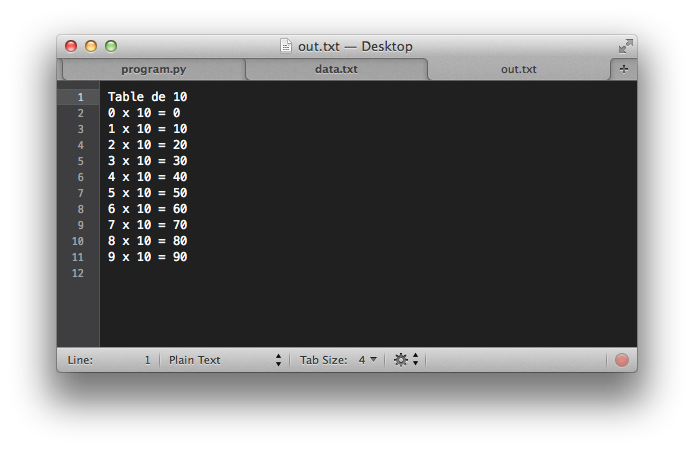

::: section
# IN2T - Informatique [Lecture et écriture de fichiers]{.small}

Quentin Lurkin
:::

::: section
## Rappels

-   Programmation **défensive**
    -   Gestion d\'erreur avec valeur de retour spéciale
    -   Spécification de fonction (pré et postconditions)
    -   Instruction `assert`{.lang-python}
-   Utiliser et créer des **exceptions**
    -   Capturer une erreur avec l\'instruction
        `try-except-finally`{.lang-python}
    -   Générer une erreur avec l\'instruction `raise`{.lang-python}
    -   Définir une nouvelle exception
:::

::: section
## Objectifs

-   Lire et écrire des **fichiers textes**
    -   Ouverture et fermeture d\'un fichier
    -   Fonctions de lecture et d\'écriture
    -   Encodage des caractères
    -   Base de données
-   Lire et écrire des **fichiers binaires**
    -   Fonctions de lecture et d\'écriture
    -   Définition du format
:::

::: {.section .full}
## Fichiers


:::

::: section
## Fichier

-   Un **fichier** stocke des informations sur le disque dur [Il est
    créé, modifié, supprimé]{.small}
-   Manipulation des fichiers grâce au **système d\'exploitation**
    [L\'interpréteur fait le relais avec Linux, Windows, Mac OS
    X\...]{.small}
-   Des **informations** sont associées à un fichier [Nom, taille, date
    de création, dernière date de modification\...]{.small}
:::

::: section
## Type de fichier

-   Au plus bas niveau, un fichier est une **séquence de bits**
    (`0`{.lang-plaintext} et `1`{.lang-plaintext}) [La séquence doit
    être interprétée pour en obtenir le sens]{.small}
-   **Deux types** de fichiers manipulés à des niveaux différents
    -   Fichier texte est une séquence de caractères ou de lignes
    -   Fichier binaire est une séquence d\'octets (8 bits)
:::

::: section
## Chemin

-   Fichier identifié sur une machine à l\'aide de son **chemin**
    [Identifie l\'endroit où se situe le fichier]{.small}
-   **Deux façons** de spécifier un chemin
    -   Chemin absolu à partir de la racine [`C:\`{.lang-plaintext}
        (Windows), `/`{.lang-plaintext} (OSX et Linux)]{.small}
    -   Chemin relatif à partir du répertoire courant

  Chemin relatif               Chemin absolu
  ---------------------------- ------------------------------------------
  data.txt                     C:\\Users\\lur\\Desktop\\data.txt
  src\\program.py              C:\\Users\\lur\\Desktop\\src\\program.py
  ..\\image.png                C:\\Users\\lur\\image.png
  ..\\movies\\hamburgers.mp4   C:\\Users\\lur\\movies\\hamburgers.mp4
:::

::: section
## Navigation en ligne de commande

Pour passer d\'un répertoire à l\'autre dans une console de commandes

-   `pwd`{.lang-plaintext}: Affiche le chemin du répertoire courant
    [Base des chemins relatifs]{.small}
-   `cd`{.lang-plaintext} *(suivi d\'un chemin)*: Change de répertoire
    courant [`..`{.lang-plaintext} pour le répertoire parent]{.small}
-   `dir`{.lang-plaintext} *(Windows)* ou `ls`{.lang-plaintext} *(OSX et
    Linux)*: Liste le contenu du répertoire
:::

::: {.section .full}
## Fichiers textes


:::

::: section
## Ouverture d\'un fichier

-   Pour manipuler un fichier, il faut d\'abord l\'**ouvrir** [On
    utilise la fonction `open`{.lang-python}, qui renvoie un identifiant
    de fichier]{.small}
-   **Deux erreurs** possibles lors de l\'ouverture [Fichier introuvable
    ou erreur d\'ouverture]{.small}

``` lang-python
            try:
                file = open('data.txt')
            except FileNotFoundError:
                print('Le fichier est introuvable')
            except IOError:
                print("Erreur d'ouverture")
        
```
:::

::: section
## Mode d\'ouverture (1)

-   Par défaut, fichier ouvert en **lecture seule** [Tout ce qu\'on peut
    faire c\'est donc lire le contenu du fichier]{.small}
-   On peut spécifier le **mode d\'ouverture** désiré [Avec le deuxième
    paramètre de la fonction `open()`{.lang-python}]{.small}

``` lang-python
            try:
                file = open('data.txt', 'w')         # Ouverture en écriture
            except IOError:
                print("Erreur d'ouverture")
        
```
:::

::: section
## Mode d\'ouverture (2)

-   Mode d\'ouverture définit avec des **caractères**

  Caractère           Description
  ------------------- ------------------------------------------------------
  `r`{.lang-python}   Lecture (par défaut)
  `w`{.lang-python}   Écriture (avec remise à zéro)
  `x`{.lang-python}   Création exclusive (erreur si fichier déjà existant)
  `a`{.lang-python}   Écriture (avec ajout à la fin)
  `b`{.lang-python}   Mode binaire
  `t`{.lang-python}   Mode texte (par défaut)

``` lang-python
            try:
                file = open('data.txt', 'rt')         # Mode par défaut
            except FileNotFoundError:
                print('Le fichier est introuvable')
            except IOError:
                print("Erreur d'ouverture")
        
```
:::

::: section
## Fermeture d\'un fichier

-   Une fois les opérations finies, il faut **fermer** le fichier [On
    utilise la fonction `close`{.lang-python} avec l\'identifiant de
    fichier]{.small}
-   **Libération des ressources** et sauvegarde sur disque [Le système
    d\'exploitation limite le nombre de fichiers ouverts]{.small}

``` lang-python
            try:
                file = open('data.txt')
                file.close()                          # Fermeture du fichier
            except FileNotFoundError:
                print('Le fichier est introuvable')
            except IOError:
                print("Erreur d'ouverture")
        
```
:::

::: section
## Lecture

-   **Lecture** intégrale du fichier comme une chaîne de caractères [On
    utilise la fonction `read`{.lang-python} avec l\'identifiant de
    fichier]{.small}
-   La lecture peut échouer et provoquer une **exception
    `IOError`{.lang-python}** [Par exemple si le disque est déconnecté
    pendant la lecture]{.small}

``` lang-python
            try:
                file = open('data.txt')
                print(file.read())
                file.close()
            except FileNotFoundError:
                print('Le fichier est introuvable')
            except IOError:
                print("Erreur d'entrée/sortie")
        
```
:::

::: section
## Instruction `finally`{.lang-python} (1)

-   En cas d\'erreur, le fichier pourrait **ne pas être fermé** [Car
    l\'exécution du code saute directement dans
    l\'`except`{.lang-python}]{.small}
-   **Instruction `finally`{.lang-python}** exécutée dans tous les cas
    [Après la fin du bloc `try`{.lang-python} ou après un
    `except`{.lang-python} éventuel]{.small}

``` lang-python
            try:
                file = open('data.txt')
                print(file.read())
            except FileNotFoundError:
                print('Le fichier est introuvable')
            except IOError:
                print("Erreur d'ouverture")
            finally:
                file.close()
        
```
:::

::: section
## Instruction `finally`{.lang-python} (2)

-   **Bug** dans le code précédent si le fichier n\'a pas su être ouvert
    [La variable `file`{.lang-python} ne sera pas initialisée et
    `close`{.lang-python} pas disponible]{.small}
-   On utilise une instruction **`try/finally`{.lang-python}**
    additionnelle

``` lang-python
            try:
                file = open('data.txt')
                try:
                    print(file.read())
                finally:
                    file.close()
            except FileNotFoundError:
                print('Le fichier est introuvable')
            except IOError:
                print("Erreur d'entrée/sortie")
        
```
:::

::: section
## Instruction `with`{.lang-python}

-   **Instruction `with`{.lang-python}** pour fermeture propre des
    ressources [L\'appel à `close`{.lang-python} sera fait
    automatiquement]{.small}
-   Il faut garder le **`try/except`{.lang-python}** pour les
    `IOError`{.lang-python}

``` lang-python
            try:
                with open('data.txt') as file:
                    print(file.read())
            except FileNotFoundError:
                print('Le fichier est introuvable')
            except IOError:
                print("Erreur d'entrée/sortie")
        
```

``` lang-plaintext
            Facebook:mlt@ecam.be:melo:8dj,Sj0m1
            Skype:mar@ecam.be:cedou:arduino
            Facebook:fle@ecam.be:fingerfood:b8ur,g2er
        
```
:::

::: section
## Écriture (1)

-   **Écriture** en ajoutant des chaines de caractères au fichier [On
    utilise la fonction `write`{.lang-python} avec l\'identifiant de
    fichier]{.small}
-   L\'écriture peut échouer et provoquer une **exception
    `IOError`{.lang-python}** [Par exemple si l\'espace disque devient
    plein pendant l\'écriture]{.small}

``` lang-python
            with open('out.txt', 'w') as file:
                file.write('Table de 10\n')
                for i in range(10):
                    file.write('{} x 10 = {}\n'.format(i, i * 10))
        
```
:::

::: section
## Écriture (2)


:::

::: section
## Copie d\'un fichier

-   **Copie** en faisant une lecture puis écriture du contenu lu [Deux
    instruction `with`{.lang-python} imbriquées]{.small}
-   Si le fichier destination existe déjà, il est **effacé** [Il faut
    utiliser le mode `x`{.lang-python} au lieu de `w`{.lang-python} pour
    empêcher cela]{.small}

``` lang-python
            with open('data.txt', 'r') as src, open('copy.txt', 'w') as dest:
                dest.write(src.read())
        
```
:::

::: section
## Lecture ligne par ligne (1)

-   Utilisation d\'un **itérateur** sur le fichier ouvert, avec
    `for`{.lang-python} [Parcours ligne par ligne, avec le retour de
    ligne inclus]{.small}
-   Fonction `rstrip`{.lang-python} pour retirer les caractères blancs
    de droite [right strip]{.small}

``` lang-python
            with open('data.txt') as file:
                for line in file:
                    cleaned = line.rstrip()
                    tokens = cleaned.split(':')
                    print('Compte {} de {} (mode de passe : {})'.format(tokens[0], tokens[2], tokens[3]))
        
```

``` lang-plaintext
            Compte Facebook de melo (mode de passe : 8dj,Sj0m1)
            Compte Skype de cedou (mode de passe : arduino)
            Compte Facebook de fingerfood (mode de passe : b8ur,g2er)
        
```
:::

::: section
## Lecture ligne par ligne (2)

-   L\'**itérateur** est un raccourci d\'appel de
    `readline`{.lang-python} [Lis une ligne s\'il en reste à lire dans
    le fichier]{.small}
-   Renvoie une **chaine de caractères vide** lorsqu\'au bout du fichier
    [Pratique lorsqu\'on sait combien de lignes lire]{.small}

``` lang-python
            with open('data.txt') as file:
                line = file.readline()
                while line != '':
                    cleaned = line.rstrip()
                    tokens = cleaned.split(':')
                    print('Compte {} de {} (mode de passe : {})'.format(tokens[0], tokens[2], tokens[3]))
                    line = file.readline()
        
```
:::

::: section
## Lecture ligne par ligne (3)

-   La fonction `readlines`{.lang-python} lis l\'**intégralité des
    lignes** en une traite [La fonction renvoie une liste de chaines de
    caractères]{.small}
-   On peut **supprimer la variable** `cleaned`{.lang-python} inutile
    [En enchainant directement les appels à `rstrip`{.lang-python} et
    `split`{.lang-python}]{.small}

``` lang-python
            with open('data.txt') as file:
                content = file.readlines()
            
            for line in content:
                tokens = line.rstrip().split(':')
                print('Compte {} de {} (mode de passe : {})'.format(tokens[0], tokens[2], tokens[3]))
        
```
:::

::: section
## Lecture ligne par ligne (4)

-   **Amélioration du code** avec une fonction de formatage [On définit
    une fonction qui formate une ligne]{.small}
-   On définit une liste par compréhension et on joint ses éléments
    [Jointure des éléments d\'une liste réalisée avec fonction
    `join`{.lang-python}]{.small}

``` lang-python
            def format(line):
                tokens = line.rstrip().split(':')
                return 'Compte {} de {} (mode de passe : {})'.format(tokens[0], tokens[2], tokens[3])
            
            with open('data.txt') as file:
                content = file.readlines()
            
            print('\n'.join([format(line) for line in content]))
        
```
:::

::: section
## Exception

-   L\'erreur principale d\'**entrée/sortie** est
    `IOError`{.lang-python} [On peut se limiter à capturer cette unique
    erreur]{.small}
-   Erreur **spécialisée** selon le type précis
    -   `FileNotFoundError`{.lang-python}, si le fichier n\'est pas
        trouvé
    -   `FileExistsError`{.lang-python}, si le fichier existe déjà
    -   `PermissionError`{.lang-python}, si l\'utilisateur n\'a pas les
        droits d\'accès
    -   `IsADirectoryError`{.lang-python}, si le fichier est en fait un
        dossier
:::

::: section
## Encodage (1)

-   Les caractères sont **stockés au format binaire** dans l\'ordinateur
    [Table de correspondance associant un entier à chaque
    caractère]{.small}
-   La **table de caractères** ASCII (iso-646) contient 128 caractères
    [Table suffisante pour des textes en anglais]{.small}

      0               1     2     3     4     5     6     7     8     9    A     B     C    D    E    F
  --- --------------- ----- ----- ----- ----- ----- ----- ----- ----- ---- ----- ----- ---- ---- ---- -----
  0   NUL             SOH   STH   ETH   EOT   ENQ   ACK   BEL   BS    HT   LF    VT    FF   CR   SO   SI
  1   DLE             DC1   CD2   DC3   DC4   NAK   SYN   ETB   CAN   EM   SUB   ESC   FS   GS   RS   US
  2   [spc]{.small}   !     \"    \#    \$    \%    &     \'    (     )    \*    \+    ,    \-   .    /
  3   0               1     2     3     4     5     6     7     8     9    :     ;     \<   =    \>   ?
  4   @               A     B     C     D     E     F     G     H     I    J     K     L    M    N    O
  5   P               Q     R     S     T     U     V     W     X     Y    Z     \[    \\   \]   \^   \_
  6   \`              a     b     c     d     e     f     g     h     i    j     k     l    m    n    o
  7   p               q     r     s     t     u     v     w     x     y    z     {     \|   }    \~   DEL
:::

::: section
## Encodage (2)

-   La fonction `ord`{.lang-python} donne le **code** d\'un caractère
    [Sous forme d\'un nombre entier]{.small}
-   La fonction `chr`{.lang-python} donne le **caractère** correspondant
    à un code [Sous forme d\'une chaine de caractères]{.small}

``` lang-python
            print(chr(65))           # Affiche A
            print(ord('z'))          # Affiche 90
        
```
:::

::: section
## Unicode et UTF-8

-   **Unicode** (ISO 10646) est un standard d\'échange de texte [Associe
    à tout caractère un nom et un identifiant numérique]{.small}
-   **UTF-8** est un encodage pour les caractères Unicode [Python
    travaille par défaut avec l\'encodage UTF-8]{.small}


:::

::: section
## Choisir l\'encodage

-   On spécifie l\'**encodage des fichiers** avec le paramètre
    `encoding`{.lang-python}


``` lang-plaintext
            Traceback (most recent call last):
                File "program.py", line 6, in 
                    print(file.read())
                File "/Library/Frameworks/Python.framework/Versions/3.4/lib/python3.4/encodings/ascii.py", line 26, in decode
                    return codecs.ascii_decode(input, self.errors)[0]
            UnicodeDecodeError: 'ascii' codec can't decode byte 0xf0 in position 11: ordinal not in range(128)
        
```
:::

::: {.section .full}
## Base de données


:::

::: section
## Base de données

-   **Système de gestion de bases de données** (SGBD) [Ensemble de
    logiciels qui gère la base de données]{.small}
-   Plusieurs **opérations** effectuées par le SGBD
    -   Interrogation de la base de données
    -   Gestion du stockage des données sur le disque
    -   \...
:::

::: section
## JavaScript Object Notation (JSON) (1)

-   Permet de **représenter des objets** [Notation issue de la notation
    des objets Javascript]{.small}
-   Ensemble de **paires** (étiquette, valeur) [Étiquette entre
    guillemets, deux-points et valeur]{.small}
-   **Valeurs** sont soit une simple valeur, soit une liste de valeurs
    [Liste de valeurs délimitée par des crochets
    `[]`{.lang-python}]{.small}
:::

::: section
## JavaScript Object Notation (JSON) (2)

``` lang-json
            {
                "name": "Carnet d'adresses de Sébastien Combéfis",
                "contacts": [
                {
                    "firstname": "Cédric",
                    "lastname": "Marchand",
                    "phone": 2837
                },
                {
                    "firstname": "Jonathan",
                    "lastname": "Verlant-Chenet",
                    "phone": 4872
                },
                {
                    "firstname": "Quentin",
                    "lastname": "Lurkin",
                    "phone": 8723
                }
                ]
            }
        
```
:::

::: section
## Base de données orientée document

-   Stocke des **documents JSON** [Souplesse par l\'absence de schéma
    prédéfini]{.small}
-   Données **répartissables** sur plusieurs machines [Robustesse,
    duplication, efficacité\...]{.small}
-   **Sérialisation et désérialisation** des documents JSON [Vers des
    objets du langage cible, pour être utilisés]{.small}

<figure>


</figure>
:::

::: section
## Sérialisation

-   **Sérialisation** d\'un dictionnaire en document JSON [Dictionnaire
    Python (`dict`{.lang-python}) \\(\\rightarrow\\) document JSON
    (`str`{.lang-python})]{.small}
-   Fonction **`dumps`{.lang-python}** du module `json`{.lang-python}
    [Renvoie une chaine de caractères]{.small}

``` lang-python
                import json
                
                bb = {'seasons': 5, 'genre': ['crime drama', 'thriller']}
                skins = {'seasons': 7, 'genre': ['teen drama', 'comedy drama']}
                tvshows = {'Breaking Bad': bb, 'Skins': skins}
                
                document = json.dumps(tvshows, indent=4)
            
```
:::

::: section
## Désérialisation

-   **Désérialisation** d\'un document JSON en dictionnaire [Document
    JSON (`str`{.lang-python}) \\(\\rightarrow\\) dictionnaire Python
    (`dict`{.lang-python})]{.small}
-   Fonction **`loads`{.lang-python}** du module `json`{.lang-python}
    [Renvoie un dictionnaire]{.small}

``` {.lang-python style="white-space: pre-wrap;"}
                import json
                
                document = '{"Belgium":{"capital":"Brussels","languages":["french","dutch","german"]},"China":{"capital":"Beijing","languages":["mandarin chinese"]}}'
                
                countries = json.loads(document)
            
```
:::

::: section
## Crédits

-   https://www.flickr.com/photos/quinnanya/2493803790
-   https://www.flickr.com/photos/jasoneppink/2081701562
-   https://www.flickr.com/photos/rakka/123380632
-   https://www.flickr.com/photos/shindotv/3835365695
-   https://openclipart.org/detail/25319/cartoon-cloud
-   https://openclipart.org/detail/17924/computer
-   https://openclipart.org/detail/163741/web-server
-   https://openclipart.org/detail/163711/database-server
-   https://en.wikipedia.org/wiki/File:MongoDB-Logo.svg
-   https://en.wikipedia.org/wiki/File:CouchDB.svg
-   https://en.wikipedia.org/wiki/File:OrientdbLogo.png
-   https://en.wikipedia.org/wiki/File:CouchbaseLogo.svg
:::
