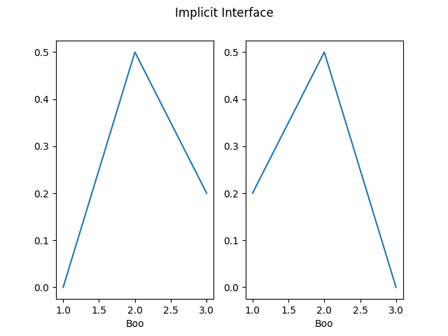

::: section
# IN2T - Informatique [Calculs numériques]{.small}

Quentin Lurkin
:::

::: section
## Calculatrice

Un ordinateur n\'est au final qu\'une grosse calculatrice avec plusieurs
avantages :

-   Meilleur clavier
-   Meilleur écran
-   Plus de puissance

Il est extrêmement commun pour un ingénieur d\'utiliser un
**ordinateur** pour effectuer des **calculs**. L\'utilisation de Python
dans ce domaine est très **répandue** dans le monde professionnel.
:::

::: {.section .code}
## Trigonométrie

``` lang-python
        import math

        print(math.cos(math.pi))
        print(math.sin(math.pi/2))
        print(math.tan(math.pi/4))
        print(math.acos(0))         # arc cosinus
        print(math.asin(1))         # arc sinus
        print(math.atan(1))         # arc tangente
      
```

Le module `math` contient bien d\'autres fonctions mathématiques
:::

::: {.section .code}
## Nombre complexes

``` lang-python
        import cmath

        # racine carrée de nombres négatifs
        print(cmath.sqrt(-1))

        # définir un nombre complex
        x = 1+2j
        x = complex(1, 2)
        print(x)

        # parties réelles et imaginaires
        print(x.real)
        print(x.imag)

        # modules et arguments
        print(cmath.phase(x))           # argument
        print(abs(x))                   # module
        print(cmath.polar(x))           # module et argument
        
        # définition d'1 nb complex à partir du module et argument
        print(cmath.rect(1, cmath.pi))  

        # opérations
        print(x+x)
        print(x*x)
        print(cmath.exp(x))             # exponentielle
      
```
:::

::: section
## Calculs vectoriels

-   Il serait possible de représenter des vecteurs avec des listes [Pas
    pratique, essayer une somme !]{.small}
-   Le module `numpy` facilite l\'utilisation de vecteurs

### Installation

``` terminal
          $> python -m pip install numpy
        
```
:::

::: section
## Numpy

-   Utilisation d\'un alias

    ``` lang-python
                import numpy as np
              
    ```

-   Création d\'un vecteur

    ``` lang
                  v = np.array([1, 1, 3])
                
    ```

-   Opérations

    ``` lang-python
                print(2*v)                   # Multiplication par un scalaire
                print(v+v)                   # Somme
                print(v.dot(v))              # Produit scalaire
                print(v @ v)                 # Produit scalaire
                v2 = np.array([2, -1, 2]
                print(np.cross(v, v2)))      # Produit vectoriel
                print(np.linalg.norm(v))     # Norme
              
    ```
:::

::: section
## Vecteurs

-   Plusieurs manières de créer des vecteurs de valeurs [Depuis une
    structure Python, ou par des fonctions de Numpy]{.small}

``` lang-python
          np.array([1, 2, 3])
          np.zeros(5)
          np.ones(10)
          np.random.random(10)
          np.random.randn(10)
          np.linspace(0, 10, 5)
          np.arange(0, 10, 0.2)
      
```
:::

::: section
## Opérations avec scalaire

``` lang-python
          a = np.array([1, 2, 3, 4])
          a + 1       # [2, 3, 4, 5]
          2 * a       # [2, 4, 6, 8]
          a ** 2      # [1, 4, 9, 16]
          1 / a       # [1.0, 0.5, 0.3333, 0.25]
          a < 3    # [True, True, False, False]
      
```
:::

::: section
## Opérations entre vecteurs

-   vecteurs de même taille
-   élément par élément

``` lang-python
          a = np.array([1, 2, 3, 4])
          b = np.array([5, 6, 7, 8])
          a + b    # [6, 8, 10, 12]
          a * b    # [5, 12, 21, 32]
      
```
:::

::: section
## Fonctions vectorisées

-   Fonctions qui s\'applique sur tous les éléments d\'un vecteur

``` lang-python
      x = np.array([1, 2, 3])

      # Fonction standard ne marche pas
      y = math.sin(x) # Error

      # Fonction vectorisée existe dans numpy
      y = np.sin(x)
      
```
:::

::: section
## Créer une fonction vectorisée

-   La plupart des opérations de base sont déjà supportées par numpy.
-   Mais il est facile de créer des fonctions vectorisées :

``` lang-python
        @np.vectorize
        def fun(a, b):
          if a > b:
            return 1
          return -1

        x = np.array([1, 2, 3])
        y = np.array([3, 2, 1])

        print(fun(x, y))
      
```
:::

::: section
## Graphiques de fonctions

-   Utilisation du module `matplotlib`

    ### Installation

    ``` terminal
                $> python -m pip install matplotlib
              
    ```

-   Fonctionne très bien avec `numpy`
:::

::: section
## Créer un graphique

-   Importer matplotlib

    ``` lang-python
                from matplotlib import pyplot as plt
              
    ```

-   Importer numpy

    ``` lang-python
                import numpy as np
              
    ```

-   Créer les abscisses des échantillons

    ``` lang-python
                # 100 valeurs entre -2 et 2
                x = np.linspace(-5, 5, 100)
              
    ```

-   Calculer les ordonnées

    ``` lang-python
                # np.sin est la version vectorisée de sin
                y = np.sin(x)
              
    ```

-   Dessiner le graphique

    ``` lang-python
                plt.plot(x, y)
                plt.show()
              
    ```


:::

::: section
## Style

-   Toutes les parties du graphique sont paramètrables

``` lang-python
        from matplotlib import pyplot as plt
        import numpy as np

        x = np.linspace(-5, 5, 100)
        y = np.sin(x)
        plt.title("Sinus")
        plt.xlabel("x")
        plt.ylabel("sin(x)")
        plt.grid()
        plt.xticks([-3*np.pi/2, -np.pi, -np.pi/2, 0, np.pi/2, np.pi, 3*np.pi/2],
          labels=["-3pi/2", "-pi", "-pi/2", "0", "pi/2", "pi", "3pi/2"])
        plt.plot(x, y)
        plt.show()
      
```


:::

::: section
## Plusieurs courbes

``` lang-python
        from matplotlib import pyplot as plt
        import numpy as np

        x = np.linspace(-5, 5, 100)
        ysin = np.sin(x)
        ycos = np.cos(x)

        plt.title("Trigono")
        plt.xlabel("x")
        plt.ylabel("y")
        plt.grid()
        plt.xticks([-3*np.pi/2, -np.pi, -np.pi/2, 0, np.pi/2, np.pi, 3*np.pi/2],
          labels=["-3pi/2", "-pi", "-pi/2", "0", "pi/2", "pi", "3pi/2"])
        plt.plot(x, ysin, label="sin(x)")
        plt.plot(x, ycos, label="cos(x)")
        plt.legend()

        plt.show()
      
```


:::

::: section
## Deux API

-   Tous les exemples précédents on été donné dans l\'API implicite de
    matplotlib [Qui ressemble plus à Matlab]{.small}
-   Voici un exemple dans l\'API explicite:

``` lang-python
        from matplotlib import pyplot as plt
        import numpy as np

        x = np.linspace(-5, 5, 100)
        ysin = np.sin(x)
        ycos = np.cos(x)

        fig, ax = plt.subplots()

        ax.set_title("Trigono")
        ax.set_xlabel("x")
        ax.set_ylabel("y")
        ax.grid()
        ax.set_xticks([-3*np.pi/2, -np.pi, -np.pi/2, 0, np.pi/2, np.pi, 3*np.pi/2],
          labels=["-3pi/2", "-pi", "-pi/2", "0", "pi/2", "pi", "3pi/2"])
        ax.plot(x, ysin, label="sin(x)")
        ax.plot(x, ycos, label="cos(x)")
        ax.legend()

        plt.show()
      
```


:::

:::::: section
## Deux API

::::: row
::: span6
### API implicite

``` lang-python
            plt.subplot(1, 2, 1)
            plt.plot([1, 2, 3], [0, 0.5, 0.2])

            plt.subplot(1, 2, 2)
            plt.plot([3, 2, 1], [0, 0.5, 0.2])

            plt.suptitle('Implicit Interface')

            for i in range(1, 3):
                plt.subplot(1, 2, i)
                plt.xlabel('Boo')
            
            plt.show()
          
```
:::

::: span6
### API explicite

``` lang-python
            fig, axs = plt.subplots(1, 2)

            axs[0].plot([1, 2, 3], [0, 0.5, 0.2])
            axs[1].plot([3, 2, 1], [0, 0.5, 0.2])

            fig.suptitle('Explicit Interface')

            for i in range(2):
                axs[i].set_xlabel('Boo')

            plt.show()
          
```
:::
:::::


::::::

::: section
## Documentation

[matplotlib.org/stable](https://matplotlib.org/stable/index.html)
:::

::: section
## Calcul Matriciel

-   Numpy permet aussi de travailler avec des tableaux
:::

::: section
## Même opérations que le vecteurs

-   Opérations avec scalaires

-   Opérations avec tableaux de même taille et produit matriciel

    ``` lang-python
                A = np.array([[1 , 2] , [3 , 4]])
                B = np.array([[5 , 6] , [7 , 8]])
                A * B       # produit élément par élément
                A @ b       # produit matriciel
              
    ```

-   Fonctions sur les tableaux
:::

::: section
## Attributs

``` lang-python
          x = np.array([[1, 2],
                        [3, 4],
                        [5, 6]])

          x.ndim   # Dimension => 2
          x.shape  # Forme => (3, 2)
          x.size   # Nombre total d’éléments => 6
          x.dtype  # Type de données stockées => dtype('int32')
      
```
:::

::: section
## Indexation

``` lang-python
          x = np.array([[1, 2],
                        [3, 4],
                        [5, 6]])

          x[0, 1]                # x[0][1] => 2
          
          # Slice
          x[:2, 1]               # [2, 4]
          x[[0, 2], :]           # [[1, 2], [5, 6]]

          # Indexation booléenne
          x[[[True , False],
             [False, True ],
             [True , True ]]]    # [1, 4, 5, 6]
          x[x < 4]               # [1, 2, 3]

          # Edition conditionnelle
          x[x < 4] = 0           # [[0, 0],
                                 #  [0, 4],
                                 #  [5, 6]]
      
```
:::

::: section
## Méthodes

``` lang-python
          x = np.array([[1, 2],
                        [3, 4],
                        [5, 6]])
          x.reshape((2, 3))  # [[1, 2, 3], 
                             #  [4, 5, 6]]
          
          x.flatten()        # [1, 2, 3, 4, 5, 6]
          x.diagonal()       # [1, 4]
          x.trace()          # 5
          x.sum(axis=1)      # [3, 7, 11]
          y = x.transpose()  # [[1, 3, 5],
                             #  [2, 4, 6]]
      
```
:::

::: section
## Scipy

-   Algorithmes et fonctions utilitaires construits sur numpy

-   De nombreuses fonctionnalités
    -   Intégration numérique
    -   Optimisation
    -   Distributions statistiques
    -   \...

-   Installation

    ``` terminal
                  $> python -m pip install scipy
                
    ```
:::

::: section
## Algèbre Linéaire

``` lang-python
          import numpy as np
          from scipy import linalg

          A = np.array([[1 , 2] , [3 , 4]])
          b = np.array([[5] , [6]])
          A.T            # transpose
          linalg.det(A)  # déterminant
          linalg.inv(A)  # inverse
          A @ b          # produit matriciel
      
```
:::

::: section
## Algèbre Linéaire

-   Résolution de système d\'équations linéaires

\$\$ \\begin{alignat}{2} 1&x+&2&y=5 \\\\ 3&x+&4&y=6 \\end{alignat} \$\$

\$\$ \\begin{pmatrix} 1 & 2 \\\\ 3 & 4 \\end{pmatrix} \\begin{pmatrix} x
\\\\ y \\end{pmatrix} = \\begin{pmatrix} 5 \\\\ 6 \\end{pmatrix}\$\$

\$\$ \\begin{pmatrix} x \\\\ y \\end{pmatrix} = \\begin{pmatrix} 1 & 2
\\\\ 3 & 4 \\end{pmatrix}\^{-1} \\begin{pmatrix} 5 \\\\ 6
\\end{pmatrix}\$\$

``` lang-python
          import numpy as np
          from scipy import linalg

          A = np.array([[1 , 2] , [3 , 4]])
          b = np.array([[5] , [6]])
          
          linalg.inv(A).dot(b)
          linalg.solve(A, b)
      
```
:::

::: section
## Recherche de racine

-   Avec la méthode Newton

``` lang-python
        from scipy import optimize

        def fun(x):
          return np.cos(x)+np.cos(3*x+1)/2+np.cos(5*x-1)/3

        root = optimize.newton(fun, -1)
        print(root)  # -1.2646564339411952

        x = np.linspace(-5, 5, 1000)

        plt.plot(x, fun(x))
        plt.plot(root, 0, "o")
        plt.grid()
        plt.show()
      
```


:::

::: section
## Intégrale définie

-   Intégration numérique avec `integrate.quad`

``` lang-python
        from scipy import integrate

        def fun(x):
          return np.sqrt(1 - x**2)

        result = integrate.quad(fun, -1, 1)
        print(result)   # (pi/2, erreur)

        x = np.linspace(-1, 1, 100)
        y = fun(x)

        plt.fill_between(x, y, alpha=0.5)
        plt.plot(x, y)
        plt.grid()
        plt.xlim(-1.5, 1.5)
        plt.annotate(str(result[0]), xy=(0, 0.4), ha="center")
        plt.show()
      
```


:::

::: section
## Equations différentielles

-   Equation différentielle avec conditions initiales \$\$
    \\frac{dy(t)}{dt} = t - y(t) \$\$

-   Avec scipy

    ``` lang-python
                from matplotlib import pyplot as plt
                from scipy.integrate import solve_ivp
                import numpy as np

                def fun(t, y):
                  return t-y

                sol = solve_ivp(
                  fun=fun,
                  t_span=[0, 15],
                  y0=[2],
                  rtol = 1e-5
                )

                t, y = np.meshgrid(np.linspace(0, 15, 10), np.linspace(0, 13, 10))

                u = 1
                v = fun(t, y)

                print(v)

                plt.quiver(t,y,u,v)
                plt.plot(sol.t, sol.y[0], '--s')
                plt.show()
              
    ```

-   Résultat:
    
:::

::: section
## Documentation

[docs.scipy.org/doc/scipy](https://docs.scipy.org/doc/scipy/)
:::
