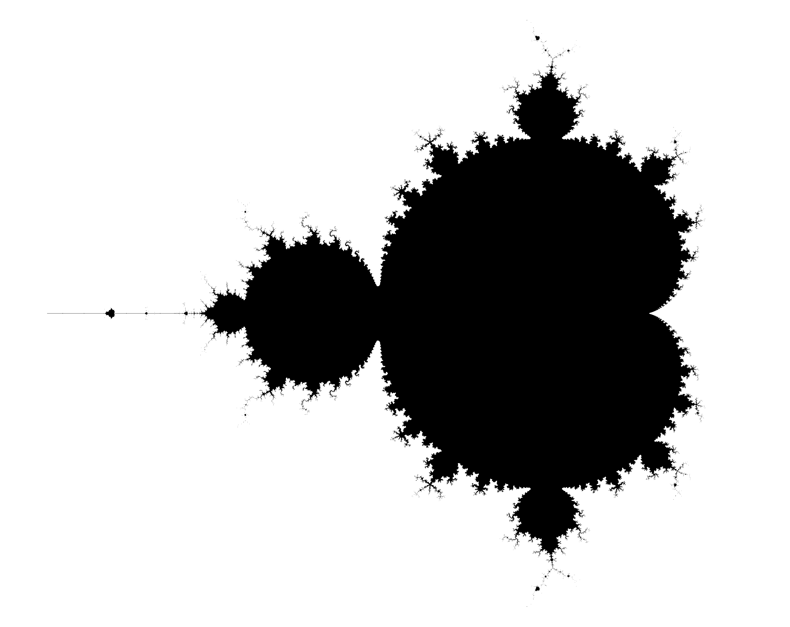

The Mandelbrot Set is a set of complex numbers. Since complex numbers can be
represented on a plane (the complex plane, with the real axis on x and the
imaginary axis on y), this set can be visualized as an image:

A complex number $c$ belongs to the Mandelbrot Set if the following sequence is
bounded:

$$
z_n = \begin{cases} 0 & \text{if } n = 1 \\ z_{n-1}^2 + c & \text{otherwise}
\end{cases}
$$

Unfortunately, there is no quick way to determine whether the sequence is
bounded for a given value of $c$. However, it has been proven that if the
modulus of $z_n$ exceeds 2, then the sequence diverges.

The procedure to determine whether a complex number $c$ belongs to the
Mandelbrot set is straightforward: compute the sequence until either

- the modulus of $z_n$ exceeds 2, or
- a maximum iteration count $n_{max}$ (defined in advance) is reached.

In the first case, $c$ does not belong to the set. In the second case, $c$ is
considered part of the set. The larger the maximum number of iterations, the
more accurate the representation of the Mandelbrot set will be.

## Goal

Create a program that generates an image of the Mandelbrot set. At startup, the
program will receive as parameters:

- The bounds on the real and imaginary axes
- The image resolution
- The number of threads to use for the computation (note: it is straightforward
  to split the problem across multiple threads by dividing the image into
  separate chunks).

You can use whatever language you want.

Once this is done, for a given representation, plot a graph of execution time as
a function of the number of threads.

## If you're bored

If you zoom in on the edges of the set and assign different colors depending on
the number of iterations required to exceed a modulus of 2, you can obtain very
beautiful images:

