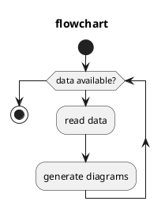

Ceci est un document de test

```python
def hello():
  print('hello')

def draw_sierpinski():
  import turtle
  from math import cos, pi, sin

  def mid(p1, p2):
    x = (p1[0] + p2[0]) / 2
    y = (p1[1] + p2[1]) / 2
    return (x, y)

  def triangle(p1, p2, p3):
    turtle.up()
    turtle.goto(p1)
    turtle.down()
    turtle.goto(p2)
    turtle.goto(p3)
    turtle.goto(p1)

  def sierpinski(p1, p2, p3, depth):
    if depth == 0:
      triangle(p1, p2, p3)
    else:
      sierpinski(p1, mid(p1, p2), mid(p3, p1), depth - 1)
      sierpinski(mid(p1, p2), p2, mid(p2, p3), depth - 1)
      sierpinski(mid(p3, p1), mid(p2, p3), p3, depth - 1)

  def polar(radius, angle):
    x = radius * cos(angle)
    y = radius * sin(angle)
    return (x, y)

  depth = 5
  radius = 300
  sierpinski(
    polar(radius, pi / 2),
    polar(radius, pi / 2 + 2 * pi / 3),
    polar(radius, pi / 2 - 2 * pi / 3),
    depth,
  )
  turtle.done()
```

- Cool
- Super
- Sympa

Voici des math $cal(A) := { x in RR | x "is natural" }$ super $x^2 = 4$ cool $sum_(k=0)^n k = 1 + ... + n$

Voici des math $$cal(A) := { x in RR | x "is natural" }$$ en display

## truc $x^2 = 4$


```javascript {.script}
const div = document.getElementById(id)
div.innerHTML = 'Hello JS'
```



